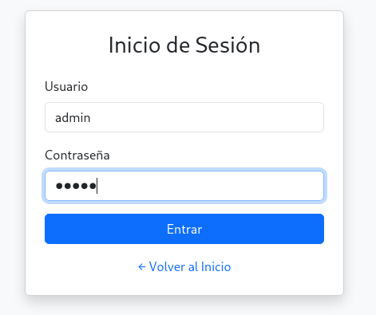

# 🖥️ Writeup - Balufood 

**Plataforma:** Dockerlabs  
**Sistema Operativo:** Linux  

# INSTALACIÓN

Descargamos el `.zip` de la máquina desde DockerLabs a nuestro entorno y seguimos los siguientes pasos.

```bash 
unzip balufood.zip
```
La máquina ya está descomprimida y solo falta montarla.

```bash
sudo bash auto_deploy.sh balufood.tar
``` 
Info:

```

                            ##        .         
                      ## ## ##       ==         
                   ## ## ## ##      ===         
               /""""""""""""""""\___/ ===       
          ~~~ {~~ ~~~~ ~~~ ~~~~ ~~ ~ /  ===- ~~~
               \______ o          __/           
                 \    \        __/            
                  \____\______/               
                                          
  ___  ____ ____ _  _ ____ ____ _    ____ ___  ____ 
  |  \ |  | |    |_/  |___ |__/ |    |__| |__] [__  
  |__/ |__| |___ | \_ |___ |  \ |___ |  | |__] ___] 
                                         
                                     

Estamos desplegando la máquina vulnerable, espere un momento.

Máquina desplegada, su dirección IP es --> 172.17.0.2

Presiona Ctrl+C cuando termines con la máquina para eliminarla
``` 

Una vez desplegada, cuando terminemos de hackearla, con un `Ctrl + C` se eliminará automáticamente para que no queden archivos residuales.

# ESCANEO DE PUERTOS

A continuación, realizamos un escaneo general para comprobar qué puertos están abiertos y luego uno más exhaustivo para obtener información relevante sobre los servicios.

```bash
nmap -n -Pn -sS -sV -p- --open --min-rate 5000 172.17.0.2
``` 

```bash
nmap -n -Pn -sCV -p22,5000 --min-rate 5000 172.17.0.2
```

Info:
```
Starting Nmap 7.95 ( https://nmap.org ) at 2025-09-13 17:02 CEST
Nmap scan report for 172.17.0.2
Host is up (0.000030s latency).

PORT     STATE SERVICE VERSION
22/tcp   open  ssh     OpenSSH 9.2p1 Debian 2+deb12u5 (protocol 2.0)
| ssh-hostkey: 
|   256 69:15:7d:34:74:1c:21:8a:cb:2c:a2:8c:42:a4:21:7f (ECDSA)
|_  256 a7:3a:c9:b2:ac:cf:44:77:a7:9c:ab:89:98:c7:88:3f (ED25519)
5000/tcp open  http    Werkzeug httpd 2.2.2 (Python 3.11.2)
|_http-title: Restaurante Balulero - Inicio
|_http-server-header: Werkzeug/2.2.2 Python/3.11.2
MAC Address: 02:42:AC:11:00:02 (Unknown)
Service Info: OS: Linux; CPE: cpe:/o:linux:linux_kernel

Service detection performed. Please report any incorrect results at https://nmap.org/submit/ .
Nmap done: 1 IP address (1 host up) scanned in 6.81 seconds
```

Tenemos abiertos los puertos `22` y `5000`.

Accedemos por `HTTP` en el puerto `5000` y nos encontramos con la página de un restaurante.

# GOBUSTER

Realizamos `fuzzing` de directorios para intentar localizar directorios o archivos ocultos.

```bash
gobuster dir -u http://172.17.0.2:5000 -w /usr/share/seclists/Discovery/Web-Content/directory-list-2.3-medium.txt -x html,zip,php,txt,bak,sh -b 403,404 -t 60
```

Info:
```
===============================================================
Gobuster v3.8
by OJ Reeves (@TheColonial) & Christian Mehlmauer (@firefart)
===============================================================
[+] Url:                     http://172.17.0.2:5000
[+] Method:                  GET
[+] Threads:                 60
[+] Wordlist:                /usr/share/seclists/Discovery/Web-Content/directory-list-2.3-medium.txt
[+] Negative Status codes:   403,404
[+] User Agent:              gobuster/3.8
[+] Extensions:              txt,bak,sh,html,zip,php
[+] Timeout:                 10s
===============================================================
Starting gobuster in directory enumeration mode
===============================================================
/login                (Status: 200) [Size: 1850]
/admin                (Status: 302) [Size: 199] [--> /login]
/logout               (Status: 302) [Size: 189] [--> /]
Progress: 11051 / 1543906 (0.72%)
```

Descubrimos una página de `login` y probamos credenciales típicas como `admin` : `admin`.



Nos autenticamos con éxito con dichas credenciales y accedemos al panel de administración.

Sin embargo, a simple vista no encontramos información relevante.

Inspeccionando el código fuente del panel de administración encontramos el siguiente comentario:

```
<!-- Backup de acceso: sysadmin:backup123 -->
```

Accedemos por `SSH` con estas credenciales `sysadmin` : `backup123`.

# ESCALADA DE PRIVILEGIOS

Una vez dentro, comprobamos permisos `sudo` y `SUID`.

Pero no identificamos ninguna vía directa de escalada.

Buscando entre los archivos de `sysadmin` encontramos un archivo `app.py`. Al revisarlo, observamos que contiene una `secret key`, que podría ser la contraseña de otro usuario.

```
app.secret_key = 'cuidaditocuidadin'
```

Consultamos el archivo /etc/passwd y vemos que existe un usuario llamado `balulero`.


```
root:x:0:0:root:/root:/bin/bash
daemon:x:1:1:daemon:/usr/sbin:/usr/sbin/nologin
bin:x:2:2:bin:/bin:/usr/sbin/nologin
sys:x:3:3:sys:/dev:/usr/sbin/nologin
sync:x:4:65534:sync:/bin:/bin/sync
games:x:5:60:games:/usr/games:/usr/sbin/nologin
man:x:6:12:man:/var/cache/man:/usr/sbin/nologin
lp:x:7:7:lp:/var/spool/lpd:/usr/sbin/nologin
mail:x:8:8:mail:/var/mail:/usr/sbin/nologin
news:x:9:9:news:/var/spool/news:/usr/sbin/nologin
uucp:x:10:10:uucp:/var/spool/uucp:/usr/sbin/nologin
proxy:x:13:13:proxy:/bin:/usr/sbin/nologin
www-data:x:33:33:www-data:/var/www:/usr/sbin/nologin
backup:x:34:34:backup:/var/backups:/usr/sbin/nologin
list:x:38:38:Mailing List Manager:/var/list:/usr/sbin/nologin
irc:x:39:39:ircd:/run/ircd:/usr/sbin/nologin
_apt:x:42:65534::/nonexistent:/usr/sbin/nologin
nobody:x:65534:65534:nobody:/nonexistent:/usr/sbin/nologin
sysadmin:x:1000:1000:sysadmin,sysadmin,,:/home/sysadmin:/bin/bash
systemd-network:x:998:998:systemd Network Management:/:/usr/sbin/nologin
systemd-timesync:x:997:997:systemd Time Synchronization:/:/usr/sbin/nologin
messagebus:x:100:102::/nonexistent:/usr/sbin/nologin
sshd:x:101:65534::/run/sshd:/usr/sbin/nologin
balulero:x:1001:1001:balulero,,,:/home/balulero:/bin/bash
```


```
su balulero
```

Probamos a autenticarnos con la contraseña `cuidaditocuidadin` que habíamos encontrado antes, y conseguimos pivotar con éxito a `balulero`.

En los archivos de este usuario encontramos en el `.bashrc` una línea que revela la contraseña del usuario `root`.

```
alias ser-root='echo chocolate2 | su - root'
```

Solo nos queda autenticarnos con ella y obtener acceso completo al sistema.

```bash
su root
```

Info:
```
root@6cfcd99d416f:/home/balulero# whoami
root
root@6cfcd99d416f:/home/balulero# 
```

Ya somos root!