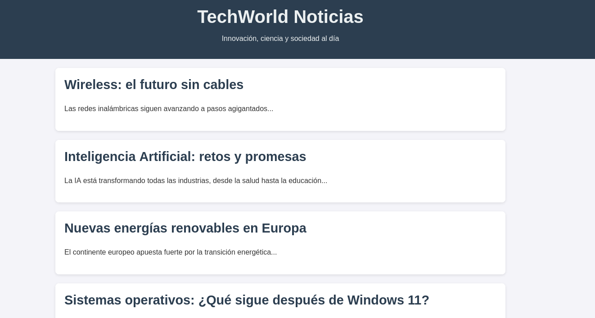

**Plataforma:** Dockerlabs\
**Sistema Operativo:** Linux

> **Tags:** `Linux` `Web` `Hydra` `Information Leakage` `Restricted Shell`

## INSTALACIÓN

Descargamos el `.zip` de la máquina desde DockerLabs a nuestro entorno y seguimos los siguientes pasos.

```bash
unzip winfake.zip
```

La máquina ya está descomprimida y solo falta montarla.

```bash
sudo bash auto_deploy.sh winfake.tar
```

Info:

```

                            ##        .         
                      ## ## ##       ==         
                   ## ## ## ##      ===         
               /""""""""""""""""\___/ ===       
          ~~~ {~~ ~~~~ ~~~ ~~~~ ~~ ~ /  ===- ~~~
               \______ o          __/           
                 \    \        __/            
                  \____\______/               
                                          
  ___  ____ ____ _  _ ____ ____ _    ____ ___  ____ 
  |  \ |  | |    |_/  |___ |__/ |    |__| |__] [__  
  |__/ |__| |___ | \_ |___ |  \ |___ |  | |__] ___] 
                                         
                                     

Estamos desplegando la máquina vulnerable, espere un momento.

Máquina desplegada, su dirección IP es --> 172.17.0.4

Presiona Ctrl+C cuando termines con la máquina para eliminarla
```

Una vez desplegada, cuando terminemos de hackearla, con un `Ctrl + C` se eliminará automáticamente para que no queden archivos residuales.

## ESCANEO DE PUERTOS

A continuación, realizamos un escaneo general para comprobar qué puertos están abiertos y luego uno más exhaustivo para obtener información relevante sobre los servicios.

```bash
nmap -n -Pn -sS -sV -p- --open --min-rate 5000 172.17.0.4
```

```bash
nmap -n -Pn -sCV -p22,80 --min-rate 5000 172.17.0.4
```

Info:

```
Starting Nmap 7.98 ( https://nmap.org ) at 2026-02-17 16:31 +0100
Nmap scan report for 172.17.0.4
Host is up (0.000038s latency).

PORT   STATE SERVICE VERSION
22/tcp open  ssh     OpenSSH 9.6p1 Ubuntu 3ubuntu13.12 (Ubuntu Linux; protocol 2.0)
| ssh-hostkey: 
|   256 ac:49:60:90:20:5a:92:7d:7b:4d:13:98:0d:ae:52:6b (ECDSA)
|_  256 68:cd:ce:ec:58:42:e5:c7:52:46:ca:1f:b6:26:a4:cd (ED25519)
80/tcp open  http    Apache httpd 2.4.58 ((Ubuntu))
|_http-title: TechWorld Noticias
|_http-server-header: Apache/2.4.58 (Ubuntu)
MAC Address: 02:42:AC:11:00:04 (Unknown)
Service Info: OS: Linux; CPE: cpe:/o:linux:linux_kernel

Service detection performed. Please report any incorrect results at https://nmap.org/submit/ .
Nmap done: 1 IP address (1 host up) scanned in 6.87 seconds
```

Identificamos los puertos `22` y `80` abiertos.

Accedemos por el puerto `80` y nos encontramos con la siguiente página de noticias tecnológicas:



Tras realizar `fuzzing de directorios` sin éxito (solo encontramos el `index.html`), procedemos a inspeccionar el `código fuente`. 

Nos llama la atención una línea inusual en el `CSS`.

```CSS
body {
            font-family: "Segoe UI", Arial, sans-serif;
            background: #f4f4f9;
            margin: 0;
            padding: 0;
            color: #333;
		    top: pipe;
        }
```

La propiedad `top` tiene asignado el valor `pipe`, lo cual no es un valor válido en `CSS`. 

Deducimos que esto podría ser una pista, puede que un nombre de usuario.

Como no encontramos más vectores de ataque en la web, probamos un ataque de `fuerza bruta` contra el servicio `SSH` utilizando el usuario `pipe`.

## FUERZA BRUTA

Lanzamos `Hydra` utilizando el diccionario `rockyou.txt`.

```Bash
hydra -l pipe -P /usr/share/wordlists/rockyou.txt ssh://172.17.0.4 -t 64
```

Info:
```
Hydra v9.6 (c) 2023 by van Hauser/THC & David Maciejak - Please do not use in military or secret service organizations, or for illegal purposes (this is non-binding, these *** ignore laws and ethics anyway).

Hydra (https://github.com/vanhauser-thc/thc-hydra) starting at 2026-02-17 16:44:32
[WARNING] Many SSH configurations limit the number of parallel tasks, it is recommended to reduce the tasks: use -t 4
[WARNING] Restorefile (you have 10 seconds to abort... (use option -I to skip waiting)) from a previous session found, to prevent overwriting, ./hydra.restore
[DATA] max 64 tasks per 1 server, overall 64 tasks, 14344399 login tries (l:1/p:14344399), ~224132 tries per task
[DATA] attacking ssh://172.17.0.4:22/
[22][ssh] host: 172.17.0.4   login: pipe   password: kisses
```

Encontramos credenciales válidas para el usuario `pipe` : `kisses`.

## ACCESO INICIAL

Accedemos mediante `SSH`.

```Bash
ssh pipe@172.17.0.4
```

Info:
```
Windows PowerShell
Copyright (C) Microsoft Corporation. Todos los derechos reservados.

Intente el nuevo Windows Terminal: https://aka.ms/terminal

PS C:\Users\pipe>
```

Sorprendentemente, se nos abre una consola `PowerShell` a pesar de estar en un entorno `Linux`. 

Listamos los archivos del directorio actual.

```
PS C:\Users\pipe> dir

 El volumen de la unidad C no tiene etiqueta.
 El número de serie del volumen es XXXX-YYYY

07/10/2025  05:05 PM              33          user.txt
07/10/2025  03:30 PM            3803          .bashrc
07/10/2025  03:33 PM    <DIR>                 .cache
07/10/2025  03:26 PM             220          .bash_logout
07/10/2025  03:30 PM             846          .profile
02/17/2026  04:31 PM               0          .bash_history
```

El entorno parece ser una `Restricted Shell` que simula `Windows` o un entorno PowerShell sobre Linux. 

Al intentar ejecutar comandos de enumeración estándar o transferir scripts como `linpeas`, nos encontramos muy limitados.

Decidimos volver a enumerar la web en el puerto `80` en busca de más información que nos permita escalar privilegios.

## ESCALADA DE PRIVILEGIOS

Inspeccionando nuevamente el código fuente, encontramos una etiqueta oculta interesante.

```HTML
<article hidden="acrostico inicial">
	    <h2>HIDDEN</h2>
```

Esto sugiere que los títulos de los artículos forman un acróstico. Revisamos los encabezados `<h2>` de los artículos visibles.

```HTML
<article>
    <h2>Wireless: el futuro sin cables</h2>
</article>
<article>
    <h2>Inteligencia Artificial: retos y promesas</h2>
</article>
<article>
    <h2>Nuevas energías renovables en Europa</h2>
</article>
<article>
    <h2>Sistemas operativos: ¿Qué sigue después de Windows 11?</h2>
</article>
<article>
    <h2>Economía digital y criptomonedas</h2>
</article>
<article>
    <h2>Redes sociales y su impacto en la sociedad</h2>
</article>
<article>
    <h2>Vehículos autónomos llegan a las calles</h2>
</article>
<article>
    <h2>Encriptación: clave para la privacidad</h2>
</article>
<article>
    <h2>Robots médicos asisten en cirugías</h2>
</article>
<article>
    <h2>Red 5G: cobertura global en 2025</h2>
</article>
<article>
    <h2>Organizaciones internacionales y tecnología</h2>
</article>
<article>
    <h2>Origen de la computación cuántica</h2>
</article>
<article>
    <h2>Transformación digital en la educación</h2>
</article>
<article>
    <h2>Fotografía computacional redefine la imagen</h2>
</article>
<article>
    <h2>Algoritmos éticos en la Inteligencia Artificial</h2>
</article>
<article>
    <h2>Keyboards mecánicos: auge entre profesionales</h2>
</article>
<article>
    <h2>Enfoque global sobre la ciberseguridad</h2>
</article>
<article>
    <h2>Nuevos materiales para baterías sostenibles</h2>
</article>
<article>
    <h2>Exploración de exoplanetas en 2025</h2>
</article>
<article>
    <h2>Wearables: el futuro de la salud conectada</h2>
</article>
<article>
    <h2>Seguridad en la nube: desafíos y soluciones</h2>
</article>
```

Si tomamos la primera letra de cada título, formamos la siguiente cadena: `WINSERVERROOTFAKENEWS`.

Volvemos a nuestra terminal PowerShell e intentamos autenticarnos como `root` utilizando esta cadena como contraseña. 

Al principio no funciona, pero probamos diferentes variantes (mayúscula, minúscula) hasta que el formato `CamelCase` nos da resultado.

```Bash
su root
# Password: WinServerRootFakeNews
```

```
root@8e97e79e398d:/home/pipe# whoami
root
root@8e97e79e398d:/home/pipe#
```

Ya somos root!

Conseguimos acceder y visualizar las `flags` de ambos usuarios.

```
root@8e97e79e398d:~# cat root.txt 
fa209fcfb40c4276bd2ceb9f08bf5f7b
root@8e97e79e398d:~# cat /home/pipe/user.txt 
d970977b69a543ce746095e2b660d107
```

