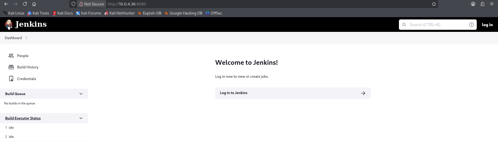

# 🖥️ Writeup - Leak 

**Platform:** Vulnyx  
**Operating System:** Linux  

# INSTALLATION

We download the `zip` containing the `.ova` of the Leak machine, extract it, and import it into VirtualBox.

We configure the network interface of the Leak machine and run it alongside the attacker machine.

# HOST DISCOVERY

At this point, we still don’t know which `IP` address is assigned to Leak, so we discover it as follows:

```bash
netdiscover -i eth1 -r 10.0.0.0/16
```
Info:
```
Currently scanning: 10.0.0.0/16   |   Screen View: Unique Hosts               
                                                                               
 4 Captured ARP Req/Rep packets, from 4 hosts.   Total size: 240               
 _____________________________________________________________________________
   IP            At MAC Address     Count     Len  MAC Vendor / Hostname      
 -----------------------------------------------------------------------------
 10.0.4.1        52:54:00:12:35:00      1      60  Unknown vendor              
 10.0.4.2        52:54:00:12:35:00      1      60  Unknown vendor              
 10.0.4.3        08:00:27:cc:8c:61      1      60  PCS Systemtechnik GmbH      
 10.0.4.36       08:00:27:49:c2:35      1      60  PCS Systemtechnik GmbH
 ```

 We identify with high confidence that the victim’s IP is `10.0.4.36`.

 # PORT SCANNING

Next, we perform a general scan to check which ports are open, followed by a more exhaustive scan to gather relevant service information.

```bash
nmap -n -Pn -sS -sV -p- --open --min-rate 5000 10.0.4.36
``` 

```bash
nmap -n -Pn -sCV -p80,8080 --min-rate 5000 10.0.4.36
```
Info:
```
Starting Nmap 7.95 ( https://nmap.org ) at 2025-12-09 20:02 CET
Nmap scan report for 10.0.4.36
Host is up (0.00018s latency).

PORT     STATE SERVICE VERSION
80/tcp   open  http    Apache httpd 2.4.56 ((Debian))
|_http-server-header: Apache/2.4.56 (Debian)
|_http-title: Apache2 Debian Default Page: It works
8080/tcp open  http    Jetty 10.0.13
|_http-server-header: Jetty(10.0.13)
|_http-title: Panel de control [Jenkins]
| http-open-proxy: Potentially OPEN proxy.
|_Methods supported:CONNECTION
| http-robots.txt: 1 disallowed entry 
|_/
MAC Address: 08:00:27:49:C2:35 (PCS Systemtechnik/Oracle VirtualBox virtual NIC)

Service detection performed. Please report any incorrect results at https://nmap.org/submit/ .
Nmap done: 1 IP address (1 host up) scanned in 7.18 seconds
```

Identificamos los puertos 80 y 8080 abiertos.

Accedemos al servicio web del puerto 80 y encontramos una pagina por defecto de Apache2.

# GOBUSTER

We perform `directory fuzzing` to try to locate hidden directories or files.

```bash
gobuster dir -u http://10.0.4.36 -w /usr/share/seclists/Discovery/Web-Content/directory-list-2.3-medium.txt -x html,zip,php,txt,bak,sh -b 403,404 -t 60
```

Info:
```
===============================================================
Gobuster v3.8
by OJ Reeves (@TheColonial) & Christian Mehlmauer (@firefart)
===============================================================
[+] Url:                     http://10.0.4.36
[+] Method:                  GET
[+] Threads:                 60
[+] Wordlist:                /usr/share/seclists/Discovery/Web-Content/directory-list-2.3-medium.txt
[+] Negative Status codes:   403,404
[+] User Agent:              gobuster/3.8
[+] Extensions:              html,zip,php,txt,bak,sh
[+] Timeout:                 10s
===============================================================
Starting gobuster in directory enumeration mode
===============================================================
/index.html           (Status: 200) [Size: 10701]
/connect.php          (Status: 200) [Size: 0]
Progress: 22313 / 1543906 (1.45%)
```

Encontramos un archivo connect.php, pero si navegamos a dicho archivo, aparece simplemente en blanco.

Como no tenemos mas por donde tirar, accedemos al puerto 8080, y nos encontramos con un Jenkins:



Navegamos a la pestanya people:


Encontramos un usuario george.

De momento no podemos hacer nada con este usuario asi que tenemos que seguir buscando vias de explotacion.

En la parte inferior derecha del dashboard podemos ver la version de Jenkins: Jenkins 2.401.2.

Buscamos en internet exploits relacionados con esta version de Jenkins.

